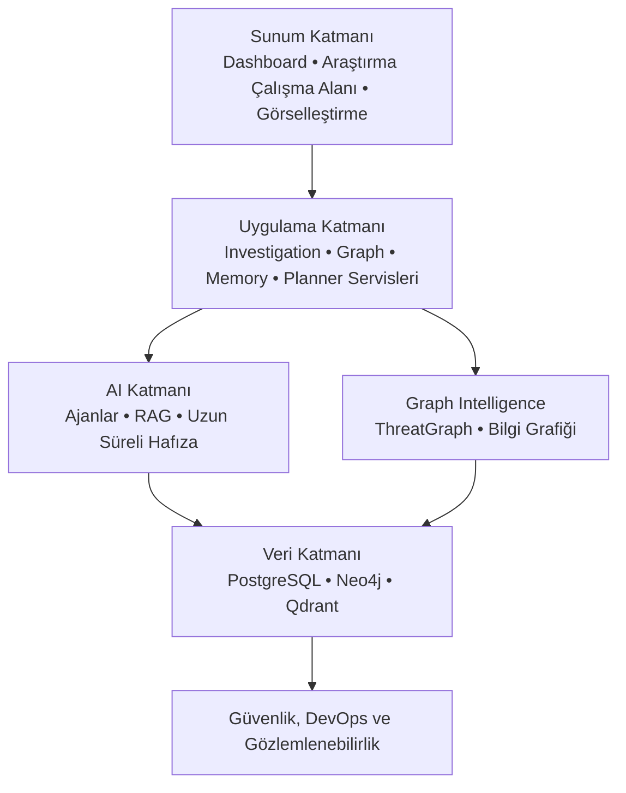
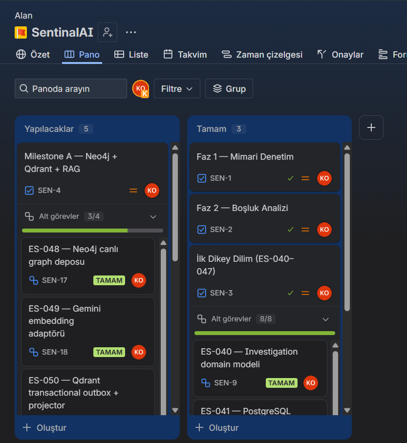
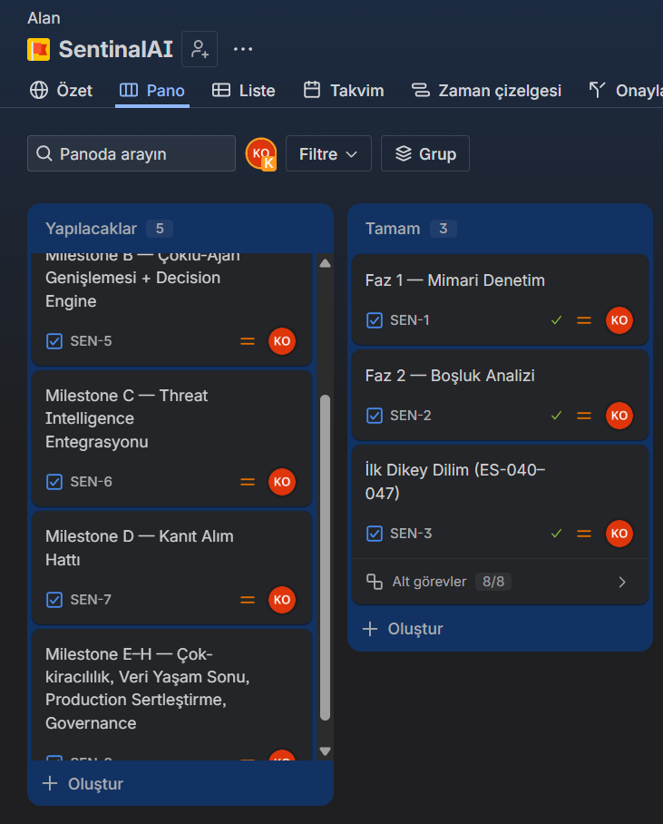
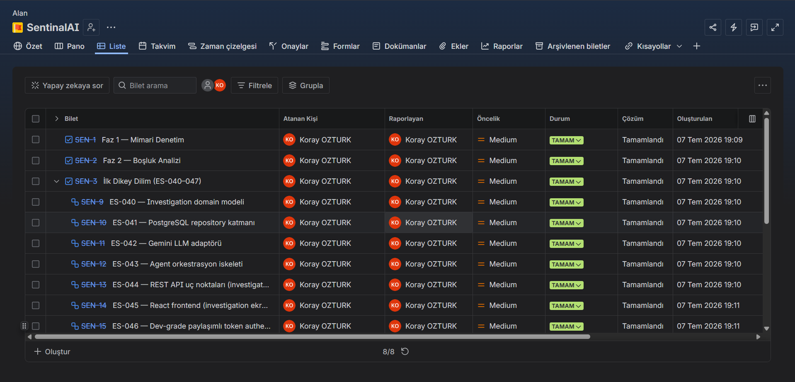
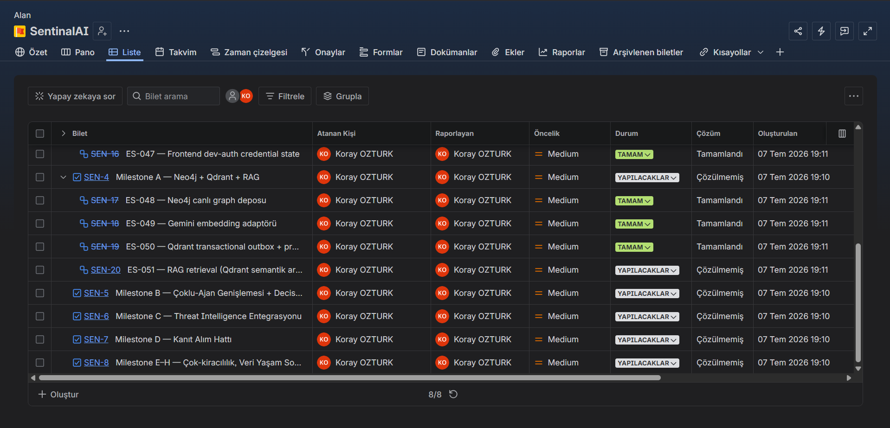
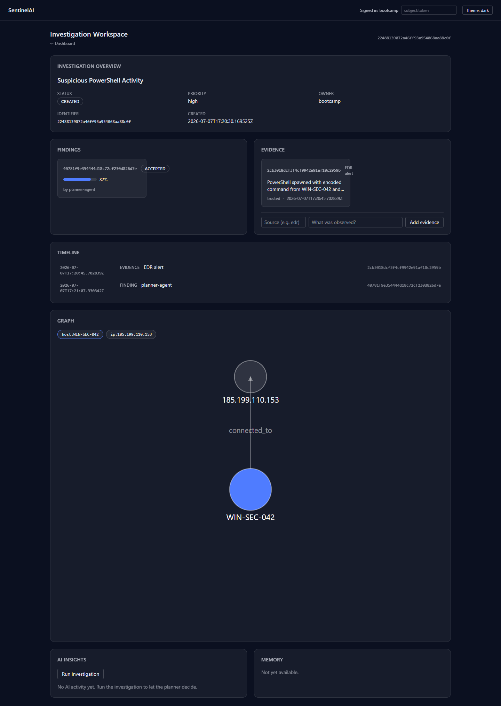

```text
        🛡️  SentinelAI

  Yapay Zeka Destekli Siber Güvenlik Araştırma Platformu
Bilgi Grafiği • Çoklu-Ajan AI • RAG • Uzun Süreli Hafıza
```


---

## İçindekiler

- [Takım İsmi](#takım-i̇smi)
- [Takım Elemanları](#takım-elemanları)
- [Ürün İsmi](#ürün-i̇smi)
- [Ürün Açıklaması](#ürün-açıklaması)
- [Ürün Özellikleri](#ürün-özellikleri)
- [Hedef Kitle](#hedef-kitle)
- [Product Backlog / Süreç Yönetimi](#product-backlog--süreç-yönetimi)
- [Sprint 1](#sprint-1)
- [Sprint 2](#sprint-2)
- [Sprint 3](#sprint-3)
- [Teknik Detaylar](#teknik-detaylar)

---

## Takım İsmi

**Bilmem**

---

## Takım Elemanları

| Ad Soyad | Rol | Sosyal |
|:---:|:---:|:---:|
| Koray Öztürk | Product Owner / Scrum Master / Developer | [](https://www.linkedin.com/in/korayoztuurk) |

---

## Ürün İsmi

**SentinelAI**

---

## Ürün Açıklaması

SentinelAI, siber güvenlik analistlerinin tehdit araştırmalarını uçtan uca yürütebilmesi için tasarlanmış, **mimari-öncelikli (architecture-first)** bir yapay zeka platformudur.

Siber güvenlik araştırmaları genellikle birden fazla güvenlik aracı, tehdit istihbaratı kaynağı ve kurumsal bilgi arasında manuel korelasyon gerektirir; bu süreç parçalı, zaman alıcı ve büyük ölçüde analistin dikkatine bağlıdır. SentinelAI, yapay zekayı tek başına bir sohbet asistanı olarak değil; bilgi grafiği (knowledge graph) tabanlı ilişki analizini, uzmanlaşmış AI ajanlarını, Retrieval-Augmented Generation (RAG) yaklaşımını ve uzun süreli araştırma hafızasını tek bir araştırma çalışma alanında birleştiren bütünleşik bir platform olarak konumlandırır.

Analistler, birbirinden kopuk araçlar arasında geçiş yapmak yerine; AI ajanlarının planlama, kanıt korelasyonu ve bağlamsal akıl yürütme konusunda destek verdiği tek bir araştırma çalışma alanında (investigation workspace) çalışır. Platform şeffaf, açıklanabilir ve insan merkezli kalacak şekilde tasarlanmıştır: AI, öneriler ve bağlamsal içgörüler sunarak araştırma sürecini destekler, ancak araştırma kararlarının tam kontrolü analistte kalır.

Amaç analistin yerini almak değil; tekrarlayan korelasyon işlerini azaltarak ve ilgili bilgiye erişimi hızlandırarak karar verme sürecini güçlendirmektir.

---

## Ürün Özellikleri

- **Grafik Tabanlı Araştırma:** Varlıklar, uyarılar, göstergeler ve kanıtlar arasındaki ilişkilerin interaktif bir bilgi grafiği (Neo4j) üzerinden keşfi.
- **Yapay Zeka Destekli Araştırma Planlaması:** Uzmanlaşmış AI ajanları kullanılarak yapılandırılmış araştırma planları üretilmesi.
- **Bilgi Grafiği Akıl Yürütmesi:** Birbirinden izole kanıtların anlamlı bir araştırma bağlamına bağlanması.
- **Retrieval-Augmented Generation (RAG) ve Semantik Hafıza:** Qdrant üzerinde embedding tabanlı semantik arama ile ilgili doküman, prosedür ve geçmiş bilgiye araştırma sırasında erişim.
- **Uzun Süreli Araştırma Hafızası:** Versiyonlanmış `MemoryItem` modeliyle oturumlar arası bağlamın korunması, sürekli akıl yürütmeye izin verilmesi.
- **Çoklu-Ajan Mimarisi:** Planlama, akıl yürütme ve araştırma desteğinden sorumlu, birbirinden ayrık sorumluluklara sahip uzman AI ajanlarının (Planner Agent, Agent Runtime) koordinasyonu.
- **Tehdit İstihbaratı Korelasyonu:** Göstergelerin, tehdit aktörlerinin ve araştırma bulgularının bağlamsal analiz yoluyla ilişkilendirilmesi (port hazır, dış sağlayıcı entegrasyonu sonraki kapsamda).
- **Açıklanabilir Yapay Zeka:** Her AI kararının ve yürütme sonucunun analistin inceleyip doğrulayabileceği şeffaf bir **Investigation Trace** üzerinden izlenebilmesi; sağlayıcı hatasında akışın sessizce çökmek yerine güvenli bir "escalated" durumuna geçmesi.
- **Mimari Yönetişim:** Mimari evrimin ADR (Architectural Decision Record) ve RFC (Request for Comments) süreçleriyle, açık sahiplik ilkesiyle yönetilmesi.

---

## Hedef Kitle

- Siber güvenlik analistleri ve SOC (Security Operations Center) ekipleri
- Tehdit istihbaratı (threat intelligence) araştırmacıları
- AI destekli güvenlik araçlarını değerlendiren güvenlik mühendisleri

---

## Product Backlog / Süreç Yönetimi

Backlog [Jira'da (SentinalAI / SEN projesi)](https://korayozturk.atlassian.net/jira/core/projects/SEN/board) görev ve alt görev olarak tutulmaktadır. Mimari seviyedeki teknik detay ve doğrulama kayıtları için `workdocs/SentinelAI-Implementation-Tracker.md` (append-only mühendislik defteri) ve `docs/11-roadmap/README.md` (teslimat kaydı) referans alınır.

- **Jira backlog:** [SentinalAI / SEN projesi](https://korayozturk.atlassian.net/jira/core/projects/SEN/board)
- **Teslimat kaydı:** [`docs/11-roadmap/README.md`](docs/11-roadmap/README.md)
- **Mühendislik defteri:** `workdocs/SentinelAI-Implementation-Tracker.md`

---

## Teknik Detaylar

<details>
<summary><strong>Mimari, teknoloji yığını ve yol haritası detayları için tıklayın</strong></summary>

### Mimari Genel Bakış

SentinelAI, implementasyondan önce mimari kararların netleştirildiği bir **Architecture First** yaklaşımı izler.



Platform şu ana mimari alanlara ayrılmıştır:

- **Sunum Katmanı** — Kullanıcı arayüzleri, dashboard ve araştırma çalışma alanları.
- **Uygulama Katmanı** — İş servisleri, araştırma iş akışları ve API orkestrasyonu.
- **AI Katmanı** — Çoklu-ajan akıl yürütme, planlama, hafıza yönetimi ve RAG.
- **Graph Intelligence** — Bilgi grafiği modelleme, ilişki analizi ve grafik tabanlı araştırmalar.
- **Güvenlik Katmanı** — Kimlik doğrulama, yetkilendirme, denetim ve güvenlik yönetişimi.
- **DevOps Katmanı** — Dağıtım, yapılandırma yönetimi, gözlemlenebilirlik ve platform operasyonları.

Her alanın sorumluluk ve sahiplik sınırları açıkça tanımlanmıştır; bu da uzun vadeli sürdürülebilirliği ve mimari tutarlılığı güvence altına alır.

### Mimari İlkeler

- **Architecture First** — Mimari kararlar implementasyon kararlarından önce gelir.
- **Açık Sahiplik** — Her mimari kavramın tek ve net bir sahibi vardır.
- **Sorumlulukların Ayrılması** — AI, Uygulama Katmanı, Sunum Katmanı, Güvenlik ve DevOps birbirinden bağımsız mimari alanlar olarak kalır.
- **Kademeli Evrim** — Mimari, kontrollü ve izlenebilir değişikliklerle evrilir.
- **Yönetişim Odaklı Geliştirme** — Mimari evrim RFC ve ADR süreçleriyle yönetilir.
- **Teknolojiden Bağımsızlık** — Mimari kararlar, mümkün olduğunca belirli framework/teknoloji seçimlerinden bağımsız kalır.

### Teknoloji Yığını

| Katman | Teknoloji |
|-------|----------------------|
| **Backend** | FastAPI, Python |
| **Frontend** | React, TypeScript |
| **AI Runtime** | Sağlayıcıdan bağımsız LLM/embedding portlarına sahip, in-process Python runtime (ADR-005/ADR-010; ileride bir orkestrasyon framework'ü sorumlulukları değiştirmeden eklenebilir) |
| **Graph Veritabanı** | Neo4j |
| **Vektör Veritabanı** | Qdrant |
| **İlişkisel Veritabanı** | PostgreSQL |
| **Önbellekleme** | Redis |
| **Konteynerleştirme** | Docker |
| **Reverse Proxy** | Nginx |
| **Gözlemlenebilirlik** | Prometheus, Grafana |
| **CI/CD** | GitHub Actions |

### Repo Yapısı

```text
SentinelAI/
│
├── assets/             # Görseller, diyagramlar ve proje kaynakları
├── backend/            # Backend servisleri ve API'ler
├── datasets/           # Örnek veri setleri
├── docs/               # Mimari, yönetişim ve mühendislik dokümantasyonu
├── frontend/           # Web uygulaması
├── infrastructure/     # Docker, dağıtım ve altyapı kaynakları
├── notebooks/          # Araştırma ve deney notebook'ları
├── research/           # Araştırma makaleleri ve tasarım çalışmaları
├── scripts/            # Geliştirme ve otomasyon script'leri
└── README.md
```

### Dokümantasyon Yapısı

| Klasör | İçerik |
| ------------------- | ----------------------------------------------------------- |
| **00-project**      | Proje vizyonu, tasarım ilkeleri ve charter |
| **01-product**      | Ürün kavramları ve ThreatGraph tanımı |
| **02-architecture** | Üst seviye sistem mimarisi |
| **03-ai**           | Çoklu-ajan mimarisi, hafıza, bilgi grafiği ve RAG |
| **04-backend**      | Backend mimarisi, servisler ve domain modeli |
| **05-frontend**     | Frontend mimarisi, UI durum yönetimi ve araştırma çalışma alanı |
| **06-devops**       | Dağıtım, ortamlar, yapılandırma ve gözlemlenebilirlik |
| **07-security**     | Güvenlik mimarisi, kimlik doğrulama ve tehdit modellemesi |
| **08-testing**      | Test stratejisi, entegrasyon ve AI doğrulama |
| **09-decisions**    | Mimari Karar Kayıtları (ADR) |
| **10-rfc**          | RFC yönetişimi |
| **11-roadmap**      | Geliştirme yol haritası ve implementasyon stratejisi |

### Geliştirme Durumu

SentinelAI, **Mimari ve Temel** aşamasından **canlı implementasyon** aşamasına geçmiştir: mimari tasarım, yönetişim modeli ve mühendislik stratejisi implementasyondan önce tamamlanmıştır; implementasyon artık kontrollü ve doğrulanabilir dikey dilimlerle ilerlemektedir.

| Alan | Durum |
| ----------------------------------- | -------------- |
| Proje vizyonu ve mimari dokümantasyon | ✅ Tamamlandı |
| Mimari yönetişim (ADR & RFC) | ✅ Tamamlandı |
| Mimari denetim (Faz 1) ve boşluk analizi (Faz 2) | ✅ Tamamlandı |
| İlk Dikey Dilim — PostgreSQL, Gemini LLM, canlı Investigation Loop, dev-grade auth, mock'suz UI akışı (ES-040–047) | ✅ Tamamlandı |
| İkinci Dikey Dilim / Milestone A — Neo4j canlı graph deposu (ES-048) | ✅ Tamamlandı |
| İkinci Dikey Dilim / Milestone A — Gemini embedding sağlayıcısı (ES-049) | ✅ Tamamlandı |
| İkinci Dikey Dilim / Milestone A — Qdrant transactional outbox & projector (ES-050) | ✅ Tamamlandı |
| İkinci Dikey Dilim / Milestone A — Canlı RAG retrieval: kaynak-destekli retriever + run yolunda tüketim (ES-051) | ✅ Tamamlandı |
| İkinci Dikey Dilim / Milestone A — Workspace Memory yüzeyi: investigation-scoped memory API + bölge (ES-052) | ✅ Tamamlandı |
| İkinci Dikey Dilim / Milestone A — Seed aracı & dilim demosu (ES-053) | ✅ Tamamlandı |
| İkinci LLM sağlayıcısı — NVIDIA NIM / MiniMax-M3 adaptörü + `LLM_PROVIDER` seçimi (ES-054) | ✅ Tamamlandı |
| Çoklu-Ajan genişlemesi & Decision Engine (Milestone B) | ⏳ Başlamadı |

Platformun temel uçtan uca iddiası — önerilen bir AI kararının yürütülmesi, kalıcı olarak izlenmesi ve tarayıcıda mock'suz görünmesi — artık canlı olarak kanıtlanmıştır. Sonraki aşama, Bilgi Katmanı'nı (RAG retrieval) tamamlamaya ve agent/karar katmanını genişletmeye odaklanmaktadır.

### Yol Haritası

- **Faz 1 — Temel:** Repo kurulumu, geliştirme ortamı, temel altyapı, CI/CD temeli.
- **Faz 2 — Çekirdek Platform:** Backend servisleri, frontend uygulaması, graph altyapısı, kimlik doğrulama ve güvenlik.
- **Faz 3 — AI Platformu:** Çoklu-ajan runtime, bilgi grafiği entegrasyonu, RAG, uzun süreli hafıza.
- **Faz 4 — Production Hazırlığı:** Performans optimizasyonu, gözlemlenebilirlik, güvenlik sertleştirme, kapsamlı test, production dağıtımı.

Detaylı implementasyon planlaması `docs/11-roadmap` dizinindedir.

### Docker ile Çalıştırma

Platformun dağıtım birimleri konteynerleştirilmiştir. Kök dizindeki `docker-compose.yml`, mimari dağıtım birimlerini konteynerlere eşler: **Sunum** (frontend), in-process AI Runtime dahil **Uygulama** (backend) ve **Veri** (PostgreSQL, Neo4j, Qdrant, Redis). Frontend, SPA'yı sunar ve `/api` ile `/health` uçlarını backend'e ters proxy'ler; böylece tarayıcı tek bir same-origin sınırıyla konuşur (CORS yok).

```bash
cp .env.example .env                       # opsiyonel; stack varsayılanlarla da çalışır

docker compose up --build                  # backend + frontend
docker compose --profile data up --build   # + veri katmanı (PostgreSQL/Neo4j/Qdrant/Redis)
```

Uygulama **http://localhost:8080** adresinde yayında olur:

```bash
curl http://localhost:8080/health          # {"status":"ok","name":"SentinelAI",...}
```

Veri katmanı `data` compose profiliyle opsiyoneldir; backend, veritabanları çalışmasa da başlar. `docker compose down` ile kapatılır (veri servislerini de kaldırmak için `--profile data`, volume'leri silmek için `-v` eklenir).

### Katkıda Bulunma

SentinelAI, **Architecture First** iş akışıyla geliştirilmektedir. Katkıda bulunmadan önce `docs/` dizinindeki mimari dokümantasyona aşina olunması önerilir. Mimari değişiklikler; evrim önerisi için **RFC**, kabul edilen kararların kaydı için **ADR** yönetişim modelini takip etmelidir.

### Lisans

Proje lisansı, ilk kamuya açık sürümden önce belirlenecektir.

</details>

---

## Sprint 1

<details>
<summary><strong>Sprint 1 detaylarını görmek için tıklayın</strong></summary>

**Sprint tarih aralığı:** 19 Haziran 2026 – 5 Temmuz 2026

### Sprint Notları

- Faz 1 (mimari denetim) ve Faz 2 (boşluk analizi) tamamlandı; ilk dikey dilim (ES-040–047) uygulandı; ikinci dikey dilimin (Milestone A) ilk üç kalemi — Neo4j, Gemini embedding, Qdrant outbox (ES-048–050) — bu sprint içinde tamamlandı.
- Backlog Jira'da (SentinalAI / SEN projesi) 8 üst-seviye görev ve 12 alt görev olarak işlendi; mimari seviyedeki teknik detay `workdocs/SentinelAI-Implementation-Tracker.md`'de tutuldu.
- Her iş kalemi aynı akıştan geçti: Implementation Plan → Mimari İnceleme → Implementasyon → Doğrulama (`ruff` + `mypy --strict` + `pytest`) → Kod İncelemesi → Doküman Güncellemesi → Merge.

### Sprint İçinde Tamamlanan İşler

Faz 1, Faz 2, İlk Dikey Dilim (8 ES) ve İkinci Dikey Dilim'in ilk 3 kalemi (ES-048–050) — Jira'da 14 görev "Tamamlandı" durumunda.

### Daily Scrum

İlerleme her gün `workdocs/SentinelAI-Implementation-Tracker.md`'ye append-only olarak işlendi ve Jira görev durumlarına yansıtıldı.

### Sprint Board

Backlog ve board [Jira'da (SentinalAI / SEN projesi)](https://korayozturk.atlassian.net/jira/core/projects/SEN/board) tutulmaktadır.

**Jira Pano Görünümü**

<p align="center">
  
  
</p>

**Jira Liste Görünümü**

<p align="center">
  
  
</p>

### Ürün Durumu

| Alan | Durum |
|---|---|
| Proje vizyonu, mimari ve yönetişim dokümantasyonu (`docs/00-project` … `docs/11-roadmap`) | ✅ Tamamlandı |
| Faz 1 — Mimari Denetim (bulgular A1–A10, B1–B10) | ✅ Tamamlandı |
| Faz 2 — Boşluk Analizi (M/E/D bulguları) | ✅ Tamamlandı |
| İlk Dikey Dilim (ES-040–047): PostgreSQL tek otoriter depo, Gemini LLM, canlı Investigation Loop, dev-grade auth, tarayıcıdan mock'suz akış | ✅ Tamamlandı (2026-07-04) |
| İkinci Dikey Dilim / Milestone A — Neo4j gerçek graph deposu (ES-048) | ✅ Tamamlandı |
| İkinci Dikey Dilim / Milestone A — Gemini embedding adaptörü (ES-049) | ✅ Tamamlandı |
| İkinci Dikey Dilim / Milestone A — Qdrant transactional outbox + projector (ES-050) | ✅ Tamamlandı |
| RAG — semantik sorgunun agent/planner tarafından tüketimi | 🚧 Planlandı (sonraki ES) |
| Milestone B — Decision Engine ve uzman agent genişlemesi | ⏳ Başlamadı |
| Backend test durumu | ✅ 352 test yeşil, `ruff` temiz, `mypy --strict` temiz (157 dosya) |

### Uygulama Ekran Görüntüsü

<p align="center">
  
</p>

### Sprint Review

- Sprint sonunda platform, ilk kez kendi çekirdek iddiasını uçtan uca kanıtladı: bir AI kararı üretiliyor, yürütülüyor, Investigation Trace'e kalıcı olarak yazılıyor ve tarayıcıdan **mock'suz** görünüyor.
- LLM sağlayıcısı (Gemini) hata verdiğinde akış sessizce çökmek yerine güvenli bir **ESCALATED** durumuna geriliyor.
- Roadmap'in "Vertical Slice First" kuralı ilk dilimle birlikte kilidini açtı; bu sayede ikinci dilimin (Neo4j + Qdrant) temel taşları da bu sprint içinde erken başlatılıp tamamlandı — planlanandan hızlı bir ilerleme.
- Sprint Review katılımcısı: Koray Öztürk.

### Sprint Retrospective

- **İyi giden:** Mimariyi implementasyondan önce netleştirmek, her ES için kod ile dokümanın (ADR, `openapi.json`, roadmap Delivery Record) eşzamanlı güncellenmesi sürecin tutarlılığını korudu; hiçbir ES bir öncekini geçersiz kılmadı.
- **Geliştirilecek:** Backlog Jira'ya taşındı; sonraki sprintte günlük ilerlemenin de Jira üzerinden (yorum/durum geçişleriyle) takip edilmesi hedefleniyor.
- **Sonraki sprint için kararlaştırılanlar:** Milestone A'nın kalanı (RAG retrieval'in agent tarafından tüketimi), ardından Milestone B (Decision Engine, uzman agent'lar) önceliklendirilecek.

</details>

---

## Sprint 2

<details>
<summary><strong>Sprint 2 detaylarını görmek için tıklayın</strong></summary>

*Bu bölüm Sprint 2 sonunda doldurulacaktır.*

</details>

---

## Sprint 3

<details>
<summary><strong>Sprint 3 detaylarını görmek için tıklayın</strong></summary>

*Bu bölüm Sprint 3 sonunda doldurulacaktır.*

</details>

---

⭐ SentinelAI aktif olarak geliştirilmeye devam ediyor.
