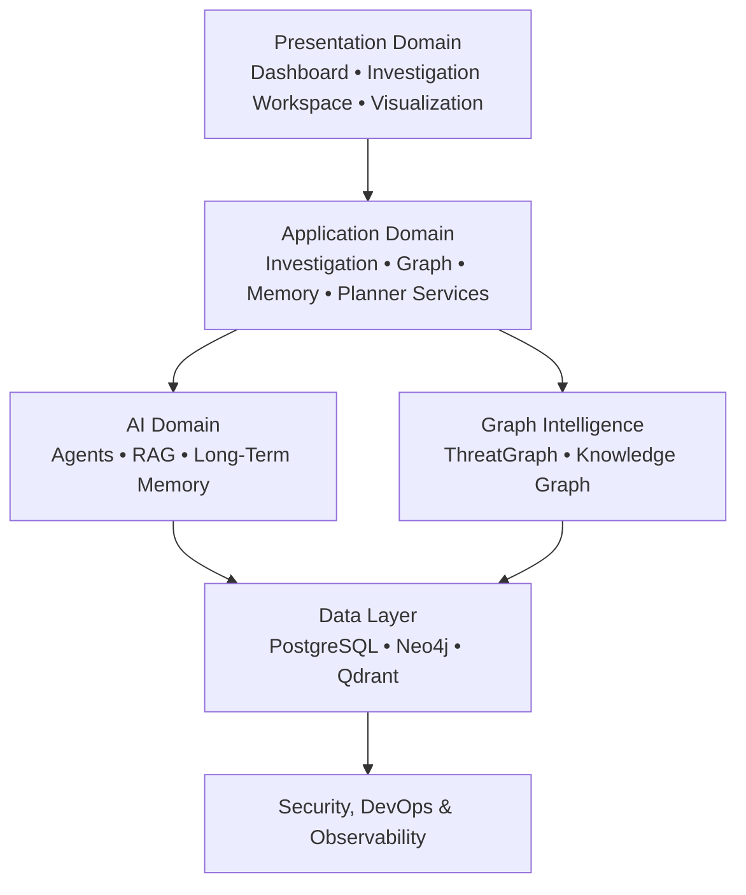

```text
        🛡️  SentinelAI

      AI-Native Cyber Investigation Platform
 Graph Intelligence • Multi-Agent AI • RAG • Memory
```

> **An architecture-first, AI-native cyber investigation platform for intelligent threat analysis, graph-based investigations and explainable security reasoning.**

SentinelAI is an open architecture project that explores how artificial intelligence can enhance cyber investigations through structured reasoning, contextual memory and knowledge-driven analysis.

Rather than treating AI as a standalone assistant, SentinelAI integrates specialized AI agents, knowledge graphs, Retrieval-Augmented Generation (RAG) and long-term memory into a unified investigation platform designed to support security analysts throughout the entire investigation lifecycle.

The project follows an **Architecture First** philosophy, where architectural consistency, explicit ownership and long-term maintainability guide every technical decision before implementation begins.

---


---

## Contents

- [Overview](#overview)
- [Why SentinelAI?](#why-sentinelai)
- [Core Capabilities](#core-capabilities)
- [High-Level Architecture](#high-level-architecture)
- [Repository Structure](#repository-structure)
- [Documentation](#documentation)
- [Technology Stack](#technology-stack)
- [Development Status](#development-status)
- [Roadmap](#roadmap)
- [Contributing](#contributing)
- [License](#license)

---

## Overview

Cyber investigations often require analysts to correlate information across multiple security tools, threat intelligence sources and organizational knowledge. This process is frequently fragmented, time-consuming and highly dependent on manual analysis.

SentinelAI addresses this challenge by bringing together graph-based knowledge representation, AI-assisted reasoning and persistent investigation memory into a single platform. Instead of switching between disconnected tools, analysts interact with a unified investigation workspace where AI agents assist with planning, evidence correlation and contextual reasoning.

The platform is designed to remain transparent, explainable and human-centered. AI supports the investigation process by providing recommendations and contextual insights, while analysts retain full control over investigation decisions.

---

## Why SentinelAI?

Modern cyber investigations are becoming increasingly complex. Security analysts must correlate information across endpoints, network telemetry, threat intelligence feeds, vulnerability reports and historical investigations while making time-critical decisions.

Although many security tools provide detection and visualization capabilities, few offer a unified environment that combines contextual understanding, structured reasoning and long-term investigation knowledge.

SentinelAI was created to explore how modern AI systems can assist analysts throughout the investigation process rather than acting as isolated chat assistants.

By combining knowledge graphs, Retrieval-Augmented Generation (RAG), long-term memory and specialized AI agents, SentinelAI aims to provide an investigation environment where context is preserved, reasoning is transparent and every recommendation remains explainable.

The objective is not to replace human analysts, but to augment their decision-making capabilities by reducing repetitive investigation tasks and improving access to relevant knowledge.

---

## Core Capabilities

| Capability | Description |
|------------|-------------|
| **Graph-Based Investigations** | Explore relationships between entities, alerts, indicators and evidence through an interactive knowledge graph. |
| **AI Investigation Planning** | Generate structured investigation plans using specialized AI agents. |
| **Knowledge Graph Reasoning** | Connect isolated evidence into meaningful investigative context. |
| **Retrieval-Augmented Generation (RAG)** | Retrieve relevant documentation, procedures and historical knowledge during investigations. |
| **Long-Term Investigation Memory** | Preserve investigation context across sessions for continuous reasoning. |
| **Multi-Agent Architecture** | Coordinate specialized AI agents responsible for planning, reasoning and investigation support. |
| **Threat Intelligence Correlation** | Relate indicators, adversaries and investigation artifacts through contextual analysis. |
| **Explainable AI Assistance** | Provide transparent reasoning and recommendations that analysts can inspect and validate. |
| **Architecture Governance** | Manage architectural evolution through RFCs, ADRs and explicit ownership. |


---

## High-Level Architecture

SentinelAI follows an **Architecture First** approach in which architectural decisions are established before implementation begins.




The platform is organized into several major architectural domains:

- **Presentation Domain** — User interfaces, dashboards and investigation workspaces.
- **Application Domain** — Business services, investigation workflows and API orchestration.
- **AI Domain** — Multi-agent reasoning, planning, memory management and Retrieval-Augmented Generation (RAG).
- **Graph Intelligence** — Knowledge graph modeling, relationship analysis and graph-based investigations.
- **Security Domain** — Authentication, authorization, auditing and security governance.
- **DevOps Domain** — Deployment, configuration management, observability and platform operations.

Each domain has clearly defined responsibilities and ownership boundaries, ensuring long-term maintainability and architectural consistency.


---


## Architecture Principles

SentinelAI is designed around several core architectural principles:

- **Architecture First** — Architectural decisions precede implementation decisions.
- **Explicit Ownership** — Every architectural concept has a single, clearly defined owner.
- **Separation of Responsibilities** — AI, Application Domain, Presentation Domain, Security and DevOps remain independent architectural domains.
- **Incremental Evolution** — The architecture evolves through controlled and traceable changes.
- **Governance-Driven Development** — Architectural evolution is managed through RFCs, ADRs and structured documentation.
- **Technology Independence** — Architectural decisions remain independent of specific frameworks and implementation technologies whenever possible.

---

## Repository Structure

The repository is organized into independent engineering and architecture domains. Documentation, research, implementation and infrastructure evolve together while remaining aligned through a shared **Architecture First** philosophy.

```text
SentinelAI/
│
├── assets/             # Images, diagrams and project resources
├── backend/            # Backend services and APIs
├── datasets/           # Sample datasets and experimental data
├── docs/               # Architecture, governance and engineering documentation
├── frontend/           # Web application
├── infrastructure/     # Docker, deployment and infrastructure resources
├── notebooks/          # Research and experimentation notebooks
├── research/           # Research papers, references and design studies
├── scripts/            # Development and automation scripts
└── README.md
```


---

## Running with Docker

The platform's deployment units are containerized (ES-028). A root `docker-compose.yml`
maps the architectural deployment units onto containers: **Presentation** (frontend),
**Application** including the in-process AI Runtime (backend) and **Data**
(PostgreSQL, Neo4j, Qdrant, Redis). The frontend serves the SPA and reverse-proxies
`/api` and `/health` to the backend, so the browser talks to a single same-origin
boundary (no CORS).

```bash
cp .env.example .env                       # optional; the stack also runs on defaults

docker compose up --build                  # backend + frontend
docker compose --profile data up --build   # + the data tier (PostgreSQL/Neo4j/Qdrant/Redis)
```

The application is served at **http://localhost:8080**:

```bash
curl http://localhost:8080/health          # {"status":"ok","name":"SentinelAI",...} (proxied to the backend)
```

The data tier is opt-in through the `data` compose profile; the backend starts lazily
and does not require the databases to be running. Tear down with `docker compose down`
(add `--profile data` to remove the data services too, `-v` to drop their volumes).

### Continuous integration & deployment

Continuous integration (`.github/workflows/ci.yml`, ES-030) validates each deployment
unit independently and confirms the deployment artifacts build: the backend
(`ruff` / `mypy` / `pytest`), the frontend (`lint` / `typecheck` / `test` / `build`)
and the Docker images (`docker compose build`). Images are built for validation only —
they are not pushed to a registry, and there is no automated environment deploy yet.

For a production-shaped run, layer the production overlay on top of the base compose
with a real `.env` (non-development environments must replace every `change_me` secret
— the backend fails fast on startup otherwise):

```bash
docker compose -f docker-compose.yml -f docker-compose.prod.yml --profile data up -d
```

---

## Documentation

SentinelAI places architecture at the center of the development process. Before implementation begins, every major architectural domain is documented, reviewed and governed through a structured documentation model.

The documentation is organized into dedicated domains, each with a clearly defined responsibility.

| Directory           | Description                                                 |
| ------------------- | ----------------------------------------------------------- |
| **00-project**      | Project vision, design principles and charter               |
| **01-product**      | Product concepts and ThreatGraph definition                 |
| **02-architecture** | High-level system architecture                              |
| **03-ai**           | Multi-agent architecture, memory, knowledge graph and RAG   |
| **04-backend**      | Backend architecture, services and domain model             |
| **05-frontend**     | Frontend architecture, UI state and investigation workspace |
| **06-devops**       | Deployment, environments, configuration and observability   |
| **07-security**     | Security architecture, authentication and threat modeling   |
| **08-testing**      | Testing strategy, integration and AI validation             |
| **09-decisions**    | Architectural Decision Records (ADRs)                       |
| **10-rfc**          | Request for Comments (RFC) governance                       |
| **11-roadmap**      | Development roadmap and implementation strategy             |

The documentation defines not only the system architecture, but also the governance model through ADRs, RFCs and a structured development roadmap, ensuring that architectural evolution remains deliberate, traceable and consistent.


---

## Documentation Highlights

Current documentation includes:

- ✅ Architecture documentation covering the entire platform lifecycle
- ✅ AI architecture and multi-agent design
- ✅ Backend, Frontend and Graph architecture
- ✅ DevOps and Security architecture
- ✅ Testing strategy and validation model
- ✅ Architectural Decision Records (ADR)
- ✅ Request for Comments (RFC) governance
- ✅ Development Roadmap
- ✅ Cross-document governance review

The documentation is designed to evolve together with the implementation through a structured governance model based on RFCs and ADRs.


---

## Planned Technology Stack

| Layer | Planned Technologies |
|-------|----------------------|
| **Backend** | FastAPI, Python |
| **Frontend** | React, TypeScript |
| **AI Runtime** | LangGraph, LangChain |
| **Graph Database** | Neo4j |
| **Vector Database** | Qdrant |
| **Relational Database** | PostgreSQL |
| **Caching** | Redis |
| **Containerization** | Docker |
| **Reverse Proxy** | Nginx |
| **Observability** | Prometheus, Grafana |
| **CI/CD** | GitHub Actions |

Technology choices may evolve over time while preserving the architectural principles established throughout the documentation.


---


## Development Status

SentinelAI is currently in the **Architecture & Foundation** stage of development.

The architectural design, governance model and engineering strategy have been completed before implementation, following the project's **Architecture First** philosophy.

### Current Progress

| Area                                | Status         |
| ----------------------------------- | -------------- |
| Project Vision                      | ✅ Complete     |
| Architecture Documentation          | ✅ Complete     |
| AI Architecture                     | ✅ Complete     |
| Backend Architecture                | ✅ Complete     |
| Frontend Architecture               | ✅ Complete     |
| DevOps Architecture                 | ✅ Complete     |
| Security Architecture               | ✅ Complete     |
| Testing Architecture                | ✅ Complete     |
| Architecture Governance (ADR & RFC) | ✅ Complete     |
| Development Roadmap                 | ✅ Complete     |
| Implementation                      | 🚧 In Progress |

The next phase focuses on transforming the approved architecture into a production-ready implementation while preserving the governance and architectural principles established throughout the project.


---


## Development Roadmap

The project evolves through clearly defined architectural phases rather than isolated implementation efforts.

* **Phase 1 — Foundation**

  * Repository setup
  * Development environment
  * Core infrastructure
  * CI/CD foundation

* **Phase 2 — Core Platform**

  * Backend services
  * Frontend application
  * Graph infrastructure
  * Authentication & security

* **Phase 3 — AI Platform**

  * Multi-agent runtime
  * Knowledge graph integration
  * Retrieval-Augmented Generation (RAG)
  * Long-term memory

* **Phase 4 — Production Readiness**

  * Performance optimization
  * Observability
  * Security hardening
  * Comprehensive testing
  * Production deployment

Detailed implementation planning is available in the `docs/11-roadmap` directory.


---


## Contributing

SentinelAI is being developed using an **Architecture First** workflow.

Before contributing, contributors are encouraged to become familiar with the architectural documentation located in the `docs/` directory.

Architectural changes should follow the governance model established through:

* **RFC (Request for Comments)** for proposing architectural evolution.
* **ADR (Architectural Decision Records)** for documenting accepted architectural decisions.

Implementation contributions should remain consistent with the approved architecture and governance model.

Major architectural changes should begin with an RFC before implementation.

Detailed contribution guidelines will be published in `CONTRIBUTING.md`.


## License

The project license will be defined before the first public release.

---

## Acknowledgements

SentinelAI is developed as an architecture-driven research and engineering project exploring the intersection of artificial intelligence, graph technologies and cybersecurity.

The project emphasizes long-term maintainability, explicit architectural ownership and transparent engineering practices, demonstrating how complex AI systems can be designed through structured architecture before implementation.

If you find this project interesting, consider giving it a ⭐ to support its development.

---

⭐ SentinelAI is actively evolving.
Feedback, ideas and architectural discussions are always welcome.
