```text
        🛡️  SentinelAI

  Yapay Zeka Destekli Siber Güvenlik Araştırma Platformu
Bilgi Grafiği • Çoklu-Ajan AI • RAG • Uzun Süreli Hafıza
```


---

## İçindekiler

- [Takım İsmi](#takım-i̇smi)
- [Takım Elemanları](#takım-elemanları)
- [Ürün İsmi](#ürün-i̇smi)
- [Ürün Açıklaması](#ürün-açıklaması)
- [Ürün Özellikleri](#ürün-özellikleri)
- [Hedef Kitle](#hedef-kitle)
- [Product Backlog / Süreç Yönetimi](#product-backlog--süreç-yönetimi)
- [Sprint 1](#sprint-1)
- [Sprint 2](#sprint-2)
- [Sprint 3](#sprint-3)
- [Teknik Detaylar](#teknik-detaylar)

---

## Takım İsmi

**Bilmem**

---

## Takım Elemanları

| Ad Soyad | Rol | Sosyal |
|:---:|:---:|:---:|
| Koray Öztürk | Product Owner / Scrum Master / Developer | [](https://www.linkedin.com/in/korayoztuurk) |

---

## Ürün İsmi

**SentinelAI**

---

## Ürün Açıklaması

SentinelAI, siber güvenlik analistlerinin tehdit araştırmalarını uçtan uca yürütebilmesi için tasarlanmış, **mimari-öncelikli (architecture-first)** bir yapay zeka platformudur.

Siber güvenlik araştırmaları genellikle birden fazla güvenlik aracı, tehdit istihbaratı kaynağı ve kurumsal bilgi arasında manuel korelasyon gerektirir; bu süreç parçalı, zaman alıcı ve büyük ölçüde analistin dikkatine bağlıdır. SentinelAI, yapay zekayı tek başına bir sohbet asistanı olarak değil; bilgi grafiği (knowledge graph) tabanlı ilişki analizini, uzmanlaşmış AI ajanlarını, Retrieval-Augmented Generation (RAG) yaklaşımını ve uzun süreli araştırma hafızasını tek bir araştırma çalışma alanında birleştiren bütünleşik bir platform olarak konumlandırır.

Analistler, birbirinden kopuk araçlar arasında geçiş yapmak yerine; AI ajanlarının planlama, kanıt korelasyonu ve bağlamsal akıl yürütme konusunda destek verdiği tek bir araştırma çalışma alanında (investigation workspace) çalışır. Platform şeffaf, açıklanabilir ve insan merkezli kalacak şekilde tasarlanmıştır: AI, öneriler ve bağlamsal içgörüler sunarak araştırma sürecini destekler, ancak araştırma kararlarının tam kontrolü analistte kalır.

Amaç analistin yerini almak değil; tekrarlayan korelasyon işlerini azaltarak ve ilgili bilgiye erişimi hızlandırarak karar verme sürecini güçlendirmektir.

---

## Ürün Özellikleri

- **Grafik Tabanlı Araştırma:** Varlıklar, uyarılar, göstergeler ve kanıtlar arasındaki ilişkilerin interaktif bir bilgi grafiği (Neo4j) üzerinden keşfi.
- **Yapay Zeka Destekli Araştırma Planlaması:** Uzmanlaşmış AI ajanları kullanılarak yapılandırılmış araştırma planları üretilmesi.
- **Bilgi Grafiği Akıl Yürütmesi:** Birbirinden izole kanıtların anlamlı bir araştırma bağlamına bağlanması.
- **Retrieval-Augmented Generation (RAG) ve Semantik Hafıza:** Qdrant üzerinde embedding tabanlı semantik arama ile ilgili doküman, prosedür ve geçmiş bilgiye araştırma sırasında erişim.
- **Uzun Süreli Araştırma Hafızası:** Versiyonlanmış `MemoryItem` modeliyle oturumlar arası bağlamın korunması, sürekli akıl yürütmeye izin verilmesi.
- **Çoklu-Ajan Mimarisi:** Birbirinden ayrık sorumluluklara sahip beş uzman AI ajanının (Memory, Graph Analysis, Threat Intelligence, Planner, Validation) tek bir `AgentRuntime` üzerinden koordinasyonu; sentezi ise ajan olmayan Decision Engine üstlenir.
- **Tehdit İstihbaratı Korelasyonu:** Araştırmanın olgularının canlı dış kaynaklarla — MITRE ATT&CK teknik kataloğu ve NVD CVE aramaları — ilişkilendirilmesi; Threat Intelligence Agent korelasyonu yapar, sonuç doğrudan tavsiyeye yansır.
- **Açıklanabilir Yapay Zeka:** Her AI kararının ve yürütme sonucunun analistin inceleyip doğrulayabileceği şeffaf bir **Investigation Trace** üzerinden izlenebilmesi; sağlayıcı hatasında akışın sessizce çökmek yerine güvenli bir "escalated" durumuna geçmesi.
- **Mimari Yönetişim:** Mimari evrimin ADR (Architectural Decision Record) ve RFC (Request for Comments) süreçleriyle, açık sahiplik ilkesiyle yönetilmesi.

---

## Hedef Kitle

- Siber güvenlik analistleri ve SOC (Security Operations Center) ekipleri
- Tehdit istihbaratı (threat intelligence) araştırmacıları
- AI destekli güvenlik araçlarını değerlendiren güvenlik mühendisleri

---

## Product Backlog / Süreç Yönetimi

Backlog [Jira'da (SentinalAI / SEN projesi)](https://korayozturk.atlassian.net/jira/core/projects/SEN/board) görev ve alt görev olarak tutulmaktadır. Mimari seviyedeki teknik detay ve doğrulama kayıtları için `workdocs/SentinelAI-Implementation-Tracker.md` (append-only mühendislik defteri) ve `docs/11-roadmap/README.md` (teslimat kaydı) referans alınır.

- **Jira backlog:** [SentinalAI / SEN projesi](https://korayozturk.atlassian.net/jira/core/projects/SEN/board)
- **Teslimat kaydı:** [`docs/11-roadmap/README.md`](docs/11-roadmap/README.md)
- **Mühendislik defteri:** `workdocs/SentinelAI-Implementation-Tracker.md`

---

## Teknik Detaylar

<details>
<summary><strong>Mimari, teknoloji yığını ve yol haritası detayları için tıklayın</strong></summary>

### Mimari Genel Bakış

SentinelAI, implementasyondan önce mimari kararların netleştirildiği bir **Architecture First** yaklaşımı izler.

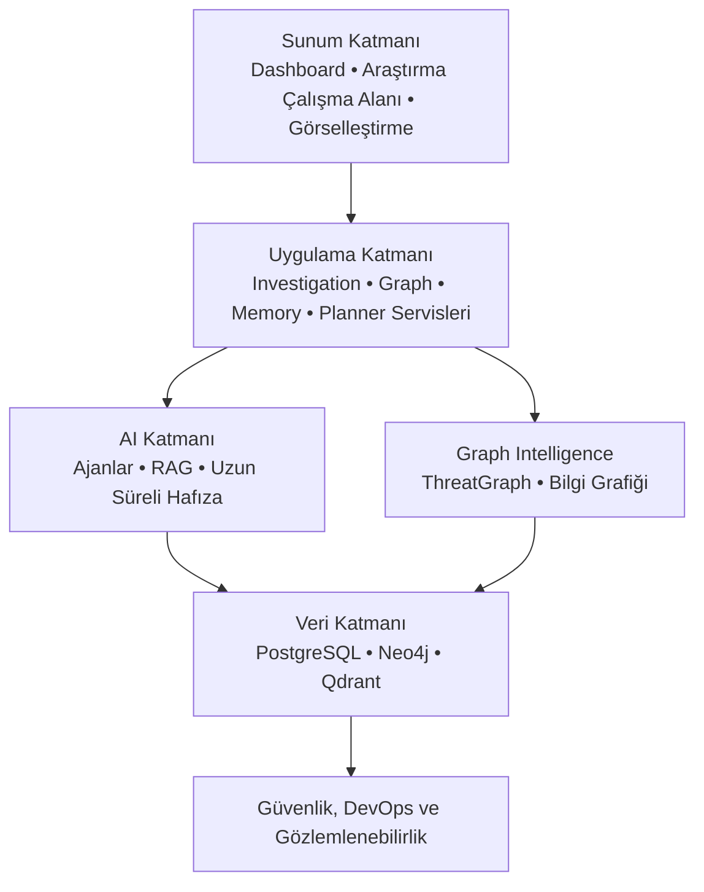
```mermaid
flowchart TB

    U["Sunum Katmanı<br/>Dashboard • Araştırma Çalışma Alanı • Görselleştirme"]

    A["Uygulama Katmanı<br/>Investigation • Graph • Memory • Planner Servisleri"]

    AI["AI Katmanı<br/>Ajanlar • RAG • Uzun Süreli Hafıza"]

    G["Graph Intelligence<br/>ThreatGraph • Bilgi Grafiği"]

    D["Veri Katmanı<br/>PostgreSQL • Neo4j • Qdrant"]

    S["Güvenlik, DevOps ve Gözlemlenebilirlik"]

    U --> A

    A --> AI
    A --> G

    AI --> D
    G --> D

    D --> S
```

Platform şu ana mimari alanlara ayrılmıştır:

- **Sunum Katmanı** — Kullanıcı arayüzleri, dashboard ve araştırma çalışma alanları.
- **Uygulama Katmanı** — İş servisleri, araştırma iş akışları ve API orkestrasyonu.
- **AI Katmanı** — Çoklu-ajan akıl yürütme, planlama, hafıza yönetimi ve RAG.
- **Graph Intelligence** — Bilgi grafiği modelleme, ilişki analizi ve grafik tabanlı araştırmalar.
- **Güvenlik Katmanı** — Kimlik doğrulama, yetkilendirme, denetim ve güvenlik yönetişimi.
- **DevOps Katmanı** — Dağıtım, yapılandırma yönetimi, gözlemlenebilirlik ve platform operasyonları.

Her alanın sorumluluk ve sahiplik sınırları açıkça tanımlanmıştır; bu da uzun vadeli sürdürülebilirliği ve mimari tutarlılığı güvence altına alır.

### Mimari İlkeler

- **Architecture First** — Mimari kararlar implementasyon kararlarından önce gelir.
- **Açık Sahiplik** — Her mimari kavramın tek ve net bir sahibi vardır.
- **Sorumlulukların Ayrılması** — AI, Uygulama Katmanı, Sunum Katmanı, Güvenlik ve DevOps birbirinden bağımsız mimari alanlar olarak kalır.
- **Kademeli Evrim** — Mimari, kontrollü ve izlenebilir değişikliklerle evrilir.
- **Yönetişim Odaklı Geliştirme** — Mimari evrim RFC ve ADR süreçleriyle yönetilir.
- **Teknolojiden Bağımsızlık** — Mimari kararlar, mümkün olduğunca belirli framework/teknoloji seçimlerinden bağımsız kalır.

### Teknoloji Yığını

| Katman | Teknoloji |
|-------|----------------------|
| **Backend** | FastAPI, Python |
| **Frontend** | React, TypeScript |
| **AI Runtime** | Sağlayıcıdan bağımsız LLM/embedding portlarına sahip, in-process Python runtime (ADR-005/ADR-010; ileride bir orkestrasyon framework'ü sorumlulukları değiştirmeden eklenebilir) |
| **Graph Veritabanı** | Neo4j |
| **Vektör Veritabanı** | Qdrant |
| **İlişkisel Veritabanı** | PostgreSQL |
| **Önbellekleme** | Redis |
| **Konteynerleştirme** | Docker |
| **Reverse Proxy** | Nginx |
| **Gözlemlenebilirlik** | Prometheus, Grafana |
| **CI/CD** | GitHub Actions |

### Repo Yapısı

```text
SentinelAI/
│
├── assets/             # Görseller, diyagramlar ve proje kaynakları
├── backend/            # Backend servisleri ve API'ler
├── datasets/           # Örnek veri setleri
├── docs/               # Mimari, yönetişim ve mühendislik dokümantasyonu
├── frontend/           # Web uygulaması
├── infrastructure/     # Docker, dağıtım ve altyapı kaynakları
├── notebooks/          # Araştırma ve deney notebook'ları
├── research/           # Araştırma makaleleri ve tasarım çalışmaları
├── scripts/            # Geliştirme ve otomasyon script'leri
└── README.md
```

### Dokümantasyon Yapısı

| Klasör | İçerik |
| ------------------- | ----------------------------------------------------------- |
| **00-project**      | Proje vizyonu, tasarım ilkeleri ve charter |
| **01-product**      | Ürün kavramları ve ThreatGraph tanımı |
| **02-architecture** | Üst seviye sistem mimarisi |
| **03-ai**           | Çoklu-ajan mimarisi, hafıza, bilgi grafiği ve RAG |
| **04-backend**      | Backend mimarisi, servisler ve domain modeli |
| **05-frontend**     | Frontend mimarisi, UI durum yönetimi ve araştırma çalışma alanı |
| **06-devops**       | Dağıtım, ortamlar, yapılandırma ve gözlemlenebilirlik |
| **07-security**     | Güvenlik mimarisi, kimlik doğrulama ve tehdit modellemesi |
| **08-testing**      | Test stratejisi, entegrasyon ve AI doğrulama |
| **09-decisions**    | Mimari Karar Kayıtları (ADR) |
| **10-rfc**          | RFC yönetişimi |
| **11-roadmap**      | Geliştirme yol haritası ve implementasyon stratejisi |

### Geliştirme Durumu

SentinelAI, **Mimari ve Temel** aşamasından **canlı implementasyon** aşamasına geçmiştir: mimari tasarım, yönetişim modeli ve mühendislik stratejisi implementasyondan önce tamamlanmıştır; implementasyon artık kontrollü ve doğrulanabilir dikey dilimlerle ilerlemektedir.

| Alan | Durum |
| ----------------------------------- | -------------- |
| Proje vizyonu ve mimari dokümantasyon | ✅ Tamamlandı |
| Mimari yönetişim (ADR & RFC) | ✅ Tamamlandı |
| Mimari denetim (Faz 1) ve boşluk analizi (Faz 2) | ✅ Tamamlandı |
| İlk Dikey Dilim — PostgreSQL, Gemini LLM, canlı Investigation Loop, dev-grade auth, mock'suz UI akışı (ES-040–047) | ✅ Tamamlandı |
| İkinci Dikey Dilim / Milestone A — Neo4j canlı graph deposu (ES-048) | ✅ Tamamlandı |
| İkinci Dikey Dilim / Milestone A — Gemini embedding sağlayıcısı (ES-049) | ✅ Tamamlandı |
| İkinci Dikey Dilim / Milestone A — Qdrant transactional outbox & projector (ES-050) | ✅ Tamamlandı |
| İkinci Dikey Dilim / Milestone A — Canlı RAG retrieval: kaynak-destekli retriever + run yolunda tüketim (ES-051) | ✅ Tamamlandı |
| İkinci Dikey Dilim / Milestone A — Workspace Memory yüzeyi: investigation-scoped memory API + bölge (ES-052) | ✅ Tamamlandı |
| İkinci Dikey Dilim / Milestone A — Seed aracı & dilim demosu (ES-053) | ✅ Tamamlandı |
| İkinci LLM sağlayıcısı — NVIDIA NIM / MiniMax-M3 adaptörü + `LLM_PROVIDER` seçimi (ES-054) | ✅ Tamamlandı |
| Milestone B — Decision Engine: tamamlanan koşuda outcome sentezi + workspace paneli (ES-055) | ✅ Tamamlandı |
| Milestone B — Validation Agent: sentez öncesi bulgu/kanıt değerlendirmesi (ES-056) | ✅ Tamamlandı |
| Milestone B — Graph Analysis Agent: komşuluk analizi ile koşu zenginleştirme (ES-057) | ✅ Tamamlandı |
| Milestone C — External Knowledge canlı: ATT&CK katalog + NVD CVE sağlayıcıları + EXTERNAL retrieval stratejisi (ES-058) | ✅ Tamamlandı |
| Milestone C — Threat Intelligence Agent: odaklı dış aramalar + korelasyonla koşu zenginleştirme (ES-059) | ✅ Tamamlandı |
| Milestone D — Evidence Payload Store: RFC-001/ADR-015 + content-addressed store + payload REST (ES-060) | ✅ Tamamlandı |
| Milestone D — Workspace evidence yükleme/indirme yüzeyi + kapanış (ES-061) | ✅ Tamamlandı |
| Milestone E — Production kimlik: JWT authenticator + owner==subject + WWW-Authenticate (ES-062) | ✅ Tamamlandı |
| Milestone E — Çok-kiracılık: RFC-002/ADR-016 + investigation tenant scope + tenant-aware authorizer (ES-063) | ✅ Tamamlandı |
| Milestone F — Veri yaşam sonu: RFC-003/ADR-017 + investigation-family tombstoning cascade + DELETE yüzeyi (ES-064) | ✅ Tamamlandı |
| Milestone F — Secondary-store erasure propagation: payload byte silme + embedding point silme + kişiye-bağlı Memory/Graph erasure (ES-065) | ✅ Tamamlandı |
| Milestone F — Workspace erasure yüzeyi + tombstone gösterimi + kapanış (ES-066) | ✅ Tamamlandı |
| Milestone G — Her hata kenarında dayanıklılık: sağlayıcı devre kesici/retry/fallback + projektör retry/dead-letter (ES-067) | ✅ Tamamlandı |
| Milestone G — Kenar ve dağıtım sertleştirme: kimlik başına hız sınırlama + TLS/edge overlay + imaj tedarik zinciri (tarama/SBOM/provenance/imza) + sürümlü registry (ES-068) | ✅ Tamamlandı |
| Milestone G — Doğrulanabilir işletim: RFC-004/ADR-018 hash-zincirli dayanıklı audit sink + AC-14 mekanik enforcement + readiness gating + secret startup fail-fast (ES-069) | ✅ Tamamlandı |
| Milestone G — Erasure operasyonelleştirme: retention sweep + crypto-shred payload store + RFC-005/ADR-019 capability-korumalı paylaşılan-bilgi erasure + platform operasyon yüzeyi ve kapanış (ES-070) | ✅ Tamamlandı |
| Milestone H — Yönetişim uyumu: RFC-006/ADR-020 doküman yaşam döngüsü + her dokümanın kendi açık boşluklarını beyan etmesi + AC-16 ile makine-denetimli yönetişim tazeliği (ES-071) | ✅ Tamamlandı |
| Milestone H — Sürüm kimliği & promotion: ADR-021 tek-platform sürümü + uyumluluk yüzeyi + Apache-2.0 lisansı + koordineli açıklama politikası + changelog + doğrulanmış digest-pinli promotion akışı (ES-072) | ✅ Tamamlandı |
| Milestone H — Release 1.0: hazırlık kapısının delille değerlendirilmesi + **yayınlanan digest-pinli imajlarla** staging provası + sürüm 1.0.0 ve milestone kapanışı (ES-073) | ✅ Tamamlandı |

Platformun temel uçtan uca iddiası — önerilen bir AI kararının yürütülmesi, kalıcı olarak izlenmesi ve tarayıcıda mock'suz görünmesi — artık canlı olarak kanıtlanmıştır. **Milestone A–H kapatılmıştır:** Bilgi Katmanı (RAG retrieval), çoklu-ajan/karar katmanı (Decision Engine + Validation/Graph Analysis/Threat Intelligence ajanları), kanıt yükleme hattı (içerik-adresli payload store), production kimlik (JWT), çok-kiracılık (tenant izolasyonu), veri yaşam sonu (erasure/tombstoning) ve **production sertleştirme** — her hata kenarında dayanıklılık, hız sınırlama ve imzalı/taranmış sürümlü imaj hattı, kurcalamaya karşı kanıtlanabilir audit kaydı, otomatik retention uygulaması ve platformun kendi operasyonel duruşunu gösteren yüzey — canlı olarak teslim edilmiştir. Son milestone **H** (yönetişim/sürüm operasyonları + lisans) de kapandı. **ES-071** ile mimari dokümantasyon artık kendi durumunu bildiriyor (ADR-020 doküman yaşam döngüsü; her doküman ya gerçeklenmiş ya da kendi içinde sınırlanmış olduğunda `Accepted`), bilinçli olarak açık bırakılan sorular ilgili dokümanın **Known Gaps** bölümünde kamuya açık duruyor ve yönetişim tazeliği artık AC-16 ile makine tarafından denetleniyor. **ES-072** ile sürüm kimliği yerine oturdu: platform tek sürüm olarak yayımlanıyor (ADR-021), uyumluluk yüzeyi commit'lenen API sözleşmesi olarak adlandırıldı, proje **Apache-2.0** ile lisanslandı, koordineli açıklama politikası (`SECURITY.md`) ve changelog yayımlandı; promotion, imza + SBOM/provenance doğrulaması yapıp **digest'e sabitlenmiş** imaj çifti üreten, onaya bağlı ve kayıt bırakan ayrı bir adım. **ES-073 ile Milestone H kapandı ve Release 1.0 etiketlenmeye hazır:** hazırlık kapısının her maddesi delille işaretlendi ve release yolu **yayınlanan digest-pinli imajlarla** staging overlay'i üzerinde uçtan uca prova edildi (TLS kenarı, JWT, retention açık, crypto-shred payload, dayanıklı audit). Prova hemen işe yaradı: konteynerli dağıtımda kanıt yüklemeyi bozan bir kusur (payload volume'ünün root sahipliğiyle oluşması) yakalandı ve imaj tanımında düzeltildi; koşu, yavaş sağlayıcı altında belgelenmiş `exhausted` terminal durumuna ulaştı — sessizce çökmedi. **Milestone A–H kapandı.** Çok-instance yatay ölçekleme (projektör/sweep leader election, paylaşımlı hız-sınırı durumu) bilinçli olarak release sonrasına bırakılmıştır.

### Yol Haritası

- **Faz 1 — Temel:** Repo kurulumu, geliştirme ortamı, temel altyapı, CI/CD temeli.
- **Faz 2 — Çekirdek Platform:** Backend servisleri, frontend uygulaması, graph altyapısı, kimlik doğrulama ve güvenlik.
- **Faz 3 — AI Platformu:** Çoklu-ajan runtime, bilgi grafiği entegrasyonu, RAG, uzun süreli hafıza.
- **Faz 4 — Production Hazırlığı:** Performans optimizasyonu, gözlemlenebilirlik, güvenlik sertleştirme, kapsamlı test, production dağıtımı.

Detaylı implementasyon planlaması `docs/11-roadmap` dizinindedir.

### Docker ile Çalıştırma

Platformun dağıtım birimleri konteynerleştirilmiştir. Kök dizindeki `docker-compose.yml`, mimari dağıtım birimlerini konteynerlere eşler: **Sunum** (frontend), in-process AI Runtime dahil **Uygulama** (backend) ve **Veri** (PostgreSQL, Neo4j, Qdrant, Redis). Frontend, SPA'yı sunar ve `/api` ile `/health` uçlarını backend'e ters proxy'ler; böylece tarayıcı tek bir same-origin sınırıyla konuşur (CORS yok).

```bash
cp .env.example .env                       # opsiyonel; stack varsayılanlarla da çalışır

docker compose up --build                  # backend + frontend
docker compose --profile data up --build   # + veri katmanı (PostgreSQL/Neo4j/Qdrant/Redis)
```

Uygulama **http://localhost:8080** adresinde yayında olur:

```bash
curl http://localhost:8080/health          # {"status":"ok","name":"SentinelAI",...}
```

Veri katmanı `data` compose profiliyle opsiyoneldir; backend, veritabanları çalışmasa da başlar. `docker compose down` ile kapatılır (veri servislerini de kaldırmak için `--profile data`, volume'leri silmek için `-v` eklenir).

#### Staging / Production dağıtımı

Geliştirme dışındaki ortamlar, CI'ın yayımladığı **sürümlenmiş, taranmış ve imzalanmış** imajları çalıştırır (`ghcr.io/<owner>/sentinelai-{backend,frontend}`) ve dağıtım sertleştirmesini ekler: TLS sonlandırma, güvenlik başlıkları, anonim istek seli koruması, kaynak/log sınırları ve istek kenarında kimlik başına hız sınırlama.

```bash
docker compose -f docker-compose.yml -f docker-compose.staging.yml --profile data up -d
docker compose -f docker-compose.yml -f docker-compose.prod.yml    --profile data up -d
```

Sertifika sağlama, imza doğrulama, imaj etiketleme şeması ve ortam hedefleri: [`infrastructure/README.md`](infrastructure/README.md).

### Katkıda Bulunma

SentinelAI, **Architecture First** iş akışıyla geliştirilmektedir. Katkıda bulunmadan önce `docs/` dizinindeki mimari dokümantasyona aşina olunması önerilir. Mimari değişiklikler; evrim önerisi için **RFC**, kabul edilen kararların kaydı için **ADR** yönetişim modelini takip etmelidir.

### Güvenlik

Güvenlik açıklarını **herkese açık issue olarak değil**, GitHub'ın özel bildirim akışıyla iletin (Security → Report a vulnerability). Kapsam, beklenen yanıt ve yayımlanan imajların imza doğrulaması: [`SECURITY.md`](SECURITY.md).

### Sürümleme

Platform **tek sürüm** olarak yayımlanır: tüm dağıtım birimleri aynı sürümü beyan eder ve `vX.Y.Z` etiketi o sürümü adlandırır (ADR-021). Uyumluluk yüzeyi, commit'lenen API sözleşmesi `docs/api/openapi.json`'dır; **`0.x` hiçbir uyumluluk taahhüdü vermez** — taahhüt 1.0.0 ile başlar. Sürüm içerikleri: [`CHANGELOG.md`](CHANGELOG.md).

### Lisans

SentinelAI, **Apache License 2.0** altında yayımlanır — tam metin: [`LICENSE`](LICENSE). Apache-2.0; atıf ve değişiklik bildirimi yükümlülüğüyle birlikte açık bir patent hibesi taşıdığı için güvenlik/altyapı araçlarının olağan tercihidir.

</details>

---

## Sprint 1

<details>
<summary><strong>Sprint 1 detaylarını görmek için tıklayın</strong></summary>

**Sprint tarih aralığı:** 19 Haziran 2026 – 5 Temmuz 2026

### Sprint Notları

- Faz 1 (mimari denetim) ve Faz 2 (boşluk analizi) tamamlandı; ilk dikey dilim (ES-040–047) uygulandı; ikinci dikey dilimin (Milestone A) ilk üç kalemi — Neo4j, Gemini embedding, Qdrant outbox (ES-048–050) — bu sprint içinde tamamlandı.
- Backlog Jira'da (SentinalAI / SEN projesi) 8 üst-seviye görev ve 12 alt görev olarak işlendi; mimari seviyedeki teknik detay `workdocs/SentinelAI-Implementation-Tracker.md`'de tutuldu.
- Her iş kalemi aynı akıştan geçti: Implementation Plan → Mimari İnceleme → Implementasyon → Doğrulama (`ruff` + `mypy --strict` + `pytest`) → Kod İncelemesi → Doküman Güncellemesi → Merge.

### Sprint İçinde Tamamlanan İşler

Faz 1, Faz 2, İlk Dikey Dilim (8 ES) ve İkinci Dikey Dilim'in ilk 3 kalemi (ES-048–050) — Jira'da 14 görev "Tamamlandı" durumunda.

### Daily Scrum

İlerleme her gün `workdocs/SentinelAI-Implementation-Tracker.md`'ye append-only olarak işlendi ve Jira görev durumlarına yansıtıldı.

### Sprint Board

Backlog ve board [Jira'da (SentinalAI / SEN projesi)](https://korayozturk.atlassian.net/jira/core/projects/SEN/board) tutulmaktadır.

**Jira Pano Görünümü**

<p align="center">
  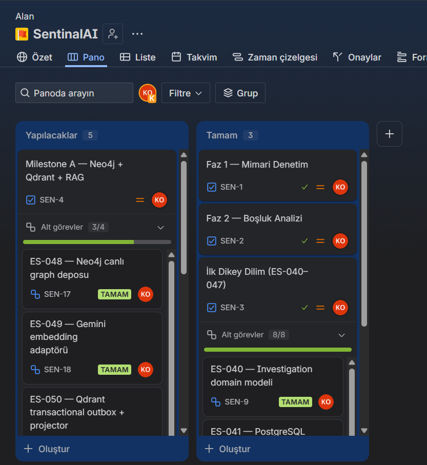
  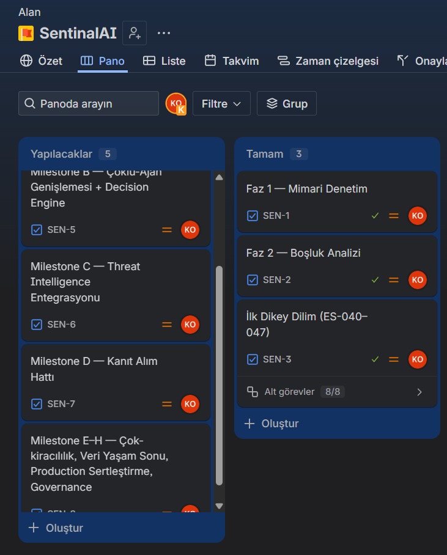
</p>

**Jira Liste Görünümü**

<p align="center">
  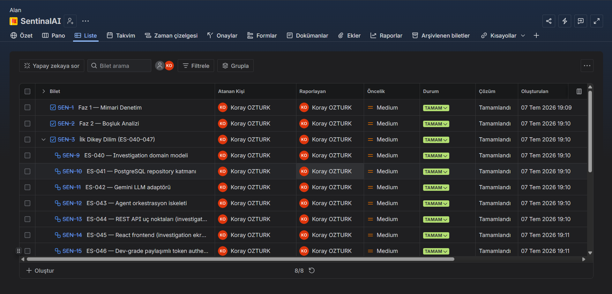
  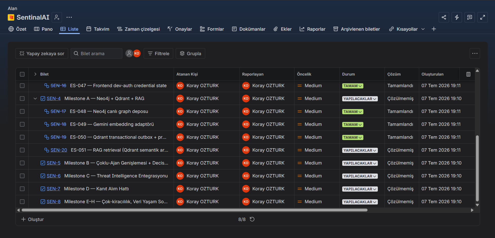
</p>

### Ürün Durumu

| Alan | Durum |
|---|---|
| Proje vizyonu, mimari ve yönetişim dokümantasyonu (`docs/00-project` … `docs/11-roadmap`) | ✅ Tamamlandı |
| Faz 1 — Mimari Denetim (bulgular A1–A10, B1–B10) | ✅ Tamamlandı |
| Faz 2 — Boşluk Analizi (M/E/D bulguları) | ✅ Tamamlandı |
| İlk Dikey Dilim (ES-040–047): PostgreSQL tek otoriter depo, Gemini LLM, canlı Investigation Loop, dev-grade auth, tarayıcıdan mock'suz akış | ✅ Tamamlandı (2026-07-04) |
| İkinci Dikey Dilim / Milestone A — Neo4j gerçek graph deposu (ES-048) | ✅ Tamamlandı |
| İkinci Dikey Dilim / Milestone A — Gemini embedding adaptörü (ES-049) | ✅ Tamamlandı |
| İkinci Dikey Dilim / Milestone A — Qdrant transactional outbox + projector (ES-050) | ✅ Tamamlandı |
| RAG — semantik sorgunun agent/planner tarafından tüketimi | 🚧 Planlandı (sonraki ES) |
| Milestone B — Decision Engine ve uzman agent genişlemesi | ⏳ Başlamadı |
| Backend test durumu | ✅ 352 test yeşil, `ruff` temiz, `mypy --strict` temiz (157 dosya) |

### Uygulama Ekran Görüntüsü

<p align="center">
  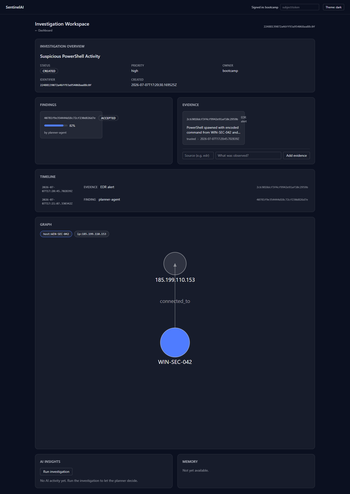
</p>

### Sprint Review

- Sprint sonunda platform, ilk kez kendi çekirdek iddiasını uçtan uca kanıtladı: bir AI kararı üretiliyor, yürütülüyor, Investigation Trace'e kalıcı olarak yazılıyor ve tarayıcıdan **mock'suz** görünüyor.
- LLM sağlayıcısı (Gemini) hata verdiğinde akış sessizce çökmek yerine güvenli bir **ESCALATED** durumuna geriliyor.
- Roadmap'in "Vertical Slice First" kuralı ilk dilimle birlikte kilidini açtı; bu sayede ikinci dilimin (Neo4j + Qdrant) temel taşları da bu sprint içinde erken başlatılıp tamamlandı — planlanandan hızlı bir ilerleme.
- Sprint Review katılımcısı: Koray Öztürk.

### Sprint Retrospective

- **İyi giden:** Mimariyi implementasyondan önce netleştirmek, her ES için kod ile dokümanın (ADR, `openapi.json`, roadmap Delivery Record) eşzamanlı güncellenmesi sürecin tutarlılığını korudu; hiçbir ES bir öncekini geçersiz kılmadı.
- **Geliştirilecek:** Backlog Jira'ya taşındı; sonraki sprintte günlük ilerlemenin de Jira üzerinden (yorum/durum geçişleriyle) takip edilmesi hedefleniyor.
- **Sonraki sprint için kararlaştırılanlar:** Milestone A'nın kalanı (RAG retrieval'in agent tarafından tüketimi), ardından Milestone B (Decision Engine, uzman agent'lar) önceliklendirilecek.

</details>

---

## Sprint 2

<details>
<summary><strong>Sprint 2 detaylarını görmek için tıklayın</strong></summary>

**Sprint tarih aralığı:** 6 Temmuz 2026 – 19 Temmuz 2026

### Sprint Notları

- Bu sprint, ikinci dikey dilimi (Milestone A) kapattı ve ardından art arda beş milestone'u uçtan uca teslim etti: **Milestone A** (Bilgi Katmanı — canlı RAG + workspace memory + seed demo), **Milestone B** (Decision Engine + uzman ajanlar), **Milestone C** (Threat Intelligence), **Milestone D** (Evidence Ingestion) ve **Milestone E** (Production kimlik + çok-kiracılık).
- Toplam **13 iş kalemi (ES-051 – ES-063)** tamamlandı; her biri aynı akıştan geçti: Implementation Plan → Mimari İnceleme → Implementasyon → Doğrulama (`ruff` + `mypy --strict` + `pytest`, frontend 4-kapı) → Kod İncelemesi → Doküman Güncellemesi (ADR/RFC, `openapi.json`, roadmap Delivery Record) → Merge.
- Yönetişimde bir ilk: platformun **RFC süreci ilk kez fiilen işletildi** — domain/mimari semantiğini değiştiren kararlar için ADR-014 eşiğinin üzerinde **RFC-001** (Evidence Payload Store → ADR-015) ve **RFC-002** (Tenant Scope → ADR-016) yazıldı ve kabul edildi.
- İkinci bir LLM sağlayıcısı (NVIDIA NIM / MiniMax-M3) eklendi; aktif sağlayıcı `LLM_PROVIDER` konfigürasyonuyla seçilir hale geldi.
- Sprint kapanışında frontend'in geçici/temel arayüzü, davranışa veya API sözleşmesine dokunmadan, animasyonlu bir "SOC konsolu" temasıyla yeniden tasarlandı (UI-R1, `workdocs/SentinelAI-Implementation-Tracker.md`); frontend 4-kapı yeşil kaldı.

### Sprint İçinde Tamamlanan İşler

**5 milestone kapatıldı, 13 ES teslim edildi** (Jira'da "Tamamlandı"):

- **Milestone A — İkinci Dikey Dilim (Bilgi Katmanı):** ES-051 canlı RAG retrieval (semantik + graph + structured), ES-052 workspace Memory yüzeyi, ES-053 seed aracı + dilim demosu.
- **İkinci LLM sağlayıcısı:** ES-054 NVIDIA NIM / MiniMax-M3 adaptörü + `LLM_PROVIDER` seçimi + dev otomatik oturum açma.
- **Milestone B — Decision Engine + Uzman Ajanlar:** ES-055 Decision Engine (outcome sentezi), ES-056 Validation Agent, ES-057 Graph Analysis Agent.
- **Milestone C — Threat Intelligence:** ES-058 dış bilgi sağlayıcıları (MITRE ATT&CK katalog + NVD CVE) + EXTERNAL retrieval stratejisi, ES-059 Threat Intelligence Agent.
- **Milestone D — Evidence Ingestion:** ES-060 içerik-adresli evidence payload store (RFC-001/ADR-015), ES-061 workspace yükleme/indirme yüzeyi.
- **Milestone E — Production Kimlik & Çok-Kiracılık:** ES-062 JWT authenticator + owner==subject + `WWW-Authenticate`, ES-063 tenant scope (RFC-002/ADR-016) + tenant-aware yetkilendirme.

### Daily Scrum

İlerleme her gün `workdocs/SentinelAI-Implementation-Tracker.md`'ye append-only olarak işlendi (her ES için durum satırı + teknik-borç bölümü + zaman çizelgesi girdisi) ve Jira görev durumlarına yansıtıldı.

### Sprint Board

Backlog ve board [Jira'da (SentinalAI / SEN projesi)](https://korayozturk.atlassian.net/jira/core/projects/SEN/board) tutulmaktadır.

**Jira Pano Görünümü**

<p align="center">
  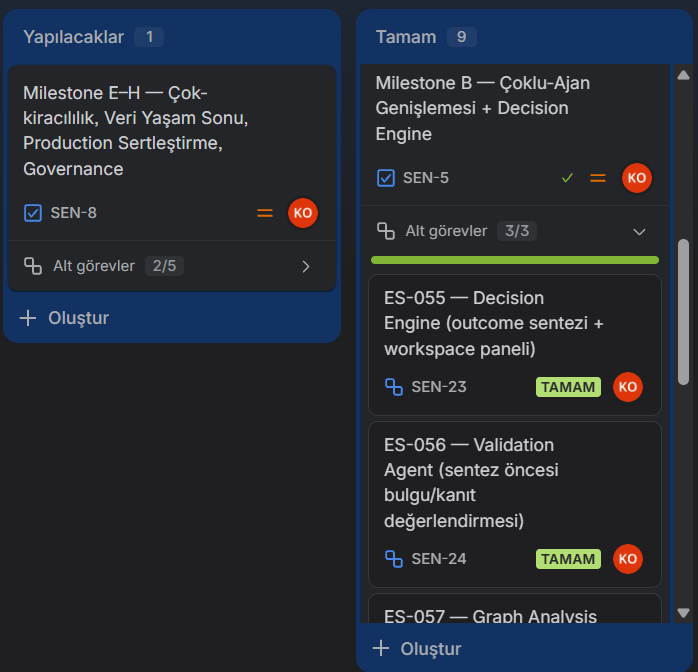
  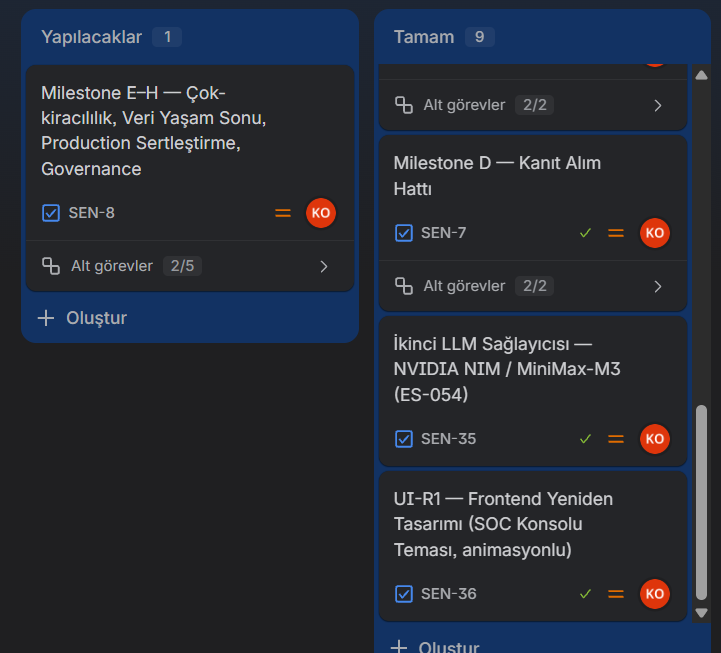
</p>

**Jira Liste Görünümü**

<p align="center">
  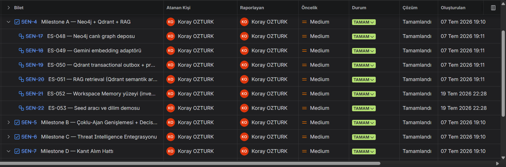
  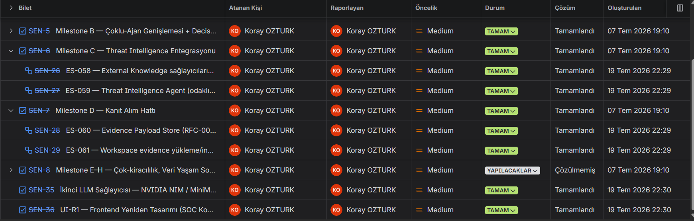
</p>

### Ürün Durumu

| Alan | Durum |
|---|---|
| Milestone A — Canlı RAG retrieval (ES-051), workspace Memory yüzeyi (ES-052), seed & demo (ES-053) | ✅ Tamamlandı (2026-07-14) |
| İkinci LLM sağlayıcısı — NVIDIA NIM / MiniMax-M3 + `LLM_PROVIDER` (ES-054) | ✅ Tamamlandı (2026-07-14) |
| Milestone B — Decision Engine (ES-055), Validation Agent (ES-056), Graph Analysis Agent (ES-057) | ✅ Tamamlandı (2026-07-15) |
| Milestone C — Threat Intelligence: dış sağlayıcılar + EXTERNAL strateji (ES-058), TI Agent (ES-059) | ✅ Tamamlandı (2026-07-17) |
| Milestone D — Evidence Payload Store (ES-060) + workspace yükleme/indirme (ES-061) | ✅ Tamamlandı (2026-07-17) |
| Milestone E — Production kimlik / JWT (ES-062) + çok-kiracılık / tenant scope (ES-063) | ✅ Tamamlandı (2026-07-17) |
| Yönetişim — RFC süreci ilk kez işletildi (RFC-001/ADR-015, RFC-002/ADR-016) | ✅ Tamamlandı |
| Backend test durumu | ✅ 525 test yeşil, `ruff` temiz, `mypy --strict` temiz (180 dosya) |
| Frontend test durumu | ✅ 74 test yeşil, lint/typecheck/build temiz (4-kapı) |
| UI-R1 — Frontend yeniden tasarımı ("SOC konsolu" teması, animasyonlu) | ✅ Tamamlandı |

### Uygulama Ekran Görüntüsü

Sprint 2'nin son gününde, geçici/temel arayüz **modern ve animasyonlu bir "SOC konsolu" temasıyla** yeniden tasarlandı (davranış, state ve API sözleşmesi değişmedi — yalnızca sunum katmanı): koyu komuta-merkezi paleti, self-hosted Space Grotesk/JetBrains Mono tipografisi, panel köşe-braketleri, sonar nabız göstergeleri, animasyonlu güven çubukları ve yönlü graf akışı.

<p align="center">
  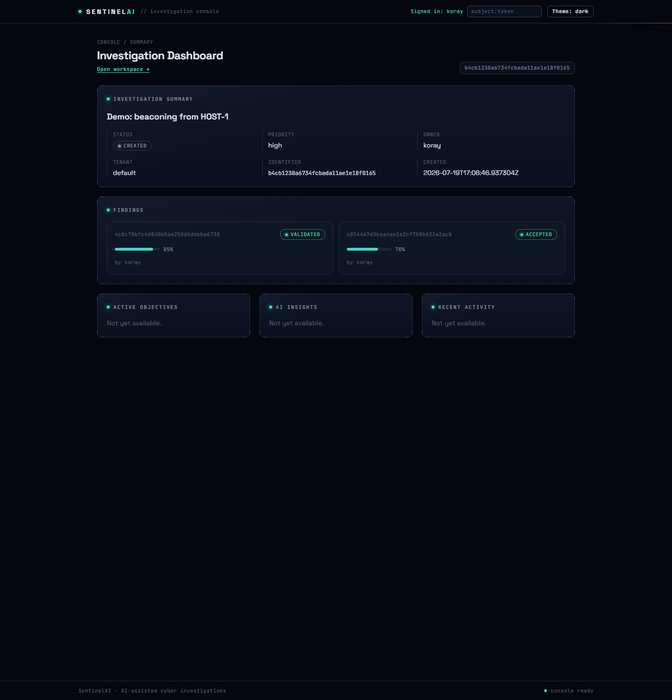
</p>

<p align="center">
  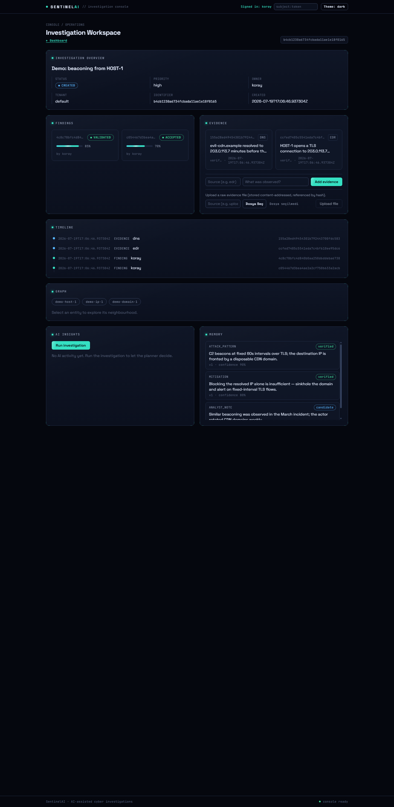
</p>

### Sprint Review

- Sprint boyunca platform, tek koşuda **yedi türlü Investigation Trace** üretecek olgunluğa ulaştı: `retrieval → graph_analysis → threat_intel → planner_decision → action_execution → validation → outcome_synthesis → loop_outcome` — tüm zincir tarayıcıda, gerçek sağlayıcılarla (MiniMax-M3 + gerçek Gemini embedding + gerçek NVD/ATT&CK aramaları) kanıtlandı.
- **Milestone C:** dış tehdit istihbaratı (ATT&CK teknikleri + canlı CVE aramaları) bir araştırma koşusunu gerçek zamanlı zenginleştirdi.
- **Milestone D:** ham kanıt yükü uçtan uca gezdi — tarayıcıdan yükleme → içerik-adresli depo → hash ile doğrulanmış indirme (byte-for-byte eşleşme); 413/422 hata sözleşmesi canlı doğrulandı.
- **Milestone E:** dev-grade paylaşımlı token, production-grade **JWT kimlik** ile değiştirildi (per-subject token, süre sınırı, `WWW-Authenticate` challenge); **owner==subject** ve **tenant izolasyonu** canlı kanıtlandı (yabancı tenant → 403). Release yolundaki iki sert ön koşul (production IdP, owner==subject) karşılandı.
- Backend test sayısı sprint boyunca **352 → 525**'e yükseldi; hiçbir ES doğrulama kapıları yeşil olmadan kapanmadı.
- Sprint Review katılımcısı: Koray Öztürk.

### Sprint Retrospective

- **İyi giden:** Milestone başına iki ES'lik ritim (bir altyapı/port ES'i + bir kullanıcıya-görünür ES) tutarlı ilerleme sağladı; her milestone canlı bir kanıtla — gerçek stack üzerinde uçtan uca demo — kapandı. RFC süreci ilk kez işletildi; domain semantiğini değiştiren kararlar (payload store, tenant scope) yönetişimden geçti.
- **Ortam kurtarma:** Sprint ortasında bir makine formatı yerel planlama dosyalarını (`implementation/`) düşürdü; append-only mühendislik defteri (`workdocs/SentinelAI-Implementation-Tracker.md`) repo içinde kaynak-doğruluk olarak kaldığından planlar sorunsuz yeniden üretildi — append-only defter pratiğinin değeri doğrulandı.
- **Geliştirilecek:** Reasoning modelinin (MiniMax-M3) çağrı başına gecikmesi, altı ardışık LLM çağrılı koşuda dar geldi; NVIDIA yürütme-sınırı varsayılanı 90s → 180s'e çekildi. Sağlayıcı devre kesici / geri çekilme (retry/backoff) Milestone G'ye ertelendi.
- **Sonraki sprint için kararlaştırılanlar:** Milestone F (veri yaşam sonu — tombstoning / crypto-shredding), Milestone G (production sertleştirme) ve Milestone H (yönetişim/sürüm + lisans kararı) önceliklendirilecek.

</details>

---

## Sprint 3

<details>
<summary><strong>Sprint 3 detaylarını görmek için tıklayın</strong></summary>

**Sprint tarih aralığı:** 20 Temmuz 2026 – 2 Ağustos 2026

### Sprint Notları

- Bu sprint yol haritasının **kalan üç milestone'unu kapattı ve ürünü sürüme çıkardı**: **Milestone F** (verinin yaşam sonu — tombstoning / crypto-shredding), **Milestone G** (production sertleştirme) ve **Milestone H** (yönetişim + sürüm kimliği). **A–H'nin tamamı kapandı** ve **Release 1.0.0** etiketlenip yayımlandı.
- Toplam **10 iş kalemi (ES-064 – ES-073)** tamamlandı; her biri Sprint 2'deki akıştan geçti: Implementation Plan → Mimari İnceleme → Implementasyon → Doğrulama (`ruff` + `mypy --strict` + `pytest`, frontend 4-kapı) → Kod İncelemesi → Doküman Güncellemesi (ADR/RFC, `openapi.json`, roadmap Delivery Record) → Merge.
- RFC süreci bu sprintte **dört kez daha işletildi**: RFC-003 (silme/tombstoning → ADR-017), RFC-004 (denetim kaydı yaşam döngüsü → ADR-018), RFC-005 (yetenek-kapılı paylaşılan bilgi silme → ADR-019), RFC-006 (mimari doküman yaşam döngüsü → ADR-020); ayrıca ADR-021 ile tek-platform sürüm kimliği tanımlandı.
- **Sürüm provası ilk koşusunda bir kusur yakaladı.** Yayımlanmış, digest'e sabitlenmiş imajlardan kaldırılan staging ortamında kanıt yükleme `evidence_payload_store_unavailable` verdi: Docker adlandırılmış birimi imajdaki dizinden başlattığı ve `/data/evidence-payloads` imajda **bulunmadığı** için birim `root:root` sahipliğiyle oluşuyordu — süreç ise uid 10001. Yani her konteynerli dağıtımda kanıt yükleme yolu bozuktu; ES-060/061 yalnızca host üzerinde koşan bir backend ile kanıtlanmıştı. Provanın var oluş sebebi tam olarak bu sınıf boşluktur.
- **Sürüm sonrası (post-release) çalışma**, jüri sunumu ve demoya hazırlık amacıyla iki başlıkta yürütüldü: frontend'in sıfırdan yeniden yazımı (UI-R2, "Hum" teması) ve uçtan uca demo denetimi (UI-R3) — ikisi de yalnızca sunum katmanı; API sözleşmesi, rota, DTO ve servis davranışı değişmedi.

### Sprint İçinde Tamamlanan İşler

**3 milestone kapatıldı, 10 ES teslim edildi, Release 1.0.0 yayımlandı** (Jira'da "Tamamlandı"):

- **Milestone F — Verinin Yaşam Sonu:** ES-064 RFC-003/ADR-017 + Investigation ailesi tombstoning (PostgreSQL silme kaskadı + DELETE yüzeyi), ES-065 ikincil depo yayılımı (payload byte silme + embedding noktası silme + kişiye bağlı Memory/Graph silme), ES-066 workspace silme yüzeyi + tombstone gösterimi.
- **Milestone G — Production Sertleştirme:** ES-067 her hata kenarında dayanıklılık (sağlayıcı devre kesici / retry / **cross-provider failover** + projeksiyon retry/dead-letter), ES-068 kenar & dağıtım sertleştirme (kimlik başına hız sınırı, TLS/edge overlay, imaj tedarik zinciri: tarama/SBOM/provenance/imzalama), ES-069 doğrulanabilir işletim (RFC-004/ADR-018 + **hash-zincirli kalıcı denetim kaydı** + AC-14 mekanik zorlama + hazırlık kapılama), ES-070 silmenin operasyonelleştirilmesi (retention süpürme + crypto-shred payload deposu + RFC-005/ADR-019 + platform operasyonel yüzeyi).
- **Milestone H — Yönetişim & Sürüm:** ES-071 yönetişim uyumu (RFC-006/ADR-020 + doküman başına açık bilinen boşluklar + AC-16 makine-kontrollü yönetişim tazeliği), ES-072 sürüm kimliği & terfi (ADR-021 tek-platform sürümü + uyumluluk yüzeyi + Apache-2.0 lisansı + koordineli açıklama politikası + changelog + doğrulanmış digest-sabitli terfi iş akışı), ES-073 Release 1.0 (hazırlık kapısı kanıtla değerlendirildi + sürüm provası + sürüm 1.0.0).
- **Release 1.0.0:** `v1.0.0` etiketlendi, etiket koşusu tamamen yeşil — daha önce hiç çalışmamış iki iş dahil: sürüm kimliği (etiket ↔ manifest uyumu) ve imaj yayımı (Trivy kapısı ilk gerçek koşusunda geçti). İmajlar GHCR'de, SBOM + provenance ile imzalı.
- **Sürüm sonrası (UI-R2 / UI-R3):** frontend "Hum" temasıyla yeniden yazıldı (açık, sıcak, sekmeli çalışma alanı; her bölge kendini açıklıyor; graf görselleştirmesi ES-026'dan beri var olan dört kusuru giderilerek elden geçirildi) ve uçtan uca demo denetimi **üç eksik yazma yüzeyini** kapattı: bulgu kaydetme, araştırma yaşam döngüsü, hafızaya bilgi terfisi.

### Daily Scrum

İlerleme her gün `workdocs/SentinelAI-Implementation-Tracker.md`'ye append-only olarak işlendi (her ES için durum satırı + teknik-borç bölümü + zaman çizelgesi girdisi) ve Jira görev durumlarına yansıtıldı.

### Sprint Board

Backlog ve board [Jira'da (SentinalAI / SEN projesi)](https://korayozturk.atlassian.net/jira/core/projects/SEN/board) tutulmaktadır.

**Jira Pano Görünümü**

<p align="center">
  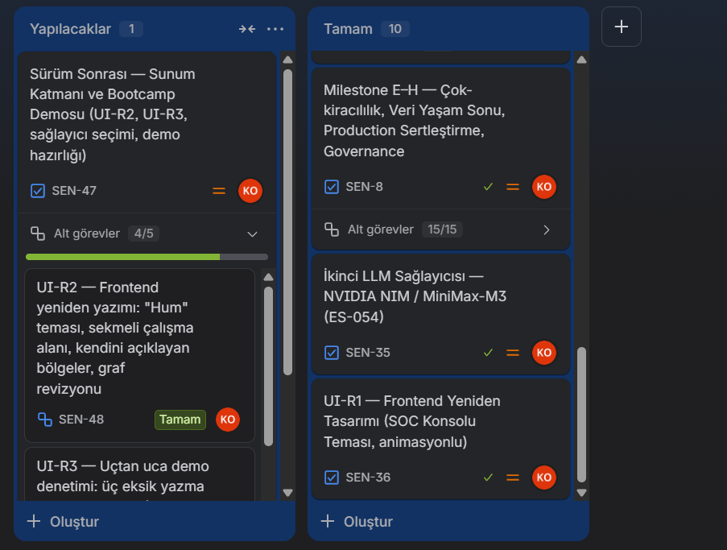
  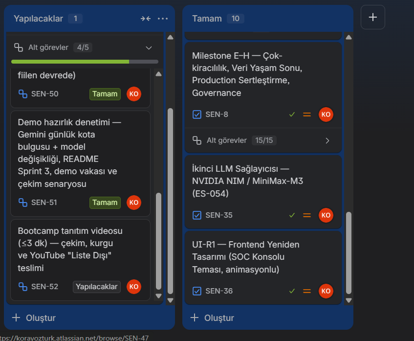
</p>

**Jira Liste Görünümü**

<p align="center">
  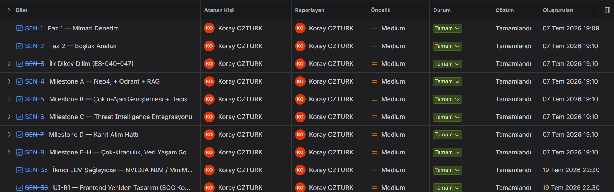
  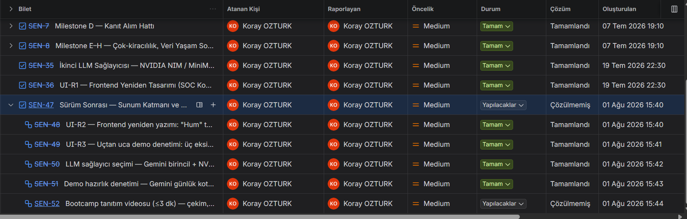
</p>

**Jira Bilet Detayı**

Her bilet yalnızca bir başlık değil: ne teslim edildiğini, hangi kararın neden
alındığını ve neyin ölçüldüğünü taşır — mühendislik defterindeki karşılığına
referansla. Aşağıda sürüm sonrası iki kalemin açıklaması örnek olarak veriliyor.

<p align="center">
  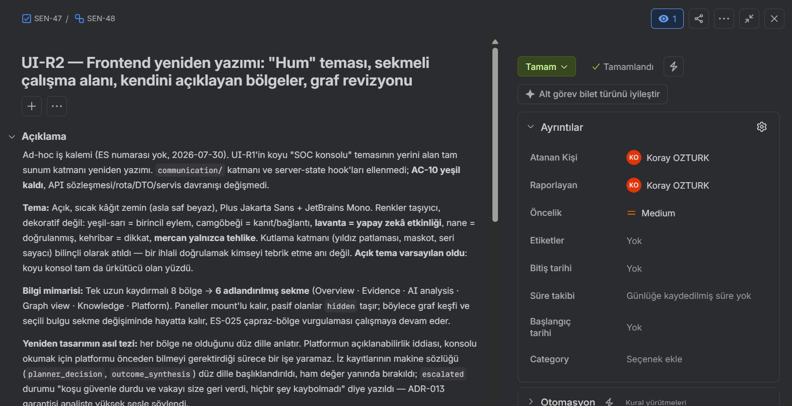
  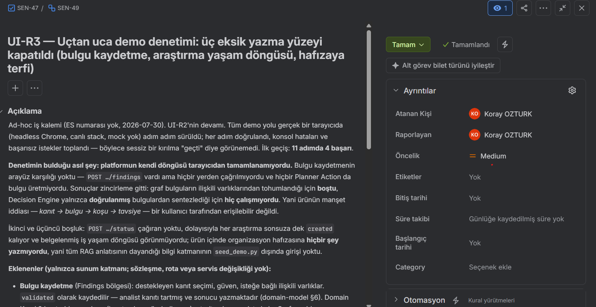
</p>

### Ürün Durumu

| Alan | Durum |
|---|---|
| Milestone F — Tombstoning/silme kaskadı (ES-064), ikincil depo yayılımı (ES-065), workspace silme yüzeyi (ES-066) | ✅ Tamamlandı (2026-07-24) |
| Milestone G — Dayanıklılık & failover (ES-067), kenar/tedarik zinciri sertleştirme (ES-068), hash-zincirli denetim kaydı (ES-069), silme operasyonelleştirme (ES-070) | ✅ Tamamlandı (2026-07-26) |
| Milestone H — Yönetişim uyumu (ES-071), sürüm kimliği & terfi + Apache-2.0 (ES-072), Release 1.0 hazırlık kapısı + prova (ES-073) | ✅ Tamamlandı (2026-07-26) |
| **Release 1.0.0** — `v1.0.0` etiketlendi, imzalı imajlar GHCR'de yayımlandı (SBOM + provenance) | ✅ Tamamlandı (2026-07-27) |
| Yönetişim — RFC-003/ADR-017, RFC-004/ADR-018, RFC-005/ADR-019, RFC-006/ADR-020, ADR-021 | ✅ Tamamlandı |
| UI-R2 — Frontend yeniden yazımı ("Hum" teması, sekmeli çalışma alanı, graf revizyonu) | ✅ Tamamlandı (2026-07-30) |
| UI-R3 — Uçtan uca demo denetimi; üç eksik yazma yüzeyi kapatıldı | ✅ Tamamlandı (2026-07-30) |
| Backend test durumu | ✅ 690 test yeşil, `ruff` temiz, `mypy --strict` temiz (200 dosya) |
| Frontend test durumu | ✅ 90 test yeşil, lint/typecheck/build temiz (4-kapı) |
| Ölçeklenme (çok-örnekli dağıtım), S3 uyumlu payload backend, denetim sorgu yüzeyi | ⏳ Sürüm sonrasına ertelendi |

### Uygulama Ekran Görüntüsü

Sürümden sonra arayüz, davranışa ve API sözleşmesine dokunulmadan **"Hum" temasıyla sıfırdan yeniden yazıldı** (UI-R2): koyu "SOC konsolu" yerine açık ve sıcak bir kâğıt zemin, altı adlandırılmış sekmeye bölünmüş çalışma alanı ve **kendini açıklayan bölgeler** — platformun açıklanabilirlik iddiası, konsolu okumak için platformu önceden bilmeyi gerektirdiği sürece bir işe yaramıyordu. Renkler taşıyıcıdır, dekoratif değil: lavanta yapay zekâ etkinliği, mercan yalnızca tehlike.

<p align="center">
  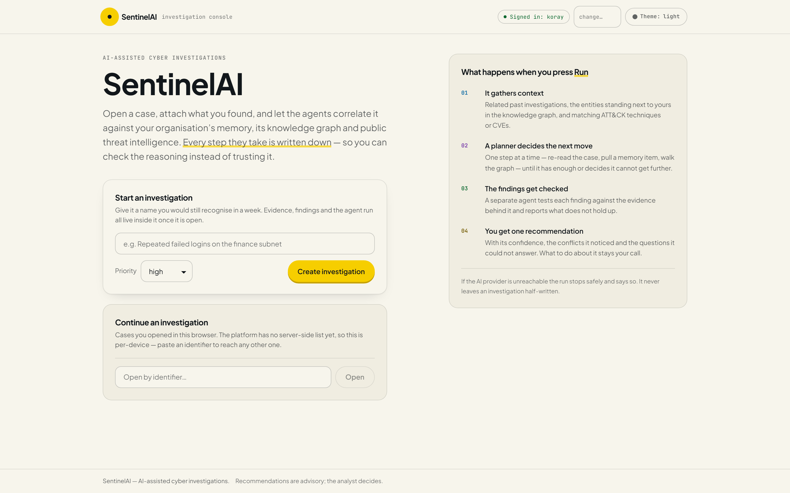
</p>

<p align="center">
  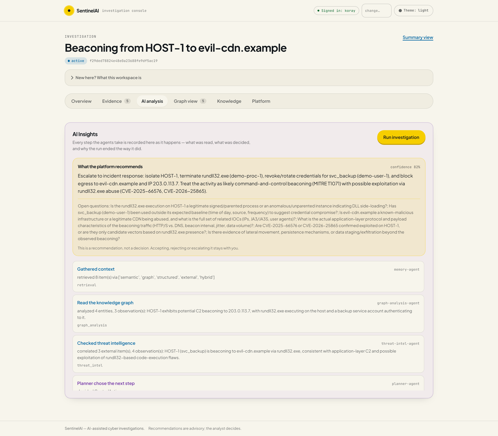
</p>

<p align="center">
  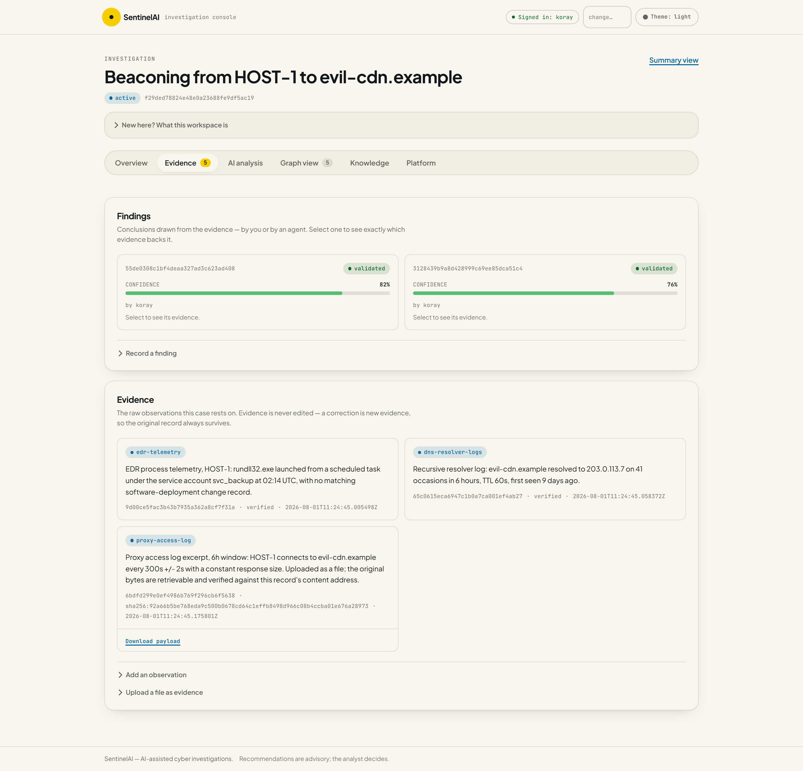
  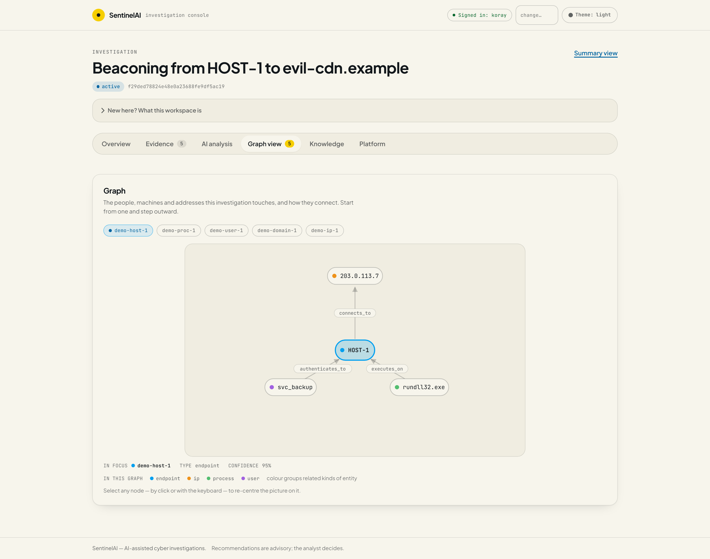
</p>

### Sprint Review

- Ürün **1.0.0 olarak yayımlandı**: yol haritasının sekiz milestone'u da kapalı, imajlar imzalı ve digest'e sabitlenmiş olarak GHCR'de.
- **Milestone F:** silme uçtan uca gerçek oldu — tombstone (`status=erased`, içerik redakte, `erased_at` damgalı), payload byte'larının fiziksel silinmesi ve türetilmiş embedding noktalarının kaldırılması; tekrar eden DELETE idempotent.
- **Milestone G:** iki iddia canlı kanıtlandı — **hash-zincirli denetim kaydı** (27 kayıtta 0 kırık halka, silinen verinin ardından da yaşayan `investigation.erased` kayıtları dahil) ve **sağlayıcılar arası devretme zinciri**; kimlik başına hız sınırı `429` + `retry-after` ile standart hata zarfında yanıt verdi.
- **Milestone H:** sürüm kimliği mekanik hale geldi — etiket, manifestler ve yayımlanmış API sözleşmesi birbirini doğruluyor. Sürüm hazırlığı iddia edilmedi, **kanıtla değerlendirildi**.
- Backend test sayısı sprint boyunca **525 → 690**'a yükseldi; frontend **74 → 90**. Hiçbir ES doğrulama kapıları yeşil olmadan kapanmadı.
- Sprint Review katılımcısı: Koray Öztürk.

### Sprint Retrospective

- **İyi giden:** Sürüm provasını planın zorunlu bir adımı yapmak, ilk koşusunda konteynerli dağıtımdaki bozuk kanıt-yükleme yolunu yakaladı — host üzerinde koşan hiçbir canlı kanıt bunu gösteremezdi. "Kanıtı üretim şekline en yakın ortamda topla" kuralı bedelini tek seferde ödedi.
- **Dürüstlük disiplini:** Provadaki koşu `exhausted` ile bitti (sağlayıcı gecikmesi) ve bu, umulan değil **gözlemlenen** haliyle kaydedildi; başarı raporlayan bir prova değersiz olurdu. Aynı disiplin sürüm sonrası bir yanlış bulgunun (Gemini varsayılan modelinin "ölü" olduğu iddiası) takipçide açıkça geri çekilmesini de gerektirdi — tek bir 503, yapılandırma kusuru kanıtı değildir.
- **Geliştirilecek:** Sürüm öncesi arayüz, platformun kendi döngüsünü tarayıcıdan tamamlayamıyordu — bulgu kaydetmenin UI karşılığı yoktu, dolayısıyla graf tohumsuz kalıyor ve Decision Engine hiç sentezlemiyordu. Bu, ancak demo denetimi gerçek bir tarayıcıda uçtan uca sürüldüğünde ortaya çıktı (UI-R3): **"testler yeşil" ile "ürün kullanılabilir" aynı şey değil.**
- **Sonraki sprint için kararlaştırılanlar:** Sunum/demo çıktısı (jüri videosu), ardından sürüm sonrasına ertelenen teknik başlıklar — araştırma listesi REST yüzeyi, çok-örnekli ölçeklenme, S3 uyumlu payload backend ve denetim sorgu yüzeyi.

</details>

---

⭐ SentinelAI aktif olarak geliştirilmeye devam ediyor.
