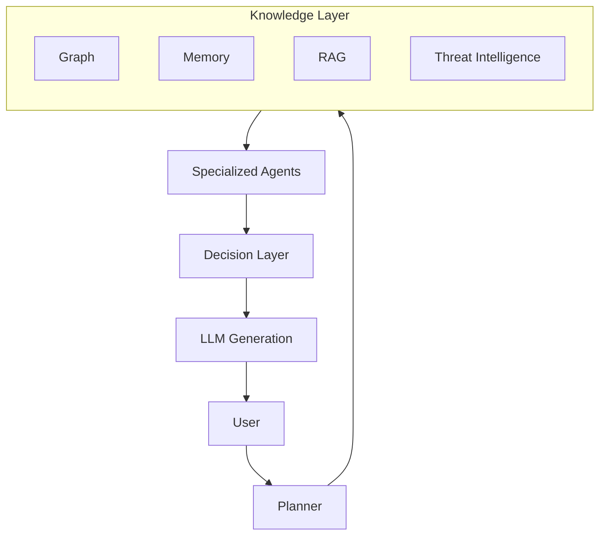
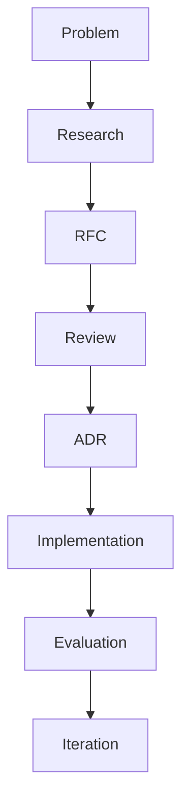

---

title: SentinelAI Design Principles
version: 1.0.0
status: Draft
owner: SentinelAI Team
last_updated: 2026-06-26
---

# SentinelAI Design Principles

> This document defines the engineering philosophy that guides every architectural, technical and product decision within SentinelAI.

Unlike implementation documents, this document is intentionally independent of programming languages, frameworks and AI models.

Technologies may evolve.

Engineering principles should remain stable.

---

# 1. Introduction

## Purpose

SentinelAI is designed as a long-term engineering project rather than a short-term prototype.

As the platform grows, hundreds of technical decisions will be made regarding architecture, infrastructure, artificial intelligence, user experience and software engineering.

Without a shared philosophy, these decisions may become inconsistent over time.

The purpose of this document is to establish a common engineering mindset before implementation begins.

Every architectural decision, feature proposal and technology selection should align with the principles described here.

SentinelAI is not intended to become a general-purpose AI platform.

Its engineering philosophy is intentionally centered around cybersecurity.

Whenever a trade-off exists between generic AI capabilities and cybersecurity-specific requirements, cybersecurity requirements take precedence.

---

## Scope

These principles apply to every component of SentinelAI, including:

* Product design
* AI systems
* Multi-agent workflows
* Backend services
* Frontend applications
* Infrastructure
* Documentation
* Testing
* Research
* Future modules

---

## What These Principles Are Not

These principles are not implementation rules.

They do not prescribe specific frameworks, programming languages or AI providers.

Instead, they define how engineering decisions should be evaluated regardless of technology choices.

---

# How to Read This Document

This document is intentionally written as a collection of engineering principles rather than implementation rules.

Technology changes.

Principles endure.

When implementation details evolve, these principles should continue guiding engineering decisions.

Every contributor is expected to understand these principles before making architectural changes.

Whenever uncertainty exists, these principles take precedence over personal preferences or temporary technological trends.

---

# 2. Core Philosophy

SentinelAI is built upon a simple idea:

> Intelligent software should amplify human expertise, not replace human judgment.

Artificial intelligence is viewed as an engineering capability rather than the final product.

Large Language Models are powerful reasoning tools, but they should never become the system architecture themselves.

Instead, SentinelAI combines multiple engineering disciplines—including software architecture, graph intelligence, cybersecurity knowledge and AI reasoning—to build systems that remain understandable, maintainable and trustworthy.

The project prioritizes long-term sustainability over rapid feature development.

Every feature should strengthen the architecture rather than increase complexity.

---

# 3. Engineering Manifesto

The following statements summarize the engineering philosophy of SentinelAI.

* We optimize for maintainability before convenience.
* We document decisions before implementing them.
* We design systems that humans can understand.
* We favor modularity over shortcuts.
* We value explainability over blind automation.
* We treat AI as one component of a larger engineering system.
* We build products, not demonstrations.
* We solve real cybersecurity problems instead of showcasing AI capabilities.
* We embrace continuous evolution rather than one-time delivery.
* We measure success by engineering quality as much as by functionality.

These statements are expanded throughout the remainder of this document.

---

# Part I — AI Principles

Artificial Intelligence is the defining capability of SentinelAI.

However, AI is not considered the product itself.

The following principles establish how artificial intelligence should be designed, integrated and evaluated throughout the platform.

---

# Principle 01 — AI Solves Problems, Not Marketing

## Statement

Artificial intelligence must exist to solve meaningful cybersecurity problems.

It must never be introduced solely because AI is popular or visually impressive.

---

## Why This Principle Exists

Modern software frequently adds AI capabilities without identifying a genuine user need.

Many products simply place a chatbot on top of existing functionality and describe the result as an AI platform.

While technically valid, this approach rarely creates significant value.

SentinelAI intentionally rejects this philosophy.

Every AI capability must eliminate manual work, improve decision quality or accelerate incident response.

If a feature would still be useful without AI, then AI should only be added if it provides measurable improvements.

---

## Engineering Rationale

Artificial intelligence introduces additional complexity.

Examples include:

- model selection
- prompt engineering
- evaluation
- hallucination risks
- latency
- infrastructure cost
- maintenance

Complexity is only justified when it produces proportional value.

Therefore, every AI component must justify its existence.

---

## SentinelAI Application

Examples of acceptable AI usage:

- Incident summarization
- Threat reasoning
- Multi-step investigation
- Timeline generation
- Security report creation
- Attack path explanation
- Analyst assistance

Examples of unacceptable AI usage:

- Random chatbot pages
- AI-generated welcome messages
- AI used only for demonstration purposes
- Features whose output provides no operational value

---

## Design Implications

When designing new features, engineers should first ask:

"What problem exists?"

Only after answering this question should AI be considered as a possible solution.

AI is never the starting point.

The cybersecurity problem is.

---

## Anti-Patterns

❌ Adding an LLM because every modern application includes one.

❌ Generating verbose responses instead of useful responses.

❌ Building AI-first interfaces without understanding analyst workflows.

---

## Future Considerations

As AI models improve, implementation details may change.

This principle should remain unchanged.

The problem always comes before the model.

---

## Related Documents

- Project Charter
- Product Roadmap
- AI Architecture
- Agent System

---

# Principle 02 — Explainability Before Automation

## Statement

Every important AI recommendation should be explainable.

Users should understand not only what SentinelAI recommends, but also why the recommendation was generated.

---

## Why This Principle Exists

Cybersecurity decisions may affect production systems, business continuity and organizational security.

Blindly trusting AI recommendations is unacceptable.

Analysts must always understand the reasoning process behind important conclusions.

Explainability builds trust.

Trust enables adoption.

---

## Engineering Rationale

Explainable systems are easier to:

- debug
- evaluate
- improve
- audit
- validate

Hidden reasoning creates engineering uncertainty.

Transparent reasoning reduces operational risk.

---

## Evidence-Based Decision Making

Every important recommendation should be supported by verifiable evidence.

Reasoning alone is insufficient.

Whenever possible, SentinelAI should reference:

- security events
- investigation artifacts
- graph relationships
- threat intelligence
- historical investigations

Evidence should always be distinguishable from interpretation.

This distinction enables analysts to independently validate AI-generated conclusions.

---

## SentinelAI Application

Every major recommendation should include:

- supporting evidence
- related alerts
- confidence level
- reasoning summary
- referenced knowledge sources

For example:

Instead of:

"High risk incident."

SentinelAI should produce:

"This incident is classified as High Risk because lateral movement indicators were detected across three endpoints, credential dumping artifacts were identified and the observed behavior matches MITRE ATT&CK technique T1003."

---

## Design Implications

Explainability affects nearly every subsystem.

Examples include:

- Report generation
- Memory
- RAG
- ThreatGraph
- Multi-Agent reasoning
- Executive summaries

All of these components should expose evidence whenever possible.

---

## Anti-Patterns

❌ Trust me.

❌ Black-box scoring.

❌ Confidence without evidence.

❌ Recommendations without supporting context.

---

## Future Considerations

Future versions may visualize reasoning paths directly within ThreatGraph.

Analysts should eventually be able to inspect the entire decision chain.

---

## Related Documents

- ThreatGraph
- RAG Architecture
- Memory System
- Report Agent

---

# Principle 03 — Human Expertise Remains Central

## Statement

SentinelAI augments human analysts.

It does not replace them.

Human expertise remains the final authority for critical security decisions.

---

## Why This Principle Exists

AI systems inevitably make mistakes.

Cybersecurity environments are dynamic, adversarial and highly contextual.

Human analysts possess organizational knowledge, intuition and business awareness that current AI systems cannot fully replicate.

Therefore, SentinelAI should assist rather than replace security professionals.

---

## Engineering Rationale

Human-in-the-loop architectures provide:

- better reliability
- lower operational risk
- easier deployment
- higher organizational trust
- safer incident response

The platform should accelerate human thinking rather than automate human judgment.

---

## SentinelAI Application

Examples include:

- AI drafts reports.
- Humans approve reports.

- AI proposes incident severity.
- Humans validate severity.

- AI suggests containment actions.
- Humans execute containment.

Automation increases gradually as confidence and validation improve.

---

## Design Implications

Critical actions should require explicit confirmation.

The platform should distinguish between:

- Recommendations
- Decisions
- Actions

Only humans may authorize actions affecting production infrastructure.

---

## Anti-Patterns

❌ Fully autonomous incident response without oversight.

❌ Removing analysts from decision loops.

❌ Executing destructive actions automatically.

---

## Future Considerations

As SentinelAI evolves toward autonomous cyber defense, human oversight should remain configurable rather than eliminated.

Autonomy should increase gradually based on measurable reliability.

---

## Related Documents

- Autonomous SOC
- Agent Architecture
- Security Principles
- Decision Engine

---

## Conceptual Intelligence Flow

---

# Principle 04 — Graph Before Generation

## Statement

SentinelAI prioritizes structured knowledge before language generation.

Large Language Models should reason over structured representations rather than replace them.

Whenever possible, graph structures, relationships and explicit knowledge should become the foundation of AI reasoning.

Language generation is the final step—not the first.

---

## Why This Principle Exists

Most modern AI systems treat the LLM as the center of the architecture.

Data enters the model.

The model generates an answer.

The reasoning process remains largely hidden.

Cybersecurity is fundamentally different.

Security investigations revolve around relationships:

- Which host communicated with another?
- Which user accessed which system?
- Which process spawned another process?
- Which attack technique followed the previous one?
- Which assets share common vulnerabilities?

These are graph problems before they become language problems.

Graph representations preserve relationships that plain text often loses.

---

## Engineering Rationale

Structured representations provide several advantages.

Graphs are:

- explainable
- queryable
- persistent
- composable
- machine-readable

Large Language Models excel at interpreting information.

Graphs excel at organizing information.

Rather than replacing one with the other, SentinelAI combines both.

Graph reasoning produces context.

LLMs transform that context into human-understandable intelligence.

---

## SentinelAI Application

Examples include:

Instead of asking an LLM:

"Analyze this network."

SentinelAI first constructs a graph describing:

- endpoints
- users
- processes
- authentication events
- privileges
- attack techniques
- infrastructure dependencies

Only after this structured representation exists should an LLM begin reasoning.

Similarly,

ThreatGraph will analyze attack propagation over graph structures before requesting language generation.

This separation improves consistency, explainability and scalability.

---

## Design Implications

This principle influences multiple future modules.

Examples include:

- ThreatGraph
- Knowledge Graph
- Asset Inventory
- Attack Timeline
- Entity Resolution
- Investigation Memory

The LLM should consume structured information whenever possible instead of raw logs.

---

## Anti-Patterns

❌ Sending thousands of raw log lines directly to an LLM.

❌ Asking the model to infer relationships that can be explicitly represented.

❌ Treating natural language as the primary storage format.

---

## Future Considerations

Future versions may combine:

- Graph Neural Networks
- Knowledge Graphs
- Vector Search
- Symbolic Reasoning
- Multi-Agent Collaboration

Graph reasoning should remain a permanent architectural layer regardless of future AI models.

---

## Related Documents

- ThreatGraph
- Knowledge Graph
- Graph Database Architecture
- GNN Module

---

# Principle 05 — Memory Is a First-Class Citizen

## Statement

Memory is not an optional AI feature.

Memory is a core architectural capability.

Every intelligent system should remember, organize and reuse relevant knowledge across investigations.

---

## Why This Principle Exists

Traditional chatbots operate within a single conversation.

Cybersecurity investigations rarely do.

Analysts continuously build knowledge across days, weeks or even months.

The platform should preserve this accumulated understanding.

Without memory, every investigation begins from zero.

With memory, SentinelAI continuously improves its contextual awareness.

---

## Engineering Rationale

Memory enables:

- investigation continuity
- context preservation
- repeated pattern detection
- historical comparisons
- organizational learning

Memory transforms isolated AI interactions into long-term intelligence.

---

## SentinelAI Application

Examples include:

An analyst investigates ransomware today.

Three months later another incident shares similar indicators.

SentinelAI should automatically recognize the similarity and provide:

- previous investigation
- previous timeline
- previous recommendations
- previous outcome

The system should learn organizational context rather than simply storing conversations.

---

## Types of Memory

Future versions will distinguish multiple memory systems.

Examples include:

### Conversation Memory

Short-term interactions.

---

### Investigation Memory

Long-running incident history.

---

### Organizational Memory

Infrastructure knowledge.

---

### Threat Memory

Previously observed attacker behaviors.

---

### Knowledge Memory

Cybersecurity concepts.

---

### Graph Memory

Entity relationships across time.

Each memory type serves a different engineering purpose.

---

## Data Quality

Memory should preserve reliable knowledge rather than accumulate information indiscriminately.

Poor-quality memory reduces reasoning quality.

Future memory systems should support:

- validation
- deduplication
- versioning
- confidence estimation
- source attribution

Knowledge quality is more valuable than knowledge quantity.

---

## Design Implications

Every future AI agent should explicitly define:

- what it remembers
- how long it remembers
- where memory is stored
- who can access memory

Memory should never become accidental.

It should always be intentional.

---

## Anti-Patterns

❌ Storing every conversation forever.

❌ Mixing temporary context with permanent knowledge.

❌ Treating vector databases as the only memory layer.

---

## Future Considerations

Future releases may introduce:

- episodic memory
- semantic memory
- procedural memory
- reflective memory

Each inspired by cognitive architectures used in autonomous AI systems.

---

## Related Documents

- Memory Architecture
- RAG
- Agent Architecture
- Knowledge Base

---

# Principle 06 — Intelligence Emerges Through Collaboration

## Statement

SentinelAI should prefer collaboration between specialized agents rather than relying on one general-purpose model.

Intelligence emerges from cooperation.

Not from a single oversized prompt.

---

## Why This Principle Exists

Cybersecurity investigations involve multiple distinct activities.

Examples include:

- log analysis
- attack classification
- evidence correlation
- timeline construction
- report writing
- executive communication

No single reasoning process performs all of these equally well.

Instead, specialized components should contribute their expertise to a shared investigation.

---

## Engineering Rationale

Smaller specialized agents provide:

- clearer responsibilities
- easier testing
- independent evaluation
- lower prompt complexity
- improved maintainability
- better scalability

Modularity increases both engineering quality and AI quality.

Collaboration should not become uncontrolled communication.

Each agent should exchange only the information required for its responsibility.

Reducing unnecessary communication improves scalability, explainability and overall system reliability.

---

## SentinelAI Application

Future versions may include dedicated agents such as:

- Planner Agent
- Investigation Agent
- Threat Intelligence Agent
- Graph Analysis Agent
- Memory Agent
- Report Agent
- Validation Agent

Each agent owns a well-defined responsibility.

No agent should attempt to solve every problem.

---

## Design Implications

Every agent should explicitly define:

- responsibilities
- inputs
- outputs
- tools
- memory usage
- failure conditions
- evaluation metrics

Agent responsibilities should overlap as little as possible.

---

## Anti-Patterns

❌ One giant prompt performing every task.

❌ Agents with undefined responsibilities.

❌ Circular reasoning between agents.

❌ Shared mutable state without ownership.

---

## Future Considerations

As SentinelAI evolves, orchestration strategies may change.

Frameworks may evolve from LangGraph to newer orchestration platforms.

The principle remains unchanged:

Specialization first.

Coordination second.

Generation third.

---

## Related Documents

- Agent Architecture
- Planner Agent
- Memory System
- Orchestration
- LangGraph Architecture

---

# Part II — Software Engineering Principles

Artificial intelligence alone is not sufficient to build reliable cybersecurity software.

Long-term maintainability depends on disciplined software engineering.

The following principles define how SentinelAI should be designed, implemented and evolved throughout its lifetime.

---

# Principle 07 — Modularity Over Monoliths

## Statement

Every subsystem should be independently replaceable.

SentinelAI must evolve through modular components rather than a tightly coupled architecture.

---

## Why This Principle Exists

Artificial intelligence evolves rapidly.

LLMs change.

Embedding models improve.

Vector databases evolve.

New orchestration frameworks appear every year.

If the platform tightly couples these technologies together, replacing any component becomes expensive and risky.

A modular architecture protects the project from technological change.

---

## Engineering Rationale

Modularity provides:

- easier maintenance
- independent testing
- simpler deployments
- faster experimentation
- lower technical debt
- better scalability

Each subsystem should own a single responsibility.

---

## SentinelAI Application

Examples include:

The platform should allow replacing:

- OpenAI with Anthropic
- Anthropic with Gemini
- Qdrant with Pinecone
- Neo4j with another graph database
- LangGraph with another orchestration framework

without requiring major architectural changes.

---

## Design Implications

Every major subsystem should expose clear interfaces.

Examples include:

- Memory Provider Interface
- LLM Provider Interface
- Graph Provider Interface
- Threat Intelligence Provider
- Embedding Provider

Implementation details should remain hidden behind abstractions.

---

## Anti-Patterns

❌ Business logic directly calling OpenAI APIs.

❌ Hardcoded infrastructure dependencies.

❌ AI providers tightly coupled with domain logic.

---

## Future Considerations

As the AI ecosystem evolves, SentinelAI should adopt new technologies by replacing implementations rather than redesigning the platform.

---

## Related Documents

- Backend Architecture
- Dependency Injection
- ADR-LLM-Provider
- Memory Architecture

---

# Principle 08 — Documentation Is Part of the Product

## Statement

Documentation is not a by-product of development.

Documentation is part of the product itself.

A feature is not considered complete until its behavior is documented.

---

## Why This Principle Exists

Software survives because knowledge survives.

Code explains implementation.

Documentation explains intent.

Without documentation:

- architectural knowledge disappears
- onboarding becomes difficult
- AI assistants lose context
- engineering decisions become forgotten

---

## Engineering Rationale

Documentation reduces long-term engineering cost.

Every important decision should answer:

- Why?

not only

- How?

---

## SentinelAI Application

Every major feature should include:

- architecture notes
- decision records
- implementation overview
- limitations
- future improvements

Documentation should evolve together with the codebase.

---

## Design Implications

Engineering documentation should be version-controlled.

Documentation reviews are part of feature development.

Major Pull Requests should update documentation when necessary.

---

## Anti-Patterns

❌ Writing documentation after six months.

❌ Commenting code instead of documenting architecture.

❌ Documentation that diverges from implementation.

---

## Future Considerations

Future versions may automatically validate documentation consistency using AI-assisted documentation review.

---

## Related Documents

- Engineering Bible
- ADR
- RFC
- Repository Standards

---

# Principle 09 — Architecture Before Framework

## Statement

Frameworks should support the architecture.

Architecture should never depend on frameworks.

---

## Why This Principle Exists

Frameworks become obsolete.

Architectural concepts remain valuable.

A strong architecture survives multiple technology generations.

---

## Engineering Rationale

SentinelAI should be understandable without knowing:

- FastAPI
- React
- LangGraph
- Docker

The business logic should remain independent from implementation technologies.

---

## SentinelAI Application

Examples include:

Investigation workflows belong to the domain layer.

They should not depend on HTTP requests.

Memory logic should not depend on vector database implementations.

ThreatGraph algorithms should not depend on Neo4j.

---

## Design Implications

Framework-specific code should remain close to infrastructure boundaries.

Domain logic should remain framework-independent.

---

## Anti-Patterns

❌ Domain logic inside API routes.

❌ Business rules inside React components.

❌ Agent orchestration tightly coupled to LangGraph.

---

## Future Considerations

Future migrations should primarily affect infrastructure layers.

Core business logic should remain stable.

---

## Related Documents

- Clean Architecture
- Backend Architecture
- Dependency Rules

---

# Principle 10 — Simplicity Is a Feature

## Statement

Complexity must always justify itself.

Simple solutions should be preferred whenever they achieve the same objective.

---

## Why This Principle Exists

Cybersecurity software naturally becomes complex.

Artificial intelligence introduces additional complexity.

Combining both domains without discipline quickly produces systems that are difficult to understand and maintain.

Complexity accumulates over time.

Simplicity requires continuous effort.

---

## Engineering Rationale

Simple systems are:

- easier to test
- easier to debug
- easier to explain
- easier to extend
- easier to replace

Engineering effort should reduce complexity rather than increase it.

---

## SentinelAI Application

Before introducing:

- another agent
- another database
- another microservice
- another AI model

engineers should ask:

"Does this reduce overall complexity?"

If the answer is no, the change should be reconsidered.

---

## Design Implications

SentinelAI should prefer:

- composition over inheritance
- configuration over duplication
- reusable components
- explicit interfaces

Every new subsystem should earn its existence.

When multiple solutions provide comparable value, SentinelAI should prefer the solution with lower operational complexity.

Reducing operational burden is considered a long-term engineering investment.

---

## Anti-Patterns

❌ Microservices without operational need.

❌ Multiple databases solving the same problem.

❌ One agent per tiny task.

❌ Premature optimization.

---

## Future Considerations

As SentinelAI grows, maintaining simplicity will require periodic architectural reviews.

Removing complexity is considered engineering progress.

---

## Related Documents

- ADR
- Architecture Reviews
- Technical Debt

---

# Part III — Security Engineering Principles

Cybersecurity is not an optional capability of SentinelAI.

It defines the product itself.

Security considerations must influence every architectural and engineering decision from the earliest design stages.

---

# Principle 11 — Security by Design

## Statement

Security should be built into the architecture from the beginning.

It should never be treated as a final development phase.

---

## Why This Principle Exists

Adding security after implementation often results in architectural compromises.

Secure systems emerge from secure designs rather than security patches.

Every architectural decision influences the attack surface.

Therefore, security begins long before the first line of code is written.

---

## Engineering Rationale

Security by Design enables:

- reduced attack surface
- predictable security posture
- easier auditing
- consistent authorization
- lower long-term maintenance cost

---

## SentinelAI Application

Examples include:

- Secure authentication
- Principle of Least Privilege
- Secret management
- API authorization
- Secure agent communication
- Encrypted sensitive data
- Audit logging

Security concerns should be addressed during architectural design instead of implementation.

---

## Design Implications

Every subsystem should answer:

- What data does it access?
- Who owns this data?
- Who may access it?
- What happens if it fails?

Threat modeling becomes part of system design.

---

## Anti-Patterns

❌ Hardcoded API keys.

❌ Shared administrator accounts.

❌ Unauthenticated internal services.

❌ Logging sensitive credentials.

---

## Future Considerations

Future versions should include a dedicated threat modeling document for every major subsystem.

---

## Related Documents

- Authentication
- Authorization
- Threat Modeling
- Infrastructure Security

---

# Principle 12 — Every Decision Should Be Traceable

## Statement

Every significant recommendation generated by SentinelAI should be traceable to its supporting evidence.

Users should never receive conclusions without understanding where they originated.

---

## Why This Principle Exists

Security investigations often require:

- audits
- compliance reports
- post-incident reviews
- forensic analysis

Without traceability, AI-generated conclusions cannot be validated.

---

## Engineering Rationale

Traceability improves:

- trust
- debugging
- explainability
- incident reviews
- legal defensibility

Every conclusion should be reproducible.

---

## SentinelAI Application

Future investigation reports should reference:

- source logs
- graph entities
- memory entries
- MITRE techniques
- external intelligence
- reasoning chain

Evidence should always accompany conclusions.

---

## Design Implications

Reports should contain structured references rather than free-form opinions.

Every recommendation should expose supporting context.

---

## Anti-Patterns

❌ AI-generated reports without evidence.

❌ Hidden reasoning.

❌ Recommendations based only on prompts.

---

## Future Considerations

ThreatGraph may eventually visualize the complete evidence chain behind every recommendation.

---

## Related Documents

- Report Agent
- ThreatGraph
- Investigation Memory
- Knowledge Graph

---

# Principle 13 — Observability Is Mandatory

## Statement

A system that cannot explain its own behavior cannot be reliably maintained.

Every important component should expose enough telemetry to understand what happened, why it happened and how it can be improved.

---

## Why This Principle Exists

SentinelAI is expected to evolve into a complex multi-agent platform.

Without observability, failures become difficult to diagnose.

Invisible systems cannot be improved.

---

## Engineering Rationale

Observability supports:

- debugging
- monitoring
- AI evaluation
- agent optimization
- performance analysis
- production reliability

---

## SentinelAI Application

Examples include:

- Agent execution traces
- Prompt history
- Tool invocation logs
- Memory access events
- Workflow execution graphs
- Latency measurements

Observability should be considered an architectural feature rather than a debugging tool.

---

## Design Implications

Every agent should expose:

- execution status
- execution duration
- input summary
- output summary
- encountered failures

Future dashboards should allow engineers to inspect entire investigation workflows.

---

## Anti-Patterns

❌ Silent failures.

❌ Hidden agent behavior.

❌ Missing execution logs.

❌ No visibility into AI reasoning pipelines.

---

## Future Considerations

Future releases may integrate OpenTelemetry, LangSmith and custom workflow visualization tools.

---

## Related Documents

- Monitoring
- Agent Architecture
- Evaluation Framework
- DevOps

---

# Part IV — Architecture Principles

The architecture of SentinelAI should remain stable even as individual technologies evolve.

Frameworks, AI models and infrastructure providers may change over time.

The architectural principles described below are intended to outlive those technologies.

---

# Principle 14 — Domain Before Technology

## Statement

Business problems should define the architecture.

Technologies should support the domain, never dictate it.

---

## Why This Principle Exists

Many software projects are designed around frameworks rather than the problems they solve.

Examples include:

- "Let's build a FastAPI application."
- "Let's create a LangGraph workflow."
- "Let's integrate Neo4j."

These statements describe technologies.

They do not describe the product.

SentinelAI is fundamentally a cybersecurity platform.

FastAPI, LangGraph and Neo4j are implementation choices—not architectural foundations.

---

## Engineering Rationale

Technology changes frequently.

The cybersecurity investigation process changes much more slowly.

If the architecture models the investigation workflow rather than the framework, the system remains valuable regardless of technological evolution.

---

## SentinelAI Application

The platform should model concepts such as:

- Investigation
- Incident
- Alert
- Evidence
- Threat
- Asset
- Timeline
- Recommendation

These concepts should exist independently of any programming language or framework.

---

## Design Implications

When introducing a new component, engineers should first identify:

- Which business concept does this represent?
- Which problem does it solve?
- Does this belong to the domain or infrastructure?

Only after these questions are answered should implementation begin.

---

## Anti-Patterns

❌ Designing services around frameworks.

❌ Naming modules after technologies instead of domain concepts.

❌ Allowing infrastructure decisions to influence business rules.

---

## Future Considerations

As SentinelAI expands into ThreatGraph, Threat Intelligence and Autonomous SOC, the domain model should remain consistent while implementation technologies evolve.

---

## Related Documents

- Project Charter
- Backend Architecture
- Domain Model

---

# Principle 15 — Stable Core, Replaceable Edges

## Statement

The core intelligence of SentinelAI should remain stable.

External integrations should remain replaceable.

---

## Why This Principle Exists

The AI ecosystem evolves extremely quickly.

New providers, databases and orchestration frameworks appear every year.

If the core platform depends directly on these technologies, long-term maintenance becomes increasingly difficult.

Instead, external systems should exist at the boundaries of the architecture.

---

## Engineering Rationale

Stable cores reduce technical debt.

Replaceable edges reduce migration costs.

Together they produce resilient software.

---

## SentinelAI Application

Examples of replaceable components include:

- LLM providers
- Embedding providers
- Graph databases
- Vector databases
- Threat intelligence providers
- Authentication providers

The investigation engine should remain independent from all of them.

---

## Design Implications

Every external dependency should be accessed through clearly defined interfaces.

No business logic should directly depend on vendor-specific implementations.

---

## Anti-Patterns

❌ OpenAI API calls inside domain logic.

❌ Neo4j queries scattered throughout the application.

❌ Direct infrastructure dependencies inside AI agents.

---

## Future Considerations

Future migrations should primarily involve replacing adapters rather than modifying business logic.

---

## Related Documents

- Dependency Rules
- Clean Architecture
- Infrastructure Layer

---

# Principle 16 — Architecture Should Be Observable

## Statement

Architecture should expose its behavior.

Every important workflow should be understandable through logs, traces and execution history.

---

## Why This Principle Exists

AI systems often fail silently.

A recommendation without visibility cannot be trusted or improved.

Observability should exist at the architectural level rather than being added as a debugging feature.

---

## Engineering Rationale

Observable architectures enable:

- debugging
- auditing
- optimization
- evaluation
- reproducibility

They also simplify future AI evaluation.

---

## SentinelAI Application

Future versions should visualize:

- agent execution order
- workflow state transitions
- memory usage
- tool invocations
- reasoning chain
- execution duration

An investigation should be replayable after completion.

---

## Design Implications

Every architectural component should produce structured telemetry.

Execution history should become part of the engineering workflow.

---

## Anti-Patterns

❌ Black-box execution.

❌ Hidden orchestration.

❌ Missing execution traces.

---

## Future Considerations

Future versions may include a dedicated Workflow Explorer allowing engineers to inspect complete investigation pipelines.

---

## Related Documents

- Agent Architecture
- Observability
- DevOps

---

# Principle 17 — Explicit Boundaries Over Shared Complexity

## Statement

Every subsystem must have clearly defined responsibilities, ownership and communication boundaries.

Subsystems should collaborate through well-defined interfaces rather than shared implementation details.

---

## Why This Principle Exists

As SentinelAI grows, multiple subsystems will evolve simultaneously.

Examples include:

- Multi-Agent Orchestrator
- ThreatGraph
- Memory System
- RAG Engine
- Backend API
- Frontend Dashboard
- Threat Intelligence

Without explicit boundaries, changes in one subsystem may unintentionally affect others.

This increases maintenance costs and slows future development.

---

## Engineering Rationale

Clear boundaries improve:

- maintainability
- scalability
- testability
- parallel development
- system reliability

Each subsystem should expose capabilities rather than internal implementation.

---

## SentinelAI Application

Future modules should communicate through contracts.

Examples include:

- Agent Interfaces
- Repository Interfaces
- Service Interfaces
- Event Contracts
- API Contracts

No subsystem should directly manipulate another subsystem's internal state.

---

## Design Implications

Ownership should always be clear.

For every component, engineers should be able to answer:

- What does this component own?
- What responsibilities belong here?
- What responsibilities do not belong here?

Ambiguous ownership should be considered an architectural issue.

---

## Anti-Patterns

❌ Shared mutable state.

❌ Circular dependencies.

❌ Cross-module business logic.

❌ Hidden coupling.

---

## Future Considerations

As SentinelAI expands into distributed services, explicit boundaries will become increasingly important.

Strong boundaries today reduce migration effort tomorrow.

---

## Related Documents

- Module Architecture
- Service Contracts
- Dependency Rules

---

# Principle 18 — Evolution Over Perfection

## Statement

SentinelAI is designed to evolve continuously.

Architectural decisions should support incremental improvement rather than assuming perfect initial designs.

---

## Why This Principle Exists

No architecture remains perfect forever.

New AI models appear.

Cybersecurity threats evolve.

User expectations change.

Attempting to predict every future requirement usually produces unnecessary complexity.

Instead, SentinelAI embraces controlled evolution.

---

## Engineering Rationale

Incremental evolution enables:

- continuous learning
- safer refactoring
- lower delivery risk
- sustainable innovation

Evolution should be planned rather than accidental.

---

## SentinelAI Application

Each product version introduces focused improvements.

Examples include:

Version 1

AI-assisted investigations

↓

Version 2

ThreatGraph

↓

Version 3

Threat Intelligence

↓

Version 4

Autonomous Decision Support

Each version extends the existing architecture rather than replacing it.

---

## Design Implications

Every architectural decision should answer:

"Can this evolve without rewriting the platform?"

If the answer is no, the design should be reconsidered.

---

## Anti-Patterns

❌ Big-bang rewrites.

❌ Throw-away prototypes.

❌ One-time architecture.

❌ Premature optimization for hypothetical requirements.

---

## Future Considerations

SentinelAI should remain adaptable to future AI paradigms while preserving architectural consistency.

---

## Related Documents

- Product Roadmap
- Architecture Evolution
- Technical Debt

---

# Part V — Product Principles

Technology alone does not create valuable software.

SentinelAI is ultimately a product built for people working in cybersecurity.

Every feature should improve the daily workflow of security professionals rather than simply demonstrating technical capabilities.

---

# Principle 19 — Every Feature Must Earn Its Place

## Statement

Every feature added to SentinelAI must solve a clearly identified problem.

Features should never exist simply because they are technically interesting or currently popular.

---

## Why This Principle Exists

As AI projects grow, they naturally accumulate features.

Without discipline, products become collections of disconnected capabilities instead of coherent systems.

Every additional feature introduces:

- maintenance cost
- testing effort
- documentation effort
- architectural complexity
- cognitive load for users

Therefore, every feature must justify its existence.

---

## Engineering Rationale

Before implementation begins, every feature should answer five questions.

1. What problem does it solve?

2. Who benefits from it?

3. Why is AI necessary?

4. Why should it be implemented now?

5. How will success be measured?

If these questions cannot be answered, the feature should remain in the backlog.

---

## SentinelAI Application

Examples of valuable features:

✓ Incident Timeline

✓ Attack Path Analysis

✓ Threat Intelligence Correlation

✓ AI Investigation Reports

Examples of features that require strong justification:

- AI Chat Assistant
- Voice Assistant
- Avatar Interfaces
- Animated Dashboards

These are not rejected automatically, but they must demonstrate measurable value.

---

## Design Implications

Product growth should remain intentional.

Removing unnecessary features is considered product improvement rather than product reduction.

---

## Anti-Patterns

❌ "Let's add this because it's cool."

❌ "Other products have this."

❌ "Maybe users will need it."

---

## Future Considerations

Future roadmap reviews should prioritize feature quality over feature quantity.

---

## Related Documents

- Product Roadmap
- RFC Process
- Product Backlog

---

# Principle 20 — Build for Analysts, Not for Demonstrations

## Statement

SentinelAI is designed for cybersecurity professionals.

Not for conference demonstrations.

Not for marketing videos.

Real analyst workflows always take priority over impressive demonstrations.

---

## Why This Principle Exists

Many AI products appear impressive during short demonstrations.

However, real users often interact with software for hours every day.

Interfaces optimized for demonstrations frequently become inefficient during real investigations.

SentinelAI should optimize for operational usefulness rather than visual impressiveness.

---

## Engineering Rationale

The objective is to reduce investigation effort.

Not to maximize AI interaction.

Success should be measured by analyst productivity rather than generated text length.

---

## SentinelAI Application

Examples include:

Instead of generating a two-page explanation,

SentinelAI should generate:

- concise summaries
- prioritized evidence
- recommended next actions
- confidence estimates

The best AI response is often the shortest response that enables correct decisions.

---

## Design Implications

Every user interface should answer:

"What does the analyst need next?"

rather than

"What can the AI generate?"

---

## Anti-Patterns

❌ Long conversational responses.

❌ Decorative AI interactions.

❌ Information overload.

❌ Interfaces designed primarily for presentations.

---

## Future Considerations

Future user testing should involve realistic investigation scenarios rather than scripted demonstrations.

---

## Related Documents

- User Personas
- UX Principles
- Dashboard Design

---

# Principle 21 — Engineering Quality Is a Product Feature

## Statement

Engineering quality is visible, even when users never read the source code.

Reliable software is itself a product feature.

---

## Why This Principle Exists

Users experience engineering quality indirectly through:

- reliability
- responsiveness
- stability
- maintainability
- predictable behavior

Poor engineering eventually becomes poor user experience.

---

## Engineering Rationale

High engineering quality enables:

- faster iteration
- fewer production failures
- easier onboarding
- safer deployments
- better long-term sustainability

Quality is therefore an investment rather than a cost.

---

## SentinelAI Application

Engineering quality includes:

- clean architecture
- comprehensive documentation
- automated testing
- continuous integration
- versioned decisions
- reproducible deployments

These are considered essential product capabilities.

---

## Design Implications

Feature completion requires:

- implementation
- tests
- documentation
- review
- architectural consistency

A feature is incomplete until all five are satisfied.

---

## Anti-Patterns

❌ "We'll document it later."

❌ "We'll add tests later."

❌ "Refactoring can wait."

❌ Shipping features with known architectural debt.

---

## Future Considerations

As SentinelAI evolves, engineering quality should remain measurable through objective metrics rather than subjective opinions.

---

## Related Documents

- Repository Standards
- Testing Strategy
- ADR Process

---

# Part VI — Decision Framework

Engineering principles become valuable only when they guide real decisions.

The following framework standardizes how technical, architectural and product decisions are evaluated throughout the lifetime of SentinelAI.

Every major decision should follow this process before implementation begins.

---

# 1. Problem First

Every proposal begins with a clearly defined problem.

Technology should never become the starting point.

Instead of asking:

> "Should we use Neo4j?"

The correct question is:

> "What problem are we trying to solve?"

A well-defined problem naturally limits the set of reasonable solutions.

---

# 2. Research Before Decision

Once the problem is understood, available alternatives should be researched.

Research should focus on objective comparisons rather than popularity.

Typical evaluation criteria include:

- suitability
- maturity
- maintainability
- scalability
- community support
- long-term sustainability
- licensing
- integration complexity

Research documents belong inside the `research/` directory.

Research is exploratory.

It does not represent a final decision.

---

# 3. RFC Before Commitment

If a decision significantly affects architecture, product direction or engineering workflow, an RFC (Request for Comments) should be created.

RFCs encourage structured discussion before implementation.

Typical RFC topics include:

- new architectural components
- new AI agents
- infrastructure changes
- database selection
- deployment strategy
- major product capabilities

RFCs are considered proposals.

They remain open until accepted or rejected.

---

# 4. ADR Before Implementation

Once consensus has been reached, an Architecture Decision Record (ADR) documents the final decision.

Every ADR should explain:

- the problem
- considered alternatives
- evaluation criteria
- final decision
- expected consequences

ADRs describe decisions.

They do not describe implementations.

---

# 5. Implementation

Implementation begins only after the decision has been documented.

During development, implementation should remain consistent with the accepted ADR.

If implementation reveals new information that invalidates the original decision, the ADR should be revised instead of silently changing direction.

---

# 6. Continuous Evaluation

No engineering decision is considered permanent.

Technologies evolve.

Requirements change.

New research becomes available.

Architectural decisions should therefore be periodically re-evaluated.

Changing a previous decision is acceptable when supported by evidence.

Changing direction without documentation is not.

---

# Decision Flow

Every major decision should follow the same lifecycle.

---

# Decision Criteria

Before accepting any proposal, the following questions should be answered.

## Product

Does it solve a real user problem?

Does it align with the Project Charter?

Does it improve analyst workflows?

---

## Engineering

Does it reduce long-term complexity?

Is it maintainable?

Can it be tested?

Can it be documented?

Can it be replaced?

---

## AI

Is AI actually necessary?

Does it improve decision quality?

Can it explain its reasoning?

Can hallucination be controlled?

---

## Security

Does it increase the attack surface?

Can permissions be clearly defined?

Does it introduce unnecessary risk?

---

## Long-Term Vision

Will this decision still make sense two years from now?

Does it move SentinelAI closer to becoming an Autonomous Cyber Defense Platform?

Does it align with the Engineering Principles?

If the answer to these questions is unclear, the proposal should remain under discussion rather than being implemented.

---

# Closing Statement

SentinelAI is expected to evolve continuously throughout its lifetime.

New technologies, AI models and architectural patterns will emerge.

This document is not intended to restrict innovation.

Instead, it exists to ensure that innovation remains consistent with the long-term vision of the project.

Engineering principles should change far less frequently than implementation details.

Whenever uncertainty exists, contributors should favor these principles over temporary technological trends or personal preferences.

A good engineering decision is not one that follows the newest technology.

A good engineering decision is one that remains correct years after it has been made.

SentinelAI is therefore developed as an evolving engineering system guided by stable principles rather than rapidly changing tools.

These principles form the foundation upon which every future architectural decision, implementation strategy and product capability will be built.

---

# Version History

| Version | Date | Description |
|----------|------------|--------------------------------|
| 1.0.0 | 2026-06-26 | Initial Design Principles document created |