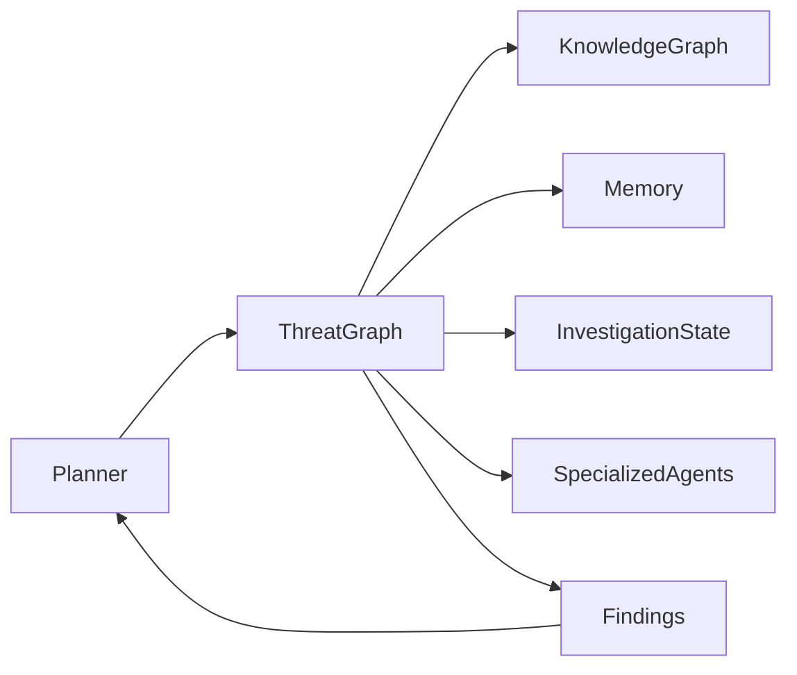
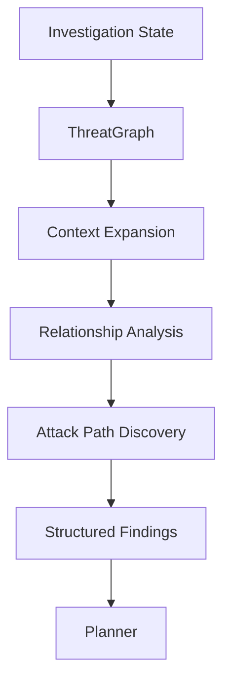
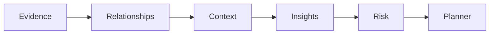

# SentinelAI ThreatGraph

> This document defines ThreatGraph, the graph-driven investigation capability of SentinelAI. It explains how graph-based reasoning, organizational knowledge and AI agents work together to support explainable cybersecurity investigations.

---

# 1. Purpose

ThreatGraph is the primary investigation capability of SentinelAI.

Its purpose is to transform isolated security observations into connected investigative knowledge.

Rather than treating alerts as independent events, ThreatGraph reconstructs the relationships between entities, evidence and historical investigations.

This enables both AI agents and security analysts to understand incidents within their broader operational context.

---

# 2. Why ThreatGraph?

Modern cyber attacks rarely consist of a single malicious event.

Instead, attackers establish sequences of related activities that span multiple systems, users and infrastructure components.

Traditional investigation workflows often require analysts to manually reconstruct these relationships.

ThreatGraph automates this process by combining graph reasoning with organizational knowledge and AI-assisted investigation.

The result is a faster, more explainable and context-aware investigation process.

---

# 3. Objectives

ThreatGraph is designed to achieve the following objectives.

## Contextual Investigation

Understand incidents as connected chains of activity rather than isolated alerts.

---

## Explainability

Every conclusion should be supported by explicit evidence and graph relationships.

---

## Investigation Acceleration

Reduce analyst effort by automatically discovering meaningful relationships.

---

## Organizational Learning

Leverage historical investigations to improve future investigations.

---

## Human-Centered Analysis

Assist analysts without replacing human decision-making.

---

# 4. ThreatGraph vs Knowledge Graph

ThreatGraph and the Knowledge Graph serve different architectural responsibilities.

The Knowledge Graph represents organizational entities and their relationships.

ThreatGraph consumes this graph to perform investigation-oriented analysis.

The distinction is intentional.

The Knowledge Graph answers:

"What is connected?"

ThreatGraph answers:

"What does this mean for the current investigation?"

ThreatGraph therefore represents an investigation capability rather than a data model.

---

# 5. High-Level Architecture

---

# 6. Core Capabilities

ThreatGraph provides a collection of investigation capabilities built upon the Knowledge Graph and Organizational Memory.

Each capability contributes to understanding the broader context of an investigation.

---

## Entity Correlation

ThreatGraph automatically discovers relationships between investigation entities.

Examples include:

- users and endpoints
- IP addresses and domains
- processes and parent processes
- alerts and affected assets
- investigations sharing common entities

Entity correlation reduces manual investigation effort.

---

## Entity Resolution

ThreatGraph identifies observations that refer to the same real-world entity.

Examples include:

- multiple usernames representing the same user
- repeated IP addresses across investigations
- aliases for the same malware family
- infrastructure reused by the same threat actor

Entity resolution improves investigation accuracy by reducing duplicate representations.

---

## Attack Path Reconstruction

ThreatGraph reconstructs possible attack paths using observed evidence.

Examples include:

- initial access
- privilege escalation
- lateral movement
- persistence
- command and control
- impact

Attack paths should always remain evidence-backed.

---

## Investigation Context Expansion

ThreatGraph expands investigation context by identifying additional relevant entities.

Examples include:

- previously unseen assets
- historical investigations
- neighboring entities
- shared infrastructure

Context expansion helps analysts understand the broader operational picture.

---

## Relationship Exploration

ThreatGraph enables analysts and AI agents to explore relationships interactively.

Relationship exploration should support both automated reasoning and human investigation.

---

## Historical Correlation

ThreatGraph identifies similarities between the current investigation and previous investigations.

Historical correlation supports organizational learning and investigation acceleration.

---

# 7. Investigation Workflow

ThreatGraph supports investigations through a structured reasoning workflow.

Rather than producing immediate conclusions, ThreatGraph progressively builds investigation context.

---

## Trigger Conditions

ThreatGraph may be invoked when:

- a new investigation is created
- significant new evidence becomes available
- the Planner requests contextual analysis
- an analyst initiates graph exploration

ThreatGraph execution should always be driven by investigation needs rather than fixed execution schedules.

---

## Step 1 — Receive Investigation Context

ThreatGraph receives:

- Investigation State
- investigation objectives
- current findings
- relevant entities

---

## Step 2 — Expand Context

Relevant neighboring entities and historical knowledge are retrieved.

The objective is to discover investigation context that may not yet be visible.

---

## Step 3 — Analyze Relationships

ThreatGraph evaluates:

- entity relationships
- relationship confidence
- attack paths
- graph connectivity

Only evidence-backed relationships contribute to investigation findings.

---

## Step 4 — Produce Structured Findings

ThreatGraph returns:

- discovered entities
- relationship chains
- contextual observations
- attack paths
- confidence information
- supporting evidence

ThreatGraph does not produce final investigation decisions.

Its responsibility is contextual analysis.

---

# 8. ThreatGraph Workflow

---

# 9. Attack Path Analysis

One of the primary responsibilities of ThreatGraph is reconstructing potential attack paths.

Attack path analysis connects isolated observations into coherent sequences of attacker activity.

---

## Possible Attack Stages

ThreatGraph may identify stages such as:

- Initial Access
- Execution
- Persistence
- Privilege Escalation
- Defense Evasion
- Credential Access
- Discovery
- Lateral Movement
- Command and Control
- Impact

These stages are inspired by established cybersecurity frameworks while remaining evidence-driven.

---

## Path Ranking

Multiple attack paths may exist simultaneously.

ThreatGraph should prioritize paths according to:

- evidence quality
- relationship confidence
- investigation relevance
- historical consistency

Higher-ranked paths should receive greater analytical attention.

---

## Explainable Attack Paths

Every reconstructed attack path should preserve:

- participating entities
- traversed relationships
- supporting evidence
- confidence estimates

Analysts should always understand why an attack path was generated.

Attack paths represent investigative hypotheses supported by available evidence.

They should evolve as new evidence becomes available during the investigation.

---

# 10. Investigation Insights

ThreatGraph transforms graph exploration into actionable investigation insights.

Rather than presenting raw graph structures, it identifies patterns that help analysts understand the significance of observed activities.

Insights should always remain evidence-backed and explainable.

---

## Behavioral Insights

ThreatGraph may identify behavioral patterns such as:

- unusual authentication activity
- repeated failed access attempts
- suspicious process execution
- abnormal communication behavior
- unexpected infrastructure usage

Behavioral insights provide context beyond isolated security events.

---

## Infrastructure Insights

ThreatGraph may identify relationships involving:

- shared IP addresses
- common domains
- reused infrastructure
- connected assets
- recurring external services

Infrastructure insights help reveal hidden connections across investigations.

---

## Investigation Insights

ThreatGraph may discover:

- recurring investigation patterns
- shared attack techniques
- repeated threat actors
- common indicators of compromise
- similar historical incidents

Investigation insights support organizational learning.

---

## Risk Insights

ThreatGraph may highlight:

- high-risk entities
- critical relationship chains
- heavily connected assets
- rapidly expanding attack paths

Risk insights assist analysts in prioritizing investigative effort.

---

# 11. Explainability

Every ThreatGraph finding should be explainable.

ThreatGraph should never produce conclusions without exposing the reasoning process that generated them.

Explainability improves analyst trust and investigation transparency.

---

## Explainable Findings

Every finding should identify:

- participating entities
- supporting relationships
- evidence references
- confidence
- investigation context

---

## Explainable Traversal

ThreatGraph should expose:

- traversal depth
- explored relationships
- filtered relationships
- selected investigation paths

Analysts should understand how a conclusion was reached.

---

## Explainable Confidence

Confidence should always be supported by observable evidence.

ThreatGraph should avoid presenting confidence values without explaining the factors contributing to them.

Confidence should represent evidence quality rather than model certainty.

---

# 12. Risk Assessment

ThreatGraph supports investigation prioritization through graph-aware risk assessment.

Risk should emerge from evidence and graph context rather than isolated severity values.

---

## Risk Factors

Examples include:

- relationship confidence
- attack path position
- critical asset involvement
- historical recurrence
- graph connectivity
- investigation objectives

Risk may be associated with:

- entities
- relationships
- attack paths
- investigations

Different investigation components may therefore expose different risk levels.

---

## Risk Propagation

ThreatGraph may estimate how risk propagates across connected entities.

Examples include:

- compromised users affecting endpoints
- infected endpoints communicating with additional assets
- reused attacker infrastructure

Risk propagation supports proactive investigation.

---

## Risk Prioritization

ThreatGraph should prioritize:

- investigations requiring immediate attention
- entities with high operational importance
- attack paths affecting critical infrastructure

Risk prioritization assists both AI agents and analysts.

---

# 13. ThreatGraph Reasoning Model

---

# 14. Integration with AI Agents

ThreatGraph is designed to support multiple AI agents throughout the investigation lifecycle.

It does not replace specialized agents.

Instead, it provides structured graph-based context that enhances their reasoning capabilities.

---

## Planner Agent

Uses ThreatGraph findings to determine the next investigative action.

---

## Memory Agent

Provides historical knowledge that enriches ThreatGraph analysis.

---

## Timeline Agent

Uses ThreatGraph relationships to reconstruct event sequences.

---

## Validation Agent

Confirms that ThreatGraph findings remain evidence-backed and internally consistent.

---

## Report Agent

Transforms ThreatGraph findings into analyst-friendly investigation reports.

ThreatGraph itself does not generate reports.

It supplies structured findings for downstream consumers.

---

# 15. ThreatGraph Contract

ThreatGraph exposes a well-defined investigation capability to the rest of SentinelAI.

Every interaction with ThreatGraph should follow a consistent architectural contract.

---

## Responsibility

Provide graph-driven investigation context through evidence-backed relationship analysis.

ThreatGraph supports investigations by producing structured findings rather than final conclusions.

---

## Inputs

ThreatGraph may receive:

- Investigation State
- investigation objectives
- entity identifiers
- graph constraints
- analyst context
- planner requests

All requests should include sufficient investigation context.

---

## Outputs

ThreatGraph returns structured investigation findings.

Examples include:

- correlated entities
- attack paths
- contextual observations
- investigation insights
- confidence estimates
- supporting evidence
- risk assessments
- reasoning trace

Outputs should remain deterministic whenever possible.

Every ThreatGraph execution should expose a structured reasoning trace describing how findings were produced.

Reasoning traces improve explainability, debugging and analyst trust.

---

## Permissions

ThreatGraph may:

- query the Knowledge Graph
- retrieve Organizational Memory
- perform graph traversal
- calculate graph-based risk
- produce structured findings

ThreatGraph may not:

- modify investigation evidence
- update Organizational Memory
- generate investigation reports
- make final investigation decisions

---

## Success Criteria

Successful ThreatGraph execution should:

- improve investigation context
- discover meaningful relationships
- preserve explainability
- minimize irrelevant findings
- support Planner decision-making

---

## Failure Conditions

Examples include:

- unavailable graph services
- incomplete investigation context
- inconsistent graph state
- invalid graph queries

Failures should remain observable and explicitly reported.

---

# 16. Architectural Boundaries

ThreatGraph intentionally limits its responsibilities.

Maintaining clear boundaries enables long-term scalability and architectural consistency.

---

## ThreatGraph Is Not the Knowledge Graph

The Knowledge Graph stores entities and relationships.

ThreatGraph consumes graph knowledge to support investigations.

---

## ThreatGraph Is Not the Planner

The Planner decides what should happen next.

ThreatGraph provides contextual findings.

---

## ThreatGraph Is Not Organizational Memory

Organizational Memory preserves reusable knowledge.

ThreatGraph retrieves knowledge when necessary but does not own it.

---

## ThreatGraph Is Not a Reporting System

ThreatGraph produces structured investigation findings.

Generating analyst reports remains the responsibility of the Report Agent.

---

## ThreatGraph Is Not a Decision Engine

ThreatGraph provides investigation intelligence.

Investigation outcome synthesis — combining findings, resolving conflicts and producing a recommendation — is the responsibility of the Decision Engine.

Operational decisions, including whether to act on a recommendation, always remain the responsibility of the human analyst.

---

## ThreatGraph Is Not a SIEM

ThreatGraph consumes security events but does not replace log collection, storage or event management platforms.

Its responsibility begins after investigation data becomes available.

---

# 17. Design Principles Applied

ThreatGraph follows the engineering principles established throughout SentinelAI.

| Principle | ThreatGraph Application |
|-----------|-------------------------|
| Explainability | Every investigation finding is supported by graph relationships and evidence. |
| Evidence-Based AI | ThreatGraph prioritizes validated observations over unsupported inference. |
| Human-Centered AI | ThreatGraph assists analysts without replacing human judgment. |
| Separation of Responsibilities | ThreatGraph performs contextual analysis but does not plan or report. |
| Modularity | ThreatGraph integrates multiple architectural components while remaining implementation-independent. |
| Scalability | Investigation capabilities grow together with organizational knowledge. |
| Security by Design | Graph access follows controlled permissions and validation workflows. |
| Architecture Before Framework | ThreatGraph behavior is independent of specific graph databases or AI frameworks. |

---

# Closing Statement

ThreatGraph represents the investigation intelligence capability of SentinelAI.

By combining graph reasoning, organizational knowledge and explainable AI, ThreatGraph enables analysts to understand complex cybersecurity incidents through connected evidence rather than isolated events.

Future implementations may introduce more advanced reasoning algorithms, graph analytics and machine learning techniques.

However, the architectural responsibilities defined in this document should remain stable regardless of implementation details.

ThreatGraph should continuously improve investigative understanding while preserving transparency, evidence traceability and analyst control.

Its primary objective is not automation alone, but trustworthy investigation support.

---

# Version History

| Version | Date | Description |
|----------|------------|--------------------------------|
| 1.0.0 | 2026-06-26 | Initial ThreatGraph architecture document created |