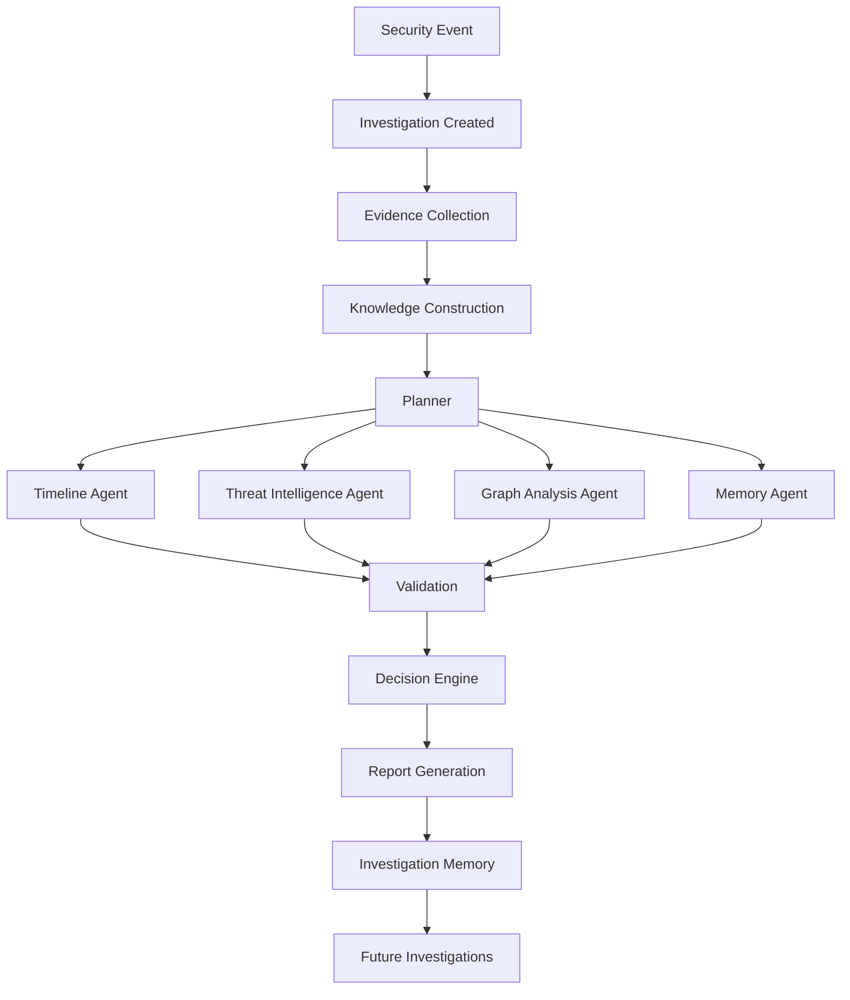
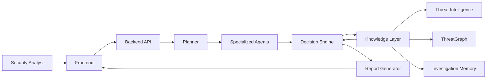
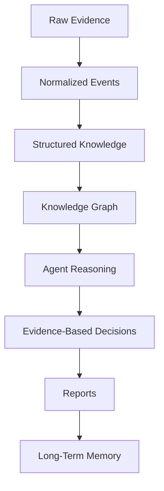
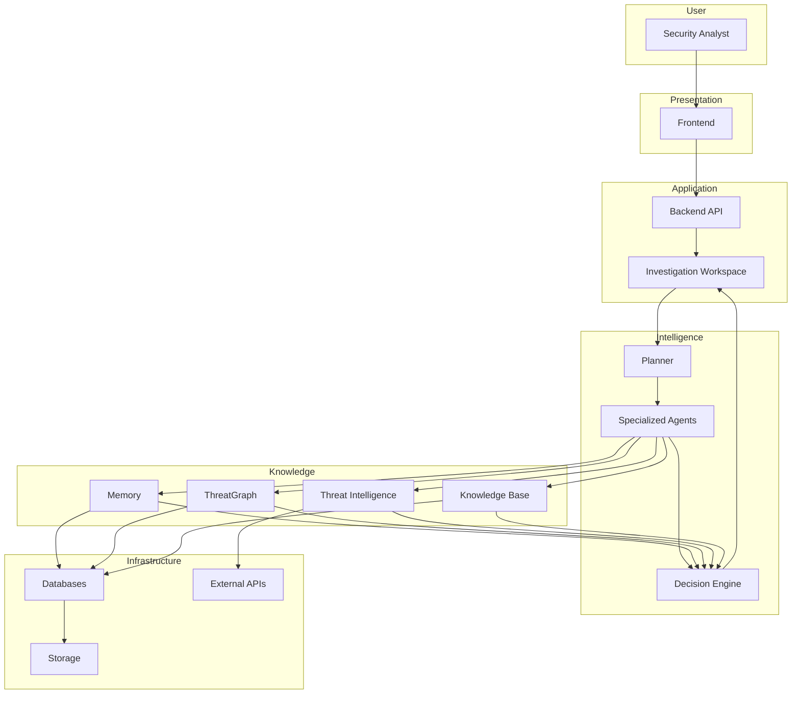

# SentinelAI System Overview

> This document describes the high-level architecture of SentinelAI. It explains how the platform processes cybersecurity investigations from user interaction to AI-assisted decision support. The purpose of this document is to establish a shared architectural understanding before implementation begins.

---

# 1. Purpose

SentinelAI is composed of multiple independent subsystems working together to assist cybersecurity analysts during incident investigations.

Rather than focusing on individual technologies or implementation details, this document explains how those subsystems interact to produce meaningful outcomes.

It serves as the primary architectural reference for future backend, AI, frontend and infrastructure documents.

---

# 2. Architectural Goals

The architecture of SentinelAI is designed around the following goals.

## Explainability

Every recommendation generated by the platform should be supported by observable evidence.

---

## Modularity

Each subsystem should be independently replaceable without requiring major architectural changes.

---

## Scalability

The platform should support increasing amounts of data, users and AI capabilities without requiring fundamental redesign.

---

## Security

Sensitive information must be handled according to secure-by-design principles.

Authentication, authorization and auditability are considered architectural concerns rather than implementation details.

---

## AI Collaboration

Instead of relying on one large AI workflow, SentinelAI coordinates multiple specialized components that cooperate during investigations.

---

## Long-Term Evolution

The architecture should support incremental expansion.

New capabilities should extend the platform rather than replace existing functionality.

---

# 3. High-Level Concept

SentinelAI is an AI-assisted cybersecurity investigation platform.

The platform transforms raw security data into structured knowledge.

That structured knowledge is analyzed by specialized AI components.

Finally, the resulting intelligence is presented to human analysts in an explainable and actionable form.

The overall architecture separates data processing, reasoning and presentation into distinct layers.

This separation improves maintainability, explainability and long-term flexibility.

---

# 4. Core System Layers

SentinelAI is organized into several logical layers.

Each layer has a clearly defined responsibility.

## User Layer

Responsible for user interaction.

Examples include:

- Dashboard
- Incident View
- Investigation Workspace
- Report Viewer

This layer never performs AI reasoning.

Its responsibility is interaction.

---

## Application Layer

Coordinates user requests.

Responsible for:

- authentication
- authorization
- request validation
- workflow orchestration
- communication between subsystems

---

## Intelligence Layer

Represents the core intelligence of SentinelAI.

This layer coordinates:

- AI Runtime (hosts agent execution, Decision Engine, RAG pipeline, and LLM/Embedding Provider Interfaces)
- Planner
- AI Agents
- Decision Engine
- Memory
- Knowledge Retrieval
- ThreatGraph

No presentation logic exists here.

---

## Knowledge Layer

Responsible for organizing information.

Examples include:

- Investigation Memory
- Knowledge Graph
- Vector Store
- Threat Intelligence
- Historical Investigations

This layer stores structured knowledge rather than generated language.

---

## Infrastructure Layer

Provides technical capabilities required by higher layers.

Examples include:

- databases
- object storage
- message queues
- logging
- monitoring
- external APIs

Infrastructure should remain replaceable.

---

# 5. Investigation Lifecycle

Every interaction within SentinelAI revolves around an investigation.

An investigation represents the complete lifecycle of analyzing a potential security incident.

Rather than processing isolated prompts, SentinelAI continuously builds and enriches an investigation until sufficient evidence has been collected to support a conclusion.

Each investigation progresses through multiple stages.

---

## Stage 1 — Investigation Creation

An investigation begins when new evidence becomes available.

Possible triggers include:

- Uploaded log files
- Security alerts
- SIEM notifications
- Manual analyst requests
- External threat intelligence

At this stage, SentinelAI creates a dedicated investigation workspace.

This workspace becomes the central context shared by all subsequent AI components.

---

## Stage 2 — Evidence Collection

Available information is gathered and normalized.

Examples include:

- log events
- endpoint information
- user identities
- network connections
- timestamps
- threat intelligence
- historical investigations

Evidence remains immutable.

The platform never modifies original evidence.

Instead, additional knowledge is derived from it.

---

## Stage 3 — Knowledge Construction

Collected evidence is transformed into structured knowledge.

Examples include:

- entities
- relationships
- attack chains
- timelines
- graph structures
- investigation memory

At this stage the platform shifts from raw data to meaningful information.

---

## Stage 4 — Investigation Planning

The Planner analyzes the current investigation state.

Rather than immediately generating an answer, the Planner determines:

- missing information
- required analysis steps
- relevant AI agents
- available tools
- investigation priorities

The Planner produces an execution plan instead of conclusions.

---

## Stage 5 — Specialized Analysis

Specialized AI agents perform focused investigation tasks.

Examples include:

- Timeline Analysis
- Threat Intelligence Correlation
- Graph Analysis
- Evidence Validation
- Memory Retrieval
- Report Preparation

Agents collaborate through clearly defined interfaces.

No single agent owns the entire investigation.

---

## Stage 6 — Decision Synthesis

Outputs generated by individual agents are combined.

The Decision Engine evaluates:

- consistency
- confidence
- supporting evidence
- conflicting findings
- validated agent findings

The objective is to produce one coherent investigation outcome rather than multiple disconnected AI responses.

---

## Stage 7 — Report Generation

Once sufficient evidence has been collected, SentinelAI generates investigation outputs.

Possible outputs include:

- analyst summaries
- executive reports
- incident timelines
- recommended actions
- confidence assessments

Reports should explain conclusions rather than simply present them.

---

## Stage 8 — Knowledge Preservation

Completed investigations become organizational knowledge.

Relevant findings are stored for future investigations.

Future incidents may reuse:

- investigation history
- attack patterns
- analyst feedback
- graph relationships
- previous recommendations

The platform continuously improves its contextual understanding over time.

---

# 6. High-Level Investigation Flow

---

# 7. Core Components

SentinelAI is composed of multiple independent but cooperative components.

Each component has a clearly defined responsibility.

The platform is designed so that no single component owns the entire investigation process.

---

## Investigation Workspace

The Investigation Workspace represents the central context of every investigation.

It stores the current investigation state and provides a shared environment where AI agents collaborate.

Responsibilities include:

- Investigation metadata
- Current investigation status
- Evidence references
- Agent outputs
- Generated reports
- Analyst feedback

The Investigation Workspace acts as the single source of truth during an investigation.

---

## Planner

The Planner coordinates the investigation.

Rather than solving cybersecurity problems directly, it decides:

- what should happen next
- which agents should participate
- which tools should be used
- whether sufficient evidence exists
- when the investigation is complete

The Planner never performs specialized analysis itself.

---

## Specialized Agents

Agents perform focused investigation tasks.

Every agent owns a single responsibility.

Examples include:

- Timeline Agent
- Threat Intelligence Agent
- Memory Agent
- Graph Analysis Agent
- Report Agent
- Validation Agent

Agents never communicate directly with users.

They communicate through the investigation workflow.

---

## Decision Engine

The Decision Engine combines outputs generated by multiple agents.

Responsibilities include:

- conflict resolution
- confidence estimation
- evidence aggregation
- recommendation synthesis

The Decision Engine produces the structured InvestigationOutcome.

---

## Knowledge Layer

The Knowledge Layer stores structured organizational knowledge.

It contains:

- Investigation Memory
- Threat Intelligence
- Knowledge Graph
- Historical Investigations
- Entity Relationships
- Organizational Context

Knowledge is persistent across investigations.

---

## User Interface

The user interface presents investigation progress.

Its responsibilities include:

- displaying investigation state
- collecting analyst input
- presenting AI findings
- visualizing evidence
- presenting reports

The user interface does not contain business logic.

---

# 8. Communication Principles

Components communicate through clearly defined interfaces.

No component should directly manipulate another component's internal implementation.

Every interaction should have:

- defined inputs
- defined outputs
- explicit ownership
- observable execution

Communication should remain intentional and traceable.

This reduces coupling and simplifies future maintenance.

---

# 9. System Boundaries

SentinelAI intentionally separates internal intelligence from external services.

Internal components are responsible for investigation logic.

External services provide supporting capabilities.

Examples of external services include:

- Large Language Model providers
- Threat Intelligence providers
- Authentication providers
- Object Storage
- Email services
- Notification services

External services should never define business logic.

Business logic always remains inside SentinelAI.

---

# 10. High-Level System Architecture

---

# 11. Control Flow

Control Flow describes how responsibilities move between components during an investigation.

The objective of the Control Flow is coordination rather than data storage.

A typical investigation follows these steps:

1. The analyst initiates or opens an investigation.
2. The Backend validates the request.
3. The Planner evaluates the current investigation state.
4. The Planner creates an execution plan.
5. Specialized Agents perform assigned tasks.
6. The Decision Engine combines the results.
7. The Report Generator produces investigation outputs.
8. The Investigation Workspace is updated.
9. The analyst reviews the findings.

At no point does the Planner perform specialized analysis.

Its sole responsibility is coordination.

---

# 12. Data Flow

Data Flow describes how information moves through SentinelAI.

Unlike Control Flow, Data Flow focuses on knowledge rather than execution.

The lifecycle of investigation data follows these stages:

## Conceptual Data Flow

Data should become increasingly structured as it moves through the system.

Artificial intelligence should consume structured knowledge whenever possible rather than raw security events.

Knowledge should never flow backwards by bypassing validation layers.

Every transformation should preserve traceability to the original evidence.

---

# 13. Conceptual Platform Architecture

---

# Closing Remarks

The architecture presented in this document intentionally focuses on responsibilities rather than implementation.

Specific technologies, frameworks and deployment strategies may evolve throughout the lifetime of SentinelAI.

The responsibilities defined here are expected to remain significantly more stable than the technologies used to implement them.

Future architectural documents should refine this model without violating its fundamental principles.

System evolution should increase capabilities while preserving architectural clarity.

Every new subsystem introduced into SentinelAI should integrate into this architecture rather than redefining it.