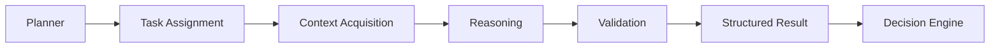
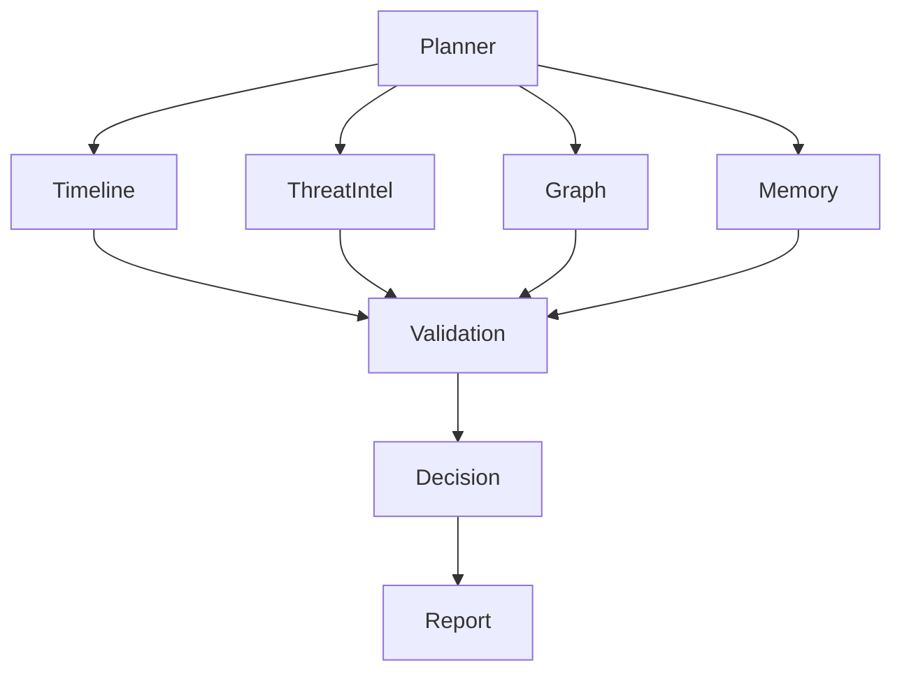
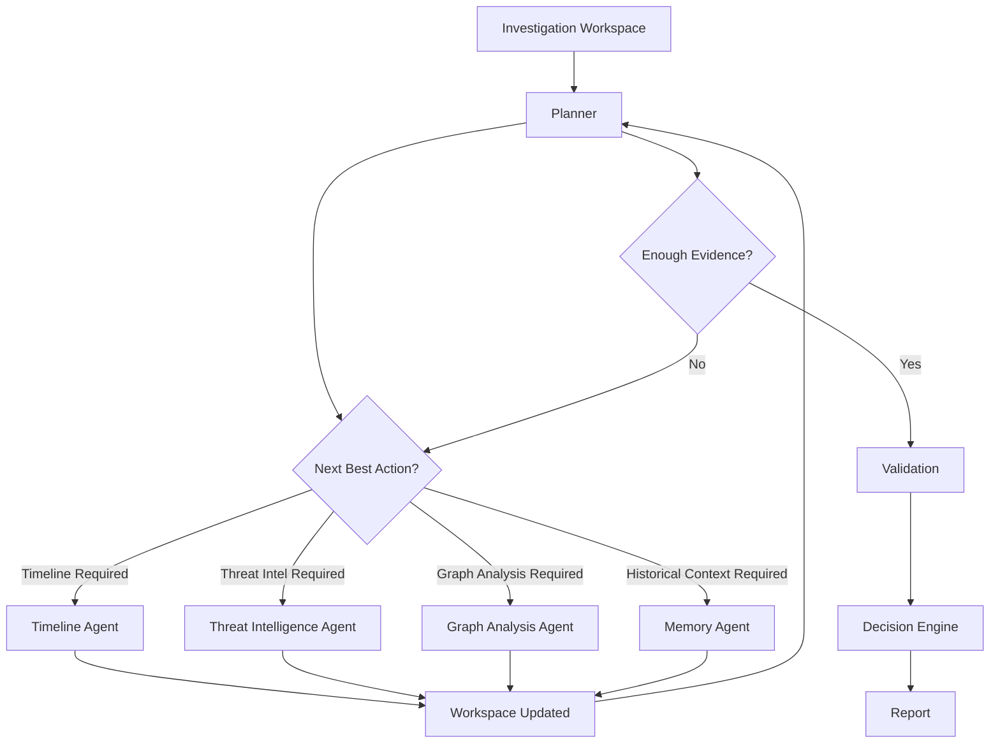

# SentinelAI Agent Architecture

> This document defines the multi-agent architecture of SentinelAI. It explains how autonomous AI components collaborate to perform cybersecurity investigations while maintaining explainability, modularity and long-term maintainability.

---

# 1. Purpose

Artificial intelligence is the core capability of SentinelAI.

However, the platform intentionally avoids relying on a single general-purpose model responsible for every task.

Instead, SentinelAI adopts a multi-agent architecture where specialized AI components cooperate throughout the investigation lifecycle.

Each agent focuses on a narrowly defined responsibility.

This separation improves reasoning quality, simplifies evaluation and enables independent evolution of system capabilities.

This document establishes the architectural foundations of that collaboration.

---

# 2. Why Multi-Agent?

Cybersecurity investigations naturally consist of multiple distinct activities.

Examples include:

- understanding alerts
- collecting evidence
- retrieving historical investigations
- analyzing graph relationships
- correlating threat intelligence
- generating reports
- validating conclusions

Attempting to perform all of these tasks within a single prompt introduces unnecessary complexity and reduces explainability.

SentinelAI therefore distributes responsibilities across specialized agents coordinated through a shared investigation workflow.

---

# 3. Architectural Objectives

The multi-agent system is designed around the following objectives.

## Specialization

Each agent owns exactly one primary responsibility.

---

## Collaboration

Agents cooperate to solve investigations.

No single agent performs the complete investigation.

---

## Explainability

Every agent should expose:

- inputs
- outputs
- reasoning summary
- confidence
- execution metadata

---

## Replaceability

Individual agents should be replaceable without redesigning the entire platform.

---

## Observability

Every execution step should be traceable.

Agent interactions must remain observable for debugging and evaluation.

---

## Controlled Autonomy

Agents may make recommendations.

Final investigation decisions belong to the Decision Engine.

---

# 4. Agent Lifecycle

Every agent within SentinelAI follows the same execution lifecycle.

Maintaining a consistent lifecycle simplifies orchestration, testing and debugging.

The lifecycle consists of six stages.

---

## Stage 1 — Task Assignment

The Planner assigns a clearly defined objective.

The assignment includes:

- investigation context
- required inputs
- available tools
- expected outputs

---

## Stage 2 — Context Acquisition

The agent retrieves only the information required for its assigned task.

Possible sources include:

- Investigation Workspace
- Memory
- ThreatGraph
- Threat Intelligence
- Knowledge Base

---

## Stage 3 — Reasoning

The agent performs task-specific reasoning.

Reasoning may involve:

- language models
- graph algorithms
- retrieval
- rule-based logic
- future ML models

The architecture intentionally remains independent of specific reasoning techniques.

---

## Stage 4 — Validation

Before producing output, the agent validates its findings.

Validation may include:

- evidence verification
- confidence estimation
- consistency checks
- missing information detection

---

## Stage 5 — Result Publication

The agent publishes structured outputs.

Outputs should include:

- findings
- evidence
- confidence
- limitations

Agents never generate final investigation decisions.

---

## Stage 6 — Completion

Execution metadata is recorded.

Examples include:

- execution duration
- tools used
- memory accessed
- encountered errors
- execution status

This information supports observability and future evaluation.

---

# 5. Agent Lifecycle

---

# 6. Agent Roles

Every agent within SentinelAI has a single, clearly defined responsibility.

Agents should never attempt to solve multiple unrelated problems.

The architecture favors specialization over generalization.

The following agents represent the initial architecture of SentinelAI.

---

## Planner Agent

The Planner Agent coordinates the investigation.

Responsibilities include:

- understanding investigation objectives
- determining required analysis steps
- selecting appropriate agents
- creating execution plans
- monitoring investigation progress

The Planner never performs domain-specific analysis.

---

## Timeline Agent

The Timeline Agent reconstructs the chronological sequence of security events.

Responsibilities include:

- ordering events
- identifying missing timestamps
- detecting unusual event sequences
- generating investigation timelines

---

## Threat Intelligence Agent

The Threat Intelligence Agent enriches investigations using external intelligence.

Responsibilities include:

- IOC enrichment
- CVE correlation
- MITRE ATT&CK mapping
- threat actor identification
- external intelligence retrieval

---

## Graph Analysis Agent

The Graph Analysis Agent analyzes relationships between entities.

Responsibilities include:

- relationship analysis
- attack path discovery
- lateral movement detection
- entity correlation
- graph traversal

This agent is expected to become increasingly important as ThreatGraph evolves.

---

## Memory Agent

The Memory Agent retrieves relevant historical knowledge.

Responsibilities include:

- retrieving previous investigations
- organizational memory lookup
- similarity search
- context retrieval
- historical pattern discovery

The Memory Agent never modifies historical knowledge directly.

---

## Validation Agent

The Validation Agent evaluates outputs generated by other agents.

Responsibilities include:

- consistency verification
- evidence validation
- confidence assessment
- conflict detection
- identifying missing evidence

Validation improves trustworthiness before final decisions are synthesized.

Validation should evaluate both AI reasoning and supporting evidence.

Whenever possible, validation should distinguish between:

- factual inconsistencies
- missing evidence
- conflicting observations
- unsupported conclusions

Validation improves investigation reliability before final reports are generated.

---

## Report Agent

The Report Agent transforms investigation findings into human-readable outputs.

Responsibilities include:

- analyst reports
- executive summaries
- incident descriptions
- recommended actions
- structured investigation reports

The Report Agent does not create new evidence.

It communicates existing findings clearly.

---

## Decision Engine

The Decision Engine is not an independent agent.

It is an Intelligence Layer component responsible for synthesizing investigation findings produced by specialized agents.

The Decision Engine executes within the AI Runtime after the Planner Agent determines that sufficient evidence has been collected.

---

### Responsibilities

The Decision Engine is responsible for:

- combining findings produced by specialized agents
- identifying conflicting conclusions
- estimating overall investigation confidence
- generating a structured investigation recommendation

The Decision Engine performs synthesis rather than specialized analysis.

Domain-specific analysis remains the responsibility of individual agents.

---

### Inputs

The Decision Engine receives:

- validated agent findings
- investigation context
- investigation objectives

---

### Output

The Decision Engine produces a structured InvestigationOutcome.

This output is consumed by downstream components responsible for investigation lifecycle management and report generation.

---

### Human Oversight

The Decision Engine provides recommendations.

Final operational decisions always remain the responsibility of the human analyst.

---

# 6a. AI Runtime

The AI Runtime hosts all AI execution within SentinelAI.

It belongs to the Intelligence Layer and is independent of backend services.

Backend services manage business data and persistence.

The AI Runtime performs reasoning.

---

## Responsibilities

The AI Runtime is responsible for:

- hosting agent execution
- hosting the Decision Engine
- coordinating the RAG pipeline
- interacting with language model providers
- interacting with embedding providers

---

## Service Interaction

The AI Runtime retrieves and updates business information exclusively through backend services.

It never bypasses service boundaries or accesses persistence technologies directly.

---

## Provider Interfaces

The AI Runtime exposes replaceable interfaces for:

- language model providers
- embedding providers

This preserves technology independence throughout the platform.

---

## Design Principle

Replacing an AI provider should not require modifications to agent logic or backend services.

Likewise, backend service evolution should not affect AI execution behavior.

---

# 7. Agent Responsibilities

Every agent should explicitly define its operational boundaries.

Each agent owns:

- one primary responsibility
- required inputs
- expected outputs
- permitted tools
- accessible memory
- evaluation metrics

Responsibilities should overlap as little as possible.

Whenever overlap becomes necessary, ownership should remain explicit.

---

# 8. Agent Communication

Agents do not communicate directly with one another.

Instead, every interaction passes through the investigation workflow.

This architecture provides:

- traceability
- observability
- reproducibility
- easier debugging
- lower coupling

The Planner coordinates execution.

The Decision Engine synthesizes results.

Agents focus exclusively on their assigned responsibilities.

---

# 9. Agent Communication Model

---

# 10. Agent State Management

SentinelAI distinguishes between investigation state and agent execution.

Agents are intentionally designed to be stateless.

The investigation itself owns the evolving state.

This separation simplifies orchestration, improves scalability and reduces hidden dependencies between agents.

---

## Investigation State

The Investigation Workspace maintains the complete state of an active investigation.

Examples include:

- investigation metadata
- collected evidence
- execution history
- completed tasks
- pending tasks
- agent outputs
- analyst feedback
- generated reports

The Investigation Workspace acts as the single source of truth throughout the investigation lifecycle.

---

## Agent State

Agents do not maintain persistent internal state.

Instead, each execution receives:

- investigation context
- assigned objective
- required evidence
- available tools

After completing its task, the agent publishes structured outputs back to the Investigation Workspace.

The agent itself remains disposable.

---

## Benefits

Separating investigation state from agent execution provides several advantages.

These include:

- easier debugging
- deterministic execution
- improved scalability
- reproducible investigations
- simpler testing
- reduced hidden coupling

Agents become interchangeable because they do not own investigation state.

---

## Design Implications

Every agent execution should behave as an independent operation.

An agent should never assume knowledge that has not been explicitly provided through the Investigation Workspace.

This principle improves transparency and prevents unintended dependencies.

---

# 11. Tool Access

Agents should only access the tools required for their assigned responsibilities.

Providing unrestricted tool access increases architectural complexity and security risk.

Every agent should operate under the Principle of Least Privilege.

---

## Examples

### Timeline Agent

Permitted:

- Investigation Events
- Timeline Builder

Not Permitted:

- Threat Intelligence APIs
- Report Generation
- Graph Database Administration

---

### Threat Intelligence Agent

Permitted:

- Threat Intelligence Providers
- IOC Lookup
- CVE Database

Not Permitted:

- Investigation Memory Modification
- Report Publishing

---

### Memory Agent

Permitted:

- Investigation Memory
- Knowledge Base
- Similarity Search

Not Permitted:

- Threat Intelligence Enrichment
- Timeline Construction

---

## Design Implications

Each agent should declare:

- accessible tools
- accessible data
- execution permissions

The orchestration layer is responsible for enforcing these permissions.

---

# 12. Failure Handling

SentinelAI assumes that AI components may fail.

Failures should therefore be treated as expected architectural events rather than exceptional situations.

---

## Possible Failures

Examples include:

- missing evidence
- unavailable tools
- low confidence
- conflicting findings
- model errors
- timeout
- incomplete reasoning

---

## Expected Behavior

When an agent cannot complete its task, it should explicitly report:

- failure reason
- completed work
- missing information
- confidence level
- suggested next action

Silent failures are unacceptable.

---

## Planner Response

The Planner may respond by:

- assigning another agent
- requesting additional evidence
- retrying execution
- terminating the investigation step
- escalating to the analyst

Failures should become part of the investigation history.

---

## Design Implications

Failure information is considered valuable investigation data.

Future investigations may learn from previous execution failures.

---

# 13. Investigation Execution Strategy

SentinelAI does not execute every agent during every investigation.

Instead, investigations are executed dynamically according to their current state.

The Planner determines which capabilities are required based on available evidence and investigation objectives.

This approach reduces unnecessary computation while improving investigation efficiency.

---

## Adaptive Execution

Different investigations require different analysis strategies.

For example:

A phishing investigation may require:

- Timeline Agent
- Threat Intelligence Agent
- Report Agent

Whereas a lateral movement investigation may additionally require:

- Graph Analysis Agent
- Memory Agent
- Validation Agent

The execution workflow should adapt to investigation needs rather than following a fixed sequence.

---

## Progressive Investigation

Investigations evolve incrementally.

Each completed analysis step may reveal new information that changes the execution plan.

Therefore, planning is considered a continuous process rather than a one-time activity.

The Planner should periodically re-evaluate:

- current evidence
- completed tasks
- unresolved questions
- investigation confidence

Execution plans may be updated whenever new evidence becomes available.

---

## Early Termination

Not every investigation requires every possible analysis.

If sufficient evidence has already been collected, the Planner may terminate the investigation early.

Early completion should reduce unnecessary reasoning while preserving investigation quality.

---

## Escalation

If confidence remains below acceptable thresholds after multiple investigation steps, the Planner may escalate the investigation to the analyst.

Escalation should include:

- completed analyses
- missing information
- confidence estimates
- recommended next actions

The objective is to assist analysts rather than delay investigations indefinitely.

---

# 14. Investigation Execution Model

---

# 15. Agent Contract

Every agent implemented within SentinelAI must follow a common execution contract.

This ensures consistency across the platform and simplifies orchestration.

Each agent should explicitly define the following elements.

---

## Responsibility

A concise description of the problem the agent is responsible for solving.

Every responsibility should be specific and measurable.

---

## Inputs

The agent should declare every required input.

Examples include:

- investigation context
- evidence
- graph entities
- historical knowledge
- external intelligence

Inputs should be explicit.

Hidden dependencies are prohibited.

---

## Preconditions

Agents should explicitly define the conditions required before execution can begin.

Examples include:

- investigation identifier is available
- required evidence has been collected
- external services are reachable
- required permissions have been granted

If preconditions are not satisfied, execution should fail immediately with a structured explanation.

---

## Outputs

Outputs should be structured rather than conversational.

Typical outputs include:

- findings
- confidence
- evidence references
- detected issues
- recommendations

Outputs should be consumable by other platform components.

Outputs should be deterministic whenever possible.

Given the same investigation context and evidence, an agent should aim to produce consistent structured outputs.

Minor variations in natural language are acceptable, but the underlying findings and evidence should remain stable.

---

## Tools

Every agent must declare which tools it is allowed to access.

Tool permissions should remain minimal.

---

## Memory Access

Agents should specify:

- whether memory is required
- which memory sources are permitted
- whether retrieved information is temporary or persistent

---

## Failure Conditions

Agents should explicitly define situations in which they cannot continue execution.

Failures should be reported rather than hidden.

---

## Evaluation Metrics

Every agent should have measurable evaluation criteria.

Examples include:

- execution latency
- evidence coverage
- reasoning quality
- confidence calibration
- successful task completion

Evaluation enables continuous improvement of agent quality.

---

## Versioning

Agents should evolve independently.

Breaking behavioral changes should be versioned and documented.

Independent versioning enables gradual improvements without disrupting the entire platform.

---

## Agent Identity

Every agent should have a unique and stable identifier.

Examples include:

- planner-agent
- memory-agent
- graph-analysis-agent
- report-agent

Identifiers should remain stable across versions whenever possible.

Stable identities simplify orchestration, monitoring and future versioning.

---

# 16. Design Principles Applied

The following engineering principles directly influence the agent architecture.

| Principle | Application |
|-----------|-------------|
| AI Solves Problems, Not Marketing | Agents exist to solve investigation tasks rather than demonstrate AI capabilities. |
| Explainability Before Automation | Every agent exposes evidence and reasoning summaries. |
| Human Expertise Remains Central | Final investigation decisions remain under human oversight. |
| Graph Before Generation | Agents consume structured knowledge before generating language. |
| Memory Is a First-Class Citizen | Historical knowledge is available through dedicated memory systems. |
| Intelligence Emerges Through Collaboration | Specialized agents cooperate under Planner coordination. |
| Modularity Over Monoliths | Agents are independently replaceable. |
| Security by Design | Tool access follows least-privilege principles. |
| Architecture Before Framework | Agent behavior is defined independently of orchestration frameworks. |

---

# 17. Agent Evolution

The multi-agent architecture of SentinelAI is designed to evolve over time.

New agents may be introduced as new cybersecurity capabilities become necessary.

However, every new agent should satisfy the architectural principles defined in this document before becoming part of the platform.

---

## When Should a New Agent Be Created?

A new agent should only be introduced if at least one of the following conditions is true:

- A new responsibility cannot be assigned to an existing agent without violating the Single Responsibility Principle.
- The required reasoning process is significantly different from existing capabilities.
- Independent evaluation of the capability is desirable.
- The capability requires dedicated tools or permissions.
- The capability is expected to evolve independently.

Creating agents simply to increase the number of agents is discouraged.

---

## When Should an Existing Agent Be Extended?

Existing agents should be extended when the new capability naturally belongs to their existing responsibility.

Examples include:

Timeline Agent

- Better timestamp normalization
- Improved event sequencing
- Additional anomaly detection

These improvements strengthen the same responsibility rather than introducing a new one.

---

## Agent Deprecation

Agents may become obsolete.

When an agent is replaced:

- responsibilities should be migrated
- interfaces should remain stable whenever possible
- historical compatibility should be preserved
- documentation should be updated

Removing agents should be considered an architectural decision rather than an implementation task.

---

## Architectural Review

Every proposed agent should answer the following questions before implementation.

- What responsibility does this agent own?
- Why can this responsibility not belong to another agent?
- Which tools are required?
- Which memory sources are required?
- How will success be measured?
- What are the expected failure conditions?

If these questions cannot be answered clearly, the new agent should not yet be implemented.

---

# Closing Statement

The multi-agent architecture presented in this document defines responsibilities rather than implementations.

Specific orchestration frameworks, language models and reasoning techniques may evolve throughout the lifetime of SentinelAI.

The architectural principles established here are expected to remain significantly more stable than the technologies used to implement them.

Future agent implementations should refine these concepts without violating the responsibilities defined in this document.

Every new agent introduced into SentinelAI should strengthen the architecture through specialization, collaboration and explainability rather than increasing unnecessary complexity.

---

# Version History

| Version | Date | Description |
|----------|------------|--------------------------------|
| 1.0.0 | 2026-06-26 | Initial Agent Architecture document created |