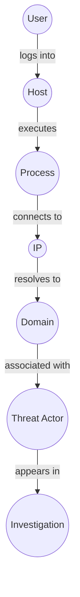
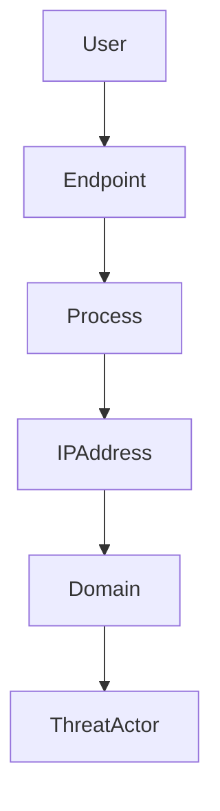
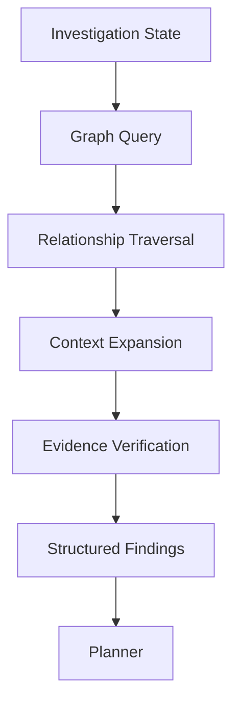

# SentinelAI Knowledge Graph

> This document defines the Knowledge Graph architecture of SentinelAI. It explains how entities and their relationships are represented, managed and utilized to support explainable cybersecurity investigations and graph-based reasoning.

---

# 1. Purpose

Cybersecurity investigations involve understanding relationships rather than isolated events.

A single security event rarely provides sufficient context.

Instead, analysts investigate how users, devices, IP addresses, domains, processes and alerts relate to one another.

The Knowledge Graph enables SentinelAI to represent these relationships explicitly.

Rather than storing isolated records, the platform constructs an interconnected representation of organizational knowledge that supports explainable reasoning and advanced investigation workflows.

---

# 2. Why a Knowledge Graph?

Traditional databases answer questions about individual records.

Cybersecurity investigations often require reasoning across multiple connected entities.

Examples include:

- Which users accessed the same endpoint?
- Which IP addresses communicate with compromised assets?
- Which domains appear across multiple investigations?
- Which attack paths connect two seemingly unrelated alerts?

These questions depend on relationships rather than individual data points.

The Knowledge Graph provides this capability.

---

# 3. Architectural Objectives

The Knowledge Graph is designed around the following objectives.

## Explicit Relationships

Relationships should be represented as first-class objects rather than inferred during every investigation.

---

## Explainability

Every relationship should be traceable to supporting evidence.

---

## Scalability

The graph should continuously evolve as investigations produce new knowledge.

---

## Modularity

Graph reasoning should remain independent of storage technology.

---

## Reusability

Graph knowledge should support future investigations rather than individual incidents only.

---

# 4. Graph Fundamentals

The Knowledge Graph represents organizational knowledge as interconnected entities and relationships.

Rather than storing isolated records, the graph models how security-relevant objects interact with one another.

The graph is designed to support reasoning rather than simple storage.

---

## Entities

Entities represent identifiable objects within an investigation.

Examples include:

- users
- endpoints
- servers
- IP addresses
- domains
- URLs
- processes
- files
- alerts
- malware
- vulnerabilities
- threat actors

Each entity should possess a stable identity throughout its lifecycle.

Every entity should expose a globally unique and stable identifier.

Entity names may change over time, but identifiers should remain immutable throughout the entity lifecycle.

---

## Relationships

Relationships describe how entities are connected.

Examples include:

- communicates_with
- logged_into
- resolved_to
- downloaded
- executed
- connected_to
- belongs_to
- related_to
- exploited
- observed_in

Relationships should explicitly represent evidence-backed interactions.

Relationships are considered first-class objects rather than simple references.

Relationship types should be explicitly defined and consistently reused across the platform.

Semantically equivalent relationships should avoid using multiple different names.

A consistent relationship vocabulary improves graph quality and reasoning accuracy.

---

## Properties

Entities and relationships may contain descriptive metadata.

Examples include:

- timestamps
- confidence
- severity
- investigation identifiers
- evidence references
- source systems

Properties enrich graph reasoning while preserving explainability.

---

# 5. Graph Semantics

The value of the Knowledge Graph lies in its semantics rather than its topology.

An isolated entity carries limited meaning.

Knowledge emerges from the relationships connecting entities across investigations.

Graph reasoning therefore focuses on contextual understanding rather than structural complexity.

---

## Contextual Relationships

Relationships should describe meaningful cybersecurity interactions.

Examples include:

- authentication events
- network communication
- process execution
- privilege escalation
- malware execution
- credential usage
- infrastructure ownership

Context transforms disconnected events into explainable investigations.

---

## Evidence-Backed Graph

Every relationship should be traceable to supporting evidence.

The graph should never introduce unsupported relationships solely through AI inference.

Hypotheses may exist temporarily during investigations but should remain clearly distinguishable from validated relationships.

---

## Graph Evolution

The graph continuously evolves.

New investigations may:

- introduce entities
- strengthen relationships
- invalidate previous assumptions
- enrich existing nodes

Graph evolution should preserve historical traceability.

---

# 6. Conceptual Knowledge Graph

---

# 7. Graph Construction

The Knowledge Graph is constructed incrementally throughout investigations.

Graph construction should prioritize correctness over completeness.

---

## Entity Discovery

Entities may be discovered from:

- security logs
- alerts
- uploaded files
- threat intelligence
- analyst input
- previous investigations

Duplicate entities should be resolved whenever possible.

---

## Relationship Discovery

Relationships emerge from observed evidence.

Examples include:

- authentication records
- network connections
- process trees
- DNS resolutions
- analyst validation

Relationships should remain evidence-backed.

---

## Entity Resolution

Multiple observations may refer to the same real-world object.

Entity resolution aims to merge these observations into a unified representation.

Examples include:

- identical IP addresses
- repeated usernames
- recurring hostnames
- known malware families

Entity resolution improves graph quality and reduces duplication.

---

## Graph Updates

The graph should evolve incrementally.

New investigations should enrich existing knowledge rather than recreate it.

Graph updates should preserve historical traceability.

---

## Entity Deprecation

Entities should rarely be deleted.

When an entity is no longer valid, it should preferably be marked as deprecated rather than removed.

Historical investigations may still depend on deprecated entities.

---

# 8. Graph Reasoning

The primary purpose of the Knowledge Graph is to support reasoning rather than storage.

The graph enables AI agents to understand how entities relate to one another across investigations.

Reasoning should always be grounded in explicit relationships and supporting evidence.

---

## Relationship-Centered Reasoning

Reasoning begins with relationships rather than isolated entities.

Examples include:

- identifying compromised assets connected to a suspicious user
- tracing process execution chains
- discovering infrastructure shared across investigations
- identifying recurring attack paths

The objective is to understand context rather than individual observations.

---

## Multi-Hop Reasoning

Many cybersecurity questions require traversing multiple relationships.

Examples include:

Rather than evaluating isolated connections, the graph enables reasoning across complete relationship chains.

---

## Context Expansion

Graph reasoning may expand investigation context when additional relevant entities are discovered.

Examples include:

- neighboring entities
- shared infrastructure
- previous investigations
- related alerts
- common attack techniques

Context expansion should remain evidence-driven.

---

## Explainable Reasoning

Every graph-based conclusion should identify:

- participating entities
- traversed relationships
- supporting evidence
- reasoning confidence

Graph reasoning should remain fully explainable.

---

# 9. Graph Reasoning Workflow

---

# 10. Graph Traversal

Traversal determines how graph knowledge is explored during investigations.

Traversal strategies should prioritize investigative value rather than graph size.

---

## Local Traversal

Focuses on immediate neighbors.

Useful for:

- connected hosts
- associated users
- recent communications

---

## Multi-Hop Traversal

Explores longer relationship chains.

Useful for:

- attack path discovery
- lateral movement
- infrastructure analysis

---

## Filtered Traversal

Traversal should support constraints such as:

- relationship type
- investigation timeframe
- confidence threshold
- evidence availability

Filtering reduces irrelevant graph exploration.

---

## Adaptive Traversal

Traversal depth should adapt to investigation needs.

Simple investigations may require only local exploration.

Complex investigations may require deeper graph analysis.

The Planner should determine the appropriate traversal strategy.

---

# 11. Relationship Confidence

Not every relationship carries the same level of certainty.

The Knowledge Graph should explicitly represent confidence.

Confidence should reflect evidence quality rather than AI certainty.

---

## Confidence Sources

Relationship confidence may depend on:

- number of supporting observations
- evidence quality
- analyst validation
- historical consistency
- external corroboration

---

## Confidence Evolution

Confidence may change over time.

Repeated evidence may strengthen relationships.

Conflicting evidence may reduce confidence.

Historical confidence changes should remain traceable.

---

## Low-Confidence Relationships

Relationships with insufficient confidence should remain available for investigation but should be clearly distinguished from validated relationships.

AI agents should avoid treating low-confidence relationships as established facts.

---

# 12. Graph Quality

The usefulness of the Knowledge Graph depends on the quality of its entities and relationships.

As the graph grows over time, maintaining quality becomes increasingly important.

Graph quality should therefore be treated as a continuous architectural responsibility rather than a one-time data cleaning task.

Its quality should also be continuously measurable.

Possible quality indicators include:

- duplicate entity ratio
- relationship validation rate
- graph connectivity
- orphan entity count
- average relationship confidence

These metrics enable continuous monitoring and improvement of graph health.

---

## Entity Quality

Every entity should satisfy the following characteristics:

- uniquely identifiable
- evidence-backed
- consistently represented
- traceable to its origin

Duplicate or ambiguous entities should be resolved whenever possible.

---

## Relationship Quality

Relationships should be:

- supported by evidence
- semantically meaningful
- appropriately classified
- assigned a confidence level

Relationships without sufficient supporting evidence should remain provisional.

---

## Graph Consistency

The graph should minimize:

- duplicate entities
- conflicting relationships
- circular inconsistencies
- orphaned nodes
- unsupported connections

Consistency improves both reasoning quality and investigation explainability.

---

## Continuous Refinement

Graph quality should improve naturally as new investigations are completed.

Future investigations may:

- strengthen existing relationships
- merge duplicate entities
- improve metadata
- refine confidence estimates

Knowledge quality should increase over time rather than deteriorate.

---

# 13. Graph Evolution

The Knowledge Graph continuously evolves throughout the lifetime of SentinelAI.

Every completed investigation has the potential to enrich the graph.

Graph evolution should preserve historical knowledge while incorporating newly validated information.

---

## Incremental Growth

Graph updates should be incremental.

Existing knowledge should be enriched whenever possible instead of recreated.

---

## Relationship Evolution

Relationships may evolve by:

- increasing confidence
- decreasing confidence
- becoming deprecated
- being superseded by stronger evidence

Relationship evolution should remain historically traceable.

---

## Entity Evolution

Entities may evolve as additional information becomes available.

Examples include:

- hostname becomes associated with a known asset
- IP address becomes linked to multiple domains
- malware family receives additional classifications

Entity evolution enriches contextual understanding without changing entity identity.

---

## Historical Preservation

Previous graph states should remain recoverable whenever meaningful architectural or investigative value exists.

Historical graph information supports auditing and investigation reproducibility.

---

# 14. Graph Contract

The Knowledge Graph exposes a well-defined architectural contract to the rest of SentinelAI.

Graph components should provide relationship-based knowledge while remaining independent of investigation orchestration.

---

## Responsibility

Represent and retrieve evidence-backed relationships between cybersecurity entities.

The Knowledge Graph is responsible for context representation rather than decision-making.

---

## Inputs

Graph operations may receive:

- investigation context
- entity identifiers
- relationship constraints
- traversal parameters
- confidence thresholds

---

## Outputs

Graph operations produce structured relationship information.

Typical outputs include:

- discovered entities
- relationship chains
- attack paths
- neighboring entities
- confidence values
- supporting evidence

Outputs should always remain explainable.

---

## Permissions

The Knowledge Graph may:

- retrieve entities
- retrieve relationships
- update validated graph knowledge
- resolve duplicate entities

The Knowledge Graph may not:

- generate investigation reports
- perform investigation planning
- modify investigation evidence
- bypass validation workflows

---

## Success Criteria

Successful graph operations should:

- retrieve meaningful relationships
- preserve explainability
- minimize irrelevant traversal
- maintain acceptable response latency

---

## Failure Conditions

Examples include:

- missing entities
- inconsistent graph state
- unavailable graph storage
- invalid traversal requests

Failures should remain observable and explicitly reported.

---

# 15. Architectural Boundaries

The Knowledge Graph intentionally limits its responsibilities.

Maintaining clear architectural boundaries improves modularity and enables future evolution.

---

## The Knowledge Graph Is Not a Database

A database stores records.

The Knowledge Graph models relationships.

Storage technology should remain an implementation detail.

---

## The Knowledge Graph Is Not Memory

Graph Memory represents one layer within the overall Memory Architecture.

The complete Memory Architecture includes additional forms of organizational knowledge beyond graph structures.

---

## The Knowledge Graph Is Not the Planner

The Planner decides what should be investigated.

The Knowledge Graph provides relationship context.

Decision-making remains outside the graph.

---

## The Knowledge Graph Is Not an AI Model

The graph itself does not reason.

AI agents perform reasoning by consuming graph knowledge.

The graph provides structured context that enables explainable reasoning.

---

## The Knowledge Graph Is Not ThreatGraph

ThreatGraph is an application built upon the Knowledge Graph architecture.

The Knowledge Graph defines the underlying representation.

ThreatGraph defines how that representation is utilized within SentinelAI.

---

# 16. Graph Query Model

The Knowledge Graph should expose a consistent query model independent of its underlying storage technology.

Graph queries should express investigative intent rather than database-specific syntax.

The objective is to retrieve meaningful relationship-based knowledge while preserving architectural independence.

---

## Entity Queries

Entity queries retrieve information about individual entities.

Examples include:

- retrieve a specific user
- retrieve a specific host
- retrieve a specific IP address
- retrieve a specific domain

Entity queries should return both entity properties and relevant relationship summaries.

---

## Relationship Queries

Relationship queries retrieve direct relationships between entities.

Examples include:

- users connected to an endpoint
- endpoints communicating with an IP address
- processes executed by a user
- alerts related to a malware family

Relationship queries should preserve evidence traceability.

---

## Path Queries

Path queries explore chains of relationships.

Examples include:

- identify attack paths
- discover lateral movement
- identify trust relationships
- reconstruct communication chains

Path exploration should support configurable traversal constraints.

---

## Neighborhood Queries

Neighborhood queries retrieve entities surrounding a target entity.

Examples include:

- neighboring assets
- related users
- associated investigations
- connected infrastructure

Neighborhood exploration provides contextual awareness during investigations.

---

## Investigation Queries

Graph queries may also operate at the investigation level.

Examples include:

- related investigations
- shared infrastructure
- recurring attack patterns
- previously observed entities

Investigation-centric queries support organizational learning.

Graph query results should remain structured.

Every response should clearly distinguish:

- retrieved entities
- retrieved relationships
- supporting evidence
- confidence information

Structured responses simplify downstream reasoning and validation.

---

# 17. Future Graph Intelligence

The Knowledge Graph establishes the foundation for future graph intelligence capabilities.

The current architecture focuses on explainable relationship modeling.

Future versions may introduce more advanced analytical capabilities without changing the architectural principles defined in this document.

---

## Possible Future Capabilities

Examples include:

- graph embeddings
- community detection
- link prediction
- anomaly detection
- graph neural networks
- risk propagation
- attack path scoring
- graph-based recommendation

These capabilities should enrich investigations while preserving explainability and evidence traceability.

---

## Architectural Principle

Advanced graph intelligence should augment human investigations rather than replace them.

Machine learning should strengthen graph reasoning without obscuring the evidence supporting investigative conclusions.

Experimental graph intelligence capabilities should remain optional.

Core investigation workflows must continue to operate even when advanced graph intelligence components are unavailable.

---

# 18. Design Principles Applied

The Knowledge Graph follows the engineering principles established throughout SentinelAI.

| Principle | Graph Application |
|-----------|-------------------|
| Explainability | Every relationship is supported by evidence and remains traceable. |
| Graph Before Generation | AI agents reason over graph structures before generating conclusions. |
| Evidence-Based AI | Relationships originate from validated observations rather than unsupported inference. |
| Modularity | Graph reasoning remains independent of storage technology and AI models. |
| Separation of Responsibilities | The graph represents relationships but does not perform planning or reporting. |
| Scalability | The graph continuously evolves with new investigations while preserving historical context. |
| Security by Design | Graph access follows controlled permissions and validation workflows. |
| Architecture Before Framework | Graph behavior is defined independently of Neo4j or any specific graph technology. |

---

# Closing Statement

The Knowledge Graph provides the relational foundation of SentinelAI.

By representing entities and their relationships explicitly, the platform enables explainable, evidence-based and context-aware cybersecurity investigations.

Future implementations may introduce more sophisticated graph storage technologies, reasoning algorithms and machine learning techniques.

However, the architectural principles established in this document should remain stable regardless of implementation details.

The Knowledge Graph should continuously evolve as organizational knowledge grows while preserving transparency, traceability and investigative integrity.

---

# Version History

| Version | Date | Description |
|----------|------------|--------------------------------|
| 1.0.0 | 2026-06-26 | Initial Knowledge Graph architecture document created |