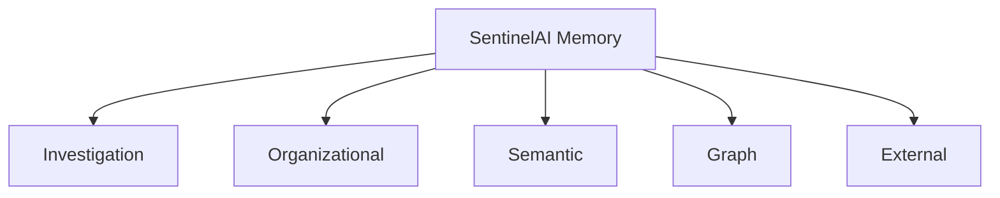

# SentinelAI Memory Architecture

> This document defines how knowledge is stored, retrieved and maintained within SentinelAI. It describes the memory architecture that enables AI agents to access organizational knowledge, historical investigations and contextual information while preserving explainability, consistency and long-term maintainability.

---

# 1. Purpose

Memory is a fundamental capability of SentinelAI.

Without memory, every investigation would begin from zero.

Instead, SentinelAI continuously accumulates organizational knowledge that can be reused across future investigations.

The objective of the Memory Architecture is to transform isolated investigations into continuously growing organizational intelligence.

Unlike conversational AI systems, SentinelAI treats memory as structured cybersecurity knowledge rather than chat history.

---

# 2. Why Memory?

Cybersecurity investigations rarely occur in isolation.

Organizations repeatedly encounter:

- similar attack techniques
- recurring threat actors
- known indicators of compromise
- familiar infrastructure
- repeated investigation patterns

Reusing previous knowledge improves both investigation speed and investigation quality.

Memory enables SentinelAI to learn from previous investigations while maintaining evidence traceability.

---

# 3. Architectural Objectives

The Memory Architecture is designed around the following objectives.

## Persistence

Knowledge should survive beyond individual investigations.

---

## Reusability

Knowledge created today should support future investigations.

---

## Explainability

Every retrieved memory should identify:

- its origin
- supporting evidence
- creation time
- confidence level

---

## Quality

Memory should prioritize reliable knowledge over large quantities of information.

---

## Scalability

The architecture should support continuously growing organizational knowledge.

---

## Separation of Responsibilities

Temporary investigation context and long-term organizational knowledge should remain independent.

---

# 4. Memory Layers

SentinelAI organizes knowledge into multiple complementary memory layers.

Each layer serves a different purpose.

Together they form the organizational memory of the platform.

---

## Investigation Memory

Stores knowledge generated during a single investigation.

Examples include:

- investigation findings
- completed analyses
- generated reports
- investigation timeline
- analyst notes

Investigation Memory is scoped to one investigation.

---

## Organizational Memory

Stores reusable knowledge shared across investigations.

Examples include:

- recurring attack patterns
- organizational assets
- analyst expertise
- internal playbooks
- investigation templates

Organizational Memory grows continuously.

---

## Semantic Memory

Stores information optimized for semantic retrieval.

Examples include:

- embedded documents
- investigation summaries
- security documentation
- analyst notes
- technical references

Semantic Memory supports similarity search.

---

## Graph Memory

Stores relationships between entities.

Examples include:

- users
- hosts
- IP addresses
- domains
- malware families
- threat actors

Graph Memory enables relationship-based reasoning.

---

## External Knowledge

Represents information retrieved from external sources.

Examples include:

- MITRE ATT&CK
- CVE databases
- threat intelligence feeds
- IOC providers
- vulnerability databases

External Knowledge remains external to SentinelAI but may enrich investigations.

---

# 5. Memory Architecture

---

# 6. Memory Lifecycle

Memory within SentinelAI evolves through a structured lifecycle.

Knowledge should never be stored automatically without evaluation.

Instead, every memory item should pass through a controlled process that ensures reliability, traceability and long-term usefulness.

---

## Stage 1 — Knowledge Creation

Knowledge is first generated during an investigation.

Possible sources include:

- agent findings
- analyst observations
- investigation reports
- graph analysis
- threat intelligence enrichment
- validation results

At this stage, information is considered candidate knowledge rather than trusted memory.

---

## Stage 2 — Validation

Before becoming memory, candidate knowledge should be evaluated.

Validation may include:

- evidence verification
- consistency checks
- duplicate detection
- confidence assessment
- analyst approval

Only validated knowledge should become persistent memory.

---

## Stage 3 — Classification

Validated knowledge is classified into the appropriate memory layer.

Possible destinations include:

- Investigation Memory
- Organizational Memory
- Semantic Memory
- Graph Memory

Classification determines how future retrieval will occur.

---

## Stage 4 — Persistence

After classification, knowledge is stored in its corresponding memory layer.

Every stored memory should preserve:

- source investigation
- creation timestamp
- confidence
- supporting evidence
- version information

Memory should always remain traceable.

---

## Stage 5 — Retrieval

Stored knowledge becomes available during future investigations.

Retrieval should depend on investigation context rather than keyword matching alone.

Only relevant memory should be retrieved.

---

## Stage 6 — Evolution

Knowledge is not static.

Future investigations may:

- strengthen existing knowledge
- reduce confidence
- supersede previous findings
- introduce improved explanations

Memory should evolve without losing historical traceability.

---

# 7. Memory Lifecycle

---

# 8. Memory Retrieval

The purpose of retrieval is to provide relevant knowledge that improves investigation quality.

Retrieval should minimize unnecessary information while maximizing useful context.

---

## Retrieval Principles

Memory retrieval should prioritize:

- relevance
- evidence quality
- investigation similarity
- recency when appropriate
- confidence

The objective is not to retrieve the largest amount of information.

The objective is to retrieve the most useful information.

---

## Context-Aware Retrieval

Retrieval should consider the current investigation context.

Examples include:

- investigation type
- affected assets
- identified entities
- observed attack techniques
- threat intelligence
- analyst objectives

The same investigation may retrieve different knowledge as new evidence becomes available.

---

## Layered Retrieval

Different memory layers may participate simultaneously.

For example:

- Organizational Memory provides previous incidents.
- Graph Memory provides related entities.
- Semantic Memory provides similar investigations.
- External Knowledge provides MITRE mappings.

The Memory Agent selects which layers participate; the retrieval pipeline retrieves from them and the Context Builder combines the results into a coherent context for downstream agents (RAG Architecture §8/§14).

---

## Retrieval Constraints

Memory retrieval should avoid:

- duplicated information
- outdated knowledge
- unsupported conclusions
- irrelevant historical events

Quality is preferred over quantity.

---

# 9. Memory Quality

Memory quality directly influences AI reasoning quality.

Poor-quality memory leads to poor investigations.

SentinelAI therefore treats memory quality as an architectural concern.

---

## Quality Dimensions

Every memory item should be evaluated according to:

- correctness
- completeness
- consistency
- traceability
- confidence
- freshness

---

## Duplicate Handling

Duplicate knowledge should be detected whenever possible.

Rather than storing identical information repeatedly, the platform should strengthen existing knowledge or create a new version when appropriate.

---

## Versioning

Knowledge evolves over time.

Instead of overwriting previous information, SentinelAI should preserve historical versions whenever meaningful changes occur.

Version history supports auditing and future investigations.

---

## Source Attribution

Every memory item should preserve its origin.

Possible sources include:

- investigation identifier
- analyst
- AI agent
- external intelligence
- imported knowledge

Knowledge without an identifiable source should never become trusted organizational memory.

---

# 10. Memory Access Model

Memory is a shared organizational resource.

However, not every component should access every type of memory.

Access should be intentional, limited and responsibility-driven.

Each component should retrieve only the information required for its current task.

---

## Planner

The Planner does not perform direct memory retrieval.

Instead, it decides whether memory retrieval is required and delegates the task to the Memory Agent.

The Planner should remain independent of memory implementation details.

---

## Memory Agent

The Memory Agent is the strategy selector for memory retrieval.

Responsibilities include:

- reasoning over the already-assembled Investigation State
- selecting which retrieval strategies (and thereby which memory layers) should participate
- producing exactly one typed Retrieval Plan per request

The Memory Agent does **not** retrieve, combine, filter or assemble knowledge itself: retrieval is executed by the RAG pipeline's Retriever against the owning backend services, and context assembly belongs to the Context Builder (RAG Architecture §14, ADR-010).

The Memory Agent is the steward gateway *decision* point to organizational knowledge; the pipeline is its execution path.

---

## Specialized Agents

Specialized agents should consume memory only when necessary.

Examples include:

Timeline Agent

- previous timeline patterns

Graph Analysis Agent

- historical graph relationships

Threat Intelligence Agent

- previously observed indicators

Report Agent

- historical report templates

Memory access should remain task-specific.

---

## Analyst

Analysts may review retrieved memory.

However, analysts should not modify organizational memory directly without appropriate validation workflows.

---

## External Services

External services should never access internal organizational memory directly.

Only controlled platform components may retrieve memory.

---

# 11. Memory Ownership

Every memory layer has a clearly defined owner responsible for maintaining its quality.

Ownership defines who may create, update and validate knowledge.

| Memory Layer | System-of-Record Owner | Knowledge Steward (Proposer) |
|--------------|------------------------|------------------------------|
| Investigation Memory | Investigation Service | Investigation Workspace |
| Organizational Memory | Memory Service | Memory Agent |
| Semantic Memory | Memory Service | Memory Agent |
| Graph Memory | Graph Service | Graph Analysis Agent |
| External Knowledge | External Providers | — |

This table distinguishes two distinct roles.

**System-of-Record Owner** is the backend service that is solely responsible for creating, updating and persisting authoritative knowledge.

No other component may write directly to that authoritative store.

**Knowledge Steward** is the AI component responsible for proposing candidate knowledge to the owning service.

Stewards retrieve, curate and recommend knowledge, but they do not persist it.

This separation preserves the stateless execution model defined in the Agent Architecture while keeping persistence responsibilities explicit.

Multiple components may consume memory, but write authority always remains with the owning backend service.

---

# 12. Memory Updates

Memory should evolve carefully.

Updating memory is considered an architectural operation rather than a simple database write.

---

## Update Principles

Memory updates should satisfy the following principles.

### Preserve History

Existing knowledge should not be overwritten whenever historical context remains valuable.

---

### Maintain Traceability

Every update should reference:

- previous version
- update reason
- evidence
- author
- timestamp

---

### Increase Quality

Updates should improve knowledge quality.

Changes that reduce confidence or remove supporting evidence should require stronger validation.

---

### Avoid Knowledge Loss

Information should be superseded rather than destroyed whenever possible.

Historical investigations may depend on previous knowledge versions.

---

# 13. Knowledge Maturity

Not every piece of knowledge should be treated equally.

Knowledge becomes more trustworthy as it survives repeated investigations and validation.

SentinelAI therefore models knowledge maturity explicitly.

---

## Candidate Knowledge

Freshly generated knowledge.

Characteristics:

- recently created
- limited validation
- investigation-specific

---

## Verified Knowledge

Knowledge supported by multiple evidence sources.

Characteristics:

- validated
- evidence-backed
- reusable

---

## Organizational Knowledge

Knowledge repeatedly confirmed across investigations.

Characteristics:

- high confidence
- organizational relevance
- long-term value

---

## Deprecated Knowledge

Knowledge that has become outdated or has been superseded.

Deprecated knowledge should remain historically accessible but should not be prioritized during retrieval.

---

## Knowledge Promotion

Knowledge may move between maturity levels over time.

Promotion should depend on:

- repeated validation
- analyst confirmation
- investigation frequency
- evidence quality
- organizational relevance

Knowledge promotion should never occur automatically based solely on repetition.

Repeated observations increase confidence, but evidence quality and analyst validation should remain primary promotion criteria.

---

# 14. Knowledge Maturity Model

---

# 15. Memory Design Principles

The Memory Architecture follows the engineering principles established throughout SentinelAI.

| Principle | Memory Application |
|-----------|--------------------|
| Explainability | Every memory item preserves its origin and supporting evidence. |
| Evidence-Based AI | AI proposes knowledge, but only validated knowledge becomes persistent memory. |
| Separation of Responsibilities | Investigation State and Organizational Memory remain independent. |
| Modularity | Individual memory layers may evolve independently. |
| Scalability | Memory architecture supports continuous organizational growth. |
| Security by Design | Memory access follows least-privilege principles. |
| Quality Over Quantity | Reliable knowledge is preferred over excessive information. |
| Traceability | Every memory item maintains historical context and version information. |

---

# 16. Memory Contract

The Memory Architecture exposes a well-defined contract to the rest of SentinelAI.

Every interaction with organizational memory should conform to the following requirements.

---

## Responsibility

Provide reliable organizational knowledge that improves investigation quality while preserving traceability and historical consistency.

Memory is responsible for storing and retrieving knowledge.

Memory is not responsible for reasoning or decision-making.

---

## Inputs

Memory operations may receive:

- investigation context
- entity identifiers
- search queries
- graph relationships
- investigation objectives
- retrieval constraints

Every request should include sufficient context to perform meaningful retrieval.

---

## Outputs

Memory returns structured knowledge.

Typical outputs include:

- investigation summaries
- related entities
- historical investigations
- relevant documents
- graph relationships
- confidence information
- source attribution

Memory should never generate unsupported conclusions.

Memory responses should remain deterministic whenever possible.

Given equivalent investigation context, retrieval operations should aim to return comparable knowledge with consistent prioritization.

---

## Permissions

Memory may:

- retrieve organizational knowledge
- retrieve investigation history
- retrieve semantic knowledge
- retrieve graph relationships
- persist validated knowledge

Memory may not:

- modify investigation evidence
- perform investigation planning
- generate analyst reports
- bypass validation procedures

---

## Preconditions

Before executing a memory operation:

- a valid investigation context should exist
- required permissions should be verified
- requested memory layer should be identifiable

Operations failing these conditions should terminate with structured error information.

---

## Success Criteria

A successful memory operation should:

- retrieve relevant knowledge
- preserve evidence traceability
- minimize irrelevant information
- maintain acceptable retrieval latency
- provide reproducible results

---

## Failure Conditions

Examples include:

- unavailable knowledge source
- invalid investigation context
- corrupted memory index
- insufficient retrieval permissions

Failures should always be observable and explicitly reported.

---

# 17. Memory Retrieval Strategy

SentinelAI retrieves knowledge using multiple complementary retrieval strategies.

No single retrieval technique is expected to solve every investigation.

Different memory layers may require different retrieval mechanisms.

---

## Semantic Retrieval

Used for retrieving conceptually similar knowledge.

Examples include:

- similar investigations
- analyst notes
- technical documentation

---

## Graph Retrieval

Used for discovering relationships.

Examples include:

- connected assets
- related users
- attack paths
- infrastructure relationships

---

## Structured Retrieval

Used for deterministic lookups.

Examples include:

- investigation identifiers
- asset records
- known indicators
- analyst assignments

---

## External Retrieval

Used when organizational knowledge alone is insufficient.

Examples include:

- threat intelligence
- CVE databases
- MITRE ATT&CK
- vulnerability references

---

## Hybrid Retrieval

The Memory Agent may combine multiple retrieval strategies.

Hybrid retrieval should prioritize evidence quality over retrieval quantity.

The objective is to provide the most useful investigation context rather than the largest amount of information.

Every retrieved memory item should include retrieval metadata.

Examples include:

- confidence
- retrieval source
- retrieval strategy
- retrieval timestamp
- supporting evidence

Retrieval quality should remain observable throughout the investigation.

---

# 18. Architectural Boundaries

The Memory Architecture intentionally limits its responsibilities.

Maintaining clear boundaries improves modularity and long-term maintainability.

---

## Memory Is Not a Database

Databases store information.

Memory organizes knowledge.

The underlying storage technology is an implementation detail.

---

## Memory Is Not a Cache

Caching improves performance.

Memory preserves knowledge.

Although caching mechanisms may support implementation, they should never replace organizational memory.

---

## Memory Is Not a Knowledge Graph

Graph Memory represents only one layer of the overall Memory Architecture.

The complete Memory Architecture includes multiple complementary knowledge representations.

---

## Memory Is Not an AI Agent

The Memory Agent interacts with memory.

The Memory Architecture itself does not perform reasoning.

Reasoning remains the responsibility of AI agents.

---

## Memory Is Not Investigation State

Investigation State exists only during active investigations.

Memory persists beyond investigation completion.

Both concepts should remain independent.

---

## Memory Is Not External Intelligence

External threat intelligence enriches investigations.

Organizational Memory represents knowledge accumulated by SentinelAI itself.

Both should remain clearly distinguishable.

---

# Closing Statement

The Memory Architecture enables SentinelAI to transform individual investigations into continuously growing organizational knowledge.

By separating temporary investigation context from persistent organizational memory, the platform supports explainable, reusable and scalable cybersecurity intelligence.

Future implementations may introduce new storage technologies, retrieval techniques and optimization strategies.

However, the architectural responsibilities defined in this document should remain stable regardless of implementation details.

The Memory Architecture should continuously increase organizational intelligence without compromising evidence quality or traceability.

Knowledge should become more valuable over time through validation, refinement and responsible reuse.

---

# Version History

| Version | Date | Description |
|----------|------------|--------------------------------|
| 1.0.0 | 2026-06-26 | Initial Memory Architecture document created |
| 1.1.0 | 2026-07-03 | Memory Agent aligned with the strategy-selector model (consistent with the §11 steward role and RAG Architecture §14); retrieval execution and context assembly assigned to the pipeline |