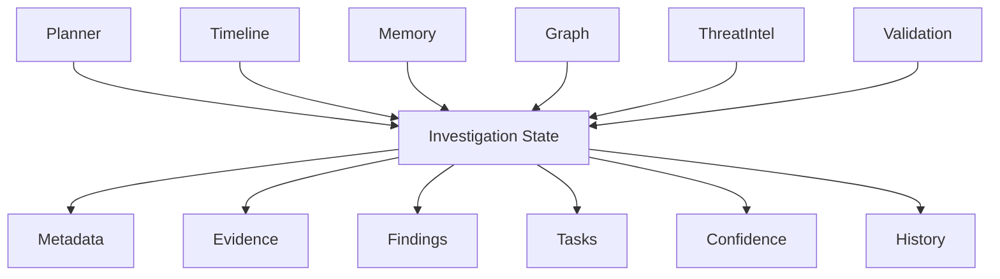
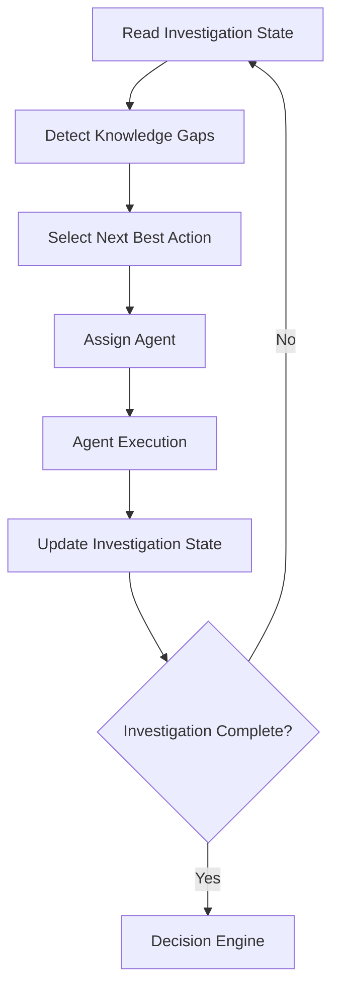
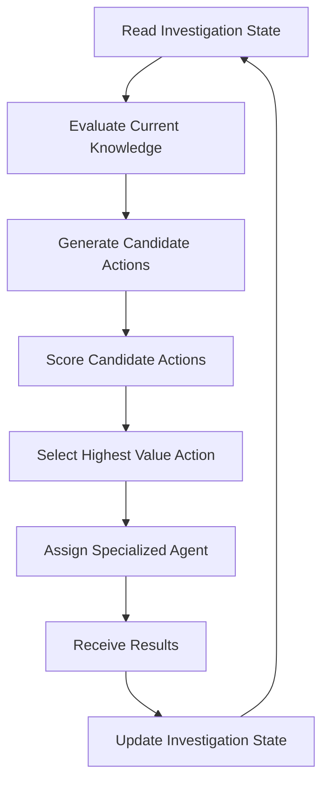

# SentinelAI Planner Agent

> This document defines the responsibilities, decision-making process and operational behavior of the Planner Agent. The Planner serves as the strategic coordinator of every investigation performed within SentinelAI.

---

# 1. Purpose

The Planner Agent is responsible for coordinating investigations.

Unlike specialized agents, the Planner does not perform cybersecurity analysis directly.

Instead, it continuously evaluates the current state of an investigation and determines the most appropriate next action.

The Planner is therefore responsible for guiding investigations rather than solving them.

Its primary objective is to maximize investigation quality while minimizing unnecessary analysis.

---

# 2. Why a Planner?

Cybersecurity investigations are dynamic.

New evidence may appear at any time.

Some investigations require only a few analysis steps.

Others may require dozens.

Executing every possible analysis wastes computational resources and increases investigation latency.

Instead, SentinelAI adopts adaptive planning.

The Planner continuously determines:

- what is already known
- what remains unknown
- what evidence is still required
- which agent should execute next
- when the investigation is complete

Planning is therefore treated as an ongoing reasoning process rather than a fixed execution sequence.

---

# 3. Core Responsibilities

The Planner owns the following responsibilities.

- evaluating investigation progress
- selecting the next analysis step
- assigning tasks to specialized agents
- monitoring investigation confidence
- identifying missing evidence
- preventing unnecessary execution
- deciding when an investigation should terminate

The Planner intentionally avoids performing domain-specific analysis.

Its responsibility is coordination rather than investigation.

---

# 4. Investigation State Model

The Planner makes decisions based on the current state of an investigation.

Rather than relying on conversation history or isolated prompts, the Planner evaluates a structured representation of the investigation.

This representation is referred to as the Investigation State.

The Investigation State acts as the operational memory of an active investigation.

Unlike long-term organizational memory, it only contains information relevant to the current investigation.

---

## Investigation Metadata

General information describing the investigation.

Examples include:

- Investigation Identifier
- Creation Timestamp
- Current Status
- Priority
- Investigation Type
- Assigned Analyst
- Investigation Source

Metadata provides administrative context rather than analytical knowledge.

---

## Investigation Objectives

Every investigation should define one or more explicit objectives.

Examples include:

- determine whether malicious activity exists
- identify affected assets
- reconstruct the attack timeline
- assess investigation confidence
- recommend containment actions

Objectives guide planning decisions throughout the investigation.

The Planner should prioritize actions that contribute directly to achieving these objectives.

---

## Evidence

Evidence represents all information collected during the investigation.

Examples include:

- security events
- alerts
- endpoint information
- user activity
- network traffic
- uploaded files
- threat intelligence references

Evidence should remain immutable throughout the investigation.

New evidence may be added.

Existing evidence should never be modified.

---

## Findings

Findings represent knowledge derived from evidence.

Examples include:

- suspicious behaviors
- attack techniques
- identified entities
- attack paths
- IOC matches
- timeline observations

Unlike evidence, findings are generated through analysis.

---

## Investigation Tasks

The Planner maintains the current execution state.

Examples include:

Completed Tasks

- Timeline Reconstruction
- IOC Enrichment

Pending Tasks

- Graph Analysis
- Memory Retrieval

Skipped Tasks

- Threat Intelligence Correlation

Task tracking enables adaptive planning throughout the investigation.

---

## Confidence

The Investigation State maintains an overall confidence estimate.

Confidence should evolve as additional evidence becomes available.

Confidence should never depend solely on language model output.

Instead, it should reflect:

- evidence quality
- evidence quantity
- agreement between agents
- validation results

Confidence represents investigation maturity rather than model certainty.

---

## Investigation History

Every important planning decision should become part of the investigation history.

Examples include:

- planner decisions
- executed agents
- completed analyses
- generated reports
- analyst feedback
- investigation milestones

Investigation History supports reproducibility and future auditing.

---

# 5. Investigation State

---

# 6. Decision-Making Process

The Planner continuously evaluates the current Investigation State.

Its objective is to determine the next action that provides the greatest investigative value.

Planning decisions should always be evidence-driven.

The Planner should avoid unnecessary analysis whenever sufficient information is already available.

---

## Step 1 — Evaluate Current State

The Planner examines:

- available evidence
- completed tasks
- unresolved questions
- investigation confidence
- analyst feedback

---

## Step 2 — Identify Information Gaps

The Planner determines:

- what is still unknown
- what evidence is missing
- what inconsistencies exist
- which hypotheses require validation

Planning is driven by missing information rather than available tools.

---

## Step 3 — Select Next Action

The Planner selects the investigation step expected to produce the highest value.

Possible actions include:

- assign Timeline Agent
- assign Memory Agent
- assign Graph Analysis Agent
- request additional evidence
- terminate investigation
- escalate to analyst

Only one planning decision should be made at a time.

This single decision is emitted to the Planner Service as a single **Planner Action** for execution.
The Planner Agent issues the next action only after observing the previous action's result (see the
Planner Decision Loop). Multi-step investigations are therefore sequenced by the Planner Agent across
successive actions rather than emitted as a single multi-step execution plan.

The Planner may also intentionally choose to perform no immediate action when additional evidence is expected.

Delaying execution is sometimes preferable to performing low-value analysis.

---

## Step 4 — Observe Results

After execution completes, the Planner evaluates:

- updated findings
- confidence changes
- newly discovered evidence
- execution failures

The investigation state is updated before another planning decision is made.

This iterative process continues until completion criteria are satisfied.

---

# 7. Planner Decision Loop

---

# 8. Task Selection Strategy

The Planner should prioritize investigation actions according to their expected contribution to the investigation.

Not every available action provides the same value.

The objective is to maximize information gain while minimizing unnecessary computation and investigation time.

Task selection should therefore be driven by investigation value rather than execution order.

---

## Prioritization Criteria

The Planner evaluates candidate actions using multiple criteria.

Examples include:

- expected information gain
- investigation impact
- confidence improvement
- evidence availability
- execution cost
- dependency satisfaction

Actions expected to produce the highest overall value should receive higher priority.

---

## Dependency Awareness

Some investigation tasks depend on previous analyses.

Examples include:

Graph Analysis may depend on Timeline Reconstruction.

Threat Intelligence Correlation may depend on IOC extraction.

Validation should generally occur after analytical tasks have completed.

The Planner should avoid assigning tasks whose prerequisites are not yet satisfied.

---

## Avoiding Redundant Analysis

Repeated execution of the same analysis rarely improves investigation quality.

The Planner should recognize:

- completed analyses
- unchanged evidence
- previously failed executions

Redundant execution should be avoided unless new evidence significantly changes the investigation state.

---

## Dynamic Replanning

Planning is not static.

Whenever new evidence becomes available, the Planner should reassess previously selected actions.

The investigation plan should evolve together with the investigation itself.

---

# 9. Task Selection Workflow

---

# 10. Investigation Completion Criteria

The Planner is responsible for determining when an investigation has reached a satisfactory conclusion.

Completion should not depend on executing every available analysis.

Instead, investigations should terminate once sufficient evidence has been collected to support a reliable decision.

---

## Completion Indicators

Possible completion indicators include:

- investigation objectives satisfied
- sufficient supporting evidence collected
- confidence exceeds acceptable threshold
- no unresolved critical questions remain
- no additional high-value analysis is available

Completion should represent analytical sufficiency rather than procedural completion.

Completion should always remain reversible.

If significant new evidence becomes available after completion, the investigation may transition back into an active state.

---

## Early Completion

Some investigations may conclude after only a few analysis steps.

Early completion reduces unnecessary computation while preserving investigation quality.

The Planner should prefer shorter investigations whenever additional analysis is unlikely to improve decision quality.

---

## Escalation Instead of Completion

Investigations should not be forced to completion.

If uncertainty remains high, the Planner may recommend escalation.

Possible escalation reasons include:

- insufficient evidence
- conflicting findings
- unavailable external information
- repeated execution failures

Escalation is considered a successful outcome when reliable conclusions cannot yet be reached.

---

# 11. Planner Evaluation

The quality of the Planner should be evaluated objectively.

Evaluation should focus on investigation effectiveness rather than language generation quality.

---

## Possible Evaluation Metrics

Examples include:

- average investigation duration
- unnecessary agent executions
- investigation completion rate
- confidence calibration
- evidence coverage
- planner latency
- successful task selection
- analyst acceptance rate
- planning accuracy

No single metric should determine planner quality.

Instead, multiple metrics should be evaluated together.

Planning quality should balance efficiency with investigation correctness.

A faster investigation is not necessarily a better investigation if critical evidence is overlooked.

---

## Continuous Improvement

Planner evaluation should support continuous optimization.

Changes to planning strategies should be measurable through repeatable evaluation rather than subjective observations.

Every significant planner improvement should demonstrate measurable benefits before becoming part of the production system.

---

# 12. Failure Recovery

The Planner is responsible for maintaining investigation progress even when individual components fail.

Failures should not immediately terminate an investigation.

Instead, the Planner should evaluate alternative strategies whenever possible.

---

## Recoverable Failures

Examples include:

- temporary model unavailability
- unavailable external services
- incomplete evidence
- timeout during agent execution

Recoverable failures should trigger replanning rather than investigation termination.

---

## Non-Recoverable Failures

Examples include:

- corrupted investigation state
- missing investigation identifier
- invalid investigation context
- unrecoverable workspace errors

These failures should terminate the current planning cycle and notify the analyst.

---

## Recovery Strategies

Possible recovery strategies include:

- retrying the same task
- selecting an alternative agent
- requesting additional evidence
- postponing the task
- escalating to the analyst

Recovery actions should become part of the Investigation History.

---

## Failure Transparency

Planner decisions made during failure recovery should remain observable.

The investigation history should record:

- detected failure
- recovery strategy
- execution outcome
- planner justification

This information improves future debugging and evaluation.

---

# 13. Planner Contract

The Planner follows a well-defined execution contract.

Every implementation should satisfy the following requirements.

---

## Responsibility

Coordinate investigations.

Never perform specialized cybersecurity analysis.

---

## Inputs

The Planner receives:

- Investigation State
- investigation objectives
- analyst feedback
- execution history
- available agent capabilities

---

## Preconditions

Before execution begins, the Planner assumes:

- a valid Investigation State exists
- investigation objectives have been defined
- required agent definitions are available

If these assumptions are violated, planning should fail immediately with a structured explanation.

---

## Outputs

The Planner produces structured planning decisions.

Typical outputs include:

- selected next action
- assigned agent
- execution priority
- completion decision
- escalation decision

Each planning decision is emitted as a single **Planner Action** — the same structure the Planner
Service consumes (see Planner Service §11 "Inputs"). For a service-invocation action this includes
the target backend service, the operation, its inputs, an investigation reference, an action
identifier and optional constraints; alternatively the action is a control action (complete or
escalate). The Planner Agent emits exactly one action per cycle and does not emit a multi-step
execution plan.

Planner outputs should be deterministic whenever possible.

---

## Permissions

The Planner may:

- read the Investigation State
- assign specialized agents
- update investigation tasks
- request additional evidence
- terminate investigations

The Planner may not:

- modify evidence
- generate investigation reports
- alter historical memory
- perform specialized analysis

---

## Success Criteria

The Planner succeeds when it:

- minimizes unnecessary execution
- selects appropriate agents
- improves investigation confidence
- produces reproducible planning decisions
- completes investigations efficiently

---

## Failure Conditions

The Planner should explicitly report situations where planning cannot continue.

Examples include:

- invalid investigation state
- missing required information
- unavailable execution resources
- inconsistent investigation context

Failures should always produce structured explanations.

---

# 14. Planner Design Principles

The Planner is implemented according to the engineering principles established throughout SentinelAI.

| Principle | Planner Application |
|-----------|---------------------|
| Single Responsibility | The Planner coordinates investigations rather than performing analysis. |
| Stateless Execution | The Planner reads and updates Investigation State without maintaining private memory. |
| Explainability | Every planning decision should be explainable. |
| Evidence-Based Reasoning | Planning decisions rely on investigation evidence rather than assumptions. |
| Human-Centered AI | Analysts remain responsible for final operational decisions. |
| Progressive Investigation | Planning evolves as new evidence becomes available. |
| Modularity | Specialized analysis remains delegated to dedicated agents. |
| Observability | Planning decisions are recorded for auditing and debugging. |

---

# Closing Statement

The Planner Agent serves as the strategic coordinator of SentinelAI.

Its responsibility is not to investigate incidents directly, but to guide investigations toward reliable conclusions through structured decision-making.

By separating planning from analysis, SentinelAI achieves greater modularity, explainability and long-term maintainability.

Future improvements to planning algorithms should enhance decision quality without altering the Planner's architectural responsibilities.

The Planner should remain focused on strategic coordination regardless of future advances in AI technologies.

Planning responsibilities should remain stable even if planning algorithms evolve over time.

---

# Version History

| Version | Date | Description |
|----------|------------|--------------------------------|
| 1.0.0 | 2026-06-26 | Initial Planner Agent document created |