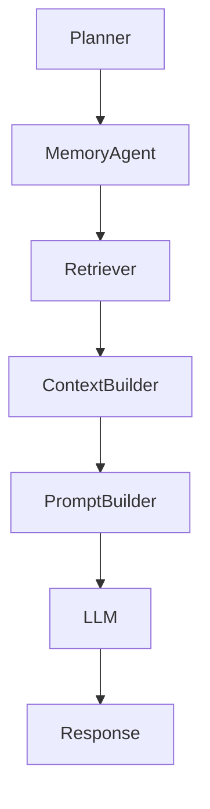
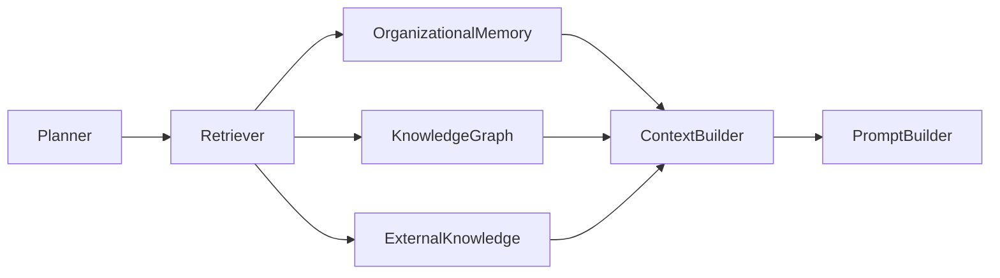
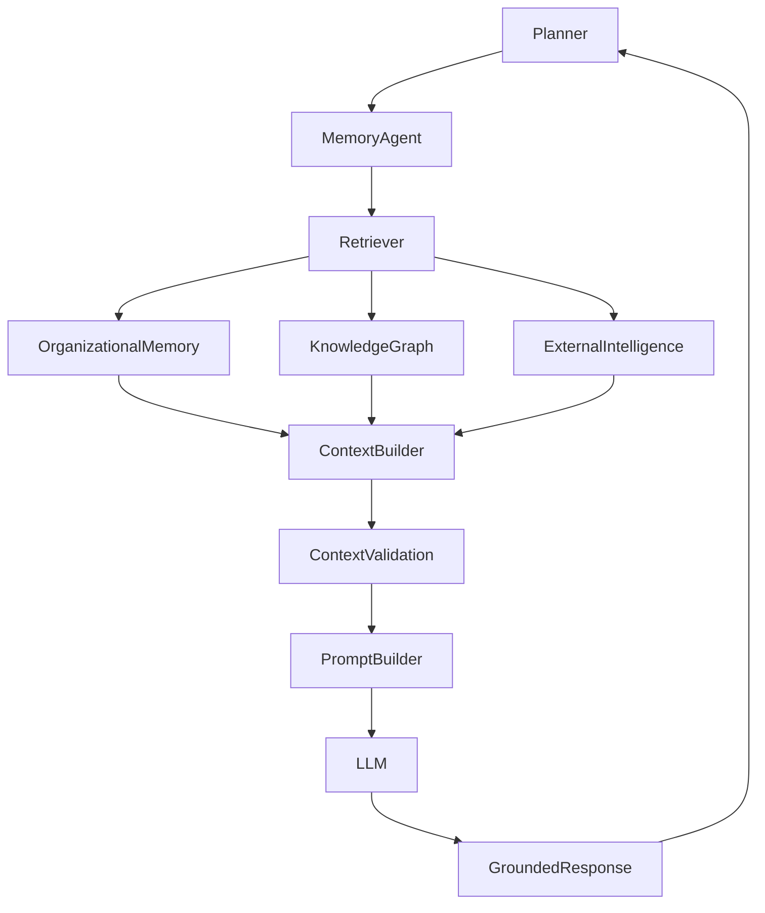

# SentinelAI RAG Architecture

> This document defines how SentinelAI retrieves, assembles and delivers contextual knowledge to Large Language Models. The architecture combines organizational memory, graph reasoning and external cybersecurity knowledge to enable explainable, context-aware AI assistance.

---

# 1. Purpose

Large Language Models should not operate solely on their internal knowledge.

Instead, they should reason over relevant investigation context retrieved from trusted organizational knowledge sources.

The purpose of the RAG Architecture is to provide high-quality contextual information while minimizing hallucinations, irrelevant retrieval and missing investigative knowledge.

---

# 2. Why RAG?

Cybersecurity investigations require organization-specific knowledge that does not exist within foundation models.

Examples include:

- previous investigations
- internal infrastructure
- analyst observations
- organizational playbooks
- historical attack patterns

Retrieval-Augmented Generation enables SentinelAI to incorporate this knowledge dynamically without retraining language models.

---

# 3. Architectural Objectives

The RAG Architecture is designed to achieve the following objectives.

## Context Before Generation

Language models should receive investigation context before producing conclusions.

---

## Evidence-Based Retrieval

Retrieved information should remain traceable to its original source.

---

## Explainability

Every generated response should reference the knowledge supporting it whenever possible.

---

## Modularity

Retrieval components should evolve independently of language models.

---

## Scalability

The retrieval pipeline should support continuously growing organizational knowledge.

---

# 4. High-Level RAG Architecture

---

# 5. Retrieval Pipeline

Retrieval within SentinelAI is a multi-stage process rather than a single database query.

The objective is to assemble the most relevant investigation context from multiple knowledge sources before interacting with a language model.

---

## Step 1 — Receive Investigation Context

The retrieval process begins with contextual information provided by the Planner.

Typical inputs include:

- investigation objectives
- current findings
- identified entities
- investigation state
- analyst requests

The quality of retrieval depends on the quality of the investigation context.

---

## Step 2 — Retrieve Organizational Knowledge

Relevant knowledge is retrieved from internal organizational sources.

Examples include:

- previous investigations
- validated Memory Items
- analyst observations
- organizational playbooks

Only relevant organizational knowledge should be considered.

---

## Step 3 — Retrieve Graph Context

The Knowledge Graph is queried to retrieve relationship-based context.

Examples include:

- neighboring entities
- relationship chains
- historical connections
- attack paths

Graph retrieval complements semantic retrieval rather than replacing it.

---

## Step 4 — Retrieve External Knowledge

External knowledge may enrich investigations when organizational knowledge is insufficient.

Examples include:

- threat intelligence
- MITRE ATT&CK
- CVE databases
- malware intelligence

External knowledge should remain distinguishable from organizational knowledge.

---

## Step 5 — Assemble Context

Retrieved information is normalized into a unified investigation context.

The resulting context should be structured, explainable and optimized for downstream reasoning.

---

# 6. Retrieval Pipeline

---

# 7. Context Engineering

The primary objective of the RAG Architecture is not retrieval.

It is context engineering.

Context engineering transforms retrieved knowledge into structured investigation context suitable for AI reasoning.

---

## Context Assembly

Context Builder combines information retrieved from multiple sources.

Typical inputs include:

- organizational memory
- graph relationships
- investigation state
- external intelligence
- planner objectives

The resulting context should remain coherent and internally consistent.

---

## Context Prioritization

Not all retrieved knowledge should be included.

Priority should consider:

- investigation relevance
- evidence quality
- confidence
- recency
- organizational importance

The objective is to maximize useful context rather than context volume.

---

## Context Compression

Large investigations may exceed language model context limits.

Context Builder should compress information while preserving critical investigative knowledge.

Compression should never remove supporting evidence for important conclusions.

---

## Context Traceability

Every contextual element should preserve its origin.

AI agents should always be able to identify where retrieved knowledge originated.

---

# 8. Context Builder

The Context Builder transforms retrieved information into a structured reasoning package.

Its responsibility is not to retrieve information, but to organize it for downstream AI agents.

---

## Responsibilities

The Context Builder is responsible for:

- merging retrieved knowledge
- removing duplicates
- resolving conflicts
- preserving evidence references
- organizing investigation context
- preserving knowledge provenance

---

## Output Structure

A typical reasoning context may include:

- investigation objective
- current investigation state
- validated findings
- graph observations
- retrieved memory
- external intelligence
- reasoning constraints

The output should remain deterministic whenever possible.

---

## Provenance Preservation

Every contextual element should preserve its origin.

Examples include:

- Memory Item identifier
- Evidence identifier
- Knowledge Graph relationship
- External intelligence source

Provenance enables explainability, auditing and analyst trust.

---

## Design Principle

The quality of AI reasoning depends more on context quality than prompt complexity.

SentinelAI therefore prioritizes context engineering over prompt engineering.

---

## Relationship to Investigation State

The Context Builder (with the Investigation Workspace) is responsible for **assembling** the
Investigation State that the Planner Agent consumes (Planner Agent §4). The Planner Agent never
assembles its own state — it receives an already-assembled Investigation State and only reasons over
it. RAG context assembly and Investigation State assembly are the same assembly responsibility and
must not be duplicated inside the Planner Agent.

---

# 9. Context Validation

Before contextual information is delivered to a language model, it should be validated.

Context validation ensures that retrieved knowledge is relevant, consistent and suitable for downstream reasoning.

Validation reduces hallucinations, contradictory information and unnecessary context expansion.

---

## Validation Criteria

Every context package should be evaluated according to:

- relevance
- evidence quality
- confidence
- consistency
- completeness

Only validated context should proceed to prompt construction.

---

## Conflict Detection

Retrieved knowledge may contain conflicting observations.

Examples include:

- contradictory analyst findings
- inconsistent relationship confidence
- outdated organizational knowledge
- duplicated investigation summaries

Conflicts should remain observable rather than silently discarded.

---

## Missing Context

The retrieval pipeline should detect when investigation context is insufficient.

Rather than generating unsupported conclusions, SentinelAI should request additional retrieval or analyst input whenever necessary.

---

# 10. Prompt Builder

The Prompt Builder transforms validated investigation context into structured prompts suitable for language models.

Prompt construction should preserve investigation intent while minimizing unnecessary token usage.

---

## Responsibilities

The Prompt Builder is responsible for:

- organizing retrieved context
- defining response objectives
- preserving evidence references
- specifying reasoning constraints
- preparing model instructions

---

## Prompt Structure

A prompt may include:

- investigation objective
- current investigation state
- validated findings
- graph observations
- retrieved organizational knowledge
- external intelligence
- response requirements

Prompt structure should remain consistent across investigations.

---

## Model Independence

Prompt construction should remain independent of any specific language model.

Different models may require different prompt formats without changing the retrieval architecture.

---

# 11. Hallucination Mitigation

Reducing hallucinations is a primary objective of the RAG Architecture.

Rather than relying solely on model behavior, SentinelAI minimizes hallucinations through architectural design.

---

## Evidence First

Generated responses should prioritize validated evidence over model assumptions.

---

## Retrieval Before Generation

Language models should reason over retrieved context rather than relying on internal knowledge whenever organizational information is available.

---

## Explicit Uncertainty

When available evidence is insufficient, AI agents should communicate uncertainty instead of fabricating conclusions.

---

## Traceable Responses

Whenever possible, generated responses should preserve references to:

- supporting evidence
- retrieved memory
- graph relationships
- external intelligence

Traceability improves analyst confidence and investigation reliability.

---

# 12. Context Flow

---

# 13. Retrieval Quality

Retrieval quality directly determines reasoning quality.

Improving retrieval should therefore be considered a continuous engineering activity.

---

## Quality Objectives

Retrieval should maximize:

- relevance
- evidence quality
- explainability
- consistency
- investigation usefulness

---

## Retrieval Metrics

Possible quality indicators include:

- retrieval precision
- retrieval recall
- context relevance
- duplicate retrieval rate
- evidence coverage

These metrics enable continuous improvement of retrieval performance.

---

## Continuous Optimization

Retrieval strategies may evolve over time.

Future improvements may include:

- hybrid retrieval
- semantic reranking
- graph-aware retrieval
- adaptive retrieval
- context-aware ranking

Architectural responsibilities should remain stable despite retrieval improvements.

---

## Continuous Evaluation

Retrieval quality should be evaluated continuously using representative investigation scenarios.

Evaluation should include both quantitative metrics and qualitative analyst feedback.

Continuous evaluation enables long-term improvement of retrieval performance.

---

# 14. Memory Agent Integration

The Memory Agent orchestrates the retrieval process on behalf of the Planner.

Rather than retrieving information directly, the Planner delegates contextual knowledge acquisition to the Memory Agent.

The Memory Agent determines which knowledge sources should participate in retrieval.

---

## Responsibilities

The Memory Agent is responsible for:

- selecting appropriate retrieval strategies
- coordinating multiple knowledge sources
- eliminating redundant retrieval
- preserving evidence traceability
- delivering structured context to the Context Builder

---

## Knowledge Sources

The Memory Agent may retrieve information from:

- Organizational Memory
- Knowledge Graph
- Investigation State
- External Threat Intelligence
- Organizational Documentation

Each source contributes different types of knowledge.

---

## Adaptive Retrieval

Retrieval strategies should adapt to investigation requirements.

Simple investigations may require only organizational memory.

Complex investigations may require graph reasoning and external intelligence simultaneously.

The Planner defines the investigation objective.

The Memory Agent determines the appropriate retrieval strategy.

---

# 15. Retrieval Strategy

Different investigations require different retrieval strategies.

SentinelAI therefore avoids using a fixed retrieval pipeline.

---

## Semantic Retrieval

Suitable for:

- previous investigations
- analyst notes
- documentation
- organizational memory

---

## Graph Retrieval

Suitable for:

- relationship discovery
- attack path analysis
- infrastructure exploration
- neighboring entities

---

## Structured Retrieval

Suitable for:

- investigation identifiers
- IOC lookups
- asset inventories
- configuration information

---

## External Retrieval

Suitable for:

- CVEs
- MITRE ATT&CK
- malware intelligence
- threat feeds

---

## Hybrid Retrieval

Multiple retrieval strategies may execute together.

Hybrid retrieval should maximize investigation value while minimizing unnecessary context.

---

## Strategy Selection

The Memory Agent should select retrieval strategies according to the investigation context.

Selection may consider:

- investigation objectives
- entity types
- available evidence
- investigation complexity
- planner constraints

Retrieval strategies should remain adaptive rather than rule-based whenever possible.

---

# 16. Context Budget

Language models have finite context windows.

Context should therefore be treated as a limited engineering resource.

The objective is not to maximize retrieved information, but to maximize useful information.

---

## Prioritization

Higher priority should be assigned to:

- validated findings
- investigation objectives
- high-confidence relationships
- critical evidence
- planner requests

---

## Compression

Lower-priority information may be summarized when necessary.

Compression should preserve:

- investigation integrity
- evidence traceability
- important relationships

---

## Budget Allocation

Context capacity should be distributed across multiple knowledge categories.

Examples include:

- Investigation State
- Organizational Memory
- Graph Context
- External Intelligence
- Planner Instructions

No single category should dominate the entire context window.

---

## Dynamic Allocation

Context allocation may change during an investigation.

As investigations evolve, different knowledge sources may become more valuable.

Context allocation decisions should remain explainable.

Analysts should understand why certain information was included or excluded from the final context package.

---

# 17. Response Grounding

Generated responses should remain grounded in retrieved investigation knowledge.

Grounding ensures that language model outputs remain connected to observable evidence.

---

## Grounding Sources

Responses may reference:

- Evidence
- Findings
- Organizational Memory
- Graph Relationships
- External Intelligence

Grounding sources should remain distinguishable.

Analysts should always know whether information originated from:

- organizational knowledge
- external intelligence
- graph reasoning
- current investigation evidence

---

## Grounding Principles

Responses should:

- distinguish facts from hypotheses
- preserve uncertainty
- reference supporting evidence
- avoid unsupported assumptions

---

## Explainable Responses

Whenever possible, generated responses should expose:

- retrieved sources
- reasoning context
- supporting evidence
- confidence information

Explainability improves analyst trust and facilitates investigation review.

---

# 18. End-to-End RAG Pipeline

---

# 19. Architectural Boundaries

The RAG Architecture intentionally limits its responsibilities.

Maintaining clear architectural boundaries improves modularity, explainability and long-term maintainability.

---

## RAG Is Not Organizational Memory

Organizational Memory stores validated organizational knowledge.

The RAG Architecture retrieves and assembles knowledge when required.

Knowledge ownership remains outside the retrieval pipeline.

---

## RAG Is Not Organizational Truth

Retrieved information represents contextual knowledge rather than absolute truth.

Final investigation conclusions remain the responsibility of analysts and investigation workflows.

---

## RAG Is Not the Knowledge Graph

The Knowledge Graph represents entities and relationships.

The RAG Architecture consumes graph knowledge as one of several retrieval sources.

Graph modeling remains independent of retrieval.

---

## RAG Is Not the Planner

The Planner determines investigation objectives.

The RAG Architecture provides contextual knowledge that supports those objectives.

Decision-making remains outside the retrieval pipeline.

---

## RAG Is Not a Search Engine

The objective of retrieval is not simply to return matching documents.

The objective is to assemble investigation context that improves reasoning quality.

---

## RAG Is Not the Language Model

Language models generate responses.

The RAG Architecture provides trustworthy context before generation occurs.

Retrieval and generation remain separate architectural concerns.

---

# 20. RAG Contract

The RAG Architecture exposes a consistent retrieval capability to the rest of SentinelAI.

Every retrieval request should follow a well-defined contract.

---

## Responsibility

Provide trustworthy investigation context for downstream AI reasoning.

The RAG Architecture retrieves, validates and organizes knowledge.

It does not perform investigation planning or final decision-making.

---

## Inputs

The RAG pipeline may receive:

- investigation objectives
- investigation state
- identified entities
- planner requests
- analyst requests
- retrieval constraints

---

## Outputs

The RAG pipeline produces:

- validated context
- retrieved knowledge
- graph observations
- evidence references
- retrieval metadata
- reasoning constraints
- retrieval provenance

The output should be optimized for downstream language models.

The RAG pipeline should expose sufficient metadata describing how contextual knowledge was assembled.

Retrieval provenance improves transparency and debugging.

---

## Success Criteria

Successful retrieval should:

- maximize context relevance
- preserve evidence traceability
- minimize hallucination risk
- support explainable reasoning
- respect context budget limitations

---

## Failure Conditions

Examples include:

- insufficient investigation context
- unavailable knowledge sources
- conflicting retrieved knowledge
- retrieval timeout

Failures should remain observable and explicitly reported.

---

# 21. Design Principles Applied

The RAG Architecture follows the engineering principles established throughout SentinelAI.

| Principle | RAG Application |
|-----------|-----------------|
| Context Before Generation | Retrieval quality is prioritized over prompt complexity. |
| Evidence-Based AI | Retrieved knowledge remains traceable to supporting evidence. |
| Explainability | Responses preserve reasoning context and supporting knowledge. |
| Separation of Responsibilities | Retrieval, context construction and generation remain independent. |
| Modularity | Retrieval sources evolve independently of language models. |
| Scalability | The retrieval pipeline supports continuously growing organizational knowledge. |
| Human-Centered AI | AI assists analysts by providing grounded investigation context. |
| Architecture Before Framework | The retrieval pipeline is defined independently of vector databases, embedding models or LLM providers. |

---

# Closing Statement

The RAG Architecture enables SentinelAI to deliver trustworthy and context-aware AI assistance through structured retrieval rather than isolated language model generation.

By combining organizational memory, graph reasoning and external cybersecurity intelligence, the platform provides explainable investigation context while reducing hallucinations and preserving evidence traceability.

Future implementations may introduce new retrieval techniques, embedding models and language models.

However, the architectural responsibilities defined in this document should remain stable regardless of implementation technologies.

The success of the RAG Architecture depends not on retrieving the largest amount of information, but on delivering the most relevant, trustworthy and explainable context for every investigation.

---

# Version History

| Version | Date | Description |
|----------|------------|--------------------------------|
| 1.0.0 | 2026-06-26 | Initial RAG Architecture document created |