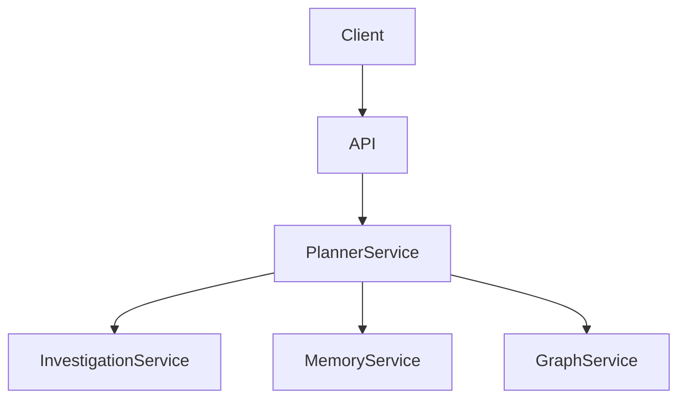
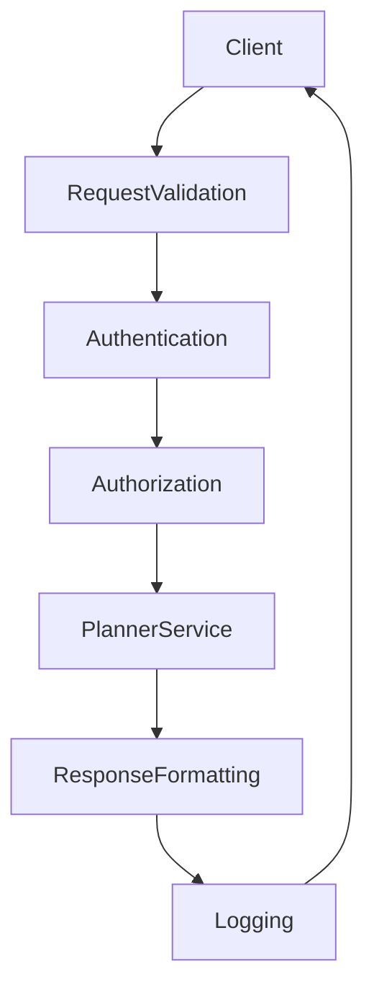

# SentinelAI API Design

> This document defines the external API architecture of SentinelAI. The API provides a secure and technology-independent interface between client applications and backend services.

---

# 1. Purpose

The SentinelAI API exposes backend capabilities to external clients.

Rather than embedding business logic within HTTP endpoints, the API delegates all business operations to dedicated backend services.

The API serves as the external communication layer of the platform.

Its primary objective is providing secure, consistent and maintainable access to backend functionality.

---

# 2. Responsibilities

The API is responsible for:

- receiving client requests
- validating requests
- authenticating clients
- invoking backend services
- formatting responses
- exposing API documentation

The API exposes backend capabilities.

It does not implement business logic.

---

# 3. High-Level Architecture

---

# 4. API Boundaries

The API intentionally limits its responsibilities.

Business rules remain within backend services.

---

## The API Is Responsible For

- request validation
- authentication
- authorization
- response formatting
- error translation

---

## The API Is Not Responsible For

- workflow orchestration
- investigation management
- graph processing
- memory management
- AI reasoning

These responsibilities belong to backend services.

---

# 5. API Philosophy

The SentinelAI API follows a thin-controller architecture.

HTTP endpoints should remain lightweight.

Business decisions should always be delegated to backend services.

The API represents an application boundary rather than an implementation boundary.

Clients interact with stable business capabilities rather than backend implementation details.

---

## API Versioning

The SentinelAI API should expose explicit version identifiers.

Versioning enables backward compatibility while allowing the API to evolve over time.

Breaking changes should result in a new API version.

Non-breaking improvements should preserve existing API contracts.

---

## Design Principles

The API should be:

- predictable
- stateless
- versioned
- observable
- technology-independent

---

## Separation of Responsibilities

Controllers should:

- validate requests
- invoke backend services
- return standardized responses

Controllers should never directly access databases.

---

# 6. Request Lifecycle

Every API request follows a consistent processing pipeline.

The API should remain responsible for communication concerns while delegating business operations to backend services.

---

# 7. Service Delegation

The API delegates business operations to backend services.

Business logic should never execute inside controllers.

---

## Planner Service

The API delegates workflow execution to the Planner Service.

---

## Investigation Service

The API delegates investigation lifecycle operations to the Investigation Service.

---

## Memory Service

The API delegates memory operations to the Memory Service.

---

## Graph Service

The API delegates graph operations to the Graph Service.

Delegation should preserve service ownership boundaries.

---

# 8. API Resources

The API exposes resources representing SentinelAI business objects.

Resources should remain stable regardless of backend implementation.

---

## Investigation Resource

Represents investigation lifecycle management.

---

## Evidence Resource

Represents investigation evidence.

---

## Finding Resource

Represents investigation findings.

---

## Memory Resource

Represents organizational knowledge.

---

## Graph Resource

Represents graph-based investigation data.

---

## Workflow Resource

Represents workflow execution initiated by the Planner Service.

---

## Resource Ownership

Each API resource should map to exactly one backend service.

The API should never combine ownership across multiple services.

Cross-service coordination remains the responsibility of the Planner Service.

---

# 9. Response Model

Every API response should follow a consistent structure.

Responses should remain predictable regardless of endpoint.

---

## Successful Responses

Successful responses should include:

- requested resource
- response metadata
- execution status
- request identifier
- correlation identifier

Correlation identifiers enable distributed tracing across backend services.

They improve observability and debugging.

---

## Error Responses

Error responses should include:

- error code
- error message
- request identifier

Internal implementation details should never be exposed.

---

## Metadata

Response metadata may include:

- timestamp
- API version
- processing duration

Metadata improves observability and debugging.

---

# 10. Request Validation

Every incoming request should be validated before backend execution.

Validation failures should prevent unnecessary service invocation.

---

## Structural Validation

Validation includes:

- required fields
- supported request schema
- data types

---

## Business Validation

Business validation remains the responsibility of backend services.

The API validates structure rather than business rules.

---

## Security Validation

Validation includes:

- authentication status
- authorization rules
- request integrity

Invalid requests should return standardized error responses.

---

## Traffic Validation

Traffic validation may include:

- rate limiting
- request throttling
- abuse detection

Traffic protection preserves backend availability.

---

# 11. Error Handling

The API should expose consistent and predictable error behavior.

Errors should help clients understand failures without revealing internal implementation details.

---

## Client Errors

Examples include:

- invalid request
- malformed payload
- unsupported operation
- unauthorized access

Client errors should return standardized error responses.

---

## Backend Errors

Backend service failures should be translated into API-level responses.

Internal service details should never be exposed.

Backend service errors should be translated into consistent API error models.

Different backend services should never expose different error formats.

---

## Unexpected Errors

Unexpected failures should:

- generate diagnostic logs
- return generic error responses
- preserve request identifiers

Unexpected failures should remain observable for debugging.

---

# 12. Authentication and Authorization

The API validates client identity before backend execution.

Authorization determines whether authenticated clients may perform specific operations.

---

## Authentication

Authentication verifies client identity.

Only authenticated requests may access protected endpoints.

Authentication mechanisms should remain replaceable without affecting API contracts.

---

## Authorization

Authorization verifies permissions.

Permissions should be evaluated before backend service invocation.

Authorization decisions should remain independent of transport protocols and API endpoint implementations.

---

## Access Control

Access policies should remain centralized.

Authorization rules should remain independent of individual API endpoints.

---

# 13. Performance Considerations

The API should minimize communication overhead while preserving correctness.

---

## Stateless Requests

Every request should remain self-contained.

API servers should not depend on local request state.

---

## Response Size

Responses should include only necessary information.

Unnecessary payload increases latency.

---

## Pagination

Large collections should support pagination.

Pagination improves scalability and response consistency.

---

## Rate Limiting

The API may apply request limits to protect backend services.

Rate limiting should remain configurable.

---

## Response Caching

Cacheable responses may be reused when business consistency permits.

Caching policies should remain configurable.

Cached responses should never violate data consistency.

---

# 14. API Contract Stability

Public API contracts should remain stable whenever possible.

Internal backend evolution should not require unnecessary client changes.

Stable contracts reduce integration cost and improve long-term maintainability.

---

# 15. Future Evolution

Future API capabilities may include:

- GraphQL support
- gRPC interfaces
- streaming responses
- webhook integration
- asynchronous APIs
- API gateway integration

Future capabilities should extend communication mechanisms without changing backend service responsibilities.

---

# 16. Design Principles Applied

The API follows the engineering principles established throughout SentinelAI.

| Principle | API Application |
|-----------|-----------------|
| Separation of Responsibilities | Business logic remains within backend services. |
| Single Source of Truth | Backend services remain authoritative for business data. |
| Explainability | Responses preserve request identifiers and execution metadata. |
| Technology Independence | API behavior remains independent of HTTP frameworks. |
| Scalability | Stateless communication enables horizontal scaling. |
| Modularity | API responsibilities remain isolated from backend implementation. |
| Architecture Before Framework | API contracts are defined before implementation technologies. |

---

# Closing Statement

The SentinelAI API provides a stable and maintainable communication layer between client applications and backend services.

By limiting API responsibilities to communication, validation and delegation, the platform preserves clean architectural boundaries while supporting secure and scalable interaction.

Future implementations may adopt different communication technologies.

However, the architectural responsibilities defined in this document should remain stable regardless of implementation details.

---

# Version History

| Version | Date | Description |
|----------|------------|--------------------------------|
| 1.0.0 | 2026-06-26 | Initial API Design specification created |