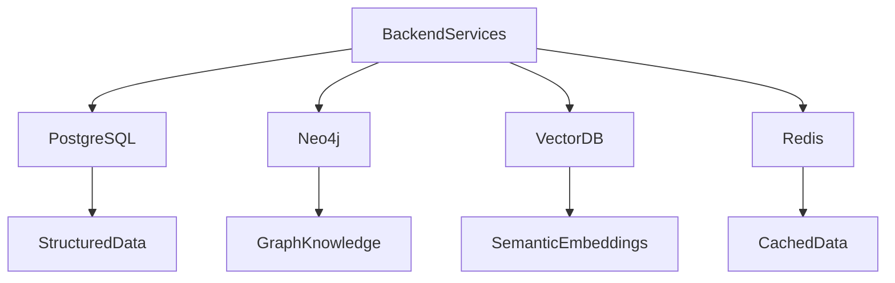
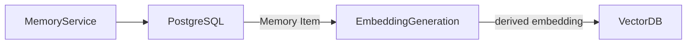
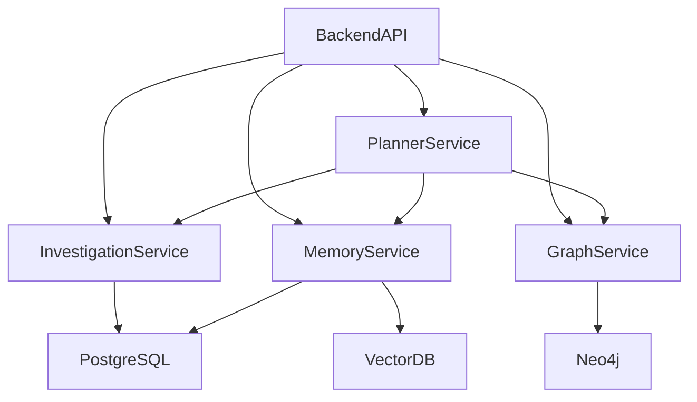

# SentinelAI Database Architecture

> This document defines the data storage architecture of SentinelAI. It explains how structured data, graph data and semantic knowledge are stored, synchronized and accessed throughout the platform.

---

# 1. Purpose

SentinelAI manages multiple categories of information with different storage requirements.

No single database technology is suitable for every workload.

The purpose of this architecture is to assign each type of data to the storage technology that best supports its operational characteristics.

The architecture prioritizes scalability, maintainability and clear separation of responsibilities.

---

# 2. Architectural Decision

SentinelAI adopts a polyglot persistence architecture.

Different database technologies are used according to their strengths rather than forcing every workload into a single storage engine.

The platform currently consists of:

### Primary Storage Technologies

- PostgreSQL
- Neo4j
- Vector Database

### Supporting Persistence Technologies

- Redis (Caching) — governed by ADR-011

Primary storage technologies own domain data.

Supporting persistence technologies improve performance and operational efficiency without becoming authoritative sources of business data.
Each database has a clearly defined responsibility.

No database should duplicate the responsibilities of another.

---

# 3. Why Multiple Databases?

Cybersecurity investigations involve multiple categories of data.

These categories exhibit fundamentally different access patterns.

Examples include:

- structured investigation records
- graph relationships
- semantic organizational knowledge

Optimizing all workloads using a single database would increase architectural complexity while reducing performance.

SentinelAI therefore separates workloads according to their data characteristics.

---

# 4. High-Level Data Architecture

---

# 5. Storage Layers

The SentinelAI data architecture consists of three complementary storage layers.

Each layer is optimized for a different category of information.

No storage layer should attempt to replace another.

---

## Structured Storage

Structured storage manages transactional investigation data.

Characteristics include:

- strong consistency
- relational integrity
- transactional updates
- auditability

Structured storage is implemented using PostgreSQL.

---

## Graph Storage

Graph storage manages entities and relationships.

Characteristics include:

- graph traversal
- relationship discovery
- attack path analysis
- neighborhood exploration

Graph storage is implemented using Neo4j.

---

## Semantic Storage

Semantic storage manages knowledge retrieved through semantic similarity.

Characteristics include:

- vector embeddings
- semantic retrieval
- organizational memory
- retrieval augmentation

Semantic storage is implemented using a vector database.

---

## Caching Layer

The caching layer provides temporary storage for performance optimization.

Characteristics include:

- low-latency access
- transient data
- derived representations
- temporary operational state

The caching layer is implemented using Redis.

Cached data should never become the authoritative source of business information.

The caching layer may be reconstructed entirely from authoritative storage whenever necessary.

---

# 6. Data Ownership

Every domain object should have a clearly defined primary storage location.

This prevents duplicated ownership and inconsistent updates.

| Domain Object | Primary Storage |
| ------------- | --------------- |
| Investigation | PostgreSQL      |
| Evidence      | PostgreSQL      |
| Finding       | PostgreSQL      |
| Task          | PostgreSQL      |
| Report        | PostgreSQL      |
| Entity        | Neo4j           |
| Relationship  | Neo4j           |
| Memory Item   | PostgreSQL      |

The primary storage location owns the lifecycle of each object.

The **Planner Service is stateless** and owns no storage: it persists no workflow or execution
state. Planner execution plans and Planner Actions are transient application-layer structures and do
not appear in this ownership model. (The owning service for the `Task` domain object is defined by
the Investigation domain rather than by the Planner Service.)

---

# 7. Data Synchronization

Although SentinelAI uses multiple databases, every domain object has a single source of truth.

Synchronization exists **only for derived representations**: secondary copies generated from an authoritative object and optimized for a specific workload.

Authoritative stores are never synchronization targets for the objects they own. Neo4j is the authoritative store for Entities and Relationships — graph objects are written to Neo4j directly by the Graph Service, not synchronized into it from another store.

The only derived representation defined by the current architecture is the **embedding**: Memory Item embeddings are generated from the authoritative Memory Item (PostgreSQL) and synchronized to the Vector Database.

---

## Synchronization Ownership

There is no standalone synchronization component.

Synchronization of a derived representation is owned by the **backend service that owns the authoritative object** (per ADR-004). The Memory Service therefore owns embedding generation and Vector Database synchronization (see the Memory Service specification).

Future derived representations must name their owning service when they are introduced; an ownerless synchronization process is not permitted.

---

## Synchronization Mechanism (ADR-012)

Propagation follows the **transactional outbox** pattern (ADR-012):

- The authoritative change and the intent to derive are recorded in the same local transaction (the outbox, inside the authoritative store).
- Asynchronous, **idempotent projectors** — owned by the owning service — consume the outbox and produce the derived representation.
- **No request path writes to more than one store**; the authoritative write commits and propagation is always asynchronous (constraint AC-14, Architecture Testing catalogue).
- Distributed transactions and saga compensation are rejected for derived data: derived copies are reproducible, so eventual re-projection is sufficient.

---

## Synchronization Principles

The synchronization process should satisfy the following principles:

- single ownership
- eventual consistency
- traceability
- deterministic updates

No synchronization process should modify the authoritative source directly.

Synchronization should be idempotent.

Repeated synchronization attempts should always produce the same resulting state.

---

## Synchronization Flow

Typical synchronization occurs as follows:

1. A domain object is created or updated in its primary storage.
2. Relevant changes are detected by the owning service.
3. Derived representations are generated.
4. The derived storage layer is updated.
5. Synchronization status is recorded.

Synchronization should remain observable throughout its lifecycle.

---

# 8. Synchronization Pipeline

Neo4j does not appear in this pipeline: graph objects are authoritative in Neo4j and are written there directly by their owning service.

---

# 8a. Cross-Store References

Domain objects reference objects owned by other stores — for example, a Finding (PostgreSQL) references Entities (Neo4j).

The architecture fixes the following rules for such references:

- **Identifiers are the only cross-store reference mechanism.** Objects are referenced by their stable, typed identifiers; no database-level foreign keys, links or replicas exist across stores.
- **The referencing service validates through the owning service.** When referential existence matters to a business operation, the service that owns the referencing object verifies the reference through the owning service's interface — never by querying the other store directly.
- **Eventual consistency applies across stores.** Cross-store references may be temporarily unresolvable during synchronization or failure windows.
- **Dangling references must remain observable.** A reference that no longer resolves is reported explicitly by the owning service on access; it is never silently dropped, repaired or fabricated.

At end-of-life this rule is realized by **tombstoning** (data-lifecycle.md §4, ADR-017): an erased object is replaced by an explicit erasure marker preserving only non-personal correlation structure (identifiers, timestamps, and the owner/tenant scope keys), so a reference to it resolves to an explicit "erased" state — distinguishable from "never existed", never silently repaired.

---

# 8b. Evidence Payload Storage

Evidence has two representations with different storage characteristics:

- **Evidence record** (metadata + normalized content): owned by PostgreSQL through the Investigation Service, as defined by the ownership model above.
- **Raw evidence payload** (uploaded files, raw log archives): large, immutable, integrity-critical binary/text content. Its designated home is a **content-addressed object store** — a storage technology that entered through the category model of ADR-011 with its own decision: **ADR-015 / RFC-001** (application-owned `sha256:` addressing, Investigation-Service-mediated access, filesystem adapter as the dev-grade first realization; S3-compatible store deferred to production hardening).

Until the object store exists, evidence content is carried inline in the Evidence record; this is an accepted interim state, not the target architecture. The rules below are fixed now so the Postgres adapter is not built against the wrong assumption:

- The Evidence record references its payload by content address (integrity hash); the hash is also the verifiable integrity anchor (Domain Rule 1/9).
- Payloads are immutable and never mutated in place; corrections are new evidence.
- Payload storage ownership follows evidence ownership: access is mediated by the Investigation Service.

**Payload end-of-life** (data-lifecycle.md §4, ADR-017): immutability governs modification, not end-of-life. The payload store's designated erasure strategy is **crypto-shredding** for the immutable production object store; the dev-grade filesystem adapter erases by physical deletion. The `EvidencePayloadStore` port gains an erase operation, and an erased investigation's payload bytes are physically erased through the ADR-012 outbox as an erasure projection (realized in ES-065).

---

# 9. Data Ownership Rules

Every domain object has exactly one authoritative owner.

Ownership determines which storage layer is allowed to modify the object.

---

## PostgreSQL Owns

- Investigation
- Evidence
- Finding
- Task
- Report

Only PostgreSQL may modify these objects.

---

## Neo4j Owns

- Entity
- Relationship

Graph updates should preserve graph integrity and entity identity.

---

## Vector Database Stores

- Embeddings
- Semantic Indexes

The Vector Database stores vector representations of Memory Items.

It should not own the Memory Item lifecycle.

Embeddings are synchronized from the authoritative storage.

---

# 10. Performance Considerations

Each storage layer is optimized for different query patterns.

Selecting the appropriate storage layer improves overall system performance.

---

## Redis Responsibilities

Redis is a supporting persistence technology used exclusively for caching and temporary operational data.

Redis does not participate in authoritative data ownership.

Its responsibilities include:

- reducing repeated database access
- improving query performance
- temporarily storing derived data
- supporting short-lived operational state

Redis should never become the primary source of business information.

All cached information must be reproducible from the authoritative storage layers.

---

## Cache Ownership

Redis does not own any domain object.

Cache ownership always remains with the authoritative storage layer.

Cached representations are implementation optimizations rather than independent data models.

Removing all cached data should not affect business correctness.

---

## Cache Lifetime

Cached data should remain temporary.

Applications should tolerate cache expiration at any time.

Cache lifetime policies should be determined by the owning backend service according to workload characteristics.

This architecture intentionally does not prescribe global cache expiration policies.

---

## Cache Failure Strategy

Redis availability should never determine overall system availability.

If Redis becomes unavailable:

- backend services should continue operating
- requests should fall back to authoritative storage
- business correctness should be preserved
- performance degradation is acceptable

Cache failures should be treated as operational events rather than data integrity failures.

---

## PostgreSQL

Optimized for:

- transactional updates
- filtering
- aggregation
- consistency

---

## Neo4j

Optimized for:

- graph traversal
- shortest paths
- relationship discovery
- neighborhood exploration

Graph traversal depth should remain configurable to balance investigation quality and query performance.

---

## Vector Database

Optimized for:

- similarity search
- semantic retrieval
- nearest-neighbor search
- embedding lookup

Queries should execute within the storage layer best suited for the requested workload.

---

# 11. Technology Independence

The architectural responsibilities defined in this document are independent of specific database products.

Current implementation choices include:

- PostgreSQL
- Neo4j
- Qdrant (or another compatible vector database)

These technologies may change over time.

However, the responsibilities assigned to each storage layer should remain stable.

Changing implementation technology should not require redesigning the overall architecture.

---

# 12. Alternatives Considered

Several storage architectures were considered during the design process.

---

## Single Relational Database

Advantages:

- simpler deployment
- fewer operational components

Disadvantages:

- poor graph traversal performance
- limited semantic retrieval capabilities

This approach was rejected.

---

## Graph Database Only

Advantages:

- powerful relationship analysis

Disadvantages:

- inefficient transactional workloads
- limited structured querying

This approach was rejected.

---

## Vector Database Only

Advantages:

- excellent semantic retrieval

Disadvantages:

- lacks transactional guarantees
- cannot efficiently represent graph structures

This approach was rejected.

---

## Polyglot Persistence

Advantages:

- each workload uses the most suitable storage technology
- scalable architecture
- clear separation of responsibilities

This approach was selected.

---

## Document Database

Advantages:

- flexible schema
- simple object storage

Disadvantages:

- weak relationship analysis
- limited transactional capabilities
- inefficient graph traversal

This approach was rejected.

---

# 13. Data Access Principles

Backend services should access data through clearly defined ownership boundaries.

Services should avoid directly manipulating data owned by other storage layers.

This approach preserves consistency and simplifies long-term maintenance.

---

## Read Access

Services may read data from multiple storage layers when required.

Read operations should remain optimized for investigation workflows.

---

## Write Access

Write operations should always target the authoritative storage layer.

Derived storage layers should be updated through synchronization rather than direct modification.

Services should never bypass ownership rules by writing directly to secondary storage layers.

Redis is not an authoritative storage layer.

Backend services may populate or invalidate cached data as needed.

Cache updates should never replace writes to the authoritative storage.

---

## Cross-Storage Queries

Complex investigations may require combining information from multiple storage layers.

Such aggregation should occur within backend services rather than inside individual databases.

Databases should remain responsible for storage rather than orchestration.

---

# 14. Data Access Architecture

---

# 15. Transaction Strategy

Transactional consistency should be guaranteed within the authoritative storage layer.

Synchronization across storage layers should use eventual consistency.

---

## Local Transactions

Operations affecting a single storage layer should complete atomically whenever possible.

---

## Distributed Updates

Operations affecting multiple storage layers should avoid distributed transactions.

Instead, synchronization should occur asynchronously.

Redis does not participate in transactional consistency.

Cache population and invalidation should remain independent of transactional guarantees.

Temporary cache inconsistencies are acceptable provided that authoritative storage remains correct.

---

## Failure Recovery

Synchronization failures should never corrupt authoritative data.

Recovery mechanisms should support retry, validation and monitoring.

Eventual consistency is preferred over tightly coupled distributed transactions.

---

# 16. Scalability Considerations

The storage architecture should support increasing investigation volume without requiring architectural redesign.

Scalability should primarily be achieved through independent evolution of each storage layer.

---

## PostgreSQL

Scaling strategies may include:

- indexing
- partitioning
- read replicas

---

## Neo4j

Scaling strategies may include:

- graph indexing
- clustering
- optimized graph traversal

---

## Vector Database

Scaling strategies may include:

- distributed indexing
- embedding sharding
- approximate nearest-neighbor search

Each storage layer should scale independently according to workload characteristics.

---

# 17. Future Evolution

The storage architecture is expected to evolve as SentinelAI grows.

Future improvements may include:

- event-driven synchronization
- streaming pipelines
- distributed storage
- graph analytics
- multiple vector indexes
- cloud-native database services

Future technologies should integrate without changing architectural responsibilities.

The architecture should remain implementation-independent.

Future evolution should prioritize architectural stability over technology replacement.

Implementation technologies may change.

Data ownership responsibilities should remain stable.

---

# 18. Design Principles Applied

The Database Architecture follows the engineering principles established throughout SentinelAI.

| Principle | Database Application |
|-----------|----------------------|
| Single Source of Truth | Every domain object has one authoritative storage location. |
| Separation of Responsibilities | Each database serves a distinct purpose. |
| Scalability | Storage layers evolve independently according to workload. |
| Technology Independence | Responsibilities remain stable regardless of database products. |
| Explainability | Data ownership and synchronization remain observable. |
| Modularity | Backend services interact with storage through well-defined boundaries. |
| Architecture Before Framework | Storage architecture is defined before implementation technologies. |

---

# Closing Statement

The Database Architecture provides the persistence foundation of SentinelAI.

By assigning each category of data to the storage technology best suited for its workload, the platform achieves scalability, maintainability and clear separation of responsibilities.

Future implementations may introduce new database technologies or synchronization mechanisms.

However, the ownership model and architectural boundaries defined in this document should remain stable regardless of implementation details.

Supporting persistence technologies such as Redis may evolve independently from the primary storage technologies.

However, supporting technologies should never become authoritative sources of business data or violate the ownership principles defined by this architecture.

---

# Version History

| Version | Date | Description |
|----------|------------|--------------------------------|
| 1.0.0 | 2026-06-26 | Initial Database Architecture specification created |
| 1.1.0 | 2026-07-03 | Synchronization scoped to derived representations with named service ownership (undefined "SyncService" removed; Neo4j no longer shown as a sync target); cross-store reference rules added (§8a); Redis governed by ADR-011 |
| 1.2.0 | 2026-07-03 | Synchronization mechanism fixed as transactional outbox + idempotent projection (ADR-012, AC-14 no-dual-write); Evidence Payload Storage defined (§8b): content-addressed object store as the designated payload home, inline content as accepted interim state |
| 1.3.0 | 2026-07-17 | Evidence payload store admitted (§8b realized): ADR-015/RFC-001 — content-addressed store as primary storage for raw payload bytes, application-owned addressing, Investigation-Service-mediated access |
| 1.4.0 | 2026-07-23 | End-of-life realization notes (RFC-003/ADR-017, Milestone F): §8a cross-store references realized by tombstoning at erasure; §8b payload end-of-life strategy (crypto-shredding for the production object store, physical deletion for the dev filesystem adapter; erase via the ADR-012 outbox projection) |