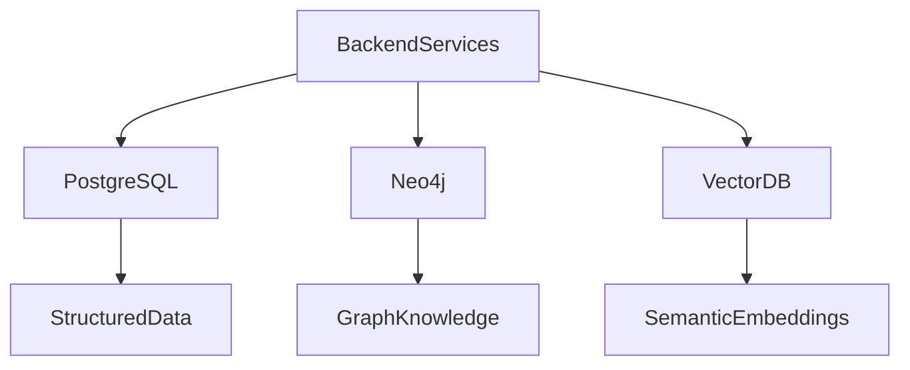
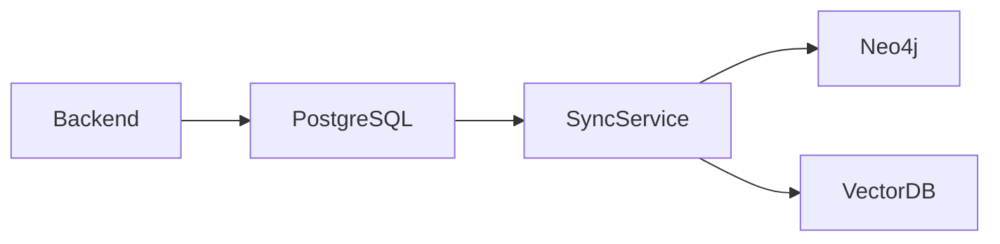
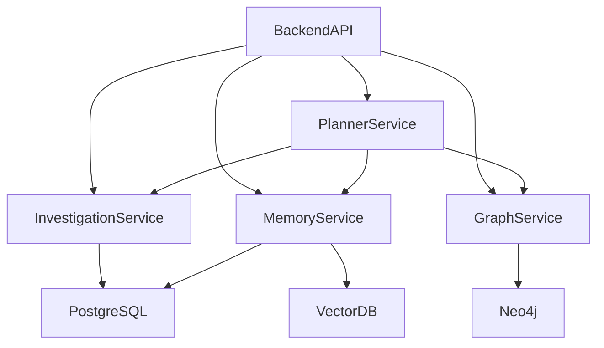

# SentinelAI Database Architecture

> This document defines the data storage architecture of SentinelAI. It explains how structured data, graph data and semantic knowledge are stored, synchronized and accessed throughout the platform.

---

# 1. Purpose

SentinelAI manages multiple categories of information with different storage requirements.

No single database technology is suitable for every workload.

The purpose of this architecture is to assign each type of data to the storage technology that best supports its operational characteristics.

The architecture prioritizes scalability, maintainability and clear separation of responsibilities.

---

# 2. Architectural Decision

SentinelAI adopts a polyglot persistence architecture.

Different database technologies are used according to their strengths rather than forcing every workload into a single storage engine.

The platform currently consists of:

- PostgreSQL
- Neo4j
- Vector Database

Each database has a clearly defined responsibility.

No database should duplicate the responsibilities of another.

---

# 3. Why Multiple Databases?

Cybersecurity investigations involve multiple categories of data.

These categories exhibit fundamentally different access patterns.

Examples include:

- structured investigation records
- graph relationships
- semantic organizational knowledge

Optimizing all workloads using a single database would increase architectural complexity while reducing performance.

SentinelAI therefore separates workloads according to their data characteristics.

---

# 4. High-Level Data Architecture

---

# 5. Storage Layers

The SentinelAI data architecture consists of three complementary storage layers.

Each layer is optimized for a different category of information.

No storage layer should attempt to replace another.

---

## Structured Storage

Structured storage manages transactional investigation data.

Characteristics include:

- strong consistency
- relational integrity
- transactional updates
- auditability

Structured storage is implemented using PostgreSQL.

---

## Graph Storage

Graph storage manages entities and relationships.

Characteristics include:

- graph traversal
- relationship discovery
- attack path analysis
- neighborhood exploration

Graph storage is implemented using Neo4j.

---

## Semantic Storage

Semantic storage manages knowledge retrieved through semantic similarity.

Characteristics include:

- vector embeddings
- semantic retrieval
- organizational memory
- retrieval augmentation

Semantic storage is implemented using a vector database.

---

# 6. Data Ownership

Every domain object should have a clearly defined primary storage location.

This prevents duplicated ownership and inconsistent updates.

| Domain Object | Primary Storage |
| ------------- | --------------- |
| Investigation | PostgreSQL      |
| Evidence      | PostgreSQL      |
| Finding       | PostgreSQL      |
| Task          | PostgreSQL      |
| Report        | PostgreSQL      |
| Entity        | Neo4j           |
| Relationship  | Neo4j           |
| Memory Item   | PostgreSQL      |

The primary storage location owns the lifecycle of each object.

---

# 7. Data Synchronization

Although SentinelAI uses multiple databases, every domain object has a single source of truth.

Other storage layers maintain derived representations optimized for their specific workloads.

Synchronization should preserve consistency while minimizing unnecessary duplication.

---

## Synchronization Principles

The synchronization process should satisfy the following principles:

- single ownership
- eventual consistency
- traceability
- deterministic updates

No synchronization process should modify the authoritative source directly.

Synchronization should be idempotent.

Repeated synchronization attempts should always produce the same resulting state.

---

## Synchronization Flow

Typical synchronization occurs as follows:

1. A domain object is created or updated in its primary storage.
2. Relevant changes are detected.
3. Derived representations are generated.
4. Secondary storage layers are updated.
5. Synchronization status is recorded.

Synchronization should remain observable throughout its lifecycle.

---

# 8. Synchronization Pipeline

---

# 9. Data Ownership Rules

Every domain object has exactly one authoritative owner.

Ownership determines which storage layer is allowed to modify the object.

---

## PostgreSQL Owns

- Investigation
- Evidence
- Finding
- Task
- Report

Only PostgreSQL may modify these objects.

---

## Neo4j Owns

- Entity
- Relationship

Graph updates should preserve graph integrity and entity identity.

---

## Vector Database Stores

- Embeddings
- Semantic Indexes

The Vector Database stores vector representations of Memory Items.

It should not own the Memory Item lifecycle.

Embeddings are synchronized from the authoritative storage.

---

# 10. Performance Considerations

Each storage layer is optimized for different query patterns.

Selecting the appropriate storage layer improves overall system performance.

---

## PostgreSQL

Optimized for:

- transactional updates
- filtering
- aggregation
- consistency

---

## Neo4j

Optimized for:

- graph traversal
- shortest paths
- relationship discovery
- neighborhood exploration

Graph traversal depth should remain configurable to balance investigation quality and query performance.

---

## Vector Database

Optimized for:

- similarity search
- semantic retrieval
- nearest-neighbor search
- embedding lookup

Queries should execute within the storage layer best suited for the requested workload.

---

# 11. Technology Independence

The architectural responsibilities defined in this document are independent of specific database products.

Current implementation choices include:

- PostgreSQL
- Neo4j
- Qdrant (or another compatible vector database)

These technologies may change over time.

However, the responsibilities assigned to each storage layer should remain stable.

Changing implementation technology should not require redesigning the overall architecture.

---

# 12. Alternatives Considered

Several storage architectures were considered during the design process.

---

## Single Relational Database

Advantages:

- simpler deployment
- fewer operational components

Disadvantages:

- poor graph traversal performance
- limited semantic retrieval capabilities

This approach was rejected.

---

## Graph Database Only

Advantages:

- powerful relationship analysis

Disadvantages:

- inefficient transactional workloads
- limited structured querying

This approach was rejected.

---

## Vector Database Only

Advantages:

- excellent semantic retrieval

Disadvantages:

- lacks transactional guarantees
- cannot efficiently represent graph structures

This approach was rejected.

---

## Polyglot Persistence

Advantages:

- each workload uses the most suitable storage technology
- scalable architecture
- clear separation of responsibilities

This approach was selected.

---

## Document Database

Advantages:

- flexible schema
- simple object storage

Disadvantages:

- weak relationship analysis
- limited transactional capabilities
- inefficient graph traversal

This approach was rejected.

---

# 13. Data Access Principles

Backend services should access data through clearly defined ownership boundaries.

Services should avoid directly manipulating data owned by other storage layers.

This approach preserves consistency and simplifies long-term maintenance.

---

## Read Access

Services may read data from multiple storage layers when required.

Read operations should remain optimized for investigation workflows.

---

## Write Access

Write operations should always target the authoritative storage layer.

Derived storage layers should be updated through synchronization rather than direct modification.

Services should never bypass ownership rules by writing directly to secondary storage layers.

---

## Cross-Storage Queries

Complex investigations may require combining information from multiple storage layers.

Such aggregation should occur within backend services rather than inside individual databases.

Databases should remain responsible for storage rather than orchestration.

---

# 14. Data Access Architecture

---

# 15. Transaction Strategy

Transactional consistency should be guaranteed within the authoritative storage layer.

Synchronization across storage layers should use eventual consistency.

---

## Local Transactions

Operations affecting a single storage layer should complete atomically whenever possible.

---

## Distributed Updates

Operations affecting multiple storage layers should avoid distributed transactions.

Instead, synchronization should occur asynchronously.

---

## Failure Recovery

Synchronization failures should never corrupt authoritative data.

Recovery mechanisms should support retry, validation and monitoring.

Eventual consistency is preferred over tightly coupled distributed transactions.

---

# 16. Scalability Considerations

The storage architecture should support increasing investigation volume without requiring architectural redesign.

Scalability should primarily be achieved through independent evolution of each storage layer.

---

## PostgreSQL

Scaling strategies may include:

- indexing
- partitioning
- read replicas

---

## Neo4j

Scaling strategies may include:

- graph indexing
- clustering
- optimized graph traversal

---

## Vector Database

Scaling strategies may include:

- distributed indexing
- embedding sharding
- approximate nearest-neighbor search

Each storage layer should scale independently according to workload characteristics.

---

# 17. Future Evolution

The storage architecture is expected to evolve as SentinelAI grows.

Future improvements may include:

- event-driven synchronization
- streaming pipelines
- distributed storage
- graph analytics
- multiple vector indexes
- cloud-native database services

Future technologies should integrate without changing architectural responsibilities.

The architecture should remain implementation-independent.

Future evolution should prioritize architectural stability over technology replacement.

Implementation technologies may change.

Data ownership responsibilities should remain stable.

---

# 18. Design Principles Applied

The Database Architecture follows the engineering principles established throughout SentinelAI.

| Principle | Database Application |
|-----------|----------------------|
| Single Source of Truth | Every domain object has one authoritative storage location. |
| Separation of Responsibilities | Each database serves a distinct purpose. |
| Scalability | Storage layers evolve independently according to workload. |
| Technology Independence | Responsibilities remain stable regardless of database products. |
| Explainability | Data ownership and synchronization remain observable. |
| Modularity | Backend services interact with storage through well-defined boundaries. |
| Architecture Before Framework | Storage architecture is defined before implementation technologies. |

---

# Closing Statement

The Database Architecture provides the persistence foundation of SentinelAI.

By assigning each category of data to the storage technology best suited for its workload, the platform achieves scalability, maintainability and clear separation of responsibilities.

Future implementations may introduce new database technologies or synchronization mechanisms.

However, the ownership model and architectural boundaries defined in this document should remain stable regardless of implementation details.

---

# Version History

| Version | Date | Description |
|----------|------------|--------------------------------|
| 1.0.0 | 2026-06-26 | Initial Database Architecture specification created |