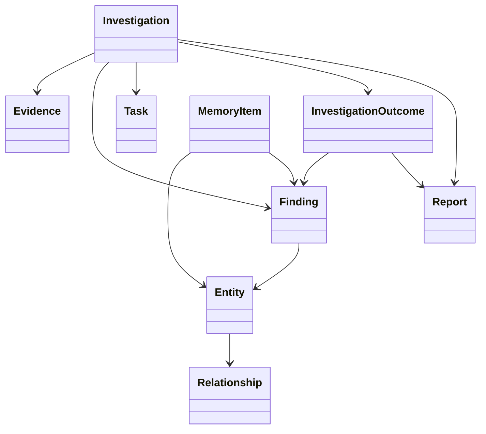
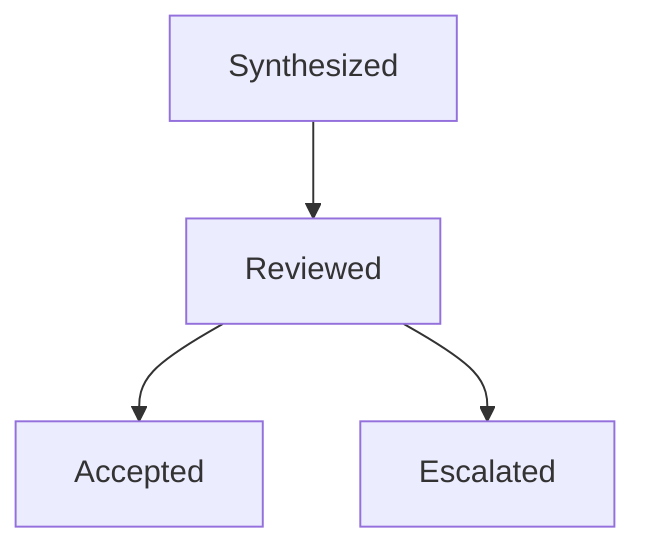
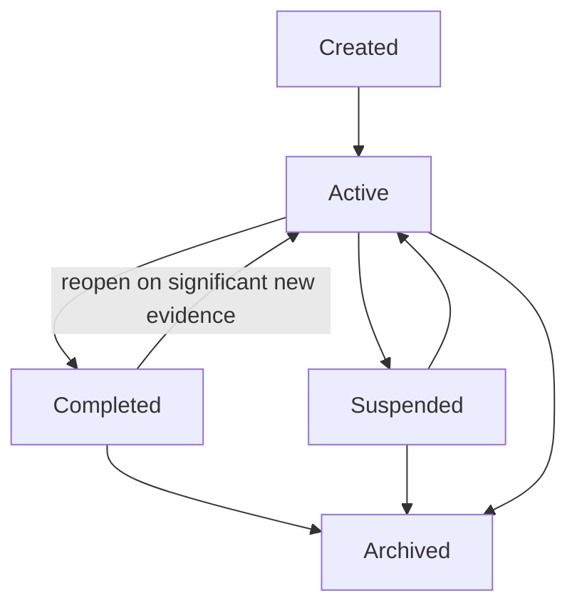
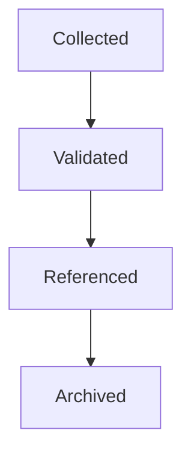
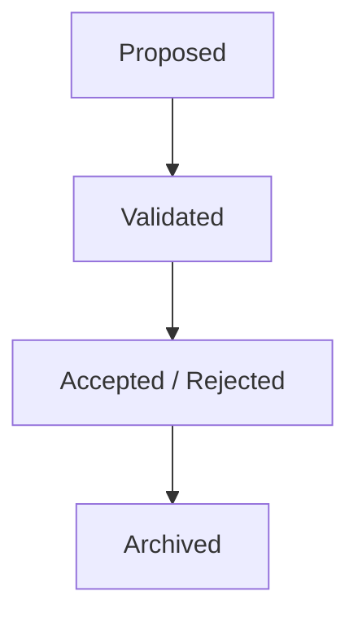
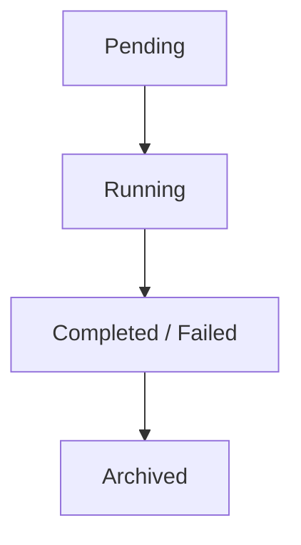
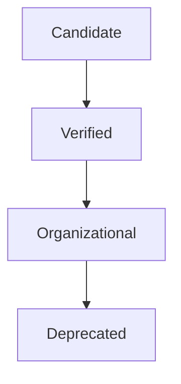
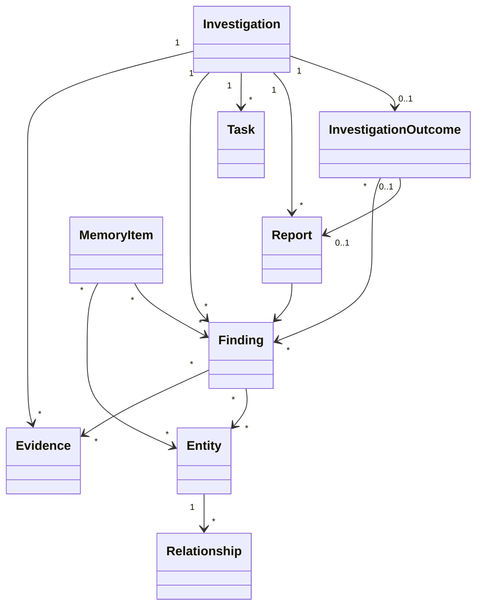

# SentinelAI Domain Model

> This document defines the core domain objects of SentinelAI. These objects represent the primary concepts used throughout the platform and provide a technology-independent foundation for backend implementation, APIs and data persistence.

---

# 1. Purpose

SentinelAI is built around a shared domain model.

Every architectural component, AI agent and backend service operates on the same set of domain objects.

A consistent domain model improves maintainability, interoperability and implementation consistency.

The purpose of this document is to define those domain objects independently of programming languages, databases or frameworks.

---

# 2. Design Goals

The Domain Model is designed according to the following principles.

## Consistency

Every component should interpret domain objects identically.

---

## Technology Independence

Domain objects should remain independent of databases, APIs and programming languages.

---

## Explainability

Every domain object should preserve sufficient context for investigation traceability.

---

## Extensibility

The model should support future capabilities without requiring fundamental redesign.

---

## Single Source of Truth

Each domain concept should have one authoritative representation throughout the platform.

---

# 3. High-Level Domain Model

---

# 4. Investigation

The Investigation represents the primary operational object within SentinelAI.

Every investigation acts as an isolated workspace where evidence is collected, analyzed and transformed into structured findings.

An Investigation coordinates the complete lifecycle of incident analysis.

---

## Responsibilities

An Investigation owns:

- investigation metadata
- evidence
- findings
- assigned tasks
- investigation history
- generated reports

The Investigation does not perform analysis itself.

Instead, it provides the environment in which analysis occurs.

---

## Characteristics

Every Investigation should preserve:

- unique identifier
- title
- current status
- creation timestamp
- owner
- priority

---

## Lifecycle

Typical lifecycle stages include:

- Created
- Active
- Suspended
- Completed
- Archived

The lifecycle should remain observable and auditable.

---

# 5. Evidence

Evidence represents raw information collected during an investigation.

Evidence originates from external sources and serves as the foundation for all analytical reasoning.

Evidence should remain immutable.

New evidence may be added during an investigation, but existing evidence should never be modified.

---

## Possible Sources

Examples include:

- SIEM alerts
- endpoint telemetry
- firewall logs
- DNS logs
- authentication events
- uploaded files
- threat intelligence

---

## Characteristics

Every evidence item should preserve:

- unique identifier
- source
- timestamp
- integrity
- investigation reference

Evidence represents facts rather than conclusions.

Evidence integrity should remain verifiable throughout its lifecycle.

Evidence should preserve its original content even when additional analysis is performed.

---

# 6. Finding

A Finding represents knowledge derived from evidence.

Unlike Evidence, which contains raw observations, a Finding contains analytical conclusions produced during an investigation.

Findings are created by AI agents or analysts after evaluating available evidence.

---

## Responsibilities

A Finding may contain:

- identified behaviors
- detected attack techniques
- correlated entities
- investigation observations
- confidence assessment
- supporting evidence references

Findings should always reference the evidence that supports them.

---

## Characteristics

Every Finding should preserve:

- unique identifier
- investigation reference
- supporting evidence
- creator
- creation timestamp
- confidence

Findings represent conclusions rather than facts.

---

## Lifecycle

Typical Finding states include:

- Proposed
- Validated
- Accepted
- Rejected
- Archived

A validated finding is subsequently accepted or rejected (see §15).

The lifecycle should remain observable and traceable.

---

# 7. Entity

An Entity represents a uniquely identifiable object involved in an investigation.

Entities provide the common language used across investigations, graph reasoning and organizational memory.

Entities may appear in multiple investigations while preserving their identity.

---

## Examples

Typical entities include:

- user
- endpoint
- server
- IP address
- domain
- process
- file
- malware
- vulnerability
- threat actor

---

## Characteristics

Every Entity should preserve:

- globally unique identifier
- entity type
- display name
- attributes
- confidence
- source information
- aliases

Entity identity should remain stable even when descriptive attributes evolve.

Entities may expose multiple aliases representing the same real-world object.

Aliases improve entity resolution while preserving a single canonical identity.

---

## Responsibilities

Entities serve as connection points between:

- evidence
- findings
- relationships
- investigations
- organizational memory

Entities should never depend on a single investigation.

---

# 8. Relationship

Relationships describe meaningful connections between entities.

Relationships transform isolated entities into structured organizational knowledge.

Every relationship should be supported by evidence.

---

## Examples

Examples include:

- authenticates_to
- executes
- communicates_with
- resolves_to
- downloads
- owns
- belongs_to
- related_to

---

## Characteristics

Every Relationship should preserve:

- unique identifier
- source entity
- target entity
- relationship type
- confidence
- supporting evidence
- creation timestamp

---

## Responsibilities

Relationships enable:

- graph reasoning
- attack path reconstruction
- context expansion
- entity correlation
- organizational learning

Relationships represent knowledge rather than raw observations.

---

# 9. Task

A Task represents a unit of work performed during an investigation.

Tasks coordinate the activities executed by AI agents and analysts.

Tasks enable structured investigation planning and execution tracking.

A Task is distinct from a Planner **execution plan / Planner Action**. Execution plans and Planner
Actions are transient, application-layer orchestration structures used by the Planner Agent and the
Planner Service to coordinate execution; they are **not** domain objects and are not part of this
domain model. A Task represents a unit of investigation work in the domain, whereas a Planner Action
represents a single backend operation the Planner Service should execute on behalf of the Planner
Agent.

Similarly, the **Investigation State** consumed by the Planner Agent is a transient application/AI-layer
operational structure (assembled by the Investigation Workspace / Context Builder, referencing domain
entities by identifier) — it is **not** a domain object and is not part of this domain model.

---

## Examples

Examples include:

- reconstruct timeline
- correlate entities
- enrich IOC
- retrieve organizational memory
- validate findings
- generate report

---

## Characteristics

Every Task should preserve:

- unique identifier
- investigation reference
- assigned agent
- execution status
- priority
- creation timestamp
- dependencies

Tasks may depend on the successful completion of other Tasks.

Dependencies enable coordinated investigation workflows.

---

## Lifecycle

Typical Task states include:

- Pending
- Running
- Completed
- Failed
- Cancelled

Task execution history should remain observable.

---

# 10. Memory Item

A Memory Item represents validated organizational knowledge preserved beyond the lifetime of a single investigation.

Unlike Findings, which belong to a specific investigation, Memory Items contribute to the long-term knowledge of SentinelAI.

Memory Items support future investigations by providing reusable organizational intelligence.

---

## Examples

Examples include:

- validated investigation summaries
- confirmed attack patterns
- reusable IOC knowledge
- analyst-approved observations
- recurring infrastructure
- organizational playbooks

---

## Characteristics

Every Memory Item should preserve:

- unique identifier
- memory type
- source investigation
- confidence
- supporting evidence
- version
- creation timestamp

---

## Responsibilities

Memory Items enable:

- organizational learning
- historical retrieval
- semantic search
- graph enrichment
- investigation acceleration

Memory Items should only contain validated knowledge.

---

# 11. Report

A Report represents the final structured output of an investigation.

Reports summarize investigation findings in a human-readable format.

Reports do not contain new knowledge.

Instead, they organize existing investigation knowledge for analysts and stakeholders.

---

## Contents

A Report may include:

- investigation summary
- key findings
- identified entities
- reconstructed attack paths
- supporting evidence
- recommendations

---

## Characteristics

Every Report should preserve:

- unique identifier
- investigation reference
- author
- creation timestamp
- report version

Reports should remain reproducible from the underlying investigation data whenever possible.

---

## Responsibilities

Reports communicate investigation outcomes.

They should not influence investigation reasoning or modify organizational knowledge.

---

# 11a. InvestigationOutcome

An InvestigationOutcome represents the structured result produced by the Decision Engine at the end of the analysis phase.

It captures the synthesized state of an investigation before a human-readable Report is generated.

---

## Responsibilities

An InvestigationOutcome captures:

- the overall investigation recommendation
- overall confidence estimate
- contributing findings
- detected conflicts
- unresolved questions

It does not contain raw evidence.

Instead, it references the findings supporting its conclusions.

---

## Characteristics

Every InvestigationOutcome should preserve:

- unique identifier
- investigation reference
- confidence
- recommendation
- contributing finding references
- detected conflicts
- open questions
- creation timestamp

---

## Lifecycle

---

## Storage Owner

The Investigation Service owns the lifecycle and persistence of every InvestigationOutcome.

---

## Purpose

InvestigationOutcome enables:

- structured analyst decision support
- report generation
- confidence tracking
- investigation traceability

---

# 11b. Trace Entry

A TraceEntry is one record of the **Investigation Trace** — the append-only explainability journal of an investigation.

The trace realizes the platform's central promise ("Explainable AI Assistance"): every planner decision, executed action, retrieval and loop outcome is recorded so the analyst can reconstruct *who decided or did what, when and why*.

The trace is **not** the security audit log: audit records security-relevant access (Audit and Observability); the trace records investigation reasoning and execution.

---

## Characteristics

Every TraceEntry preserves:

- unique identifier
- investigation reference
- kind (planner decision, action execution, retrieval, loop outcome, analyst note)
- actor (the agent, component or analyst it originates from)
- human-readable summary
- correlation reference (for example the action or retrieval-plan identifier)
- creation timestamp

---

## Rules

- Trace entries are immutable and append-only; they are never updated or removed by investigation workflows (removal is governed by the Data Lifecycle architecture).
- Trace recording is best-effort from the producer's perspective: a trace failure must never break the investigation it explains.

---

## Storage Owner

The Investigation Service owns the persistence of the Investigation Trace. The AI Runtime compositions (Investigation Loop, Retrieval Flow) produce entries and record them through the Investigation Service interface (ADR-010 dependency direction).

---

# 12. Domain Relationships

The domain objects defined in this document interact through well-defined relationships.

These relationships remain stable regardless of implementation technology.

---

## InvestigationOutcome References

An InvestigationOutcome references:

- one parent Investigation
- one or more Findings
- zero or more detected conflicts

---

## Investigation Owns

An Investigation owns:

- Evidence
- Findings
- Tasks
- Reports
- Trace Entries (its explainability journal)

---

## Findings Reference

A Finding references:

- Evidence
- Entities
- Relationships

Findings should never exist without supporting evidence.

---

## Relationships Connect

Relationships connect:

- Entity → Entity

Relationships should never directly connect Findings or Evidence.

---

## Memory References

Memory Items may reference:

- Findings
- Entities
- Relationships
- Investigations

Memory should preserve historical traceability.

---

## Tasks Produce

Tasks may produce:

- Findings
- Reports
- Memory Candidates

Task execution should remain observable throughout the investigation.

---

## Reports Summarize

Reports summarize:

- Findings
- Evidence
- Investigation History

Reports should never become inputs to investigation reasoning.

---

# 13. Domain Rules

The following rules define the behavioral constraints of the SentinelAI domain model.

These rules should remain valid regardless of implementation technology.

---

## Rule 1 — Evidence Is Immutable

Evidence represents observed facts.

Evidence should never be modified after ingestion.

Corrections should be represented as additional evidence rather than edits.

---

## Rule 2 — Findings Require Evidence

Every Finding should reference one or more supporting Evidence items.

Unsupported findings should never become validated investigation knowledge.

---

## Rule 3 — Entities Are Globally Identifiable

Every Entity should expose a globally unique and stable identifier.

Entity attributes may evolve.

Entity identity should not.

---

## Rule 4 — Relationships Require Supporting Evidence

Relationships should never exist without evidence.

Every relationship should preserve its origin.

---

## Rule 5 — Memory Requires Validation

Only validated knowledge may become persistent organizational memory.

Candidate knowledge should remain investigation-specific.

---

## Rule 6 — Reports Do Not Create Knowledge

Reports summarize investigations.

Reports should never introduce new findings or modify organizational memory.

---

## Rule 7 — Tasks Drive Execution

AI agents execute Tasks.

Agents should not perform work outside assigned Tasks.

---

## Rule 8 — Investigations Are Independent

Each Investigation represents an isolated operational workspace.

Shared organizational knowledge belongs to Memory rather than individual investigations.

---

## Rule 9 — Domain Objects Are Traceable

Every domain object should preserve sufficient metadata to reconstruct its origin and evolution.

Traceability is required for explainability, auditing and organizational learning.

---

# 14. Domain Contract

The Domain Model provides a stable contract shared across all SentinelAI components.

Every architectural layer should interact through these domain objects rather than implementation-specific structures.

---

## Responsibilities

The Domain Model is responsible for:

- defining core business objects
- preserving consistent terminology
- enabling interoperability
- supporting technology-independent architecture

The Domain Model does not define implementation details.

---

## Consumers

The following components consume the Domain Model:

- AI Agents
- Backend Services
- REST APIs
- Graph Services
- Memory Services
- Frontend Applications

Every component should interpret domain objects consistently.

---

## Stability

Domain objects should evolve slowly.

Implementation technologies may change frequently.

Core business concepts should remain stable.

---

## Extensibility

New domain objects may be introduced in future versions.

Existing objects should remain backward compatible whenever possible.

---

# 15. Domain Object Lifecycle

Every domain object follows a lifecycle appropriate to its responsibility.

Although lifecycle stages differ, all domain objects should remain observable and traceable.

---

## Investigation

Suspension is reversible (Suspended ↔ Active) and a suspended investigation may be archived without reactivation. Completion is likewise reversible: significant new evidence may transition a completed investigation back to Active (Planner Agent §10). Archived is terminal.

---

## Evidence

---

## Finding

---

## Task

---

## Memory Item

---

# 16. Domain Relationships

---

# 17. Design Principles Applied

The Domain Model follows the engineering principles established throughout SentinelAI.

| Principle | Domain Model Application |
|-----------|--------------------------|
| Single Source of Truth | Every business concept has one authoritative representation. |
| Explainability | Every object preserves sufficient context for traceability. |
| Separation of Responsibilities | Each object owns a clearly defined responsibility. |
| Technology Independence | Domain concepts remain independent of implementation frameworks. |
| Consistency | Every component interprets domain objects identically. |
| Extensibility | Future capabilities should extend rather than replace existing concepts. |
| Evidence-Based AI | Analytical objects preserve references to supporting evidence. |
| Architecture Before Framework | Domain objects are defined before implementation technologies are selected. |

---

# Closing Statement

The Domain Model establishes the common language shared across every component of SentinelAI.

By defining stable business concepts independently of implementation technologies, the platform achieves architectural consistency, maintainability and long-term scalability.

Future implementations may introduce new technologies, programming languages and storage solutions.

However, the domain concepts defined in this document should remain stable regardless of implementation details.

The Domain Model should evolve carefully.

Business concepts are expected to change far less frequently than implementation technologies.

Protecting domain stability is essential for long-term architectural consistency.

---

# Version History

| Version | Date | Description |
|----------|------------|--------------------------------|
| 1.0.0 | 2026-06-26 | Initial Domain Model specification created |
| 1.1.0 | 2026-07-03 | Finding lifecycle list aligned with §15 (Accepted added); Investigation lifecycle diagram completed with Suspended transitions (Active ↔ Suspended, Suspended → Archived) and reopen (Completed → Active, per Planner Agent §10) |
| 1.2.0 | 2026-07-03 | Trace Entry added (§11b) — the append-only Investigation Trace (explainability journal) owned by the Investigation Service and produced by the AI Runtime compositions (audit finding M-01/E-07) |