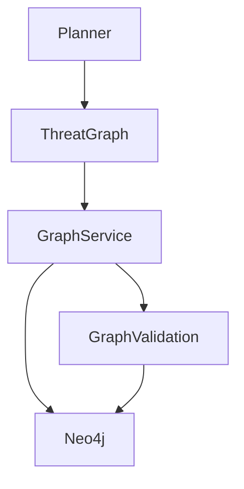
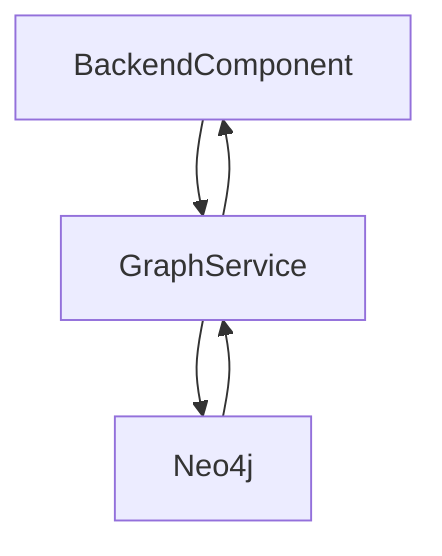
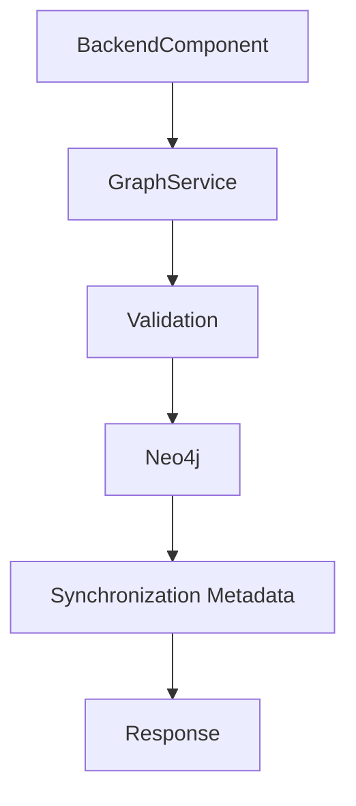

# SentinelAI Graph Service

> This document defines the Graph Service responsible for managing graph-based operations within SentinelAI. The service provides a technology-independent interface for graph queries while isolating backend components from graph database implementation details.

---

# 1. Purpose

The Graph Service provides a dedicated backend service for accessing graph knowledge.

Rather than allowing backend components to communicate directly with Neo4j, all graph operations pass through the Graph Service.

This abstraction improves modularity, maintainability and technology independence.

---

# 2. Responsibilities

The Graph Service is responsible for:

- retrieving entities
- retrieving relationships
- graph traversal
- neighborhood exploration
- attack path retrieval
- graph statistics
- graph validation

The service provides graph operations.

It does not perform investigation reasoning.

---

# 3. High-Level Architecture

---

# 4. Service Boundaries

The Graph Service intentionally limits its responsibilities.

Maintaining clear service boundaries simplifies implementation and testing.

---

## The Graph Service Is Responsible For

- graph storage access
- graph queries
- entity retrieval
- relationship retrieval
- traversal operations

---

## The Graph Service Is Not Responsible For

- investigation planning
- AI reasoning
- report generation
- memory management
- prompt construction

These responsibilities belong to other architectural components.

---

## The Graph Service Does Not Interpret Graph Data

The Graph Service retrieves graph structures.

Interpreting their meaning remains the responsibility of ThreatGraph and AI agents.

---

# 5. Design Goals

The Graph Service is designed to satisfy the following objectives.

## Abstraction

Backend components should remain independent of graph database technologies.

---

## Performance

Graph operations should remain optimized for investigation workloads.

---

## Consistency

Every graph query should produce deterministic results for identical graph states.

---

## Scalability

The service should support continuously growing graph structures.

---

## Testability

Graph operations should remain independently testable without requiring AI components.

---

# 6. Core Operations

The Graph Service exposes graph-specific operations to backend components.

These operations remain independent of graph database implementation details.

---

## Entity Operations

Supported operations include:

- retrieve entity
- create entity
- update entity attributes
- merge duplicate entities
- validate entity integrity

Entity identity should remain stable across investigations.

Entity creation should preserve canonical identity.

If an equivalent entity already exists, the Graph Service should reuse the existing entity rather than creating duplicates.

---

## Relationship Operations

Supported operations include:

- retrieve relationships
- create relationships
- update relationship confidence
- validate relationship consistency

Relationships should always preserve supporting evidence.

---

## Graph Traversal

The Graph Service supports graph traversal operations including:

- neighborhood exploration
- shortest path discovery
- attack path traversal
- relationship expansion

Traversal depth should remain configurable.

Traversal operations should prioritize investigation relevance over exhaustive graph exploration.

---

# 7. Data Flow

Graph operations follow a consistent execution flow.

---

## Read Operations

---

## Write Operations

---

# 8. Error Handling

The Graph Service should expose predictable and observable failure behavior.

---

## Invalid Entity

Operations targeting unknown entities should return explicit errors.

---

## Invalid Relationship

Relationships referencing missing entities should be rejected.

---

## Graph Constraint Violations

Operations violating graph integrity rules should fail without modifying graph state.

---

## Database Failures

Database connectivity failures should remain observable and recoverable.

Backend components should receive meaningful error information.

---

# 9. Service Contract

The Graph Service exposes a consistent graph interface to backend components.

All graph operations should be performed through this service rather than accessing the graph database directly.

---

## Inputs

The Graph Service may receive:

- entity identifiers
- relationship identifiers
- traversal requests
- graph constraints
- investigation context

Requests should contain sufficient information to perform deterministic graph operations.

---

## Outputs

The Graph Service may return:

- entities
- relationships
- graph paths
- neighboring entities
- traversal metadata
- validation results
- graph metadata

Returned data should remain independent of graph database implementation details.

---

## Success Criteria

Successful execution should:

- preserve graph integrity
- return deterministic results
- maintain entity identity
- expose traversal metadata

---

## Failure Conditions

Examples include:

- missing entities
- invalid graph queries
- constraint violations
- unavailable graph database

Failures should be explicit and observable.

---

# 10. Graph Validation

The Graph Service validates graph consistency before accepting graph modifications.

Validation prevents inconsistent graph structures from entering the Knowledge Graph.

---

## Entity Validation

Validation includes:

- unique identifiers
- supported entity types
- required attributes

---

## Relationship Validation

Validation includes:

- existing source entity
- existing target entity
- supported relationship type
- evidence references
- relationship confidence

---

## Integrity Validation

The Graph Service should reject operations that:

- create duplicate canonical entities
- introduce invalid relationships
- violate graph constraints

Validation should occur before persistence.

---

# 11. Performance Considerations

The Graph Service should optimize graph operations for investigation workloads.

Performance improvements should not compromise graph correctness.

---

## Query Optimization

Frequently used graph queries should remain optimized.

Examples include:

- entity lookup
- relationship lookup
- neighborhood traversal
- attack path retrieval

---

## Caching

Frequently accessed graph data may be cached.

Caching should never replace the authoritative graph.

Cached graph data should expire or be refreshed whenever graph consistency could be affected.

---

## Traversal Limits

Graph traversal should support configurable limits including:

- traversal depth
- maximum returned nodes
- maximum returned relationships

Traversal limits prevent excessive resource consumption.

---

# 12. Future Evolution

Future Graph Service capabilities may include:

- graph analytics
- community detection
- graph embeddings
- graph anomaly detection
- graph versioning
- distributed graph processing
- graph snapshots

Future capabilities should extend the service without changing its core responsibilities.

---

# 13. Design Principles Applied

The Graph Service follows the engineering principles established throughout SentinelAI.

| Principle | Graph Service Application |
|-----------|---------------------------|
| Single Source of Truth | Neo4j remains the authoritative source for entities and relationships. |
| Separation of Responsibilities | The service performs graph operations but not investigation reasoning. |
| Explainability | Graph queries preserve traversal metadata and supporting evidence. |
| Technology Independence | Backend components remain independent of Neo4j-specific features. |
| Scalability | Graph operations support continuously growing knowledge graphs. |
| Modularity | Graph functionality is encapsulated within a dedicated backend service. |
| Architecture Before Framework | Service behavior is defined independently of graph libraries or drivers. |

---

# Closing Statement

The Graph Service provides a stable abstraction layer between SentinelAI backend components and graph storage.

By encapsulating graph operations behind a dedicated service, the platform improves maintainability, scalability and technology independence while preserving graph integrity and explainability.

Future implementations may introduce new graph technologies or optimization techniques.

However, the service responsibilities defined in this document should remain stable regardless of implementation details.

---

# Version History

| Version | Date | Description |
|----------|------------|--------------------------------|
| 1.0.0 | 2026-06-26 | Initial Graph Service specification created |