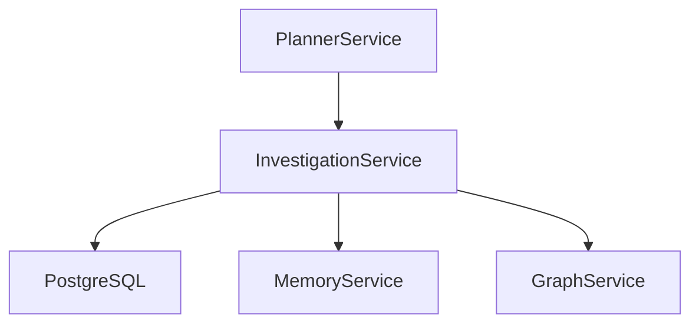
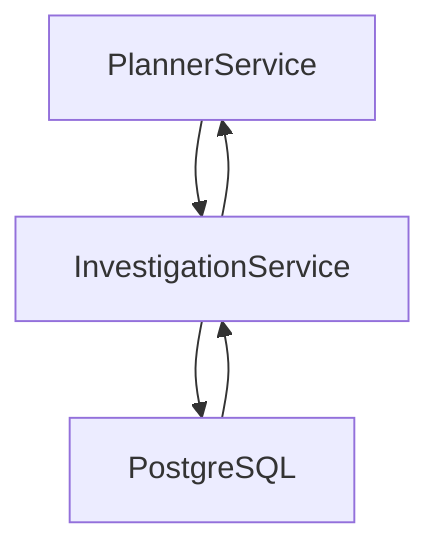
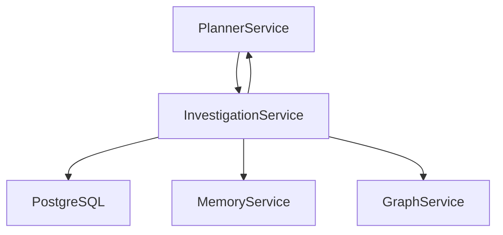
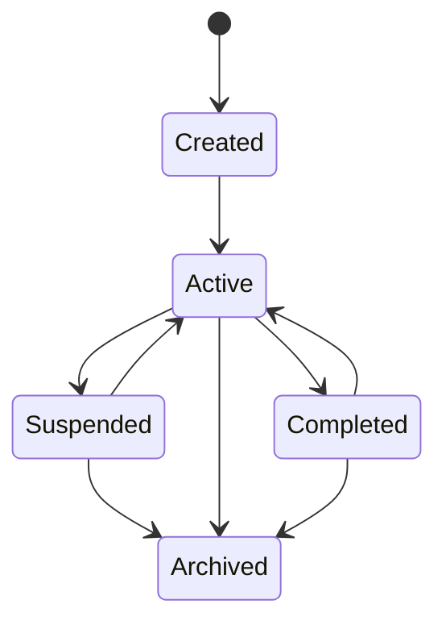

# SentinelAI Investigation Service

> This document defines the backend service responsible for managing the lifecycle of investigations within SentinelAI. The Investigation Service provides a centralized interface for investigation-related operations while preserving clear ownership of investigation data.

---

# 1. Purpose

The Investigation Service manages investigation lifecycle operations.

Rather than allowing backend components to manipulate investigation data directly, all investigation-related operations pass through the Investigation Service.

The service preserves investigation consistency, auditability and lifecycle management.

Its primary objective is maintaining investigation integrity.

---

# 2. Responsibilities

The Investigation Service is responsible for:

- creating investigations
- updating investigation state
- managing investigation lifecycle
- managing findings
- managing evidence references
- generating investigation summaries
- coordinating investigation persistence

The Investigation Service owns investigation business logic.

It does not perform AI reasoning.

---

# 3. High-Level Architecture

---

# 4. Service Boundaries

The Investigation Service intentionally limits its responsibilities.

Maintaining clear boundaries simplifies investigation management and long-term maintainability.

---

## The Investigation Service Is Responsible For

- investigation lifecycle
- evidence management
- finding management
- report coordination
- investigation persistence

---

## The Investigation Service Is Not Responsible For

- AI reasoning
- graph processing
- semantic retrieval
- workflow orchestration
- language model interaction

These responsibilities belong to other architectural components.

---

# 5. Investigation Ownership

The Investigation Service owns the lifecycle of every Investigation.

Investigation data should only be modified through this service.

---

## Investigation Lifecycle

The Investigation Service manages:

- creation
- updates
- archival
- completion
- status transitions

---

## Business Ownership

Investigation-related business rules remain centralized within the Investigation Service.

Other backend services may contribute information but should not modify investigation ownership.

Investigation ownership includes business state but not supporting domain data.

Evidence, Memory Items and Graph entities remain owned by their respective services.

---

## Service Collaboration

The Investigation Service may interact with:

- Memory Service
- Graph Service

Service collaboration should respect ownership boundaries.

---

# 6. Core Operations

The Investigation Service exposes investigation-specific operations to backend components.

Operations focus on managing investigation data and lifecycle rather than AI reasoning.

---

## Investigation Operations

Supported operations include:

- create Investigation
- retrieve Investigation
- update Investigation
- suspend / resume Investigation (Active ↔ Suspended)
- complete Investigation (transition to Completed; "closing" an investigation means completing it — no separate Closed state exists)
- reopen Investigation (Completed → Active, on significant new evidence)
- archive Investigation

Investigation lifecycle should remain fully observable.

---

## Evidence Operations

Supported operations include:

- attach Evidence
- detach Evidence
- validate Evidence references
- retrieve Investigation Evidence

Evidence should always remain traceable to its originating Investigation.

Evidence associations should remain traceable throughout the investigation lifecycle.

---

## Finding Operations

Supported operations include:

- create Finding
- update Finding
- validate Finding
- retrieve Findings

Findings should preserve supporting evidence and confidence information.

Findings should remain linked to both supporting evidence and the investigation that produced them.

---

## Report Operations

Supported operations include:

- create Investigation Report
- retrieve Investigation Report
- archive Investigation Report

Reports summarize investigation outcomes without modifying underlying Investigation data.

---

## Outcome Operations

The Investigation Service owns the lifecycle and persistence of every InvestigationOutcome (Domain Model §11a).

Supported operations include:

- create Investigation Outcome (at most one per investigation; contributing findings must exist and belong to the investigation)
- retrieve Investigation Outcome

Outcomes are produced by the Decision Engine (AI Runtime) and persisted through this service.

---

## Trace Operations

The Investigation Service owns the persistence of the Investigation Trace — the append-only explainability journal (Domain Model §11b).

Supported operations include:

- record Trace Entry (append-only; the referenced investigation must exist; the summary must not be blank)
- list Trace Entries (in append order)

Trace entries are produced primarily by the AI Runtime compositions (Investigation Loop, Retrieval Flow) through this service's interface; analysts may contribute note entries.

---

## Evidence Ingestion Boundary

The Investigation Service owns evidence **attachment** (accepting an already-formed Evidence item and binding it to its investigation).

Evidence **ingestion** — upload transport, format parsing and log normalization (Project Charter, Initial Product Capabilities) — is a distinct future capability with its own pipeline; it is *not* an Investigation Service responsibility and requires its own architectural decision before implementation (ADR-004 rule: a new service only for a distinct business capability). Raw evidence payload storage is defined by the Database Architecture (Evidence Payload Storage).

---

# 7. Data Flow

Investigation operations follow a consistent execution process.

## Investigation Creation

---

## Investigation Update

Service invocations should occur only when investigation updates affect the responsibilities of collaborating services.

---

# 8. Service Coordination

The Investigation Service coordinates investigation-related activities while respecting service ownership boundaries.

---

## Memory Service

The Investigation Service may request:

- memory creation
- memory updates
- memory retrieval

The Memory Service remains responsible for organizational memory.

---

## Graph Service

The Investigation Service may request:

- entity retrieval
- relationship retrieval
- graph validation

The Graph Service remains responsible for graph operations.

---

## Planner Service

The Planner Service initiates investigation workflows.

The Investigation Service executes investigation-specific business operations.

---

# 9. Failure Management

The Investigation Service should preserve investigation integrity under failure conditions.

---

## Persistence Failure

Investigation data should never become partially persisted.

Failed persistence operations should leave investigation state unchanged whenever possible.

---

## Service Failure

Failures in collaborating backend services should not corrupt investigation data.

Partial failures should remain observable.

---

## Validation Failure

Invalid investigation updates should be rejected before persistence.

Validation failures should return meaningful error information.

---

## Recovery

Interrupted investigation updates should support controlled recovery whenever possible.

---

# 10. Investigation Lifecycle

Every Investigation progresses through observable lifecycle states.

Lifecycle management enables monitoring, auditing and controlled execution.

---

## Lifecycle

Suspension (Active ↔ Suspended) and completion (Completed → Active on significant new evidence, Planner Agent §10) are reversible; Archived is terminal.

---

## State Management

Only valid state transitions should be permitted.

Every transition should be recorded for auditability.

---

## Consistency

Lifecycle transitions should preserve investigation integrity and business rules.

---

# 11. Service Contract

The Investigation Service exposes a consistent interface for investigation lifecycle management.

Backend components should perform investigation operations exclusively through this service.

---

## Inputs

The Investigation Service may receive:

- investigation identifiers
- investigation updates
- evidence references
- findings
- lifecycle requests

Requests should contain sufficient information to execute deterministic investigation operations.

---

## Outputs

The Investigation Service may return:

- Investigation objects
- Investigation summaries
- Findings
- Evidence references
- lifecycle metadata

Returned data should remain independent of persistence technologies.

---

## Success Criteria

Successful execution should:

- preserve investigation integrity
- maintain evidence traceability
- enforce valid lifecycle transitions
- expose investigation metadata

---

## Failure Conditions

Examples include:

- unknown Investigation
- invalid lifecycle transition
- missing evidence references
- persistence failures

Failures should remain explicit and recoverable.

---

# 12. Investigation Validation

The Investigation Service validates investigation updates before persistence.

Validation protects investigation consistency and long-term data quality.

---

## Investigation Validation

Validation includes:

- required fields
- valid lifecycle state
- unique investigation identifier
- supported investigation type

---

## Evidence Validation

Validation includes:

- existing evidence
- valid evidence references
- duplicate evidence detection
- evidence ownership

---

## Finding Validation

Validation includes:

- supported finding type
- confidence information
- supporting evidence

Validation failures should prevent persistence.

---

# 13. Performance Considerations

The Investigation Service should optimize investigation management without compromising consistency.

---

## Investigation Retrieval

Frequently accessed investigations should remain efficiently retrievable.

---

## Evidence Access

Evidence retrieval should minimize unnecessary database operations.

---

## Report Generation

Report generation may execute asynchronously for large investigations.

---

## Caching

Frequently accessed investigation metadata may be cached.

Caching should never replace authoritative investigation storage.

Cached investigation metadata should be invalidated whenever investigation state changes.

---

# 14. Future Evolution

Future Investigation Service capabilities may include:

- investigation templates
- collaborative investigations
- investigation versioning
- automated report generation
- investigation timelines
- investigation analytics
- investigation replay

Future capabilities should extend investigation management without changing ownership responsibilities.

---

# 15. Design Principles Applied

The Investigation Service follows the engineering principles established throughout SentinelAI.

| Principle | Investigation Service Application |
|-----------|-----------------------------------|
| Single Source of Truth | Investigation data is managed exclusively through the Investigation Service. |
| Separation of Responsibilities | Investigation management is isolated from AI reasoning, graph processing and memory management. |
| Explainability | Investigation history and evidence remain fully traceable. |
| Scalability | Investigation lifecycle management scales independently from other backend services. |
| Technology Independence | Investigation operations remain independent of database implementation details. |
| Modularity | Investigation functionality is encapsulated within a dedicated backend service. |
| Architecture Before Framework | Service behavior is defined independently of backend frameworks and ORM technologies. |

---

# Closing Statement

The Investigation Service provides the business foundation for managing cybersecurity investigations within SentinelAI.

By centralizing investigation lifecycle management behind a dedicated service, the platform achieves consistency, auditability and maintainable business logic while preserving clear ownership boundaries.

Future implementations may introduce new persistence technologies or workflow integrations.

However, the investigation responsibilities defined in this document should remain stable regardless of implementation details.

---

# Version History

| Version | Date | Description |
|----------|------------|--------------------------------|
| 1.0.0 | 2026-06-26 | Initial Investigation Service specification created |
| 1.1.0 | 2026-07-03 | Lifecycle completed: Suspended transitions defined (Active ↔ Suspended, Suspended → Archived), reopen defined (Completed → Active), "close" clarified as completing (no separate Closed state) |
| 1.2.0 | 2026-07-03 | Outcome operations (create/retrieve, 0..1 per investigation) and Trace operations (append-only explainability journal) added; evidence ingestion boundary defined (attachment owned here, ingestion/normalization a future capability requiring its own decision) |