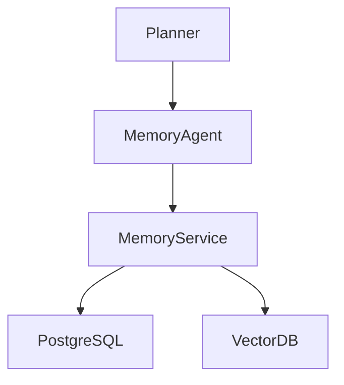
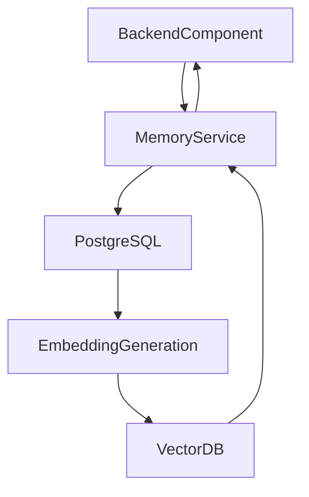
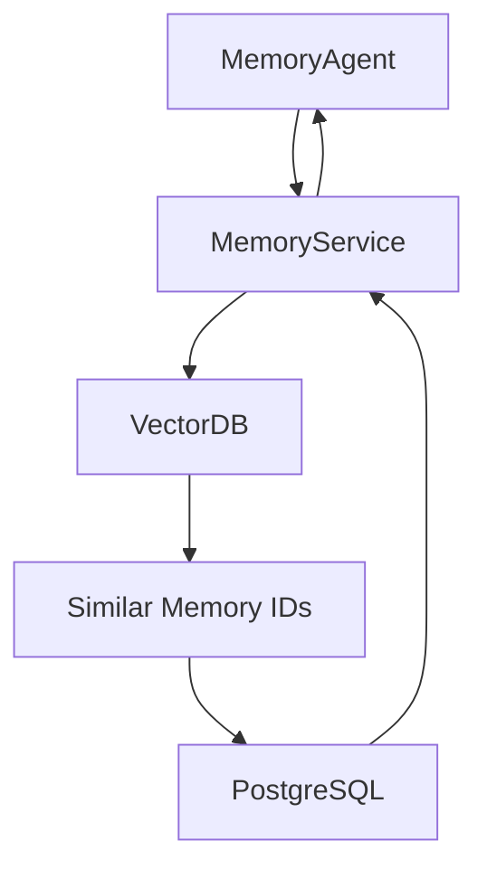

# SentinelAI Memory Service

> This document defines the backend service responsible for storing, retrieving and managing organizational memory within SentinelAI. The Memory Service provides a technology-independent interface for memory operations while isolating backend components from storage implementation details.

---

# 1. Purpose

The Memory Service provides centralized access to organizational memory.

Rather than allowing backend components to communicate directly with PostgreSQL or the Vector Database, all memory operations pass through the Memory Service.

This abstraction preserves consistency, traceability and technology independence.

The Memory Service is responsible for memory persistence.

It does not perform AI reasoning.

---

# 2. Responsibilities

The Memory Service is responsible for:

- storing Memory Items
- retrieving Memory Items
- semantic retrieval
- embedding management
- memory validation
- memory versioning
- synchronization with the Vector Database

The service manages memory operations.

It does not determine investigation strategy.

---

# 3. High-Level Architecture

---

# 4. Service Boundaries

The Memory Service intentionally limits its responsibilities.

Maintaining clear service boundaries improves maintainability and simplifies implementation.

---

## The Memory Service Is Responsible For

- memory persistence
- semantic retrieval
- embedding management
- synchronization
- version management

---

## The Memory Service Is Not Responsible For

- investigation planning
- graph reasoning
- report generation
- prompt construction
- language model interaction

These responsibilities belong to other architectural components.

---

# 5. Memory Ownership

The Memory Service owns the lifecycle of every Memory Item.

Memory Items are stored in authoritative storage before semantic representations are generated.

---

## Authoritative Storage

Memory Items are stored in PostgreSQL.

PostgreSQL remains the single source of truth.

---

## Semantic Representation

Embeddings are generated from Memory Items.

Embeddings are synchronized to the Vector Database.

The Vector Database stores semantic representations rather than authoritative business objects.

Embedding generation should not modify the authoritative Memory Item.

Semantic representations are derived artifacts maintained independently of business data.

---

# 6. Core Operations

The Memory Service exposes memory-specific operations to backend components.

These operations remain independent of storage implementation details.

---

## Memory Operations

Supported operations include:

- create Memory Item
- retrieve Memory Item
- update Memory Item
- archive Memory Item
- retrieve memory history
- deprecate Memory Item

Memory Items should remain versioned throughout their lifecycle.

---

## Semantic Operations

Supported operations include:

- generate embeddings
- retrieve similar Memory Items
- semantic ranking
- similarity search

Semantic operations should complement authoritative storage rather than replace it.

---

## Synchronization Operations

Supported operations include:

- synchronize embeddings
- regenerate embeddings
- validate synchronization status

Synchronization should preserve consistency between PostgreSQL and the Vector Database.

---

# 7. Data Flow

Memory operations follow a consistent execution flow.

---

## Memory Creation

---

## Semantic Retrieval

---

# 8. Embedding Lifecycle

Embeddings are derived artifacts generated from authoritative Memory Items.

Embeddings should never become the primary representation of organizational knowledge.

---

## Embedding Versioning

Embedding models may evolve over time.

The Memory Service should preserve embedding version information to support controlled regeneration and compatibility across model upgrades.

---

## Embedding Creation

Embeddings are generated when:

- a Memory Item is created
- significant memory content changes
- embedding models are upgraded

---

## Embedding Updates

Embedding regeneration should preserve Memory Item identity.

Only semantic representations should change.

---

## Embedding Validation

The Memory Service should verify:

- embedding availability
- synchronization status
- embedding version

Embedding failures should never corrupt Memory Items.

---

# 9. Retrieval Strategy

The Memory Service supports multiple retrieval mechanisms.

Different investigation scenarios may require different retrieval strategies.

---

## Identifier Retrieval

Retrieve Memory Items using unique identifiers.

---

## Semantic Retrieval

Retrieve Memory Items using embedding similarity.

Similarity scores should guide retrieval rather than determine final investigation conclusions.

---

## Metadata Retrieval

Retrieve Memory Items according to:

- tags
- investigation type
- confidence
- creation date

---

## Hybrid Retrieval

Multiple retrieval strategies may execute together.

Hybrid retrieval should maximize investigation relevance while minimizing unnecessary retrieval.

---

# 10. Error Handling

The Memory Service should expose predictable and observable failure behavior.

---

## Missing Memory

Unknown Memory Items should return explicit errors.

---

## Embedding Failures

Embedding generation failures should not prevent Memory Item persistence.

Failed embeddings should be recoverable.

---

## Synchronization Failures

Synchronization failures should remain observable.

Retry mechanisms should support eventual consistency.

---

## Storage Failures

Database failures should never corrupt authoritative Memory Items.

Recovery procedures should preserve data integrity.

---

# 11. Service Contract

The Memory Service exposes a consistent interface for organizational memory operations.

Backend components should interact with memory exclusively through this service.

---

## Inputs

The Memory Service may receive:

- Memory Item identifiers
- investigation context
- semantic search requests
- metadata filters
- synchronization requests

Requests should contain sufficient information to perform deterministic memory operations.

---

## Outputs

The Memory Service may return:

- Memory Items
- semantic search results
- retrieval metadata
- synchronization status
- embedding metadata
- retrieval provenance

Returned data should remain independent of storage implementation details.

Returned Memory Items should preserve sufficient metadata describing how they were retrieved.

Retrieval provenance improves explainability and debugging.

---

## Success Criteria

Successful execution should:

- preserve Memory Item integrity
- maintain synchronization consistency
- return deterministic retrieval results
- expose retrieval metadata

---

## Failure Conditions

Examples include:

- missing Memory Items
- unavailable storage
- embedding failures
- synchronization failures

Failures should remain observable and recoverable.

---

# 12. Memory Validation

The Memory Service validates Memory Items before persistence and retrieval.

Validation improves long-term organizational knowledge quality.

---

## Content Validation

Validation includes:

- required fields
- supported memory types
- valid metadata
- investigation references
- provenance information

---

## Version Validation

Memory versions should remain sequential and traceable.

Historical versions should remain accessible when required.

---

## Embedding Validation

Validation includes:

- embedding availability
- embedding version
- synchronization status

Invalid embeddings should trigger regeneration rather than data modification.

---

# 13. Performance Considerations

The Memory Service should optimize retrieval without compromising memory integrity.

---

## Semantic Search

Similarity search should remain optimized for investigation workloads.

---

## Metadata Filtering

Filtering should occur before semantic ranking whenever possible.

Reducing candidate Memory Items improves retrieval efficiency.

---

## Caching

Frequently retrieved Memory Items may be cached.

Caching should never replace authoritative storage.

Cached Memory Items should be invalidated whenever authoritative memory changes.

---

## Embedding Generation

Embedding generation may execute asynchronously.

Delayed embedding generation should not block Memory Item persistence.

---

# 14. Future Evolution

Future Memory Service capabilities may include:

- automatic memory summarization
- memory clustering
- adaptive embedding generation
- memory quality scoring
- semantic deduplication
- long-term memory optimization
- memory expiration policies

Future capabilities should extend the service without changing its architectural responsibilities.

---

# 15. Design Principles Applied

The Memory Service follows the engineering principles established throughout SentinelAI.

| Principle | Memory Service Application |
|-----------|----------------------------|
| Single Source of Truth | PostgreSQL remains the authoritative source for Memory Items. |
| Separation of Responsibilities | Memory management is isolated from AI reasoning and planning. |
| Explainability | Memory retrieval preserves provenance and retrieval metadata. |
| Technology Independence | Backend components remain independent of storage technologies. |
| Scalability | Memory retrieval scales independently from investigation processing. |
| Modularity | Memory functionality is encapsulated within a dedicated backend service. |
| Architecture Before Framework | Service behavior is defined independently of embedding models or vector databases. |

---

# Closing Statement

The Memory Service provides the persistence and retrieval foundation for organizational knowledge within SentinelAI.

By separating authoritative memory storage from semantic representations, the platform achieves scalable retrieval while preserving consistency, traceability and long-term maintainability.

Future implementations may introduce new storage technologies, embedding models or retrieval optimizations.

However, the service responsibilities defined in this document should remain stable regardless of implementation details.

---

# Version History

| Version | Date | Description |
|----------|------------|--------------------------------|
| 1.0.0 | 2026-06-26 | Initial Memory Service specification created |