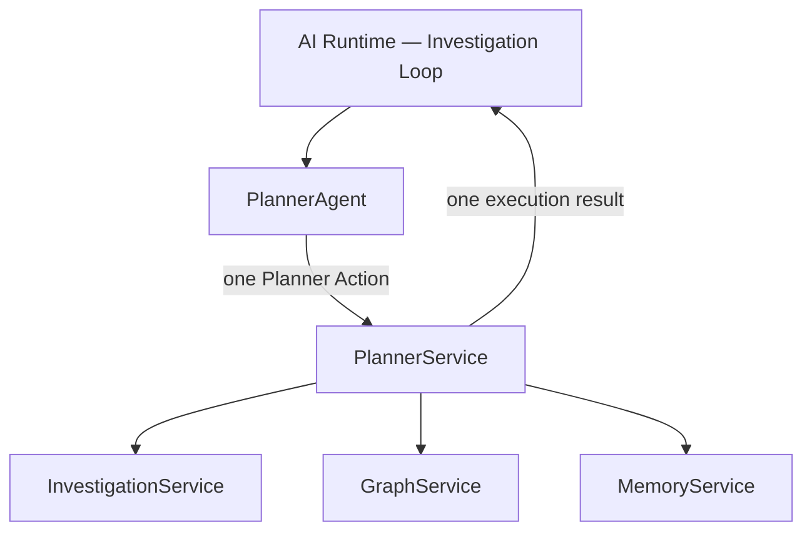

# SentinelAI Planner Service

> This document defines the backend component responsible for executing Planner Actions within SentinelAI. The Planner Service is the single, validated execution boundary between the AI Runtime and the backend services. Its composition with the Planner Agent is decided by ADR-010.

---

# 1. Purpose

The Planner Service executes the decisions produced by the Planner Agent.

It is an **orchestration seam** (ADR-010), not a business-capability service: it owns no business data, persists no state and performs no reasoning.

Each request executes exactly **one Planner Action** against the backend service that owns the requested operation, and returns a provenance-bearing execution result.

Its primary objective is reliable, observable, deterministic single-action execution.

---

# 2. Control Model

The Planner Service follows the **single-action control model** (normative per ADR-010):

- One request executes one Planner Action.
- The service holds no multi-step plans and persists no workflow state.
- Multi-step, adaptive investigation is realized exclusively by the **Planner Agent's iterative decision loop**, hosted by the AI Runtime's Investigation Loop: the agent selects the next action, the Planner Service executes that single action and returns its result, and the agent decides the following action after observing the result.
- Execution order, dependencies between actions, redundancy avoidance and lifecycle control (continuing, completing or escalating an investigation) are therefore the Planner Agent's responsibility across successive cycles — never the Planner Service's.

Stateful, multi-step workflow orchestration inside the Planner Service is explicitly rejected (ADR-010, Alternatives Considered).

---

# 3. Responsibilities

The Planner Service is responsible for:

- validating a single Planner Action before dispatch
- dispatching the action to the owning backend service
- isolating downstream service failures into a structured execution result
- returning the execution result with its originating service preserved
- exposing execution observability through operational logging

The Planner Service executes decisions.

It does not make them.

---

# 4. High-Level Architecture

The caller of the Planner Service is the AI Runtime (the Investigation Loop composing the Planner Agent, ADR-010). Exposure of Planner Action execution through the public API is a communication concern of the Backend API and is a separate, still-open decision (ADR-010, Notes).

---

# 5. Service Boundaries

## The Planner Service Is Responsible For

- single Planner Action validation
- single Planner Action execution
- failure isolation
- execution-result provenance

---

## The Planner Service Is Not Responsible For

- AI reasoning and planning (Planner Agent)
- loop composition, cycle budgeting and termination (AI Runtime — Investigation Loop)
- business data ownership and persistence (Investigation, Graph and Memory Services)
- report generation
- language model interaction

---

## Statelessness

The Planner Service is **stateless**. It owns no storage, persists no execution state and retains nothing between requests. Execution remains observable through operational logging rather than a persisted workflow store. Investigation business state remains owned by the Investigation Service.

---

# 6. Planner Action Contract

The Planner Service receives a single **Planner Action** per request.

A Planner Action is a transient, application-layer structure (not a domain object, per the Domain Model). It is one of:

- a **service-invocation action**, containing:
  - an action identifier (caller-supplied, for correlation and observability)
  - an investigation reference
  - a target backend service (Investigation, Graph or Memory)
  - the operation to invoke on that service
  - the operation inputs
  - optional execution constraints (for example, a timeout)
- a **control action** (no service call): complete or escalate. Control actions signal the Planner Agent's loop decision; the Planner Service records and acknowledges them so that every planner decision remains observable through the same execution boundary.

The target service and operation must be drawn from that service's documented operations.

---

# 7. Action Validation

Every Planner Action is validated before dispatch:

- the action identifier is present
- the target is one of the known backend services
- the requested operation is a supported operation of that service
- the required operation inputs are present
- any execution constraints are satisfiable

Validation failures are reported explicitly as precondition errors and never reach a backend service.

Cross-action concerns — ordering, dependency satisfaction, duplicate-action detection — are not validated here: they belong to the Planner Agent, which sequences actions across cycles.

---

# 8. Execution and Failure Isolation

Execution follows one consistent flow per request:

1. Validate the Planner Action.
2. Dispatch it to the owning backend service.
3. Capture the outcome as an execution result.
4. Return the result to the caller.

## Execution Result

Each request returns one **execution result** carrying:

- the action identifier
- the originating backend service (absent for control actions)
- the execution status (Completed or Failed)
- the service response on success, or a structured error on failure

The execution status is an application-layer, in-memory status of a single action. It is **not** a persisted workflow object and is **not** the domain `TaskStatus`.

## Failure Isolation

A downstream service failure never propagates as an exception: it is isolated into a **failed execution result** with a stable error code and message. The Planner Agent observes the failure through the next assembled Investigation State and decides how to respond — retry, alternative action or escalation (Planner Agent §12). Recovery strategy is therefore a planning concern, not an execution concern.

Timeout constraints, when supplied, must be explicit rather than silent; timeout and retry semantics are deferred (see the implementation tracker).

---

# 9. Service Contract

## Inputs

One Planner Action per request (see §6).

## Outputs

One execution result per request (see §8), independent of backend service implementations.

## Success Criteria

Successful execution should:

- execute exactly the requested action against exactly the owning service
- preserve the originating service and action identifier in the result
- return deterministic results for equivalent actions over equivalent state

## Failure Conditions

- invalid Planner Action (precondition error, never dispatched)
- unavailable or failing backend service (failed execution result)
- unsatisfiable execution constraints (precondition error)

Failures are always explicit: as precondition errors before dispatch, or as failed execution results after dispatch.

---

# 10. Performance Considerations

- The service adds no state and no coordination overhead of its own; latency is dominated by the dispatched backend operation.
- Only the single owning backend service participates in a request; no fan-out occurs inside the Planner Service.
- Concurrency across actions, when useful, is a Planner Agent / Investigation Loop concern (issuing independent actions), not a Planner Service concern.
- Execution metrics remain observable through operational logging for performance analysis.

---

# 11. Future Evolution

Future capabilities may include:

- the full Planner Action operation catalogue (aligned with the Planner Agent's action vocabulary)
- timeout and retry semantics for execution constraints
- richer execution-result metadata

Future capabilities must preserve the single-action control model and the statelessness of the service; multi-step or persisted workflow execution would require superseding ADR-010.

---

# 12. Design Principles Applied

| Principle | Planner Service Application |
|-----------|-----------------------------|
| Separation of Responsibilities | Decision-making (AI Runtime) and execution (backend) remain separate components with a typed contract. |
| Single Source of Truth | No second store of investigation progress exists; business state stays with the owning services. |
| Explainability | Every executed action returns a provenance-bearing result; every decision passes through one observable boundary. |
| Simplicity Is a Feature | One action per request, no persisted workflow machinery. |
| Technology Independence | The execution seam is independent of orchestration libraries and messaging systems. |
| Architecture Before Framework | The control model is fixed by ADR-010, independent of implementation technology. |

---

# Closing Statement

The Planner Service is the validated, stateless execution boundary between AI decision-making and backend execution.

By executing exactly one Planner Action per request and leaving all multi-step behavior to the Planner Agent's decision loop, SentinelAI keeps investigation progress in a single authoritative place while making every planner decision observable and reproducible.

---

# Version History

| Version | Date | Description |
|----------|------------|--------------------------------|
| 1.0.0 | 2026-06-26 | Initial Planner Service specification created |
| 2.0.0 | 2026-07-03 | Rewritten around the single-action control model (ADR-010); stateful multi-step workflow orchestration content removed; caller and composition ownership defined |
