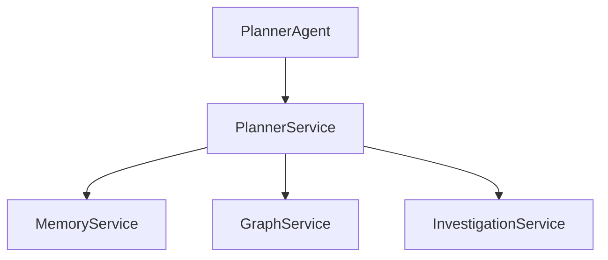
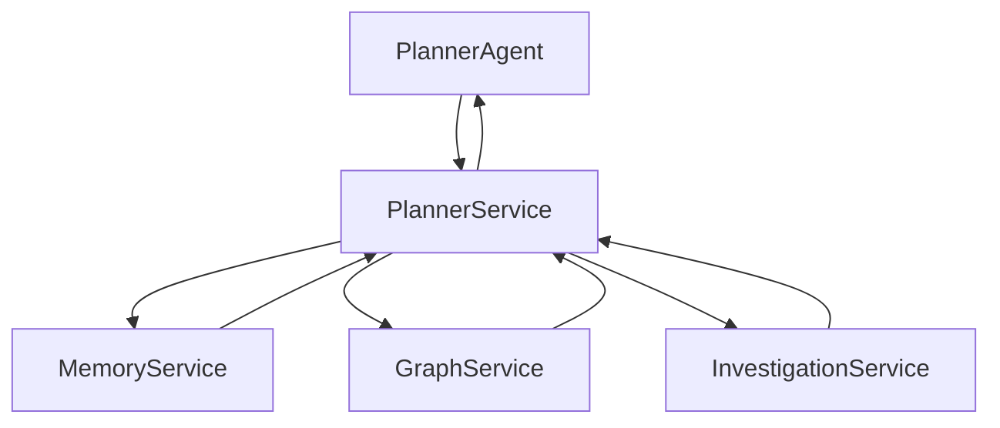
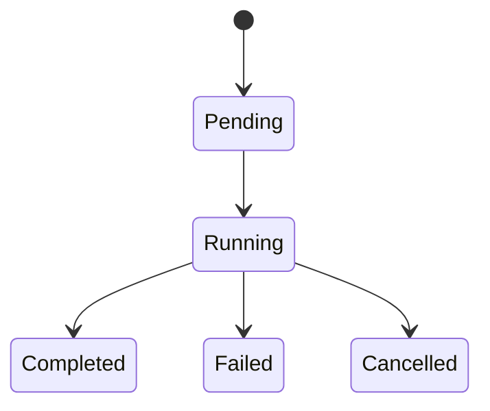

# SentinelAI Planner Service

> This document defines the backend service responsible for coordinating investigation workflows within SentinelAI. The Planner Service orchestrates backend services while remaining independent of AI reasoning and language model implementation.

---

# 1. Purpose

The Planner Service coordinates backend workflows initiated by the Planner Agent.

Rather than performing investigation reasoning, the service executes investigation plans by interacting with backend services.

The Planner Service acts as the orchestration layer between AI components and backend infrastructure.

Its primary objective is reliable workflow execution.

---

# 2. Responsibilities

The Planner Service is responsible for:

- coordinating investigation workflows
- executing investigation tasks
- invoking backend services
- monitoring workflow execution
- collecting service responses
- returning execution results

The Planner Service executes plans.

It does not generate plans.

---

# 3. High-Level Architecture

---

# 4. Service Boundaries

The Planner Service intentionally limits its responsibilities.

Maintaining clear service boundaries improves modularity and simplifies workflow execution.

---

## The Planner Service Is Responsible For

- workflow execution
- service orchestration
- execution monitoring
- task coordination

---

## The Planner Service Is Not Responsible For

- AI reasoning
- graph processing
- memory persistence
- report generation
- language model interaction

These responsibilities belong to other architectural components.

---

# 5. Workflow Ownership

The Planner Service owns workflow execution.

Workflow ownership does not imply ownership of investigation data.

Business data always remains within the responsible backend service.

It does not own investigation knowledge.

Knowledge remains within dedicated backend services.

---

## Workflow Responsibilities

The Planner Service:

- receives execution plans
- invokes backend services
- coordinates execution order
- aggregates execution results
- returns execution summaries

---

## Service Coordination

The Planner Service may coordinate:

- Memory Service
- Graph Service
- Investigation Service
- Future backend services

The Planner Service should not bypass service boundaries.

---

# 6. Core Operations

The Planner Service exposes workflow orchestration capabilities to AI components.

Operations focus on execution rather than decision-making.

---

## Workflow Operations

Supported operations include:

- start workflow
- execute workflow step
- pause workflow
- resume workflow
- cancel workflow
- complete workflow

Workflow execution should remain observable throughout its lifecycle.

---

## Task Coordination

Supported operations include:

- dispatch service requests
- monitor task execution
- collect execution results
- detect execution failures

Task coordination should remain deterministic whenever possible.

Task execution should preserve execution order whenever workflow dependencies exist.

---

## Execution Monitoring

The Planner Service monitors:

- workflow progress
- service availability
- execution status
- task completion

Execution state should remain continuously observable.

---

# 7. Workflow Execution

Workflow execution follows a consistent orchestration process.

Workflow execution is orchestration-oriented.

The Planner Service coordinates backend services without becoming the owner of their data or business logic.

---

# 8. Service Coordination

The Planner Service coordinates backend services without assuming ownership of their data.

Each backend service remains responsible for its own business domain.

---

## Sequential Execution

Some workflows require services to execute in a predefined order.

Execution order should preserve workflow correctness.

---

## Parallel Execution

Independent service requests may execute concurrently.

Parallel execution should reduce investigation latency without affecting correctness.

---

## Result Aggregation

Execution results are combined into a unified workflow response.

The Planner Service should preserve the origin of every service response.

Aggregation should not modify business data.

Aggregated results should preserve the originating service for every returned artifact.

---

# 9. Failure Management

Workflow execution should remain resilient to individual service failures.

Failures should be isolated whenever possible.

---

## Service Failure

Failure of one backend service should not automatically terminate the entire workflow.

Recovery strategies should be workflow-dependent.

---

## Retry Strategy

Temporary failures may trigger controlled retry mechanisms.

Retries should remain observable.

---

## Partial Results

When appropriate, the Planner Service may return partial workflow results.

Returned responses should clearly indicate incomplete execution.

---

## Timeout Handling

Long-running service operations should respect configurable timeout policies.

Timeouts should remain explicit rather than silent.

---

# 10. Workflow State

Every workflow progresses through observable execution states.

Workflow state enables monitoring, debugging and recovery.

---

## Workflow Lifecycle

---

## State Transitions

State transitions should be deterministic.

Every transition should be recorded for auditability.

---

## Recovery

Interrupted workflows should support controlled recovery whenever possible.

Recovery should preserve workflow consistency.

Recovered workflows should resume from the last consistent execution state whenever possible.

---

# 11. Service Contract

The Planner Service exposes a consistent workflow execution interface to AI components.

Backend workflows should always be executed through the Planner Service.

---

## Inputs

The Planner Service may receive:

- execution plans
- workflow requests
- investigation context
- execution constraints
- planner instructions

Requests should contain sufficient information to execute deterministic workflows.

---

## Outputs

The Planner Service may return:

- workflow status
- execution results
- service responses
- execution metadata
- workflow summary

Returned data should remain independent of backend service implementations.

---

## Success Criteria

Successful execution should:

- preserve workflow consistency
- coordinate backend services correctly
- expose execution metadata
- return deterministic workflow results

---

## Failure Conditions

Examples include:

- unavailable backend services
- workflow validation failures
- execution timeouts
- incomplete service responses

Failures should remain observable and recoverable.

---

# 12. Workflow Validation

The Planner Service validates workflows before execution.

Validation prevents invalid execution plans from consuming backend resources.

---

## Plan Validation

Validation includes:

- required workflow steps
- supported operations
- valid execution order
- service availability
- duplicate workflow steps

---

## Dependency Validation

Workflow dependencies should be satisfied before execution begins.

Invalid dependency chains should prevent workflow execution.

---

## Constraint Validation

Execution constraints should be verified before dispatching backend requests.

Validation failures should be reported explicitly.

---

# 13. Performance Considerations

The Planner Service should optimize workflow execution without compromising correctness.

---

## Parallel Execution

Independent service operations should execute concurrently whenever possible.

Parallel execution should only be used when service dependencies allow concurrent execution.

---

## Scheduling

Workflow scheduling should minimize unnecessary waiting between backend services.

---

## Resource Utilization

The Planner Service should avoid unnecessary service invocations.

Only required backend services should participate in a workflow.

---

## Monitoring

Workflow execution metrics should remain observable for performance analysis and optimization.

---

# 14. Future Evolution

Future Planner Service capabilities may include:

- dynamic workflow optimization
- priority-based scheduling
- distributed workflow execution
- workflow templates
- event-driven orchestration
- adaptive execution strategies
- workflow checkpoints

Future capabilities should extend workflow orchestration without changing service responsibilities.

---

# 15. Design Principles Applied

The Planner Service follows the engineering principles established throughout SentinelAI.

| Principle | Planner Service Application |
|-----------|-----------------------------|
| Separation of Responsibilities | Workflow execution is isolated from AI reasoning and backend persistence. |
| Modularity | Backend services are orchestrated through a dedicated workflow service. |
| Explainability | Workflow execution preserves execution history and service responses. |
| Scalability | Independent backend services may execute concurrently. |
| Technology Independence | Workflow orchestration remains independent of specific frameworks or messaging systems. |
| Reliability | Workflow execution supports validation, monitoring and controlled recovery. |
| Architecture Before Framework | Service behavior is defined independently of orchestration libraries. |

---

# Closing Statement

The Planner Service provides the orchestration layer connecting AI decision-making with backend execution.

By coordinating backend services through well-defined workflows, SentinelAI achieves reliable, observable and scalable investigation execution while preserving clear service boundaries.

Future implementations may introduce new orchestration technologies or execution models.

However, the workflow responsibilities defined in this document should remain stable regardless of implementation details.

---

# Version History

| Version | Date | Description |
|----------|------------|--------------------------------|
| 1.0.0 | 2026-06-26 | Initial Planner Service specification created |