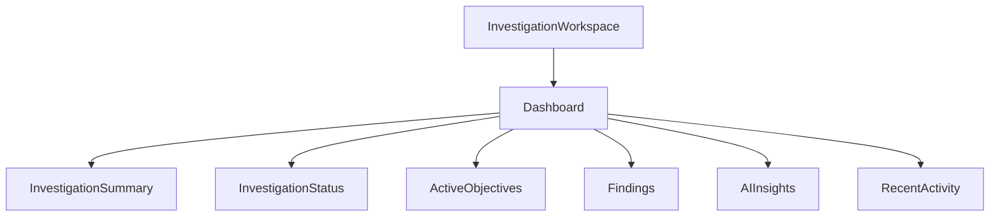
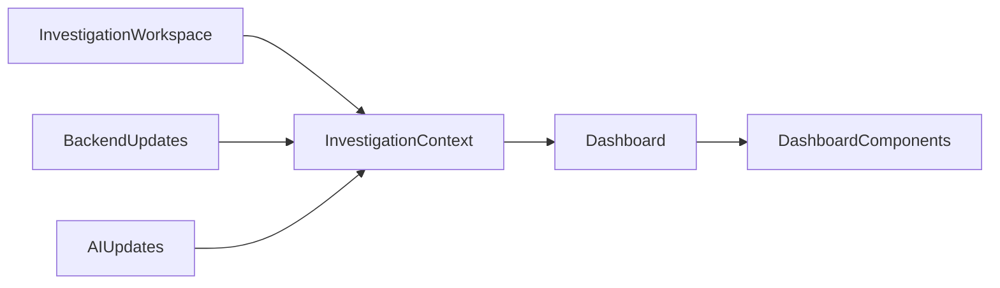

# Dashboard Architecture

> This document defines the architectural design of the Investigation Dashboard within SentinelAI. It specifies how high-level investigation information is organized, prioritized and presented to analysts while remaining independent of implementation technologies.

---

# 1. Purpose

The Investigation Dashboard provides analysts with a high-level operational view of the current investigation.

Rather than serving as a detailed analysis interface, the dashboard summarizes investigation progress, highlights significant findings and presents information that supports rapid situational awareness.

The dashboard enables analysts to quickly understand the current state of an investigation before transitioning to detailed workspace regions such as evidence exploration, relationship analysis or AI-generated insights.

It complements the Investigation Workspace by providing an overview of investigation activity while preserving a consistent investigation context.

---

# 2. Design Goals

The Investigation Dashboard is designed to achieve the following architectural goals.

## Situational Awareness

The dashboard should communicate the current investigation state at a glance.

Analysts should be able to identify important investigation developments without navigating through multiple workspace regions.

---

## Investigation-Centric Perspective

Information should be organized around the current investigation rather than individual system features.

Every dashboard component should contribute to understanding the investigation as a whole.

---

## Information Prioritization

The dashboard should emphasize the most relevant investigation information.

Critical findings, active investigation objectives and emerging risks should receive greater visual prominence than secondary information.

---

## Explainable Investigation Status

Dashboard summaries should remain traceable to the underlying investigation evidence.

High-level information should always allow analysts to navigate toward supporting investigation details.

---

## Progressive Exploration

The dashboard should encourage deeper investigation rather than replace detailed analysis.

It should function as the starting point for investigation activities while allowing analysts to transition naturally into specialized workspace regions.

---

## Extensible Design

The dashboard should support future investigation metrics, analytical summaries and visualization capabilities without requiring architectural redesign.

---

# 3. Architectural Role

The Investigation Dashboard serves as the primary summary layer within the Investigation Workspace.

The dashboard acts as the primary entry point into detailed investigation workflows but does not replace specialized workspace regions.

It consolidates investigation information from multiple workspace regions into a coherent operational overview while remaining independent of business logic and AI reasoning.

The dashboard is responsible for:

- presenting investigation summaries
- highlighting investigation progress
- surfacing important findings
- improving analyst situational awareness
- providing entry points into detailed investigation workflows

The dashboard presents operational summaries only.

Detailed investigation workflows remain within dedicated workspace regions.

The dashboard does not own investigation data, perform analytical processing or execute business operations.

These responsibilities remain within backend services and AI components.

The Dashboard Architecture therefore defines how investigation information is summarized and presented rather than how investigation data is generated.

---

# 4. Dashboard Composition

The Investigation Dashboard is composed of multiple logical components that collectively provide a high-level overview of the current investigation.

Each component presents a specific category of investigation information while remaining synchronized with the shared Investigation Context.

The dashboard summarizes investigation state rather than exposing detailed analytical workflows.

Dashboard components should remain modular.

New dashboard components may be introduced without changing the overall dashboard architecture.

Every component should contribute to analyst situational awareness rather than duplicate functionality already provided by other workspace regions.

---

# 5. Dashboard Components

The Investigation Dashboard consists of specialized components that present different perspectives of the current investigation.

## Investigation Summary

Provides an overall summary of the investigation.

Typical information includes:

- investigation identifier
- current status
- investigation priority
- assigned analyst
- investigation progress

---

## Investigation Status

Communicates the operational state of the investigation.

Examples include:

- in progress
- awaiting validation
- completed
- paused

---

## Active Objectives

Displays the current investigation objectives.

Objectives help analysts understand what remains to be completed before the investigation can be finalized.

---

## Findings

Highlights confirmed investigation findings.

Only confirmed findings should appear within this component.

**Definition (normative):** a finding is *confirmed* when its lifecycle status is **Validated** or **Accepted** (Domain Model, Finding lifecycle). This is a presentation filter over domain lifecycle states — it introduces no new business state, and its definition is owned by this document, realized in the frontend's communication layer (view-model mapping). Any other investigation-scoped derivation that classifies findings (for example, graph seeding) must reuse this same definition.

Supporting evidence remains accessible through other workspace regions.

---

## AI Insights

Provides summarized AI-generated observations relevant to the investigation.

Insights should remain concise and always be supported by traceable investigation evidence.

---

## Recent Activity

Summarizes recent investigation events.

Examples include:

- newly collected evidence
- recent graph updates
- timeline changes
- completed validation steps
- newly generated recommendations

The Recent Activity component provides awareness of investigation progress without requiring analysts to inspect detailed history.

---

# 6. Investigation Summary

The Investigation Summary represents the highest level of investigation abstraction presented within the dashboard.

Its purpose is to communicate the current state of the investigation quickly and consistently.

The summary should provide sufficient information for analysts to determine whether additional investigation is required.

Information presented in the Investigation Summary should remain concise and avoid exposing implementation-specific details.

The summary complements detailed investigation views rather than replacing them.

Every summary element should provide a clear navigation path toward the corresponding detailed workspace region when deeper analysis is required.

The Investigation Summary provides an aggregated overview of the investigation rather than reporting its operational state.

---

# 7. Situational Awareness

The primary objective of the Investigation Dashboard is to maintain continuous situational awareness throughout the investigation lifecycle.

Rather than presenting every available investigation artifact, the dashboard communicates the current operational state through carefully selected high-level information.

Situational awareness enables analysts to quickly understand:

- the current investigation status
- active investigation priorities
- recent investigation progress
- significant findings
- AI-generated observations requiring attention

The dashboard should continuously reflect the current Investigation Context while avoiding unnecessary information overload.

Every dashboard component should contribute to a coherent understanding of the investigation rather than operate as an isolated information source.

---

# 8. Information Prioritization

The Investigation Dashboard should prioritize information according to its relevance to the current investigation.

Information importance should be determined by investigation context rather than fixed presentation order.

Examples of high-priority information include:

- critical investigation findings
- active security incidents
- investigation blockers
- analyst actions requiring attention
- validated AI recommendations

Lower-priority information should remain accessible without competing for analyst attention.

The dashboard should emphasize information that assists decision-making while reducing visual noise.

Prioritization should adapt naturally as the Investigation Context evolves throughout the investigation lifecycle.

---

# 9. Dashboard Refresh Model

The Investigation Dashboard reflects the current state of the Investigation Workspace.

It should remain synchronized with investigation changes without requiring manual refresh by the analyst.

Dashboard updates may be triggered by:

- investigation state changes
- newly collected evidence
- validated findings
- AI-generated recommendations
- graph updates
- timeline updates
- analyst interactions

Dashboard refreshes should update only the components affected by the underlying investigation changes.

Unrelated dashboard components should remain unchanged to preserve analyst focus and reduce unnecessary interface updates.

The Dashboard Architecture defines when dashboard information should be refreshed.

The implementation mechanism responsible for performing these updates is intentionally left outside the scope of this document.

---

# 10. Interaction Principles

The Investigation Dashboard should support efficient investigation workflows by enabling analysts to move naturally from high-level summaries to detailed analysis.

Dashboard interactions should assist investigation rather than interrupt analytical reasoning.

The dashboard follows the following interaction principles.

## Context-Aware Navigation

Dashboard interactions should preserve the current Investigation Context.

Selecting dashboard information should transition analysts to the appropriate workspace region without losing investigation state.

---

## Progressive Disclosure

The dashboard should initially present summarized information.

Additional investigation details should become available only when analysts intentionally explore specific investigation artifacts.

This approach reduces visual complexity while preserving access to comprehensive investigation information.

---

## Explainable Navigation

Every dashboard summary should provide a clear path to its supporting investigation data.

Analysts should always be able to trace dashboard information back to the underlying investigation evidence.

---

## Consistent Interaction

Dashboard components should behave consistently throughout the Investigation Workspace.

Similar investigation actions should produce predictable navigation and interaction behavior regardless of the originating dashboard component.

---

# 11. Extensibility

The Investigation Dashboard is designed to evolve together with the Investigation Workspace.

Future dashboard capabilities should integrate through existing architectural principles without changing the dashboard's core responsibilities.

New dashboard components should:

- support the Investigation Context
- participate in dashboard synchronization
- remain modular and independently evolvable
- avoid introducing business logic
- preserve consistent interaction behavior

The dashboard architecture encourages incremental expansion while maintaining a unified investigation experience.

---

# 12. Future Evolution

Future versions of the Investigation Dashboard may introduce:

- customizable dashboard layouts
- analyst-specific dashboard views
- collaborative investigation dashboards
- adaptive information prioritization
- AI-assisted investigation summaries
- organization-specific dashboard modules
- operational health indicators

Future enhancements should extend dashboard capabilities without changing the architectural role established by this document.

The Investigation Dashboard should continue serving as the primary investigation summary layer within the Investigation Workspace regardless of future platform evolution.

Future enhancements should remain compatible with the Investigation Workspace architecture and shared Investigation Context.

---

# 13. Design Principles Applied

The Investigation Dashboard follows the engineering principles established throughout SentinelAI.

| Principle | Dashboard Architecture Application |
|-----------|------------------------------------|
| Human-Centered AI | The dashboard supports analyst decision-making without replacing human judgment. |
| Explainability | Dashboard summaries remain traceable to supporting investigation evidence. |
| Separation of Responsibilities | The dashboard presents investigation information without performing business operations or AI reasoning. |
| Modularity | Dashboard components evolve independently while remaining coordinated through the Investigation Context. |
| Consistency | Dashboard behavior remains synchronized with the Investigation Workspace and follows consistent interaction patterns. |
| Scalability | Additional dashboard components and investigation summaries can be introduced without architectural redesign. |
| Architecture Before Framework | Dashboard behavior is defined independently of implementation technologies and user interface frameworks. |

---

# Closing Statement

The Investigation Dashboard provides the primary operational summary of an investigation within SentinelAI.

By organizing investigation information into a coherent, prioritized and context-aware overview, the dashboard enables analysts to rapidly understand investigation status and transition naturally into detailed analytical workflows.

The Dashboard Architecture complements the Investigation Workspace by defining how high-level investigation information is structured, synchronized and presented throughout the investigation lifecycle.

Future implementations may introduce additional dashboard capabilities and visualization techniques while preserving the architectural responsibilities established by this document.

---

# Version History

| Version | Date | Description |
|----------|------------|--------------------------------|
| 1.0.0 | 2026-06-27 | Initial Dashboard Architecture specification created |
| 1.1.0 | 2026-07-03 | "Confirmed finding" defined normatively (Validated or Accepted) with explicit ownership: a presentation filter over domain lifecycle states, realized in the frontend communication layer |