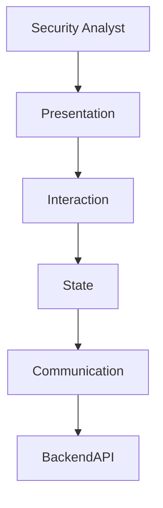
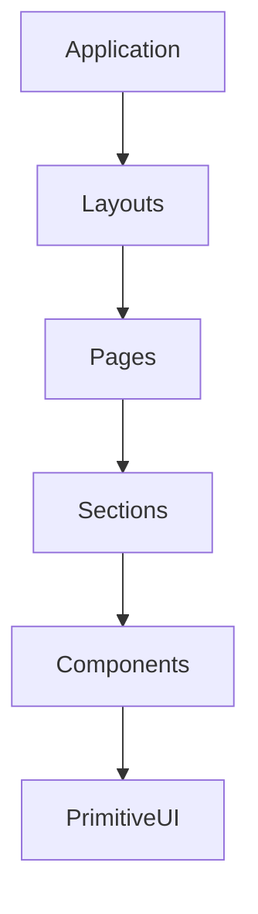
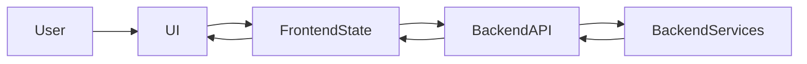
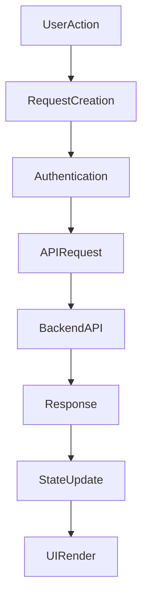
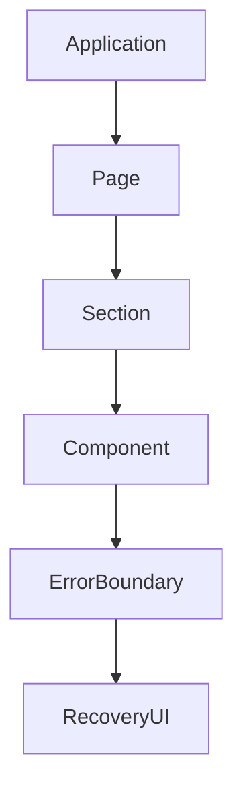
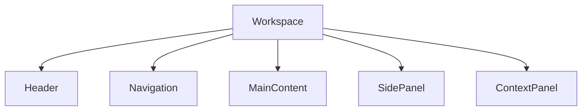

# SentinelAI Frontend Architecture

> This document defines the frontend architecture of SentinelAI. It describes how the user interface is organized, how it communicates with backend services, and how it presents AI-assisted cybersecurity investigations while remaining independent of specific frontend technologies.

---

# 1. Purpose

The frontend architecture defines how cybersecurity analysts interact with SentinelAI throughout the investigation lifecycle.

Unlike backend services, which own business capabilities and investigation logic, the frontend is responsible for presenting information, collecting analyst input and supporting efficient investigation workflows.

This document establishes the architectural responsibilities of the presentation layer independently of implementation technologies.

Its objective is to ensure that future frontend implementations preserve consistent user experience, clear responsibility boundaries and long-term maintainability.

The frontend architecture complements the backend, AI and domain architectures already defined within SentinelAI.

Rather than redefining existing concepts, it explains how those architectural capabilities are exposed to analysts through a coherent user interface.

The frontend should evolve independently from backend implementation details while remaining compatible with the platform's architectural principles.

---

# 2. Architectural Goals

The frontend architecture is designed according to the following goals.

## Analyst Productivity

The interface should reduce investigation complexity by presenting only the information required for the current investigation step.

The system should minimize unnecessary navigation while allowing analysts to move efficiently between related investigation artifacts.

---

## Explainability

Every AI-generated recommendation should be accompanied by sufficient supporting evidence.

Analysts should always understand:

- where information originated
- which evidence supports conclusions
- which AI components contributed to a recommendation
- overall confidence of the investigation

The frontend should visualize reasoning rather than simply displaying answers.

---

## Separation of Responsibilities

Presentation responsibilities remain within the frontend.

Business logic remains within backend services.

Reasoning remains within the AI Runtime.

The frontend should never duplicate responsibilities owned by other architectural layers.

---

## Consistency

Similar investigation concepts should always be represented consistently throughout the interface.

Navigation patterns, terminology and interaction models should remain predictable across the application.

---

## Scalability

The frontend should accommodate increasing investigation complexity without requiring architectural redesign.

New investigation capabilities should extend existing interface patterns rather than introducing unrelated interaction models.

---

## Technology Independence

Architectural responsibilities defined in this document should remain valid regardless of the frontend framework eventually selected for implementation.

---

# 3. Relationship to the Overall Architecture

The frontend represents the presentation layer of SentinelAI.

It does not own investigations, business rules or AI reasoning.

Instead, it exposes capabilities implemented by backend services through a consistent and intuitive user experience.

The frontend consumes the platform architecture rather than redefining it.

Responsibilities defined in other architectural documents remain authoritative.

Examples include:

- Domain objects defined in `domain-model.md`
- Backend responsibilities defined in the backend architecture
- AI coordination defined in `agent-architecture.md`
- API communication defined in `api-design.md`

This document therefore focuses exclusively on presentation concerns.

Whenever architectural responsibilities overlap, ownership always remains with the originating architectural document.

---

# 4. Frontend Responsibilities

The frontend serves as the presentation layer of SentinelAI.

Its primary objective is to enable cybersecurity analysts to interact with investigations efficiently while preserving the architectural boundaries established throughout the platform.

The frontend coordinates user interaction but never owns investigation execution.

All business operations remain delegated to backend services through the Backend API.

The frontend is responsible for transforming backend capabilities into intuitive user experiences while preserving explainability and investigation traceability.

---

## User Interaction

The frontend provides all interaction between analysts and the platform.

Examples include:

- starting investigations
- exploring investigation progress
- reviewing AI findings
- navigating historical investigations
- managing investigation filters
- acknowledging recommendations

Every user action should produce predictable system behavior.

---

## Investigation Visualization

The frontend presents investigation information using visual representations appropriate for cybersecurity workflows.

Examples include:

- investigation timelines
- entity relationship graphs
- evidence summaries
- confidence indicators
- attack paths
- report visualizations

Visualization improves analyst understanding without changing investigation data.

---

## Context Preservation

Investigation context should remain visible throughout analyst workflows.

Analysts should not lose important information while navigating between different investigation views.

Examples include:

- selected investigation
- current evidence
- active filters
- selected entities
- investigation progress

Maintaining context reduces cognitive load during complex investigations.

---

## AI Transparency

The frontend is responsible for presenting AI reasoning in an understandable manner.

Whenever possible, recommendations should include:

- supporting evidence
- contributing agents
- confidence estimates
- unresolved questions
- investigation history

The frontend should expose sufficient context for analysts to evaluate AI-generated recommendations.

---

## Collaboration Support

Although collaboration mechanisms may evolve over time, the frontend should be designed to accommodate future collaborative investigation workflows.

Potential capabilities include:

- shared investigations
- analyst comments
- investigation handoffs
- review workflows

Collaboration features should extend existing interaction patterns rather than introducing separate workflows.

---

## Responsibilities Outside Frontend Scope

The frontend never performs:

- investigation planning
- AI reasoning
- decision synthesis
- evidence persistence
- graph computation
- organizational memory management
- direct database communication

These responsibilities remain owned by backend services and the AI Runtime.

---

# 5. High-Level Frontend Architecture

The frontend is organized as a layered presentation architecture.

Each layer owns a specific responsibility and communicates only with adjacent architectural layers.

Separating responsibilities reduces coupling, simplifies maintenance and enables independent evolution of frontend capabilities.

---

## Layer Responsibilities

| Layer | Responsibility |
|---------|----------------|
| Presentation | Renders pages, components and visualizations. |
| Interaction | Processes user actions and UI events. |
| State | Maintains client-side application state. |
| Communication | Communicates with Backend APIs. |

Each layer should expose well-defined interfaces to adjacent layers.

Business logic should never migrate into Presentation or Interaction layers.

---

## Architectural Principles

The frontend architecture follows several architectural constraints.

### Layer Isolation

Each layer should remain responsible only for its own concerns.

Communication should always flow through defined interfaces.

---

### Backend-Centric Business Logic

Business rules remain implemented exclusively within backend services.

The frontend consumes business capabilities but never reproduces them.

---

### Stateless Communication

Every backend request should contain sufficient context for execution.

The frontend should avoid maintaining hidden business state across requests.

---

### Technology Independence

The architectural layering defined in this document remains valid regardless of framework selection.

Future implementation technologies should conform to these responsibilities rather than redefining them.

---

# 6. UI Architecture

The SentinelAI user interface is organized around investigations rather than individual features.

Every screen should contribute to the investigation workflow while minimizing unnecessary navigation.

The interface should prioritize context preservation, explainability and rapid analyst decision-making.

Rather than exposing backend implementation details, the frontend presents business capabilities through cohesive user experiences.

---

## Design Philosophy

The interface should support investigation-driven workflows.

Users should think in terms of investigations rather than services, APIs or AI agents.

Examples include:

- investigate an incident
- inspect evidence
- review findings
- explore relationships
- validate recommendations

The frontend should hide implementation complexity whenever possible.

---

## Progressive Disclosure

Cybersecurity investigations often involve large amounts of information.

Presenting everything simultaneously increases cognitive load.

Instead, the interface should progressively reveal information.

Typical progression includes:

1. Investigation Summary
2. Key Findings
3. Supporting Evidence
4. Detailed Relationships
5. Raw Investigation Data

Analysts should always be able to navigate from summaries to supporting details.

---

## Explainable Presentation

Every AI-generated recommendation should expose sufficient supporting context.

Examples include:

- contributing agents
- supporting findings
- supporting evidence
- confidence estimation
- investigation timeline
- graph relationships

Recommendations should never appear as unexplained AI outputs.

---

## Workspace-Oriented Design

The Investigation Workspace represents the primary operating environment.

The Investigation Dashboard forms the summary layer of the Investigation Workspace and provides analysts with an overview of the current investigation.

Rather than opening many unrelated pages, analysts should remain within a single investigation workspace whenever practical.

Supporting panels may expose:

- evidence
- findings
- graph exploration
- reports
- memory retrieval
- analyst notes

Maintaining a unified workspace reduces context switching.

---

# 7. Application Structure

The frontend follows a hierarchical application structure.

Responsibilities become increasingly specialized toward lower architectural layers.

---

## Application

The Application represents the complete frontend.

Responsibilities include:

- application initialization
- global configuration
- authentication initialization
- routing initialization
- global providers

---

## Layouts

Layouts establish consistent page organization.

Typical layouts include:

- Main Application Layout
- Investigation Layout
- Authentication Layout
- Settings Layout

Layouts should define structure rather than business behavior.

---

## Pages

Pages represent complete business capabilities.

Examples include:

- Investigation Workspace
- Investigation History
- Reports
- Administration
- Settings

The Investigation Workspace serves as the primary operational environment for analyst activities.

Within the workspace, the Investigation Dashboard provides a high-level summary of the current investigation before analysts transition into detailed workspace regions.

Pages coordinate sections but should avoid implementing reusable business logic.

---

## Sections

Sections divide pages into logical regions.

Examples include:

- Timeline Panel
- Findings Panel
- Graph Panel
- Evidence Panel
- Memory Panel
- Recommendation Panel

Sections improve readability while reducing component complexity.

---

## Components

Components implement reusable interface elements.

Examples include:

- Evidence Card
- Finding Card
- Timeline Event
- Entity Badge
- Confidence Indicator
- Recommendation Card

Components should remain reusable across multiple pages whenever practical.

---

## Primitive UI

Primitive UI elements provide the lowest architectural layer.

Examples include:

- buttons
- inputs
- dialogs
- tables
- badges
- icons
- typography

Primitive components should contain no SentinelAI-specific business knowledge.

---

# 8. State Management Philosophy

SentinelAI distinguishes multiple categories of frontend state.

Each category has a different lifecycle, owner and synchronization strategy.

Separating state according to responsibility improves maintainability, reduces unintended coupling and simplifies future frontend evolution.

The frontend should never treat all application data as a single shared state.

---

## State Categories

The frontend architecture distinguishes four primary categories of state.

---

## Investigation Context

Represents the shared operational context of the current investigation.

Examples include:

- investigation identifier
- selected entity
- selected evidence
- selected finding
- active timeline position
- investigation objectives
- shared investigation filters
- analyst focus

The Investigation Context coordinates behavior across the Investigation Workspace.

---

## View State

Represents temporary presentation information owned by an individual workspace region.

Examples include:

- panel visibility
- expanded sections
- active tabs
- sorting preferences
- local view filters

View State affects presentation only and does not alter investigation semantics.

---

## Session State

Session State represents information associated with the analyst rather than a specific investigation.

Examples include:

- preferred language
- theme
- UI preferences
- notification preferences
- workspace personalization

Session State should remain independent of investigation-specific state.

---

## Derived State

Derived State is calculated from existing authoritative frontend state.

Examples include:

- dashboard summaries
- visualization highlights
- aggregated investigation statistics
- filtered investigation results

Derived State should always be reproducible and should never become an authoritative source of information.

---

## Server-State (Cached Backend Data)

Backend-owned business information consumed by the frontend is cached, not owned. Server-state is a distinct concern from the four client-owned state categories above: the backend remains the authoritative source, and the frontend holds only a cached representation with its own freshness and invalidation lifecycle.

Cached server-state should be refreshed or invalidated rather than mutated in place, consistent with the ownership principle that the frontend caches business information rather than owning it.

The detailed ownership, synchronization and lifecycle of frontend state are defined in the **UI State Management** document.

---

## Ownership Principles

Every piece of frontend state should have exactly one owner.

Duplicating ownership increases synchronization complexity and reduces predictability.

Whenever uncertainty exists, ownership should remain with the backend.

The frontend should cache business information rather than owning it.

---

# 9. Frontend Data Flow

The frontend processes information through a predictable data flow.

Every user interaction eventually results in one of three outcomes:

- UI updates
- backend communication
- investigation context updates

The frontend should avoid hidden data flows or implicit state modifications.

---

## High-Level Data Flow

---

## Request Lifecycle

Every user action follows a consistent lifecycle.

1. User interaction occurs.
2. Frontend validates interaction.
3. Backend request is issued if required.
4. Backend returns updated business data.
5. Frontend updates presentation.
6. Investigation context is refreshed if necessary.

This lifecycle should remain consistent across the application.

---

## Optimistic vs Confirmed Updates

The frontend should distinguish between temporary UI feedback and confirmed backend state.

Visual feedback may occur immediately.

Business state should only change after backend confirmation.

This distinction prevents inconsistencies between client and server representations.

---

## Investigation Refresh Strategy

Different investigation panels may require different refresh frequencies.

Examples include:

- graph visualization
- timeline
- findings
- recommendations
- reports

Refreshing should remain incremental whenever possible.

The frontend should avoid reloading entire investigations after small updates.

---

## Traceability

Frontend updates should preserve traceability.

Whenever business information changes, analysts should be able to determine:

- when the change occurred
- why the change occurred
- which backend capability produced the change
- whether AI components contributed to the update

Traceability supports explainability and analyst trust.

---

# 10. Communication Architecture

The frontend communicates with the platform exclusively through the Backend API.

No frontend component should communicate directly with backend services, databases or external providers.

This architectural boundary preserves encapsulation, simplifies maintenance and enables backend evolution without affecting the user interface.

---

## Communication Principles

Every request should satisfy the following principles:

- stateless communication
- explicit request ownership
- predictable responses
- standardized error handling
- observable execution

Frontend communication should remain independent of backend implementation details.

---

## API Boundary

The Backend API represents the single communication boundary between the frontend and the platform.

The frontend should never require knowledge of internal service architecture.

---

## Request Lifecycle

Every request should follow a consistent lifecycle.

Maintaining a consistent lifecycle simplifies debugging and improves user experience.

---

## Authentication

Authentication information should be attached automatically to outgoing requests.

Individual UI components should never manage authentication directly.

Authentication responsibilities belong to the communication layer.

---

## Request Isolation

Frontend components should not communicate independently with backend services when a shared communication layer already exists.

Centralizing request execution provides:

- consistent authentication
- unified logging
- standardized error handling
- easier monitoring
- reusable communication logic

---

## Cancellation

Long-running requests should be cancellable.

Examples include:

- investigation switching
- navigation
- repeated searches
- graph exploration

Cancelling obsolete requests prevents unnecessary backend load while improving responsiveness.

---

## Timeouts

Every request should define reasonable timeout behavior.

Timeout handling should provide meaningful feedback rather than leaving the interface indefinitely waiting.

---

## Retry Strategy

Retry behavior should remain explicit.

Suitable examples include:

- temporary network failures
- transient backend availability issues

Business validation failures should never be retried automatically.

---

# 11. Error Handling Strategy

Errors should be treated as expected operational events rather than exceptional situations.

The frontend should present errors clearly while preserving investigation context whenever possible.

Unexpected failures should never terminate the entire user experience.

---

## Error Categories

The frontend distinguishes multiple error categories.

### User Errors

Examples include:

- invalid input
- missing required fields
- unsupported actions

These errors should provide immediate corrective guidance.

---

### Communication Errors

Examples include:

- connection failures
- request timeout
- unavailable backend services

Communication errors should clearly indicate that investigation data may be incomplete.

---

### Authorization Errors

Examples include:

- expired sessions
- insufficient permissions
- authentication failures

Authentication-related errors should redirect users through appropriate recovery workflows.

---

### Unexpected Errors

Unexpected failures should be isolated whenever possible.

Individual interface failures should not affect unrelated investigation components.

---

## Error Boundaries

The frontend should isolate failures using architectural error boundaries.

Localized failures improve resilience during complex investigations.

---

## Recovery Principles

Whenever practical, users should be able to recover without restarting the entire investigation.

Recovery actions may include:

- retry request
- refresh component
- reload investigation
- continue working with available information

The frontend should prioritize graceful degradation over complete failure.

---

## Observability

Unexpected frontend failures should remain observable.

Diagnostic information should support future debugging without exposing sensitive implementation details to analysts.

---

# 12. Investigation Workspace Concept

The Investigation Workspace represents the primary operating environment of SentinelAI.

Rather than navigating across many disconnected pages, analysts perform most investigation activities within a unified workspace.

The workspace maintains investigation context while exposing different analytical perspectives through coordinated interface regions.

This approach reduces cognitive load and improves investigation efficiency.

---

## Objectives

The Investigation Workspace is designed to:

- preserve investigation context
- minimize unnecessary navigation
- provide rapid access to investigation information
- expose AI-generated recommendations
- support explainable decision-making

The workspace should become the central location for analyst activities.

---

## Workspace Organization

A typical investigation workspace consists of multiple coordinated regions.

Each region serves a distinct purpose while contributing to a single investigation experience.

---

## Investigation Header

The header summarizes the current investigation.

Typical information includes:

- investigation identifier
- current status
- priority
- confidence level
- assigned analyst
- creation time

The header should remain visible throughout the investigation whenever practical.

---

## Main Investigation Area

The main area displays the analyst's current working context.

Depending on the selected task, it may contain:

- timeline analysis
- graph visualization
- evidence exploration
- investigation findings
- generated reports

Only one primary investigation perspective should occupy the main working area at a time.

---

## Supporting Panels

Supporting panels provide contextual information without interrupting the primary workflow.

Examples include:

- evidence details
- entity information
- related findings
- investigation history
- memory suggestions
- analyst notes

Supporting panels should remain synchronized with the active investigation context.

---

## Workspace Context

The workspace should preserve context while analysts switch between different investigation perspectives.

Context includes:

- investigation identifier
- selected evidence
- selected entity
- selected finding
- graph position
- timeline position
- shared investigation filters
- analyst focus

Changing views should not unnecessarily reset investigation context.

---

# 13. Navigation Architecture

Navigation should reflect investigation workflows rather than backend implementation.

Analysts should move naturally between related investigation activities without understanding internal platform structure.

---

## Primary Navigation

Primary navigation exposes the major platform capabilities.

Examples include:

- Dashboard
- Investigations
- Reports
- Knowledge
- Administration
- Settings

Primary navigation should remain stable as the platform evolves.

---

## Contextual Navigation

Within an investigation, navigation becomes context-sensitive.

Examples include:

- Timeline
- Evidence
- Findings
- Graph
- Recommendations
- Memory
- Report

Contextual navigation should preserve the current investigation.

Changing views should not restart investigation workflows.

---

## Deep Linking

Important investigation resources should support direct navigation.

Examples include:

- a specific investigation
- a particular finding
- an entity
- a report
- a graph node

Stable navigation improves collaboration and future sharing capabilities.

---

## Navigation Principles

Navigation should satisfy the following principles:

- predictable behavior
- minimal context loss
- low interaction cost
- investigation-centric organization
- consistency across the platform

Navigation should optimize analyst productivity rather than exposing technical architecture.

---

# 14. Rendering and Performance Strategy

Cybersecurity investigations often involve large datasets, complex graphs and continuously evolving investigation state.

The frontend should therefore prioritize responsiveness without sacrificing explainability or investigation accuracy.

Performance optimizations should improve analyst productivity rather than hide important information.

---

## Rendering Strategy

The frontend should render information incrementally whenever possible.

Large investigations should become usable immediately rather than waiting for every component to finish loading.

Rendering should prioritize:

- investigation summary
- current recommendations
- active workspace
- supporting investigation details

Secondary information may appear progressively.

---

## Progressive Rendering

Different interface regions may become available independently.

Typical loading order may include:

1. Investigation metadata
2. Summary information
3. Findings
4. Timeline
5. Graph visualization
6. Supporting evidence

Users should always understand which information has already been loaded.

---

## Lazy Loading

Heavy interface modules should be loaded only when required.

Examples include:

- graph visualization
- report viewer
- investigation history
- advanced analytics
- administration pages

Lazy loading reduces initial application startup time.

---

## Incremental Updates

Minor investigation updates should refresh only affected interface regions.

Examples include:

- new finding added
- recommendation updated
- graph expanded
- analyst comment added

Refreshing the entire workspace for small changes should be avoided whenever practical.

---

## Virtualization

Large datasets should avoid rendering every visible element simultaneously.

Typical candidates include:

- evidence tables
- investigation history
- alert lists
- entity collections
- log viewers

Virtualization improves responsiveness during large investigations.

---

## Caching Principles

Frontend caching should reduce unnecessary backend requests while preserving data consistency.

Cached information should always remain secondary to backend state.

Whenever uncertainty exists, backend information remains authoritative.

---

## Performance Monitoring

Performance should remain observable.

Examples include:

- page loading duration
- API response latency
- rendering duration
- interaction latency
- visualization performance

Performance metrics should support continuous frontend improvement.

---

# 15. Scalability and Extensibility

The frontend architecture should support long-term platform evolution without requiring fundamental redesign.

Future capabilities should integrate into existing architectural patterns whenever possible.

The introduction of new investigation capabilities should extend the current architecture rather than replace it.

---

## Feature Growth

New capabilities should be implemented as additional frontend modules.

Examples include:

- new investigation visualizations
- additional dashboards
- collaborative investigation tools
- AI assistants
- organization-specific extensions

Existing navigation and interaction models should remain stable.

---

## Component Evolution

Reusable components should evolve independently.

Changes to one component should minimize unintended impact on unrelated interface regions.

Component interfaces should remain stable whenever practical.

---

## Visualization Expansion

New visualization techniques may be introduced over time.

Potential examples include:

- attack path visualization
- infrastructure topology
- behavioral heatmaps
- investigation dependency graphs
- analyst activity timelines

The architecture should accommodate these capabilities without requiring significant structural changes.

---

## Multi-Tenant Readiness

Future deployments may support multiple organizations.

Frontend architecture should therefore avoid assumptions that limit future tenant isolation.

Tenant-specific customization should remain configurable rather than hardcoded.

---

## Internationalization

The architecture should support future localization requirements.

Examples include:

- language translation
- regional date formats
- timezone handling
- localized terminology

Internationalization should remain independent of business logic.

---

# 16. Frontend Security Principles

Although security enforcement belongs primarily to backend services, the frontend contributes to platform security through responsible interface design.

Security considerations should influence user interaction without becoming a substitute for backend enforcement.

---

## Secure Communication

All communication should occur through authenticated and encrypted channels.

Sensitive information should never appear in client-side logs or diagnostic messages.

---

## Session Protection

Authentication state should remain protected throughout the user session.

Unexpected session expiration should trigger controlled recovery workflows.

---

## Sensitive Information

The frontend should display only information authorized for the current analyst.

Sensitive investigation information should never remain visible after logout or session expiration.

---

## Client Validation

Frontend validation improves user experience.

Backend validation remains authoritative.

Client-side validation should never be considered a security boundary.

---

## Principle of Least Privilege

Interface elements should reflect the permissions granted to the authenticated analyst.

Unavailable capabilities should remain inaccessible through the user interface.

Permission-aware interfaces improve usability while reinforcing backend authorization policies.

---

## Security Awareness

Whenever security-relevant events occur, the interface should communicate them clearly.

Examples include:

- authentication failures
- expired sessions
- insufficient permissions
- unavailable secure resources

Security feedback should remain informative without exposing implementation details.

---

# 17. Accessibility

SentinelAI is intended for professional cybersecurity analysts who spend extended periods interacting with the platform.

Accessibility therefore improves both usability and long-term productivity.

The interface should remain usable across different devices, screen sizes and user needs.

---

## Keyboard Accessibility

Primary workflows should remain fully accessible using keyboard navigation.

Examples include:

- investigation navigation
- evidence selection
- search
- graph interaction
- report viewing

Keyboard shortcuts may be introduced for frequently used investigation tasks.

---

## Visual Accessibility

The interface should provide sufficient visual contrast for prolonged use.

Important investigation information should never rely solely on color.

Critical findings should be distinguishable through multiple visual indicators.

---

## Responsive Layout

The platform should support:

- desktop workstations
- laptops
- large displays

Mobile support may be limited to monitoring and lightweight investigation tasks.

Complex investigations are optimized for larger displays.

---

## Readability

Information should be presented using clear typography and consistent spacing.

Long investigation reports should remain easy to scan.

Complex information should be divided into manageable sections.

---

## Error Recovery

Validation errors should provide actionable guidance.

Users should understand:

- what happened
- why it happened
- how to resolve it

Error messages should improve productivity rather than interrupt investigations.

---

# 18. Future Evolution

The frontend architecture is expected to evolve together with SentinelAI.

Future capabilities should integrate into existing architectural patterns while preserving established design principles.

Evolution should prioritize architectural consistency over feature expansion.

---

## Planned Capabilities

Potential future enhancements include:

- collaborative investigations
- real-time analyst collaboration
- advanced graph analytics
- AI conversation workspace
- customizable dashboards
- investigation replay
- notification center
- plugin architecture

---

## AI Evolution

Future AI capabilities may introduce:

- conversational investigation assistants
- proactive recommendations
- adaptive workspace layouts
- investigation copilots

These additions should extend analyst workflows rather than replace them.

---

## Continuous Improvement

Frontend improvements should be guided by:

- analyst feedback
- usability testing
- performance metrics
- accessibility evaluations
- engineering reviews

Long-term evolution should strengthen consistency, maintainability and user experience.

---

# 19. Design Principles Applied

The Frontend Architecture follows the engineering principles established throughout SentinelAI.

| Principle | Frontend Application |
|-----------|----------------------|
| Human-Centered AI | The interface supports analyst decision-making rather than replacing human judgment. |
| Explainability | AI-generated findings are presented together with supporting evidence and reasoning context. |
| Separation of Responsibilities | Presentation logic remains independent from backend business logic and AI reasoning. |
| Modularity | User interface features are implemented as reusable and independently evolvable modules. |
| Scalability | The interface supports increasing investigation complexity without architectural redesign. |
| Security by Design | Authentication, authorization and secure interaction patterns are integrated into the user experience. |
| Accessibility | Core investigation workflows remain usable across different users and devices. |
| Architecture Before Framework | User experience and architectural responsibilities are defined independently of frontend technologies. |

---

# Closing Statement

The Frontend Architecture defines how cybersecurity analysts interact with SentinelAI throughout the investigation lifecycle.

By separating presentation concerns from backend services and AI reasoning, the architecture provides a modular, explainable and maintainable user experience.

Future implementations may introduce new interface technologies, visualization techniques and interaction models.

However, the architectural responsibilities and user experience principles defined in this document should remain stable regardless of implementation details.

The primary objective of the frontend is to present trustworthy investigation information that enables analysts to make informed security decisions efficiently and confidently.

---

# Version History

| Version | Date | Description |
|----------|------------|--------------------------------|
| 1.0.0 | 2026-06-27 | Initial Frontend Architecture specification created |
| 1.1.0 | 2026-07-02 | Clarified server-state (cached backend data) as a distinct concern from the owned client-state categories |