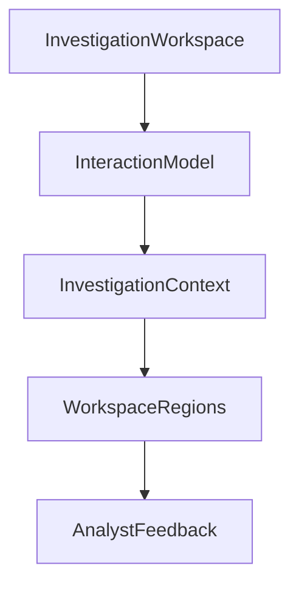
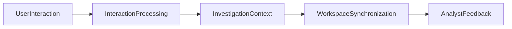

# Interaction Model

> This document defines the architectural interaction model governing analyst interactions within the SentinelAI Investigation Workspace. It establishes how user actions propagate through the workspace while remaining independent of implementation technologies.

---

# 1. Purpose

The Interaction Model defines how analyst interactions are interpreted, propagated and coordinated throughout the Investigation Workspace.

Rather than describing implementation-specific user interface events, this document establishes the architectural principles that govern interaction behavior across the SentinelAI frontend.

The Interaction Model ensures that every user action contributes to a coherent, predictable and investigation-oriented analytical workflow.

---

# 2. Design Goals

The Interaction Model is designed to achieve the following architectural goals.

## Consistent Interaction Behavior

Analysts should experience predictable interaction patterns throughout the Investigation Workspace.

Similar investigation actions should produce consistent outcomes regardless of the originating workspace region.

---

## Investigation-Centric Interaction

Every interaction should contribute to the current investigation.

Interactions should advance investigation understanding rather than manipulate isolated interface components.

---

## Context Preservation

Interactions should preserve the current Investigation Context whenever possible.

Temporary exploration should not disrupt investigation continuity.

---

## Cross-Region Coordination

Interactions initiated within one workspace region should propagate appropriately to other relevant regions through established architectural mechanisms.

Direct coupling between workspace regions should be avoided.

---

## Technology Independence

Interaction behavior should remain independent of presentation frameworks, event systems and user interface technologies.

Architectural interaction rules should remain stable regardless of implementation choices.

---

# 3. Architectural Role

The Interaction Model establishes the common architectural behavior governing analyst interactions across SentinelAI.

It defines how interactions influence the Investigation Workspace while preserving clear responsibility boundaries.

The Interaction Model is responsible for:

- coordinating interaction behavior
- defining interaction semantics
- supporting investigation workflows
- propagating investigation context
- preserving consistent analyst experience

The Interaction Model does not perform business operations, manage application state or execute investigation logic.

These responsibilities remain within backend services, the Investigation Workspace and dedicated state management mechanisms.

---

# 4. Interaction Architecture

The Interaction Model establishes a unified architectural framework for handling analyst interactions throughout the Investigation Workspace.

Rather than allowing each workspace region to define its own interaction behavior, the architecture provides a common interaction model shared by all frontend components.

Every interaction follows a consistent architectural flow.

The Interaction Model coordinates interaction behavior without becoming responsible for investigation state or business logic.

Interaction processing remains independent of user interface frameworks and rendering technologies.

---

# 5. Interaction Types

The Interaction Model defines a common set of interaction categories shared throughout the Investigation Workspace.

## Selection

Selection identifies the current investigation artifact.

Examples include:

- selecting an entity
- selecting evidence
- selecting a timeline event
- selecting a finding

Selections should update the shared Investigation Context.

Focus should be temporary and should not replace the current investigation selection unless explicitly confirmed by the analyst.

---

## Focus

Focus temporarily emphasizes a specific investigation artifact without changing investigation ownership.

Focus assists analysts in narrowing attention while preserving the broader investigation context.

---

## Highlighting

Highlighting visually emphasizes related investigation artifacts.

Highlighting should communicate relationships rather than modify investigation information.

Highlights should remain synchronized across relevant workspace regions whenever appropriate.

---

## Navigation

Navigation changes the analyst's current viewpoint within the Investigation Workspace.

Navigation should preserve Investigation Context whenever possible.

---

## Drill-Down Exploration

Drill-down interactions progressively reveal additional investigation detail.

Each drill-down action should move analysts toward more detailed investigation information without losing the broader analytical context.

---

## Context Inspection

Context inspection provides additional investigation information without interrupting the current investigation workflow.

Inspection interactions should remain non-destructive and reversible.

---

# 6. Cross-Region Interaction

Workspace regions should collaborate through the shared Investigation Context rather than through direct communication.

An interaction initiated within one workspace region may influence multiple regions simultaneously.

Examples include:

- selecting a graph entity updates related timeline events
- selecting evidence highlights associated graph entities
- selecting findings updates dashboard summaries
- changing investigation filters refreshes relevant visualizations

Workspace regions should never invoke one another directly.

Instead, interactions propagate through the shared Investigation Context.

This architectural approach preserves loose coupling while maintaining a unified analyst experience across the Investigation Workspace.

Cross-region interaction should remain transparent to analysts, allowing the Investigation Workspace to behave as a single coherent environment.

---

# 7. Interaction Lifecycle

Every interaction within the Investigation Workspace follows a consistent architectural lifecycle.

The purpose of the interaction lifecycle is to ensure that analyst actions produce predictable, explainable and synchronized behavior throughout the workspace.

A typical interaction progresses through the following stages.

The interaction lifecycle represents a logical architectural flow and does not prescribe implementation-specific processing pipelines.

The interaction lifecycle is independent of implementation technologies.

Its purpose is to describe how interactions propagate architecturally rather than how user interface events are processed.

Each interaction should complete as a single logical operation from the analyst's perspective, even if multiple workspace regions participate in the resulting updates.

---

# 8. Context Propagation

The Investigation Context acts as the central propagation mechanism for all analyst interactions.

Rather than distributing interaction updates directly between workspace regions, every meaningful interaction contributes to the shared Investigation Context.

The updated context is then propagated to every relevant workspace region.

This propagation model provides several architectural benefits:

- consistent interaction behavior
- reduced coupling
- synchronized investigation views
- predictable workspace updates
- simplified architectural evolution

Context propagation should remain deterministic.

Given the same interaction and the same Investigation Context, every workspace region should produce consistent results.

The Investigation Context therefore serves as the authoritative source for interaction propagation throughout the Investigation Workspace.

Workspace regions remain consumers of propagated context rather than owners of interaction state.

---

# 9. Interaction Consistency

Consistent interaction behavior is essential for maintaining analyst confidence during complex investigations.

Equivalent interactions should produce equivalent outcomes regardless of where they originate.

For example:

- selecting an entity from the Graph Visualization should produce the same investigation context as selecting the same entity from a search result
- navigating to a finding from the Dashboard should preserve the same investigation context as navigating from the Timeline
- applying investigation filters should affect every relevant workspace region consistently

Interaction consistency should be preserved across:

- dashboard components
- visualization modules
- investigation panels
- future workspace regions

The Interaction Model defines interaction semantics rather than presentation behavior.

Individual workspace regions may present interactions differently, but the resulting Investigation Context should remain consistent throughout the platform.

---

# 10. Extensibility

The Interaction Model is designed to support future interaction capabilities without requiring architectural redesign.

New interaction patterns should integrate into the existing interaction architecture while preserving consistent Investigation Context propagation and workspace synchronization.

Future interaction capabilities should:

- follow the established interaction lifecycle
- propagate changes through the Investigation Context
- preserve interaction consistency
- avoid introducing direct dependencies between workspace regions
- remain independent of implementation technologies

The architectural interaction model provides stable behavioral contracts that enable the Investigation Workspace to evolve incrementally.

---

# 11. Future Evolution

Future versions of the Interaction Model may introduce:

- collaborative analyst interactions
- multi-user investigation sessions
- AI-assisted interaction guidance
- customizable investigation workflows
- adaptive interaction patterns
- intelligent context suggestions
- workflow-specific interaction models

Future interaction capabilities should extend the existing architectural model without changing the interaction responsibilities established by this document.

The Interaction Model should continue serving as the common behavioral foundation for every analyst interaction within SentinelAI.

Future interaction capabilities should remain compatible with the Investigation Workspace and shared Investigation Context.

---

# 12. Design Principles Applied

The Interaction Model follows the engineering principles established throughout SentinelAI.

| Principle | Interaction Model Application |
|-----------|-------------------------------|
| Human-Centered AI | Interactions assist analysts while preserving human control over investigation workflows. |
| Explainability | Every interaction produces predictable and traceable effects throughout the Investigation Workspace. |
| Separation of Responsibilities | Interaction behavior remains independent of business logic, AI reasoning and state management. |
| Modularity | Workspace regions participate in shared interaction behavior without direct coupling. |
| Consistency | Equivalent interactions produce equivalent investigation outcomes regardless of their origin. |
| Scalability | New interaction patterns can be introduced without changing existing architectural responsibilities. |
| Architecture Before Framework | Interaction behavior is defined independently of frontend frameworks and event implementations. |

---

# Closing Statement

The Interaction Model establishes the architectural foundation governing analyst interactions throughout the SentinelAI Investigation Workspace.

By defining a shared interaction lifecycle, Investigation Context propagation and consistent interaction semantics, the architecture enables workspace regions to behave as a unified analytical environment while remaining loosely coupled.

The Interaction Model complements the Investigation Workspace, Dashboard and Visualization Architecture by defining how analyst actions are coordinated rather than how they are implemented.

Future implementations may introduce additional interaction capabilities while preserving the architectural principles established by this document.

---

# Version History

| Version | Date | Description |
|----------|------------|--------------------------------|
| 1.0.0 | 2026-06-27 | Initial Interaction Model specification created |