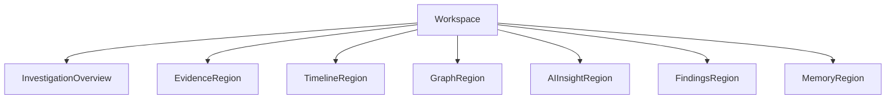

# Investigation Workspace

> This document defines the architectural design of the Investigation Workspace within SentinelAI. It establishes the primary operational environment for cybersecurity investigations and specifies how investigation information is organized, synchronized and presented to analysts while remaining independent of implementation technologies.

---

# 1. Purpose

The Investigation Workspace defines the primary operational environment where cybersecurity analysts conduct investigations within SentinelAI.

It provides a unified environment for collecting evidence, exploring relationships, reviewing AI-generated findings and managing the overall investigation process.

Rather than representing a single interface, the Investigation Workspace establishes the architectural foundation that coordinates all investigation-related interactions throughout the platform.

The workspace is designed to support complex investigations while maintaining a consistent, explainable and analyst-centered experience.

---

# 2. Design Goals

The Investigation Workspace is designed to achieve the following architectural goals.

## Unified Investigation Environment

All investigation activities should occur within a single logical workspace.

Analysts should not need to switch between disconnected interfaces while conducting an investigation.

---

## Investigation-Centric Design

The workspace is organized around investigations rather than individual tools.

Every component contributes to the current investigation context instead of operating independently.

---

## Context Preservation

The workspace should preserve investigation context throughout the analyst's workflow.

Selections, evidence, AI recommendations and navigation state should remain synchronized across the entire workspace.

---

## Explainable AI Collaboration

AI-generated insights should always be presented together with their supporting evidence.

Analysts must be able to understand how recommendations were produced before making security decisions.

---

## Progressive Investigation

Investigations should evolve incrementally.

The workspace should allow analysts to gather evidence, validate findings and refine conclusions without disrupting the overall investigation flow.

---

## Extensible Architecture

The workspace should accommodate future investigation capabilities without requiring architectural redesign.

New investigation tools and visualization modules should integrate into the existing workspace through established architectural principles.

---

# 3. Architectural Role

The Investigation Workspace serves as the central interaction layer between cybersecurity analysts and the SentinelAI platform.

It provides a unified operational environment where information from backend services and AI components is presented in a coherent and investigation-oriented manner.

The workspace does not perform business operations, AI reasoning or data persistence.

Instead, it coordinates the presentation of investigation information while maintaining a consistent investigation context across all workspace regions.

Within the overall system architecture, the Investigation Workspace is responsible for:

- presenting investigation information
- coordinating workspace interactions
- maintaining investigation context
- synchronizing user navigation
- supporting explainable investigation workflows

Business logic remains within backend services.

AI reasoning remains within the AI Runtime.

The Investigation Workspace focuses exclusively on enabling effective analyst interaction.

---

# 4. Workspace Composition

The Investigation Workspace is composed of multiple coordinated regions that collectively support the investigation lifecycle.

Each region provides a specialized perspective of the current investigation while remaining synchronized with the shared investigation context.

Rather than operating independently, workspace regions collaborate to provide a unified analyst experience.

Typical workspace regions include:

- Investigation Overview
- Evidence Region
- Timeline Region
- Graph Region
- AI Insights Region
- Findings Region
- Memory Region

The exact visual arrangement of these regions is implementation-dependent.

This document defines their architectural responsibilities rather than their user interface layout.

Each workspace region should:

- present a single aspect of the investigation
- respond to shared investigation context
- update consistently when investigation state changes
- avoid maintaining isolated investigation knowledge

The Investigation Workspace therefore acts as a coordinated environment rather than a collection of independent interface components.

---

# 5. Workspace Regions

The Investigation Workspace is organized into multiple logical regions.

Each region is responsible for presenting a specific aspect of the current investigation while remaining synchronized with the overall investigation context.

Workspace regions should remain loosely coupled.

A region may be added, removed or replaced without affecting the architectural responsibilities of other regions.

Typical workspace regions include:

## Investigation Overview

Provides a high-level summary of the current investigation.

Typical information includes:

- investigation status
- active objectives
- investigation metadata
- investigation progress

---

## Evidence Region

Displays evidence collected during the investigation.

The region supports evidence exploration without modifying investigation ownership.

Examples include:

- alerts
- logs
- indicators
- files
- external intelligence

---

## Timeline Region

Presents investigation events in chronological order.

This region enables analysts to reconstruct attack progression and understand temporal relationships.

---

## Graph Region

Visualizes entities and relationships relevant to the investigation.

The region presents graph information generated by backend services without exposing graph persistence mechanisms.

---

## AI Insights Region

Displays AI-generated observations and recommendations.

Every recommendation should remain explainable through supporting investigation evidence.

AI-generated content should never appear without sufficient contextual information.

---

## Findings Region

Presents validated investigation findings.

This region summarizes investigation outcomes while preserving traceability to the supporting evidence.

---

# 6. Investigation Context

The Investigation Context represents the shared operational state of the Investigation Workspace.

It ensures that every workspace region presents a consistent view of the current investigation.

Rather than maintaining independent local contexts, workspace regions consume and contribute to a common investigation context.

The Investigation Context may include:

- investigation identifier
- selected entity
- selected evidence
- selected finding
- active timeline position
- investigation objectives
- shared investigation filters
- analyst focus

The Investigation Context should evolve as analysts interact with the workspace.

Changes initiated in one workspace region should be reflected across all relevant regions through context synchronization.

The Investigation Context represents presentation state only.

Business ownership, investigation persistence and AI reasoning remain outside the Investigation Workspace.

---

# 7. Workspace Lifecycle

The Investigation Workspace follows the lifecycle of the active investigation.

Its responsibility is to present investigation information consistently throughout every stage of the investigation process.

The workspace itself does not control the investigation lifecycle.

Instead, it reflects changes initiated by backend services and AI components.

The typical workspace lifecycle consists of the following stages.

## Workspace Initialization

The workspace is initialized when an investigation is opened or created.

During initialization, the workspace establishes the initial investigation context and loads the information required for analyst interaction.

---

## Active Investigation

During an active investigation, analysts continuously explore evidence, review AI recommendations and refine investigation findings.

Workspace regions remain synchronized while the Investigation Context evolves through analyst interaction.

This stage represents the primary operational state of the workspace.

---

## Investigation Updates

As the investigation progresses, new information may become available.

Examples include:

- newly collected evidence
- AI-generated recommendations
- graph updates
- timeline updates
- validated findings

The workspace should integrate these updates without disrupting the analyst's workflow.

---

## Investigation Completion

Once sufficient evidence has been collected and validated, the investigation reaches completion.

The workspace transitions from active investigation to investigation review.

Historical information remains accessible for future analysis and reporting.

---

# 8. Workspace Event Model

The Investigation Workspace is event-driven.

User interactions and investigation updates are represented as workspace events that synchronize the investigation context across all workspace regions.

Workspace events coordinate presentation behavior only.

Business operations continue to be executed by backend services.

Typical workspace events include:

- investigation opened
- investigation closed
- investigation updated
- evidence selected
- entity selected
- graph node selected
- timeline position changed
- AI recommendation selected
- finding validated
- navigation changed
- filter updated

Workspace regions respond only to events that are relevant to their responsibilities.

This approach minimizes coupling between workspace regions while maintaining a consistent investigation experience.

Workspace events should represent meaningful investigation actions rather than implementation-specific user interface interactions.

The event model enables the workspace to evolve by introducing additional workspace regions without fundamentally changing existing interaction patterns.

---

# 9. Context Synchronization

The Investigation Workspace maintains a single shared Investigation Context across all workspace regions.

Context synchronization ensures that analysts interact with a consistent representation of the investigation regardless of which workspace region is currently active.

Whenever the Investigation Context changes, every affected workspace region should update accordingly.

Examples include:

- selecting an entity in the Graph Region highlights related evidence
- selecting evidence updates the Timeline Region
- selecting a finding focuses the associated investigation artifacts
- changing investigation filters updates all relevant workspace regions

Synchronization should occur automatically without requiring manual coordination by the analyst.

Workspace regions should react only to context changes relevant to their responsibilities.

They should neither maintain duplicate investigation context nor perform independent synchronization with other regions.

The Investigation Workspace is solely responsible for coordinating context synchronization.

This coordination ensures that every workspace region contributes to a coherent investigation experience.

---

# 10. Navigation Principles

Navigation within the Investigation Workspace should remain investigation-oriented rather than page-oriented.

Analysts should navigate through investigation information while preserving their current investigation context.

Navigation should minimize unnecessary context switching and maintain analyst focus throughout the investigation lifecycle.

The Investigation Workspace should support navigation between:

- investigation overview
- evidence
- timeline
- graph analysis
- AI insights
- findings
- reports

Navigation should preserve relevant investigation selections whenever possible.

For example:

- returning to the Graph Region should preserve the previously selected entity
- switching between workspace regions should not reset investigation filters
- temporary navigation should not discard investigation progress

The workspace should distinguish between navigation state and investigation state.

Navigation determines how information is presented.

Investigation state represents the current operational context.

Keeping these responsibilities separate improves usability while reducing unnecessary state dependencies across the workspace.

---

# 11. Interaction Principles

The Investigation Workspace is designed to support efficient and intuitive analyst interaction throughout the investigation lifecycle.

Every interaction should contribute to the current investigation without disrupting analyst focus or introducing unnecessary complexity.

Interaction principles guide how workspace regions behave collectively rather than defining implementation-specific user interface behavior.

The workspace follows the following principles.

## Context Preservation

User interactions should preserve the current Investigation Context whenever possible.

Selecting information in one workspace region should enrich the investigation rather than interrupt it.

---

## Progressive Exploration

Analysts should be able to investigate information incrementally.

Each interaction should reveal additional investigation details while maintaining awareness of previously explored evidence.

---

## Explainable Interactions

Every AI-generated recommendation should remain traceable to the evidence that supports it.

Analysts should never be required to trust opaque AI conclusions.

---

## Consistent Behavior

Similar interactions should produce consistent behavior across every workspace region.

Selecting entities, evidence or findings should follow predictable interaction patterns regardless of where the interaction originates.

---

## Non-Destructive Workflow

Workspace interactions should assist investigation without unintentionally discarding analyst progress.

Temporary exploration should not modify investigation data unless explicitly confirmed through business operations.

---

# 12. Extensibility

The Investigation Workspace is designed to evolve as SentinelAI introduces new investigation capabilities.

Future workspace regions, visualization modules and analytical tools should integrate into the existing workspace architecture without modifying its core responsibilities.

New capabilities should:

- participate in the shared Investigation Context
- respond to relevant workspace events
- respect existing navigation principles
- preserve context synchronization
- avoid introducing independent investigation state

The workspace architecture encourages modular growth by defining stable interaction contracts instead of fixed interface implementations.

This approach enables future enhancements while preserving architectural consistency across the platform.

Extensibility should strengthen the Investigation Workspace rather than increase architectural complexity.

---

# 13. Future Evolution

The Investigation Workspace is designed to accommodate future investigation capabilities without requiring architectural redesign.

As SentinelAI evolves, new workspace regions, analytical tools and AI-assisted workflows should integrate through the existing workspace architecture.

Potential future enhancements include:

- collaborative investigations
- multi-analyst workspaces
- real-time investigation synchronization
- customizable workspace layouts
- advanced investigation dashboards
- additional visualization modules
- intelligent investigation assistants
- personalized analyst workspaces

Future capabilities should extend the Investigation Workspace rather than alter its architectural responsibilities.

The Investigation Workspace should remain the single operational environment for analyst-driven investigations regardless of future platform growth.

---

# 14. Design Principles Applied

The Investigation Workspace follows the engineering principles established throughout SentinelAI.

| Principle | Investigation Workspace Application |
|-----------|-------------------------------------|
| Human-Centered AI | The workspace assists analysts without replacing human decision-making. |
| Explainability | AI recommendations remain traceable to supporting evidence. |
| Separation of Responsibilities | Presentation remains independent from backend services and AI reasoning. |
| Modularity | Workspace regions evolve independently while sharing a common investigation context. |
| Consistency | Shared context synchronization ensures a unified investigation experience. |
| Scalability | Additional workspace regions can be introduced without architectural redesign. |
| Architecture Before Framework | Workspace behavior is defined independently of implementation technologies. |

---

# Closing Statement

The Investigation Workspace defines the architectural foundation for analyst interaction within SentinelAI.

It establishes a unified operational environment where investigation information, AI-generated insights and analytical tools are presented through a consistent and investigation-centered experience.

By coordinating workspace regions through a shared Investigation Context, synchronized events and consistent navigation principles, the architecture enables analysts to conduct complex investigations without losing context or workflow continuity.

The Investigation Workspace complements the Frontend Architecture by defining how investigation activities are organized, coordinated and presented throughout the platform.

Future implementations may introduce additional capabilities, visualizations and interaction models while preserving the architectural principles established by this document.

---

# Version History

| Version | Date | Description |
|----------|------------|--------------------------------|
| 1.0.0 | 2026-06-27 | Initial Investigation Workspace specification created |