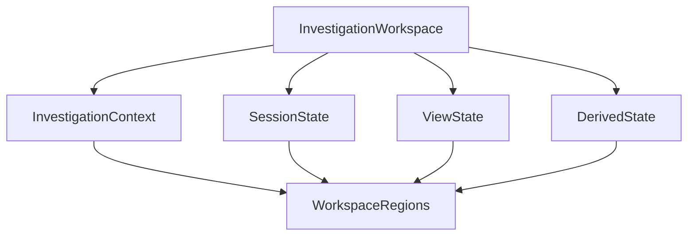
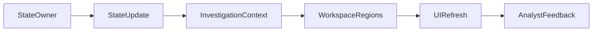
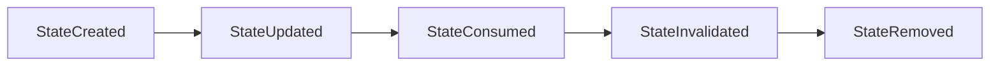

# UI State Management

> This document defines the architectural model for managing frontend state within SentinelAI. It specifies state ownership, propagation and lifecycle while remaining independent of implementation technologies.

---

# 1. Purpose

UI State Management defines how frontend state is organized, owned and synchronized throughout the SentinelAI Investigation Workspace.

Rather than prescribing implementation-specific state management solutions, this document establishes the architectural principles governing frontend state across the platform.

The architecture ensures that investigation information remains consistent, predictable and synchronized as analysts interact with different workspace regions.

---

# 2. Design Goals

The UI State Management architecture is designed to achieve the following goals.

## Single Source of Truth

Each category of frontend state should have a clearly defined architectural owner.

Duplicate or competing representations of the same state should be avoided.

---

## Consistent State Synchronization

State changes should propagate predictably throughout the Investigation Workspace.

Every workspace region should observe a consistent view of the current investigation.

---

## Clear Responsibility Boundaries

State ownership should remain separated from business logic, AI reasoning and backend persistence.

Frontend state exists to coordinate presentation behavior rather than manage investigation operations.

---

## Predictable Evolution

State transitions should remain deterministic and understandable.

Equivalent interactions should always produce equivalent frontend state.

---

## Technology Independence

State architecture should remain independent of implementation libraries, frameworks and state management solutions.

Architectural responsibilities should remain stable regardless of implementation choices.

---

# 3. Architectural Role

The UI State Management architecture defines how frontend state is structured and coordinated across SentinelAI.

It establishes ownership boundaries for presentation state while supporting synchronized investigation workflows.

UI State Management is responsible for:

- defining frontend state ownership
- coordinating state synchronization
- preserving Investigation Context
- supporting consistent workspace behavior
- enabling predictable interaction outcomes

UI State Management does not own investigation data, business logic or AI-generated knowledge.

These responsibilities remain within backend services and the AI Runtime.

---

# 4. State Architecture

The UI State Management architecture establishes a structured model for coordinating frontend state throughout the Investigation Workspace.

Rather than treating all frontend information as a single state, the architecture separates state according to its responsibility, ownership and lifecycle.

Each state category has a clearly defined purpose and should interact with other state categories only through established architectural principles.

The state architecture defines logical ownership boundaries rather than implementation-specific storage mechanisms.

---

# 5. State Categories

The frontend architecture distinguishes multiple categories of state, each serving a specific architectural purpose.

## Investigation Context

The Investigation Context represents the shared operational context of the current investigation.

It coordinates workspace behavior by providing a common reference for navigation, selections and investigation focus.

The Investigation Context serves as the primary coordination mechanism across the Investigation Workspace.

Typical Investigation Context information includes:

- investigation identifier
- selected entity
- selected evidence
- selected finding
- active timeline position
- investigation objectives
- shared investigation filters
- analyst focus

---

## View State

View State represents temporary presentation information associated with a specific workspace region.

Examples include:

- panel visibility
- sorting preferences
- local view filters
- expanded sections
- active tabs

View State affects presentation only and should not influence investigation semantics.

---

## Session State

Session State represents information associated with the analyst rather than a specific investigation.

Examples include:

- preferred language
- theme
- workspace preferences
- notification preferences
- personalized workspace configuration

Session State should remain independent of investigation-specific state.

Investigation-specific information belongs to the Investigation Context.

---

## Derived State

Derived State is calculated from existing frontend state rather than maintained independently.

Examples include:

- aggregated investigation statistics
- filtered investigation views
- calculated dashboard summaries
- visualization highlights

Derived State should always be reproducible from authoritative frontend state.

Independent ownership of Derived State should be avoided.

---

## Server-State (Cached Backend Data)

Backend-owned business information is not one of the four categories above: it is **cached, not owned**. The backend remains the authoritative source, and the frontend holds only a cached representation with its own freshness and invalidation lifecycle, managed separately from the client-owned state categories (see the Frontend Architecture, State Management Philosophy).

---

# 6. State Ownership

Every category of frontend state should have a clearly defined architectural owner.

State ownership prevents conflicting updates and ensures predictable frontend behavior.

The ownership model follows the principle of a single authoritative source for every state category.

| State Category | Architectural Owner |
|----------------|---------------------|
| Investigation Context | Investigation Workspace |
| View State | Individual Workspace Region |
| Session State | Investigation Workspace |
| Derived State | No Independent Owner (Derived from Authoritative State) |

Workspace regions may consume multiple state categories simultaneously.

However, they should modify only the state categories for which they are explicitly responsible.

This ownership model minimizes ambiguity while preserving modularity across the frontend architecture.

---

# 7. State Synchronization

State synchronization ensures that all workspace regions present a consistent representation of the current investigation.

Rather than synchronizing state directly between workspace regions, synchronization is coordinated through the architectural ownership model defined by the Investigation Workspace.

Every state update should originate from its authoritative owner before being propagated to dependent workspace regions.

This synchronization model prevents conflicting state updates while ensuring that every workspace region observes the same investigation state.

State synchronization should remain deterministic.

Given identical state updates, every workspace region should reach an equivalent presentation state.

---

# 8. State Lifecycle

Frontend state follows a well-defined architectural lifecycle.

Different state categories may have different lifetimes, but every state should progress through a consistent sequence of stages.

State transitions should occur only when required by analyst interactions or investigation updates.

Temporary presentation state should be discarded once it is no longer relevant.

Session State should remain available for the duration of the active investigation session.

Derived State should be recalculated whenever its authoritative source changes rather than maintained independently.

State removal should never invalidate the Investigation Context unless the investigation itself is closed.

---

# 9. State Consistency

State consistency ensures that every workspace region reflects the same investigation reality.

Equivalent investigation conditions should always produce equivalent frontend state.

Consistency should be preserved across:

- Investigation Context
- dashboard summaries
- visualization modules
- interaction outcomes
- workspace navigation
- investigation selections

Workspace regions should consume shared state rather than maintain independent copies of investigation information.

Conflicting state representations should never exist simultaneously within the Investigation Workspace.

The UI State Management architecture establishes consistency through clear ownership boundaries, deterministic synchronization and shared Investigation Context rather than direct communication between workspace regions.

State consistency should be preserved regardless of the workspace region in which an interaction originates.

---

# 10. Extensibility

The UI State Management architecture is designed to support future frontend capabilities without requiring architectural redesign.

New workspace regions, visualization modules and interaction patterns should integrate through the existing state architecture while preserving established ownership and synchronization principles.

Future frontend capabilities should:

- define clear state ownership
- participate in state synchronization
- preserve Investigation Context integrity
- avoid duplicate state representations
- remain independent of implementation technologies

The architecture encourages incremental evolution through stable state contracts rather than framework-specific implementations.

---

# 11. Future Evolution

Future versions of the UI State Management architecture may introduce:

- collaborative investigation sessions
- multi-user shared state
- offline workspace capabilities
- cross-device session continuity
- adaptive workspace personalization
- intelligent state restoration
- advanced workspace preferences

Future enhancements should remain compatible with the Investigation Workspace architecture and preserve the state ownership model established by this document.

The UI State Management architecture should continue serving as the authoritative frontend state model regardless of future platform evolution.

---

# 12. Design Principles Applied

The UI State Management architecture follows the engineering principles established throughout SentinelAI.

| Principle | UI State Management Application |
|-----------|----------------------------------|
| Human-Centered AI | State management preserves a consistent analyst experience without reducing analyst control. |
| Explainability | State transitions remain predictable and traceable throughout the Investigation Workspace. |
| Separation of Responsibilities | Frontend state remains independent of business logic, backend persistence and AI reasoning. |
| Modularity | Individual workspace regions own only their designated state while participating in shared synchronization. |
| Consistency | Shared Investigation Context and deterministic synchronization maintain a unified workspace state. |
| Scalability | New state categories and workspace capabilities can be introduced without architectural redesign. |
| Architecture Before Framework | State responsibilities are defined independently of frontend frameworks and state management libraries. |

---

# Closing Statement

The UI State Management architecture establishes the architectural foundation for coordinating frontend state throughout SentinelAI.

By defining clear ownership boundaries, deterministic synchronization and a shared Investigation Context, the architecture enables every workspace region to participate in a consistent and predictable investigation experience.

The UI State Management architecture complements the Investigation Workspace, Dashboard, Visualization Architecture and Interaction Model by defining how frontend state is organized, propagated and maintained throughout the investigation lifecycle.

Future implementations may introduce new state capabilities while preserving the architectural responsibilities established by this document.

---

# Version History

| Version | Date | Description |
|----------|------------|--------------------------------|
| 1.0.0 | 2026-06-27 | Initial UI State Management specification created |
| 1.1.0 | 2026-07-02 | Noted cached backend (server) state as managed separately from the four state categories |