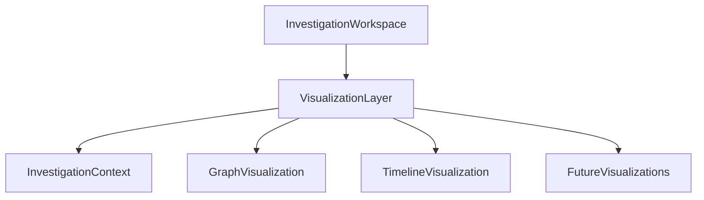

# Visualization Architecture

> This document defines the architectural principles governing investigation visualizations within SentinelAI. It specifies how visual representations support investigation workflows while remaining independent of visualization technologies and rendering frameworks.

---

# 1. Purpose

Investigation visualizations provide analysts with graphical representations of investigation data that improve understanding of complex relationships, temporal sequences and investigation progress.

Rather than replacing textual investigation information, visualizations complement other workspace regions by presenting investigation artifacts through intuitive visual structures.

The Visualization Architecture establishes common architectural principles that ensure all investigation visualizations behave consistently throughout the Investigation Workspace.

---

# 2. Design Goals

The Visualization Architecture is designed to achieve the following architectural goals.

## Investigation-Oriented Visualization

Every visualization should support investigation activities rather than function as an isolated graphical component.

Visualizations exist to improve investigation quality, not simply to display data.

---

## Consistent User Experience

All visualization modules should follow common interaction and navigation principles.

Analysts should experience predictable behavior regardless of the visualization type.

---

## Shared Investigation Context

Every visualization should remain synchronized with the shared Investigation Context.

Selections and navigation performed within one visualization should remain consistent across the entire Investigation Workspace.

---

## Explainable Visual Representation

Visualizations should accurately represent investigation data without introducing ambiguity.

Every visual element should correspond to traceable investigation information.

---

## Extensible Visualization Framework

The architecture should support future visualization modules without requiring changes to existing architectural responsibilities.

---

# 3. Architectural Role

The Visualization Architecture defines how investigation information is visually represented within SentinelAI.

It establishes common architectural responsibilities shared by all visualization modules while remaining independent of specific visualization techniques.

Visualization components are responsible for:

- presenting investigation information visually
- supporting analyst exploration
- reflecting Investigation Context
- coordinating visualization interactions
- enabling intuitive investigation analysis

Visualization modules provide complementary investigation perspectives rather than replacing textual investigation information.

Visualization components do not perform investigation reasoning, business operations or data persistence.

These responsibilities remain within backend services and AI components.

---

# 4. Visualization Architecture

The Visualization Architecture defines a common architectural model for every visual representation within the Investigation Workspace.

Rather than treating each visualization as an independent feature, the architecture establishes a shared foundation that governs how visual components receive, present and synchronize investigation information.

Every visualization module should:

- consume the shared Investigation Context
- present a specific perspective of the investigation
- support investigation-oriented exploration
- synchronize with other workspace regions
- remain independent of visualization technologies

The Visualization Layer represents a logical architectural abstraction rather than a software framework or rendering engine.

It defines the common responsibilities shared by all investigation visualizations.

---

# 5. Visualization Types

The Visualization Architecture supports multiple visualization types, each providing a different perspective of the current investigation.

Each visualization should communicate information that cannot be understood as effectively through textual presentation alone.

Individual visualization modules may coexist within the same investigation workflow while presenting different perspectives of the shared Investigation Context.

Typical visualization categories include:

## Graph Visualization

Represents entities and their relationships.

Graph visualizations support exploration of investigation structure and relationship discovery.

---

## Timeline Visualization

Represents investigation events chronologically.

Timeline visualizations assist analysts in understanding attack progression and event sequencing.

---

## Relationship Visualization

Highlights logical relationships between investigation artifacts.

Relationship visualizations help analysts understand dependencies and associations without exposing implementation details.

---

## Statistical Visualization

Represents aggregated investigation metrics.

Examples include investigation progress, finding distribution and investigation trends.

Statistical visualizations summarize information rather than presenting detailed investigation artifacts.

---

## Future Visualization Types

The architecture allows additional visualization categories to be introduced without modifying existing visualization responsibilities.

Every new visualization should conform to the architectural principles defined within this document.

---

# 6. Shared Visualization Principles

Every visualization within SentinelAI should follow a common set of architectural principles.

## Investigation-Centric Representation

Visualizations should present investigation information rather than raw system data.

Visual elements should always contribute to investigation understanding.

---

## Context Awareness

Every visualization should remain synchronized with the current Investigation Context.

Changes in investigation focus should be reflected consistently across all visualization modules.

---

## Explainability

Visual elements should always represent traceable investigation information.

Analysts should never encounter visual representations whose origin cannot be explained.

---

## Consistency

Common interaction patterns should be preserved across all visualization modules.

Selection, highlighting and navigation behavior should remain predictable regardless of visualization type.

---

## Technology Independence

Visualization behavior should be defined independently of rendering technologies, visualization libraries or implementation frameworks.

Architectural responsibilities should remain stable regardless of future implementation choices.

---

# 7. Visualization Synchronization

All visualization modules operate within the shared Investigation Context established by the Investigation Workspace.

Rather than maintaining independent visualization states, every visualization reflects the current investigation context while contributing additional interaction events.

Visualization synchronization ensures that multiple visual representations remain consistent throughout the investigation lifecycle.

Typical synchronization scenarios include:

- selecting an entity in the Graph Visualization highlights related timeline events
- selecting a timeline event focuses associated graph entities
- selecting investigation findings updates relevant visualizations
- changing investigation filters refreshes affected visual representations

Visualization modules should never synchronize directly with one another.

Instead, synchronization is coordinated through the shared Investigation Context.

This architectural model minimizes coupling while ensuring consistent analyst experience across the Investigation Workspace.

---

# 8. Interaction Model

Visualizations are designed to support interactive investigation rather than passive information presentation.

Interactions should assist analysts in exploring investigation data while preserving a consistent investigation workflow.

Common visualization interactions include:

- selection
- highlighting
- filtering
- navigation
- drill-down exploration
- contextual inspection

Every interaction should either:

- update the Investigation Context,
- respond to Investigation Context changes, or
- provide additional investigation detail.

Visualization interactions should remain predictable across all visualization types.

Analysts should not be required to learn different interaction models for different visual representations.

Interaction behavior should remain independent of visualization technology or rendering implementation.

---

# 9. Context Awareness

Every visualization is context-aware.

Rather than displaying static information, visualizations continuously reflect the current Investigation Context.

Context awareness allows visualizations to adapt automatically as analysts progress through an investigation.

Examples include:

- updating highlighted entities when investigation focus changes
- reflecting active investigation filters
- synchronizing selected investigation artifacts
- adapting visible information according to analyst navigation

Visualization modules should consume contextual information but should not become the authoritative owner of investigation state.

Investigation ownership remains within backend services.

Visualization modules remain consumers of investigation context rather than authoritative sources of investigation state.

Presentation coordination remains within the Investigation Workspace.

The Visualization Architecture ensures that every visual representation contributes to a single, coherent view of the investigation rather than creating isolated analytical experiences.

---

# 10. Extensibility

The Visualization Architecture is designed to accommodate future visualization capabilities without requiring architectural redesign.

New visualization modules should integrate through the existing architectural model while preserving consistent interaction behavior and Investigation Context synchronization.

Every new visualization should:

- consume the shared Investigation Context
- participate in visualization synchronization
- follow established interaction principles
- remain independent of visualization technologies
- avoid introducing independent investigation state

The architecture encourages incremental expansion through stable architectural contracts rather than implementation-specific solutions.

---

# 11. Future Evolution

Future versions of the Visualization Architecture may introduce:

- attack path visualization
- MITRE ATT&CK mapping
- geospatial visualizations
- risk heatmaps
- collaborative investigation views
- comparative investigation analysis
- adaptive visualization layouts
- AI-assisted visual explanations

Future visualization capabilities should extend the existing architecture while preserving consistent investigation workflows and shared context synchronization.

The Visualization Architecture should continue providing a unified visual language for investigation analysis regardless of future platform evolution.

Future visualization modules should remain compatible with the shared Investigation Context and existing interaction principles.

---

# 12. Design Principles Applied

The Visualization Architecture follows the engineering principles established throughout SentinelAI.

| Principle | Visualization Architecture Application |
|-----------|-----------------------------------------|
| Human-Centered AI | Visualizations assist analysts in understanding investigation data without replacing analytical judgment. |
| Explainability | Every visual element represents traceable investigation information. |
| Separation of Responsibilities | Visualization modules present information without performing business logic or AI reasoning. |
| Modularity | Individual visualization modules evolve independently while following shared architectural contracts. |
| Consistency | All visualization modules follow common interaction, navigation and synchronization principles. |
| Scalability | New visualization capabilities can be integrated without modifying existing architectural responsibilities. |
| Architecture Before Framework | Visualization behavior is defined independently of rendering technologies and visualization libraries. |

---

# Closing Statement

The Visualization Architecture establishes a common architectural foundation for presenting investigation information visually within SentinelAI.

By defining shared principles for visualization behavior, synchronization and interaction, the architecture ensures that every visualization contributes to a coherent and investigation-centered analytical experience.

The Visualization Architecture complements the Investigation Workspace by defining how investigation information is visually represented while remaining independent of visualization technologies and implementation frameworks.

Future implementations may introduce new visualization techniques and analytical capabilities while preserving the architectural responsibilities established by this document.

---

# Version History

| Version | Date | Description |
|----------|------------|--------------------------------|
| 1.0.0 | 2026-06-27 | Initial Visualization Architecture specification created |