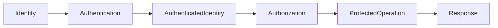

# Authentication and Authorization

> This document defines the architectural model for authentication and authorization within SentinelAI. It establishes identity, authentication and access control responsibilities while remaining independent of implementation technologies.

---

# 1. Purpose

Authentication and Authorization define how identities are recognized and how access to platform capabilities is controlled throughout SentinelAI.

Rather than prescribing implementation-specific authentication protocols or authorization mechanisms, this document establishes the architectural responsibilities governing identity verification and access control across the platform.

The architecture ensures that identity management remains consistent across the Frontend, Backend, AI Runtime and supporting architectural domains while preserving clear responsibility boundaries.

Authentication and Authorization complement the Security Architecture by defining how trusted identities interact with protected platform resources.

---

# 2. Design Goals

The Authentication and Authorization architecture is designed to achieve the following goals.

## Verified Identity

Every security-sensitive interaction should originate from a verified identity.

The platform should never perform protected operations on behalf of unidentified actors.

---

## Explicit Authorization

Successful authentication should not automatically imply permission to perform every operation.

Authorization decisions should always be evaluated independently of identity verification.

---

## Clear Responsibility Boundaries

Authentication and Authorization responsibilities should remain explicitly assigned to the architectural domains responsible for enforcing them.

Identity verification, authorization enforcement and presentation responsibilities should never become implicitly shared.

---

## Least Privilege

Authenticated identities should receive only the permissions required to perform their legitimate responsibilities.

Additional privileges should never be granted by default.

---

## Consistent Access Control

Equivalent operations should be evaluated according to equivalent authorization principles regardless of where they originate within the platform.

Consistent authorization behavior improves predictability, simplifies auditing and reduces security risk.

---

## Technology Independence

Authentication and Authorization responsibilities should remain independent of authentication providers, identity technologies and authorization frameworks.

---

# 3. Architectural Role

Authentication and Authorization establish the architectural access control model shared across SentinelAI.

Authentication is responsible for establishing trusted identity.

Authorization is responsible for determining whether an authenticated identity is permitted to perform a requested operation.

Although closely related, these responsibilities remain architecturally independent.

Within SentinelAI:

- Authentication verifies identity.
- Authorization evaluates permissions.
- Application Domain services enforce authorization decisions.
- Frontend presents authenticated user interactions.
- AI Runtime consumes only authorized investigation context.

Authentication and Authorization do not define authentication protocols, identity providers or authorization technologies.

Those implementation concerns remain outside the scope of this architectural document.

---

# 4. Identity Model

Identity forms the foundation of every security-sensitive operation within SentinelAI.

Before any protected platform capability can be accessed, the architecture must establish a trusted identity that represents the requesting actor.

The Identity Model defines how architectural components recognize and reason about identities without prescribing implementation-specific identity technologies.

Within SentinelAI, identity is treated as an architectural concept rather than an implementation artifact.

An established identity provides the basis upon which authorization decisions, audit activities and security monitoring are performed.

The architecture recognizes multiple categories of identities.

## Human Identities

Human identities represent authenticated analysts interacting with the SentinelAI platform.

Human identities are responsible for:

- initiating investigations
- reviewing investigation results
- validating AI-generated findings
- interacting with investigation workflows
- performing authorized platform operations

Every analyst interaction should be associated with a verified human identity.

Anonymous access to protected investigation capabilities should not be permitted.

---

## System Identities

System identities represent architectural components acting on behalf of the platform rather than individual analysts.

Examples include:

- backend services
- AI Runtime components
- scheduled platform processes
- internal integration components

System identities enable secure communication between architectural domains while preserving traceability and accountability.

Every system identity should be uniquely distinguishable from human identities.

---

## External Identities

External identities represent trusted entities originating outside SentinelAI.

Examples may include:

- enterprise systems
- organizational platforms
- external intelligence providers
- integrated security platforms

External identities should never be assumed trustworthy solely because they originate from a known external system.

Their interactions should always be evaluated according to the authentication and authorization principles established by this architecture.

---

## Identity Characteristics

Regardless of identity category, every identity should satisfy the following architectural characteristics:

- uniquely identifiable
- verifiable
- traceable
- auditable
- revocable
- non-transferable

Identity should remain independent of authorization.

Possessing a verified identity does not imply permission to perform protected operations.

Identities may own or consume secrets according to the responsibilities defined by the Secrets Management architecture.

Possession or use of a secret does not establish identity, but supports the secure operation of an already established identity.

---

# 5. Authentication Principles

Authentication establishes confidence in the identity of the requesting actor before protected platform resources are accessed.

Authentication should establish identity without exposing unnecessary identity information to architectural components that do not require it.

Its responsibility is limited to identity verification.

Authentication does not determine whether an authenticated identity is authorized to perform a requested operation.

The Security Architecture establishes the following authentication principles.

## Identity Before Access

Authentication should always occur before security-sensitive platform capabilities become accessible.

Protected operations should never proceed without establishing a trusted identity.

---

## Independent Verification

Every authentication event should independently establish confidence in the requesting identity.

Architectural components should not rely solely on authentication decisions performed by unrelated domains unless those decisions have been explicitly propagated through trusted architectural mechanisms.

---

## Consistent Authentication

Equivalent authentication scenarios should produce equivalent architectural outcomes.

Identity verification should remain predictable regardless of which protected platform capability is ultimately accessed.

---

## Authentication Is Not Authorization

Authentication confirms identity.

It does not grant permissions.

Authorization decisions remain the responsibility of the architectural components responsible for protecting platform resources.

Maintaining this separation reduces security risk and simplifies architectural reasoning.

---

## Authentication Continuity

Once successfully established, authenticated identity should remain consistently associated with subsequent security-sensitive operations until the authentication context is no longer considered valid.

Architectural components should preserve authenticated identity throughout trusted communication paths without redefining identity ownership.

---

## Traceable Authentication

Authentication events should support architectural traceability.

The platform should be capable of associating protected operations with the authenticated identity responsible for initiating them.

Traceability supports security monitoring, audit activities and incident investigation while remaining independent of implementation technologies.

---

# 6. Authorization Principles

Authorization determines whether an authenticated identity is permitted to perform a requested operation.

Unlike authentication, which establishes confidence in identity, authorization evaluates permissions according to the security policies governing protected platform resources.

Authorization is therefore an architectural decision rather than a presentation concern.

Within SentinelAI, authorization is enforced by the Application Domain because backend services own business operations, investigation state and domain integrity.

Neither the Frontend nor the AI Runtime should independently determine whether protected operations are permitted.

The Security Architecture establishes the following authorization principles.

## Explicit Authorization

Every protected operation should be explicitly authorized before execution.

Authorization should never be inferred solely because an identity has successfully authenticated or previously performed similar operations.

Each authorization decision should be evaluated according to the current operational context.

---

## Resource Ownership

Authorization decisions should be made by the architectural domain that owns the protected resource.

Business operations should be authorized by backend services.

Persistent information should remain protected by backend-controlled authorization.

Presentation components should not become authoritative decision makers for protected resources.

---

## Principle of Least Privilege

Authorization should grant only the permissions necessary to perform the requested operation.

Permissions unrelated to the requested capability should remain inaccessible.

Limiting unnecessary privileges reduces architectural attack surface and minimizes the impact of compromised identities.

---

## Context-Aware Authorization

Authorization decisions should consider the operational context associated with the requested action.

Relevant context may include:

- authenticated identity
- requested operation
- resource ownership
- investigation ownership
- organizational responsibilities
- current investigation context

Authorization should evaluate the complete operational context rather than isolated request attributes.

---

## Consistent Authorization

Equivalent operations should produce equivalent authorization outcomes regardless of which platform component initiated the request.

Consistent authorization behavior improves predictability, simplifies auditing and reduces architectural ambiguity.

---

## Authorization Traceability

Authorization decisions should support architectural traceability.

The platform should be capable of associating every protected operation with:

- the authenticated identity
- the requested operation
- the resulting authorization decision

Authorization traceability strengthens security monitoring, audit activities and incident investigation.

---

# 6a. Investigation Access Scoping Model

The threat model names cross-investigation information leakage as a threat and investigation isolation as its mitigation. This section defines the isolation **model** those statements rely on (audit finding M-04).

## Scoping Key

- Every Investigation carries an **owner** (the domain's `ActorRef`); ownership is the initial access-scoping key.
- The model is extensible to team and organization scopes: a scope is always expressed as an attribute of the investigation, evaluated by the authorization policy — never inferred from data content.

## Access Rules

- Access to an investigation and to every investigation-scoped object (evidence, findings, reports, outcome, trace) is evaluated against the investigation's scope by the `Authorizer` policy.
- AI retrieval operates **within** the requesting investigation's scope for investigation-scoped data: the Investigation State and retrieval context carry the investigation reference, and investigation-scoped knowledge of other investigations is not retrievable through it.

## Shared Knowledge Boundary

Organizational Memory and the Knowledge Graph are **deliberately cross-investigation** (organizational learning is a platform goal). The isolation boundary is placed at promotion, not at retrieval:

- Only **validated** knowledge is promoted into the shared layers (Memory Architecture, Domain Rule 5); promotion is the controlled point where investigation-scoped information becomes organizational.
- Retrieval from shared layers is therefore legitimate for any investigation; retrieval of another investigation's *unpromoted* data is not.

---

# 6b. Operation Context (Identity Propagation)

Authorization, auditing and the Investigation Trace all need to know **on whose behalf** an operation runs. The architectural concept is the **operation context**: the verified identity (subject + kind), its authorization scope and the request correlation identifier — established at the API boundary and carried to the components that need it.

- The operation context is passed **explicitly** (as an argument of the operations that require it), consistent with the platform's caller-supplies rule; hidden global/ambient state is not permitted.
- It is immutable for the lifetime of the operation and is never persisted as such — persisted records (audit events, trace entries) copy the fields they need.
- The concrete context type is introduced together with its first consumer (the concrete authorization policy); defining it earlier would be a speculative abstraction.

---

# 7. Responsibility Boundaries

Authentication and Authorization responsibilities are intentionally separated across the SentinelAI architecture.

Each architectural domain contributes to identity and access control according to its ownership boundaries.

This separation preserves modularity, prevents duplicated security logic and reinforces the Security Architecture established for the platform.

## Frontend Responsibilities

The Frontend participates in authenticated user interaction.

Its responsibilities include:

- presenting authenticated user interfaces
- preserving authentication context during user interaction
- communicating authenticated requests to the Backend API
- presenting authorization outcomes to analysts

The Frontend does not:

- authenticate identities independently
- authorize protected business operations
- determine investigation permissions
- enforce business access policies

The Frontend should always defer authorization decisions to the Application Domain.

---

## Backend Responsibilities

The Application Domain (Backend) is the primary architectural authority for authorization enforcement.

Its responsibilities include:

- validating authenticated requests
- evaluating authorization decisions
- protecting business operations
- enforcing investigation permissions
- safeguarding protected platform resources
- preserving authorization consistency
- protecting authorization consistency across backend services

Every protected business operation should be evaluated within the Application Domain regardless of where the request originates.

---

## AI Runtime Responsibilities

The AI Runtime consumes only investigation information that has already been authorized by the Application Domain.

Its responsibilities include:

- processing authorized investigation context
- respecting authorization constraints
- avoiding access beyond provided investigation scope
- returning analytical results without modifying authorization decisions

The AI Runtime should never become an authorization authority within SentinelAI.

---

## Cross-Domain Responsibilities

Identity and access control require cooperation across multiple architectural domains.

Although responsibilities differ, every domain should:

- preserve authenticated identity
- respect authorization outcomes
- avoid bypassing authorization enforcement
- maintain traceability
- protect trust boundaries

No architectural domain should assume responsibilities owned by another domain.

Maintaining explicit ownership boundaries preserves both security and architectural consistency.

---

# 8. Authentication and Authorization Flow

Authentication and Authorization operate together to protect platform resources while maintaining clear separation of responsibilities.

Authentication establishes a trusted identity.

Authorization evaluates whether that authenticated identity may perform a requested operation.

Although these processes are closely related, they should remain architecturally independent throughout the platform lifecycle.

The architectural interaction follows the responsibility model established by the Security Architecture.

The architecture intentionally separates identity verification from permission evaluation.

This separation simplifies security reasoning, supports future architectural evolution and reduces unnecessary coupling between identity management and business authorization.

Every protected operation should follow the same high-level architectural flow regardless of implementation technologies or deployment environments.

---

## Architectural Characteristics

The Authentication and Authorization flow should satisfy the following characteristics:

- deterministic
- traceable
- consistent
- technology independent
- aligned with trust boundaries

Equivalent security-sensitive operations should follow equivalent architectural responsibilities regardless of where they originate within the platform.

---

## Failure Handling Principles

Authentication or authorization failures should terminate the requested protected operation before business processing begins.

Failures should:

- preserve platform security
- avoid exposing protected information
- remain traceable
- provide consistent outcomes
- preserve auditability
- avoid revealing unnecessary security details

Failure handling should prioritize protection of platform resources while maintaining a predictable analyst experience.

---

# 9. Extensibility

The Authentication and Authorization architecture is designed to evolve without requiring changes to the overall SentinelAI architecture.

Future identity providers, authorization strategies or organizational access models should integrate through the architectural principles established by this document.

Future capabilities should:

- preserve identity ownership
- maintain explicit authorization responsibilities
- remain compatible with Security Architecture
- preserve trust boundaries
- avoid introducing implicit authorization paths
- maintain traceability

Architectural evolution should strengthen consistency rather than introduce additional complexity.

---

# 10. Future Evolution

Future versions of the Authentication and Authorization architecture may introduce:

- multi-organization identity models
- delegated administrative responsibilities
- collaborative investigation authorization
- adaptive authorization policies
- organization-specific access models
- temporary privilege delegation
- advanced identity federation

Future enhancements should preserve the separation between authentication and authorization established by this document.

Regardless of future platform evolution, authorization enforcement should remain within the Application Domain while identity verification continues to provide the trusted foundation for access control.

---

# 11. Design Principles Applied

The Authentication and Authorization architecture follows the engineering principles established throughout SentinelAI.

| Principle | Authentication and Authorization Application |
|-----------|----------------------------------------------|
| Human-Centered AI | Identity and access control protect analysts while preserving efficient investigation workflows. |
| Explainability | Authentication and authorization decisions should remain understandable, traceable and auditable. |
| Separation of Responsibilities | Identity verification, authorization enforcement and presentation responsibilities remain architecturally independent. |
| Modularity | Authentication and authorization evolve independently while preserving common security principles. |
| Least Privilege | Authenticated identities receive only the permissions required for their legitimate responsibilities. |
| Defense in Depth | Authentication and authorization complement other architectural security controls rather than replacing them. |
| Architecture Before Framework | Identity and access control responsibilities remain independent of authentication providers, authorization technologies and implementation frameworks. |

---

# Closing Statement

Authentication and Authorization establish the architectural foundation for identity verification and access control throughout SentinelAI.

By separating authentication from authorization, assigning authorization enforcement to the Application Domain and preserving explicit responsibility boundaries across architectural domains, the platform achieves a consistent and technology-independent security model.

Authentication establishes trusted identity, while authorization protects platform capabilities through explicit permission evaluation.

This document complements the Security Architecture by defining how trusted identities interact with protected platform resources while maintaining traceability, least privilege and consistent authorization enforcement.

Future authentication and authorization capabilities should extend these architectural principles without altering the fundamental responsibility model established by this document.

---

# Version History

| Version | Date | Description |
|----------|------------|--------------------------------|
| 1.0.0 | 2026-06-27 | Initial Authentication and Authorization specification created |
| 1.1.0 | 2026-07-03 | Investigation Access Scoping Model added (§6a: owner-based scoping, extensible to team/org; shared-knowledge boundary at promotion) and Operation Context defined (§6b: explicit identity propagation) — audit findings M-04/E-06 |