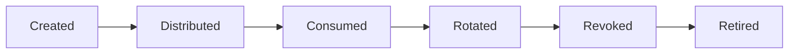

# Secrets Management

> This document defines the architectural model for managing secrets within SentinelAI. It establishes ownership, lifecycle and protection responsibilities for sensitive credentials while remaining independent of implementation technologies.

---

# 1. Purpose

Secrets Management defines how sensitive credentials are governed throughout the SentinelAI architecture.

Rather than prescribing implementation-specific secret storage technologies, this document establishes the architectural responsibilities that protect sensitive credentials during their lifecycle.

Secrets Management complements the Security Architecture by defining how architectural components securely own, consume and protect secrets without altering established trust boundaries.

The architecture ensures that secrets remain controlled assets rather than implementation details distributed throughout the platform.

---

# 2. Design Goals

The Secrets Management architecture is designed to achieve the following goals.

## Explicit Secret Ownership

Every secret should have a clearly defined architectural owner.

Ownership should never be ambiguous or implicitly shared across architectural domains.

---

## Least Exposure

Secrets should only be accessible to architectural components that require them to perform their legitimate responsibilities.

Unnecessary exposure increases architectural risk and should be avoided.

---

## Lifecycle Management

Every secret should follow a well-defined architectural lifecycle from creation through retirement.

Secrets should never exist without clear ownership or lifecycle responsibility.

---

## Controlled Distribution

Secrets should be distributed only through trusted architectural pathways.

Architectural components should receive only the secrets required for their responsibilities.

---

## Traceability

Secret ownership, usage and lifecycle activities should support architectural traceability.

The architecture should enable accountability without exposing secret values.

---

## Technology Independence

Secret responsibilities should remain independent of secret storage products, deployment environments and implementation technologies.

---

# 3. Architectural Role

Secrets Management establishes the architectural model governing sensitive credentials throughout SentinelAI.

Rather than introducing a dedicated secret management service, the architecture defines how existing architectural domains own, protect and consume secrets according to their responsibilities.

Secrets Management is responsible for:

- defining secret ownership
- establishing secret lifecycle responsibilities
- protecting secret confidentiality
- limiting secret exposure
- supporting secure inter-domain communication
- preserving architectural traceability

Secrets Management does not define secret storage mechanisms, cryptographic algorithms or deployment-specific secret technologies.

Those implementation concerns remain outside the scope of this architectural document.

---

# 4. Secret Model

A secret is any sensitive piece of information whose unauthorized disclosure could compromise the confidentiality, integrity or availability of SentinelAI.

Within the architecture, secrets are treated as protected security assets rather than configuration artifacts.

Every secret should exist for a clearly defined architectural purpose and should always have an explicitly assigned owner.

Secrets should never be created without an identified consumer, a defined lifecycle and an established ownership boundary.

The architecture recognizes multiple categories of secrets.

## Human Secrets

Human secrets are associated with authenticated analysts.

Examples may include credentials or other confidential information required to establish trusted analyst identity.

Human secrets should:

- remain associated with a single verified identity
- never be shared between analysts
- support authentication without becoming authorization artifacts
- remain protected throughout their lifecycle

Human secrets should never be exposed to architectural components that do not require them.

---

## System Secrets

System secrets enable trusted communication between architectural components.

Examples may include:

- service credentials
- machine identities
- integration credentials
- internal communication credentials

System secrets should be owned by the architectural component responsible for consuming them.

System secrets should never become globally shared resources.

---

## External Secrets

External secrets enable SentinelAI to communicate with systems outside the platform.

Examples may include credentials required for:

- enterprise integrations
- external intelligence providers
- organizational services
- third-party platforms

External secrets should remain isolated from internal platform secrets.

Compromise of one external integration should not affect unrelated architectural domains.

---

## Secret Characteristics

Every secret managed by SentinelAI should satisfy the following architectural characteristics:

- confidential
- uniquely owned
- traceable
- revocable
- replaceable
- minimally exposed
- purpose-bound

Secrets should always remain independent of the business data they protect.

A secret grants access to protected resources but should never become part of the protected information itself.

---

# 5. Secret Lifecycle

Every secret should progress through a well-defined architectural lifecycle.

Managing secrets as lifecycle-managed assets reduces long-term security risk and simplifies operational governance.

The architecture defines the following lifecycle stages.

A secret should exist in only one lifecycle stage at any given time.

Each lifecycle stage represents a distinct architectural responsibility.

---

## Secret Creation

Secrets should be created only when an architectural responsibility requires them.

Secret creation should always establish:

- ownership
- intended consumer
- protection requirements
- lifecycle responsibility

Secrets without defined ownership should never become operational.

---

## Secret Distribution

Secrets should be distributed only to the architectural components explicitly authorized to consume them.

Distribution should preserve confidentiality and respect the trust boundaries defined by the Security Architecture.

Secrets should never be propagated beyond their intended scope.

---

## Secret Consumption

Architectural components should consume secrets only for their intended responsibilities.

Possession of a secret should not imply authority beyond the capability the secret was created to support.

Secrets should never be reused for unrelated architectural purposes.

---

## Secret Rotation

Secrets should support replacement without requiring architectural redesign.

Rotation should preserve service continuity while reducing long-term exposure risk.

Architectural components should avoid assumptions that secrets remain permanently valid.

---

## Secret Revocation

Secrets should be revocable whenever trust can no longer be maintained.

Revocation should immediately prevent further architectural use of the affected secret.

Secret revocation should not require modification of unrelated architectural components.

---

## Secret Retirement

Secrets that are no longer required should be permanently removed from operational use.

Retired secrets should no longer participate in trusted architectural communication.

Retirement concludes the architectural lifecycle of a secret while preserving any traceability requirements established by the Security Architecture.

---

# 6. Secret Responsibilities

Secrets are governed through explicit ownership and clearly defined architectural responsibilities.

Rather than treating secrets as globally accessible platform resources, SentinelAI assigns every secret to the architectural domain responsible for its legitimate use.

Ownership determines which architectural component is responsible for protecting, consuming and ultimately retiring a secret throughout its lifecycle.

No secret should exist without an explicitly identified owner.

---

## Frontend Responsibilities

The Frontend should never become a long-term owner of platform secrets.

Its responsibilities are limited to:

- consuming only the minimum security information required for authenticated interaction
- protecting temporary authentication context during user interaction
- avoiding unnecessary exposure of sensitive information
- preventing accidental disclosure through presentation behavior

The Frontend should never:

- persist platform secrets
- expose secrets through the user interface
- share secrets between users
- distribute secrets to other architectural domains

Secret ownership remains outside the Presentation Domain.

---

## Backend Responsibilities

The Backend is responsible for protecting the majority of operational platform secrets.

Its responsibilities include:

- consuming secrets required for business operations
- protecting communication credentials
- limiting secret exposure across backend services
- maintaining secret ownership boundaries
- ensuring secrets are used only for their intended purpose
- coordinating secure secret consumption across backend services

The Backend should avoid unnecessary duplication of secrets across services.

Secret usage should remain aligned with the ownership model established by this document.

---

## AI Runtime Responsibilities

The AI Runtime may require secrets to communicate with supporting AI infrastructure or authorized platform resources.

Its responsibilities include:

- consuming only secrets required for analytical responsibilities
- protecting temporary access credentials
- avoiding disclosure of secret material through AI outputs
- respecting secret ownership established by the Application Domain

The AI Runtime should never become a centralized repository for platform secrets.

---

## External Integration Responsibilities

External integrations may require secrets to establish trusted communication with SentinelAI.

Responsibilities include:

- limiting secret scope to the intended integration
- preventing reuse across unrelated integrations
- supporting independent secret rotation
- preserving trust boundaries between external systems

Secrets associated with one external integration should never automatically grant access to another external integration.

---

## Cross-Domain Responsibilities

Every architectural domain contributes to secret protection.

Common responsibilities include:

- respecting secret ownership
- minimizing secret exposure
- avoiding unnecessary secret duplication
- supporting traceability
- participating in secret lifecycle management

Secret ownership should remain explicit throughout every stage of the architectural lifecycle.

---

# 7. Secret Distribution Principles

Secrets should move through the architecture only when required to fulfill legitimate responsibilities.

Distribution should always preserve the trust boundaries established by the Security Architecture.

The architecture establishes the following distribution principles.

## Need-to-Know Distribution

Architectural components should receive only the secrets necessary to perform their responsibilities.

Secrets unrelated to a component's responsibilities should never be distributed to that component.

---

## Minimal Lifetime

Secrets should remain available only for the duration required to complete their intended purpose.

Architectural components should avoid retaining secrets beyond their operational necessity.

Reducing secret lifetime decreases the potential impact of accidental exposure.

---

## Controlled Propagation

Secrets should never propagate freely between architectural domains.

Every transfer should occur through explicitly defined architectural responsibilities.

Implicit propagation weakens ownership boundaries and increases security risk.

Secret propagation should never alter secret ownership.

---

## Independent Distribution Paths

Distribution of one secret should remain independent from every other secret.

Failure or compromise of one distribution path should not affect unrelated secrets or architectural domains.

---

## Separation from Business Data

Secrets should never be embedded within investigation data, business objects or analytical artifacts.

Business information and secret material should remain architecturally independent throughout the platform lifecycle.

Maintaining this separation simplifies governance and reduces accidental disclosure.

---

# 8. Secret Protection Principles

Protecting secrets requires more than preventing unauthorized disclosure.

The architecture establishes principles that preserve confidentiality while maintaining operational flexibility.

## Confidentiality by Default

Secrets should remain confidential throughout their lifecycle.

Architectural components should assume that unnecessary disclosure represents a security failure.

---

## Least Exposure

Architectural components should expose only the minimum secret information required to complete the requested responsibility.

Secret values should never be revealed when architectural behavior can be achieved without exposing them.

---

## Separation of Ownership

Owning a secret should not imply authority over unrelated platform capabilities.

Secret ownership remains scoped to the architectural responsibility for which the secret exists.

---

## Revocability

Every secret should support replacement or revocation without requiring architectural redesign.

The platform should remain capable of recovering from secret compromise while preserving architectural consistency.

---

## Traceable Secret Usage

Architectural secret usage should remain observable without exposing secret values.

The platform should support accountability regarding:

- which architectural domain consumed a secret
- under which architectural identity
- when it was used
- for which architectural responsibility

Traceability strengthens auditability while preserving confidentiality.

---

# 9. Extensibility

The Secrets Management architecture is designed to evolve together with the SentinelAI platform while preserving established security principles.

Future architectural capabilities should integrate into the existing secret management model without requiring changes to secret ownership, lifecycle responsibilities or trust boundaries.

New architectural capabilities should:

- define explicit secret ownership
- integrate into the established secret lifecycle
- preserve trust boundaries
- minimize unnecessary secret exposure
- support independent secret rotation
- maintain architectural traceability

Architectural evolution should strengthen consistency rather than increase operational complexity.

---

# 10. Future Evolution

Future versions of the Secrets Management architecture may introduce:

- organization-specific secret domains
- delegated secret ownership
- dynamic secret provisioning
- automated secret lifecycle governance
- enhanced secret usage analytics
- adaptive secret distribution policies
- cross-organization secret isolation

Future enhancements should preserve the ownership and lifecycle principles established by this document.

Regardless of future platform evolution, secrets should continue to remain explicitly owned, minimally exposed and independently manageable.

---

# 11. Design Principles Applied

The Secrets Management architecture follows the engineering principles established throughout SentinelAI.

| Principle | Secrets Management Application |
|-----------|--------------------------------|
| Human-Centered AI | Secret management protects sensitive platform credentials without disrupting analyst workflows. |
| Explainability | Secret ownership, lifecycle and usage remain traceable throughout the architecture. |
| Separation of Responsibilities | Secret ownership, consumption and lifecycle management remain explicitly separated across architectural domains. |
| Modularity | Individual architectural domains manage only the secrets required for their responsibilities. |
| Least Privilege | Architectural components receive only the secrets required to perform legitimate operations. |
| Defense in Depth | Secret protection complements authentication, authorization and other architectural security controls. |
| Architecture Before Framework | Secret management responsibilities remain independent of storage technologies, deployment environments and implementation frameworks. |

---

# Closing Statement

Secrets Management establishes the architectural foundation for governing sensitive credentials throughout SentinelAI.

By defining explicit ownership, lifecycle responsibilities, controlled distribution and protection principles, the architecture ensures that secrets remain protected security assets rather than implementation-specific configuration details.

This document complements the Security Architecture and Authentication & Authorization by defining how architectural domains securely own, consume and protect secrets while preserving trust boundaries, least exposure and architectural traceability.

Future secret management capabilities should extend these architectural principles without altering the ownership model established by this document.

Secrets should remain governed as architectural security assets throughout the lifetime of the SentinelAI platform.

---

# Version History

| Version | Date | Description |
|----------|------------|--------------------------------|
| 1.0.0 | 2026-06-27 | Initial Secrets Management specification created |