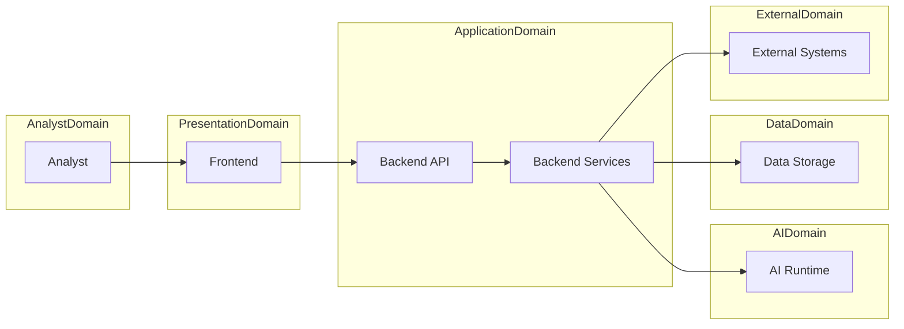

# Security Architecture

> This document defines the architectural security model of SentinelAI. It establishes the security principles, trust boundaries and responsibility model that protect the platform while remaining independent of implementation technologies.

---

# 1. Purpose

The Security Architecture defines the architectural principles that protect SentinelAI throughout its operational lifecycle.

Rather than prescribing implementation-specific security mechanisms, this document establishes the responsibilities, boundaries and security principles that govern every architectural layer of the platform.

The Security Architecture provides a common security foundation shared by the frontend, backend, AI Runtime and supporting platform services.

It ensures that security remains an integral architectural concern rather than an isolated implementation feature.

---

# 2. Security Goals

The Security Architecture is designed to achieve the following architectural goals.

## Defense in Depth

Security should be established through multiple complementary architectural layers rather than relying on a single protection mechanism.

Individual security controls should reinforce one another while remaining independently effective.

---

## Clear Responsibility Boundaries

Every architectural component should have clearly defined security responsibilities.

Security ownership should remain explicit across frontend, backend, AI Runtime and platform infrastructure.

---

## Least Privilege

Every architectural component should operate with only the permissions required to fulfill its responsibilities.

Access beyond operational necessity should be avoided.

---

## Secure by Design

Security considerations should influence architectural decisions from the beginning rather than being introduced after functional capabilities have been designed.

Security responsibilities should therefore be embedded throughout the architecture.

---

## Traceability

Security-relevant operations should remain observable and traceable.

The architecture should support accountability without exposing unnecessary implementation details.

---

## Technology Independence

Security responsibilities defined in this document should remain valid regardless of implementation technologies, deployment environments or security products.

---

# 3. Architectural Role

The Security Architecture establishes the common security model shared across every architectural layer within SentinelAI.

Rather than introducing dedicated security services, it defines the architectural principles that govern how existing components protect platform resources and investigation information.

The Security Architecture is responsible for:

- defining trust boundaries
- establishing security domains
- assigning security responsibilities
- protecting architectural communication
- supporting secure investigation workflows
- promoting consistent security practices

The Security Architecture does not implement authentication mechanisms, authorization policies or cryptographic techniques.

These implementation concerns are defined separately while remaining guided by the architectural principles established within this document.

---

# 4. Trust Boundaries

Trust Boundaries define the architectural security limits between components with different security responsibilities or trust assumptions.

Rather than assuming that all components within SentinelAI operate under the same level of trust, the architecture explicitly recognizes that different architectural layers expose different security risks and require different protection strategies.

Every communication crossing a trust boundary should be treated as a security-sensitive operation.

Trust boundaries exist to:

- separate security responsibilities
- reduce the impact of potential compromises
- protect sensitive investigation information
- preserve architectural isolation
- enforce explicit communication between independent architectural domains

Trust boundaries should be established according to architectural responsibilities rather than deployment topology or implementation technologies.

For example, two components deployed on the same physical infrastructure may still belong to different trust domains if they have different security responsibilities.

The primary architectural trust boundaries within SentinelAI include:

- Analyst ↔ Frontend
- Frontend ↔ Backend API
- Backend API ↔ Backend Services
- Backend Services ↔ AI Runtime
- Backend Services ↔ Data Storage
- Backend Services ↔ External Systems

Each boundary represents a point where requests, data or operational responsibilities transition between independently protected architectural domains.

Crossing a trust boundary should never imply implicit trust.

Every boundary crossing should be evaluated according to the security principles established by the architecture.

---

# 5. Security Domains

The Security Architecture separates SentinelAI into multiple logical security domains.

A security domain represents a collection of architectural components that share common security responsibilities and protection requirements.

Security domains do not necessarily correspond to deployment environments or infrastructure boundaries.

Instead, they provide a conceptual model for assigning ownership and defining security expectations.

The primary security domains include:

## Analyst Domain

Represents authenticated users interacting with SentinelAI.

Responsibilities include:

- initiating investigation activities
- reviewing investigation results
- providing analyst decisions
- interacting with investigation workflows

Actions originating from the Analyst Domain should never be implicitly trusted by downstream architectural components.

Every request should be validated according to the responsibilities of the receiving domain.

---

## Presentation Domain

The Presentation Domain consists of the frontend architecture responsible for presenting investigation information.

Responsibilities include:

- presenting authorized information
- preserving investigation context
- protecting user interaction flows
- avoiding exposure of sensitive implementation details

The Presentation Domain is responsible for user interaction but is not considered an authoritative source of investigation data.

---

## Application Domain

The Application Domain contains the backend services responsible for business capabilities.

Responsibilities include:

- enforcing business rules
- validating requests
- coordinating investigation workflows
- protecting investigation integrity
- managing domain operations

The Application Domain serves as the authoritative owner of investigation state and business behavior.

The Application Domain serves as the primary security enforcement domain within SentinelAI.

---

## AI Domain

The AI Domain contains the AI Runtime and supporting AI components responsible for analysis and reasoning.

Responsibilities include:

- processing investigation context
- generating AI observations
- reasoning over investigation data
- supporting analyst decision-making

The AI Domain operates under the same architectural security principles as other domains but should remain isolated from direct analyst interaction.

Every AI-generated output should return through the Application Domain before being presented to analysts.

The AI Domain should never become a direct trust boundary between analysts and platform resources.

---

## Data Domain

The Data Domain contains persistent platform information including investigation data, graph data and organizational knowledge.

Responsibilities include:

- maintaining investigation persistence
- protecting data integrity
- preserving confidentiality
- supporting reliable information retrieval

Direct access to the Data Domain should remain restricted to authorized backend responsibilities.

Neither the Frontend nor the AI Runtime should bypass the Application Domain to access persistent information directly.

---

## External Domain

The External Domain represents systems outside SentinelAI that exchange information with the platform.

Examples may include:

- external intelligence providers
- enterprise integrations
- notification services
- organizational platforms

External systems should always be treated as independent security domains.

Trust should never be inherited solely because an external system successfully communicates with SentinelAI.

Every integration should preserve the architectural trust boundaries defined by this document.

---

# 6. Security Responsibilities

Security within SentinelAI is a shared architectural responsibility.

Rather than assigning all security concerns to a single component or architectural layer, every part of the platform contributes to maintaining the overall security posture according to its defined responsibilities.

Each architectural layer is responsible only for the security concerns that fall within its ownership boundaries.

This separation prevents duplicated responsibilities, reduces unnecessary coupling and preserves the modular architecture established throughout SentinelAI.

The following sections summarize the primary security responsibilities of each architectural domain.

---

## Analyst Responsibilities

Security begins with authenticated analyst interaction.

Although analysts operate outside the internal platform architecture, their actions influence investigation integrity and therefore represent an important part of the overall security model.

Analysts are responsible for:

- interacting only through authorized platform interfaces
- protecting their authentication credentials
- validating AI-generated recommendations before acting upon them
- maintaining responsible investigation workflows
- following organizational security policies

The platform should never assume that analyst actions are inherently correct or safe.

Critical operations should always remain subject to architectural validation.

---

## Frontend Responsibilities

The frontend contributes to platform security by enforcing presentation-layer responsibilities.

Its purpose is not to enforce business security policies but to ensure that user interaction remains secure, predictable and consistent with the overall architecture.

The frontend is responsible for:

- presenting only authorized information
- protecting investigation context during navigation
- preventing accidental exposure of sensitive information
- preserving secure user interaction flows
- communicating exclusively through the Backend API
- providing appropriate security feedback to analysts

The frontend does not:

- authorize business operations
- validate business rules
- enforce investigation permissions
- communicate directly with databases
- communicate directly with AI components

Those responsibilities remain outside the Presentation Domain.

---

## Backend Responsibilities

The backend serves as the primary enforcement point for platform security.

Because backend services own business capabilities and investigation state, they are responsible for protecting every business operation regardless of where requests originate.

The backend is responsible for:

- validating every incoming request
- enforcing authorization decisions
- protecting investigation integrity
- safeguarding business operations
- coordinating secure communication between architectural domains
- protecting persistent resources
- maintaining security-related audit information
- protecting communication across trust boundaries

Security decisions affecting investigation behavior should always be enforced within the backend.

No frontend validation should be considered authoritative.

---

## AI Runtime Responsibilities

The AI Runtime operates as an analytical component rather than a security authority.

Although it processes investigation information, it should never become responsible for enforcing platform security policies.

The AI Runtime is responsible for:

- processing only authorized investigation context
- protecting temporary analytical data
- avoiding unauthorized disclosure of investigation information
- returning explainable analytical results
- respecting the security constraints established by the Application Domain

The AI Runtime should never make authorization decisions on behalf of the platform.

Every AI-generated result should be validated by the backend before reaching analysts.

---

## Data Responsibilities

Persistent platform information represents one of SentinelAI's most valuable assets.

The Data Domain is responsible for protecting the confidentiality, integrity and availability of investigation information throughout its lifecycle.

Responsibilities include:

- preserving investigation integrity
- protecting stored information
- supporting reliable data persistence
- maintaining controlled access to persistent resources
- supporting secure information retrieval

Persistent information should never be accessed outside the architectural pathways established by the Application Domain.

---

## Cross-Domain Responsibilities

Certain security responsibilities extend across every architectural domain.

Examples include:

- preserving investigation confidentiality
- maintaining data integrity
- supporting operational availability
- protecting trust boundaries
- maintaining traceability
- supporting security monitoring

Every architectural domain contributes to these responsibilities according to its ownership boundaries.

No individual architectural layer is solely responsible for overall platform security.

Security emerges through the coordinated behavior of all architectural domains.

No security responsibility should remain undefined or implicitly owned.

---

# 7. Secure Communication Principles

Communication between architectural domains represents one of the primary security concerns within SentinelAI.

Every communication path should preserve the architectural trust boundaries defined earlier in this document.

Secure communication is achieved through architectural discipline rather than implicit trust between components.

The Security Architecture establishes the following communication principles.

## Explicit Trust Boundaries

Every communication crossing an architectural boundary should be treated as an independent security event.

Trust established within one architectural domain should not automatically extend into another domain.

Each receiving domain should independently evaluate incoming requests according to its own responsibilities.

---

## Controlled Communication Paths

Architectural components should communicate only through approved communication pathways.

Examples include:

- Frontend → Backend API
- Backend API → Backend Services
- Backend Services → AI Runtime
- Backend Services → Data Domain
- Backend Services → External Domain

Direct communication outside these established pathways should be avoided because it weakens architectural isolation and increases security risk.

---

## Validation at Every Boundary

Every architectural boundary should independently validate incoming requests before processing them.

Validation responsibilities should never be delegated implicitly to upstream components.

Even when a request originates from another trusted architectural domain, the receiving domain remains responsible for protecting its own resources.

---

## Confidentiality and Integrity

Information exchanged between architectural domains should preserve both confidentiality and integrity throughout its lifecycle.

Sensitive investigation information should never be exposed beyond the responsibilities of the receiving domain.

Information should remain protected regardless of where it originates or where it is ultimately consumed.

---

## Principle of Minimal Exposure

Architectural communication should expose only the information necessary to perform the requested operation.

Components should avoid sharing unnecessary investigation data, internal implementation details or security-sensitive information.

Reducing unnecessary information exchange minimizes architectural attack surface while preserving functional collaboration between domains.

---

## Consistent Security Enforcement

Secure communication principles should remain consistent across every architectural interaction.

Equivalent communication scenarios should be evaluated according to equivalent security expectations regardless of the participating architectural domains.

This consistency strengthens predictability, simplifies future evolution and supports a coherent security architecture across the SentinelAI platform.

---

# 8. Security Monitoring

Security Architecture should support continuous visibility into security-relevant activities across the SentinelAI platform.

Monitoring serves both operational security and architectural governance by providing insight into how security responsibilities are exercised throughout the system.

Monitoring should provide architectural visibility without introducing additional operational responsibilities into protected domains.

Rather than focusing solely on infrastructure events, security monitoring should observe architectural behavior across trust boundaries and security domains.

Security monitoring should support:

- detection of security-relevant events
- visibility into cross-domain interactions
- observation of authentication and authorization outcomes
- monitoring of investigation access
- identification of anomalous platform behavior
- support for security auditing

Monitoring responsibilities should remain independent of business workflows.

Security monitoring complements operational monitoring by focusing on the protection of architectural assets rather than platform performance.

Security monitoring should preserve analyst privacy while maintaining sufficient visibility to support incident investigation and organizational accountability.

The implementation of monitoring mechanisms is intentionally outside the scope of this document.

---

# 9. Extensibility

The Security Architecture is designed to evolve together with the SentinelAI platform without requiring architectural redesign.

Future architectural capabilities should integrate into the existing security model while preserving established trust boundaries, security domains and responsibility ownership.

New architectural capabilities should:

- define explicit security responsibilities
- integrate into existing trust boundaries
- preserve domain isolation
- respect secure communication principles
- avoid introducing implicit trust relationships
- remain compatible with existing security monitoring
- preserve security ownership boundaries

Security evolution should strengthen architectural consistency rather than increase complexity.

The architecture encourages incremental enhancement through stable security principles instead of technology-specific security solutions.

---

# 10. Future Evolution

Future versions of the Security Architecture may introduce:

- multi-organization security domains
- collaborative investigation security models
- adaptive authorization policies
- enhanced security analytics
- zero-trust architectural refinements
- additional audit capabilities
- advanced threat detection support

Future capabilities should preserve the architectural responsibility model established by this document.

Security enhancements should extend existing architectural principles rather than redefine them.

Regardless of future platform evolution, trust boundaries, security ownership and separation of responsibilities should remain fundamental architectural concepts.

---

# 11. Design Principles Applied

The Security Architecture follows the engineering principles established throughout SentinelAI.

| Principle | Security Architecture Application |
|-----------|-----------------------------------|
| Human-Centered AI | Security mechanisms protect analysts while preserving efficient investigation workflows. |
| Explainability | Security-relevant operations should remain observable, traceable and understandable. |
| Separation of Responsibilities | Security ownership is distributed according to architectural responsibilities rather than centralized within a single component. |
| Modularity | Security responsibilities evolve independently within each architectural domain while preserving common architectural principles. |
| Defense in Depth | Multiple architectural layers cooperate to protect platform resources and investigation information. |
| Least Privilege | Every architectural component operates with only the permissions required by its responsibilities. |
| Architecture Before Framework | Security responsibilities remain independent of implementation technologies, frameworks and security products. |

---

# Closing Statement

The Security Architecture establishes the common security foundation shared across every architectural layer of SentinelAI.

By defining trust boundaries, security domains, architectural responsibilities and secure communication principles, the architecture provides a consistent model for protecting investigation information and platform resources.

Rather than concentrating security within a single architectural component, SentinelAI distributes security responsibilities across the Frontend, Backend, AI Runtime and Data Domain while preserving clear ownership boundaries.

The Security Architecture serves as the foundation for the Authentication & Authorization, Secrets Management, Audit & Observability and Threat Model documents, ensuring that future security capabilities remain consistent with the architectural principles established throughout the platform.

---

# Version History

| Version | Date | Description |
|----------|------------|--------------------------------|
| 1.0.0 | 2026-06-27 | Initial Security Architecture specification created |